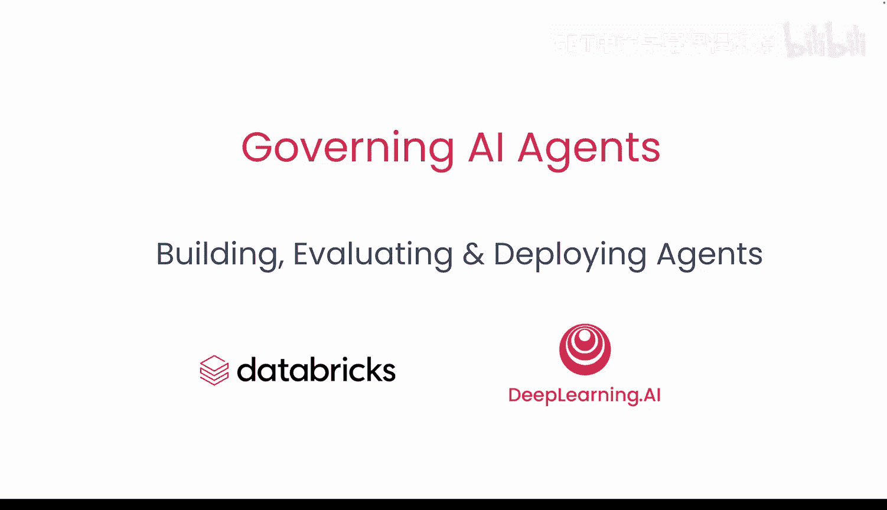
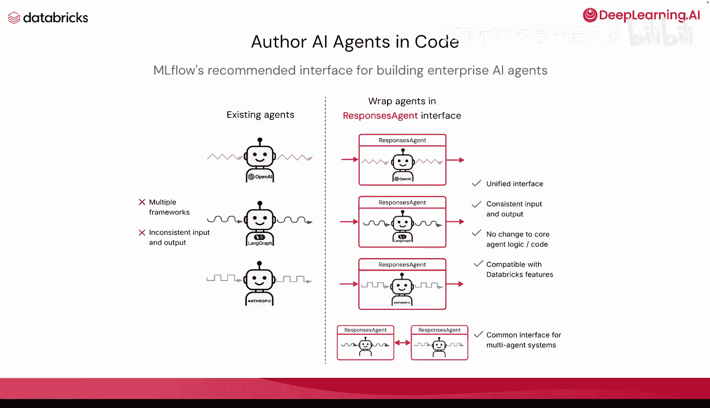
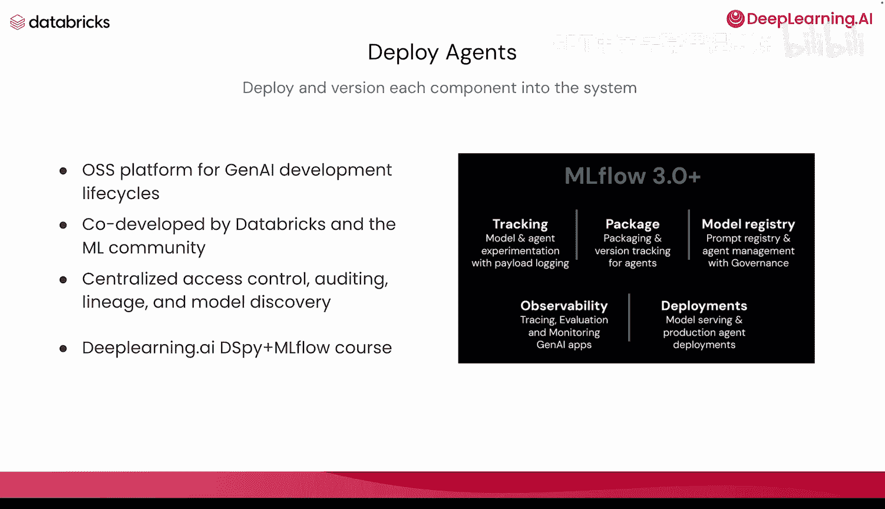
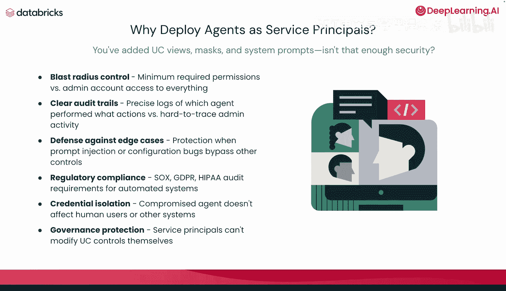
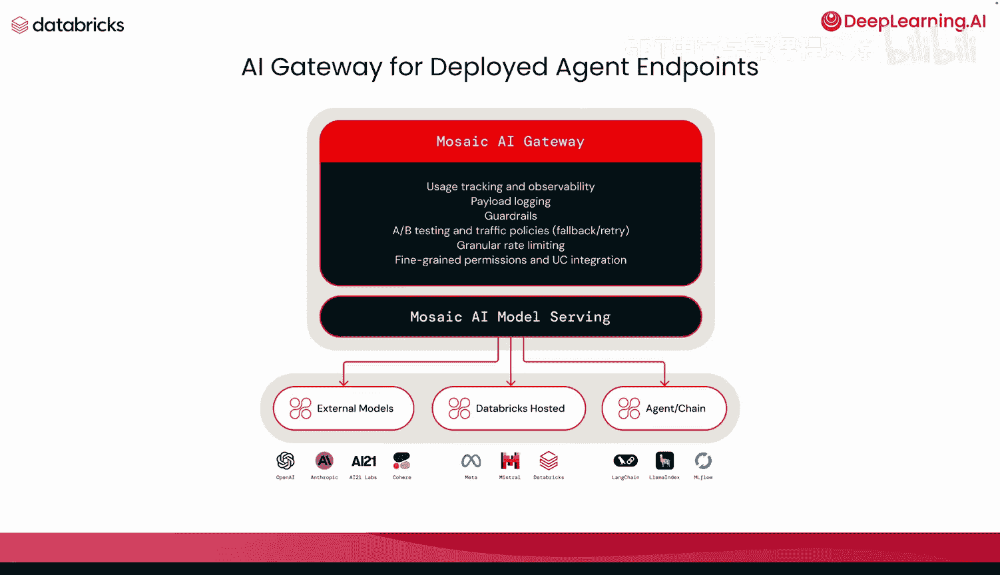
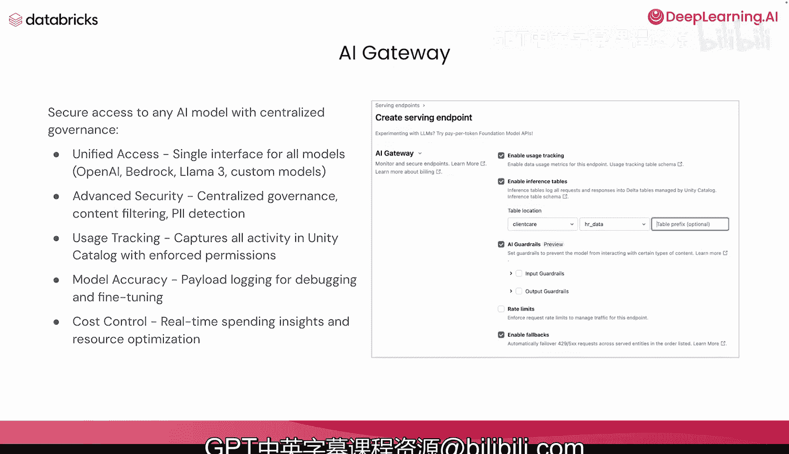

# 006：构建、评估与部署智能体 🚀

在本节课中，我们将学习如何构建、评估并最终部署一个生产就绪的AI智能体。我们将使用Mlflow等工具，并探讨自定义评估指标，以确保智能体的性能、安全性和成本效益。

---

## 构建智能体基础 🧠

上一节我们建立了治理基础，本节中我们来看看如何构建智能体本身。



智能体使用大语言模型作为其“大脑”，通过工具进行推理。例如，我可以为智能体提供一系列工具和一个LLM，并赋予其一个标准的助手提示，使其能够做出决策。

**核心概念**：智能体 = LLM（推理大脑） + 工具（执行手段）

```python
# 伪代码示例：智能体基本结构
agent = Agent(
    brain=LargeLanguageModel(),
    tools=[lookup_account, check_return_policy, generate_shipping_label]
)
```

如果一个客户询问智能体“你能帮我退回上一个订单吗？”，一个标准的客户支持智能体会经历以下推理步骤：查找账户信息、确认退货政策、生成运单。智能体应遵循类似的“推理-行动”范式，调用必要工具，最终解决问题。

以下是智能体可以使用的工具类型：
*   **文档**：如知识库文件。
*   **向量数据库**：用于语义搜索。
*   **函数**：自定义的业务逻辑代码。
*   **API**：连接外部服务。
*   **数据表**：访问结构化数据。

只要智能体能够通过提示词或工具本身的明确操作来理解所使用的数据，它就应该能够生成正确的响应并检索信息。

---

## 评估智能体性能 📊

智能体构建完成后，在部署到生产环境之前，你需要评估其性能。

主要的评估方式包括：
*   **检索指标**：例如RAG指标，评估响应是否相关。
*   **响应指标**：评估智能体是否产生幻觉、提供错误或不安全的信息。
*   **系统指标**：评估速度、延迟和成本，确保用户体验和预算可控。

我们通常通过以下三种方式对智能体进行评估：
1.  **基于代码的评估**：使用正则表达式或自定义逻辑进行判断。
2.  **LLM即评委**：通过提示词模板让另一个LLM来评估响应的质量、语气或自定义指标。这是目前最流行的方式，尤其适用于缺乏标准答案的场景。
3.  **人在回路评估**：由领域专家标注数据或提供一组标准的输入输出对，用于训练或微调智能体。

**核心概念**：`评估结果` → `生产环境监控阈值`

请记住，当你将模型部署为生产系统后，这些评估指标将转化为监控能力。你可以为初始评估设定阈值，进而监控关键性能指标、成本和令牌使用量。

---

## 追踪与生产准备 🔍

为了在生产环境中对智能体进行评估和问题排查，我们需要运行追踪。

追踪最常用于OTLP框架或开放遥测格式，这是记录这些追踪的标准。MLflow追踪也使用开放遥测格式来记录所有追踪及其中的每一步（称为“跨度”）。

通过追踪，你可以：
*   查看每个步骤的耗时。
*   查看LLM的输入、输出和属性。
*   查看中间推理步骤。
*   查看检索到的所有文档（对于基于RAG的智能体）。
*   从而能够有效地对生产环境中的智能体进行故障排除和问题解决。

---

## 使用MLflow记录与部署 📦

在本课程中，当你构建智能体时，我们将使用MLflow来记录它。

记录操作会将你的智能体保存为一个版本化的模型工件，存储在MLflow的模型注册表中。你可以将其理解为将智能体保存为一种Databricks可以在生产环境中部署和管理的格式。

这样做的好处包括：
*   存储智能体代码、依赖项和完整配置。
*   创建带有元数据的可部署模型版本。
*   启用模型服务端点和API访问。
*   跟踪实验、性能指标和谱系。
*   允许回滚到之前的版本。

在代码中编写AI智能体时，MLflow推荐使用`response agent`接口来构建企业级智能体。无论你使用来自OpenAI、LangChain、Anthropic的智能体，还是用Python构建的任何智能体，该接口都能将其统一封装。



**核心优势**：
*   **统一接口**：一致的输入输出格式。
*   **无侵入性**：无需更改核心智能体逻辑或代码。
*   **兼容性好**：与Databricks功能和MLflow兼容。
*   **支持多智能体系统**：为多智能体系统创建通用接口。



在Databricks中部署智能体时，我们对系统中的每个组件都进行部署和版本控制。Databricks近期发布了MLflow 3.0，这是一个用于GenAI开发周期的开源平台，它提供了追踪、模型注册、可观测性等关键组件，用于部署模型和创建服务端点。

---

## 以服务主体身份部署 🔒

你可能会想：我们已经添加了Unity Catalog视图、治理策略和系统提示词，这还不够安全吗？为什么在实验3的最后，我们还要将智能体作为服务主体来部署？



原因如下：
*   **控制爆炸半径**：使用最小必要权限，而非可访问一切的管理员账户。
*   **清晰的审计追踪**：精确记录哪个智能体执行了哪些操作，对比难以追踪的管理员活动。
*   **防御边缘情况**：防范提示词注入或其他恶意行为。
*   **满足合规要求**：提供凭证隔离和完整的治理保护。

**公式**：`安全性` = `最小权限原则` + `审计日志` + `凭证隔离`

---

## 部署后的下一步：AI网关 🌉

将智能体以服务主体凭证部署并获得端点后，下一步可以使用AI网关。

Databricks提供了Mosaic AI网关，你可以通过它来路由该端点或任何外部模型、Databricks托管的模型或智能体，并开始跟踪关键信息。



使用AI网关，你可以：
*   **统一治理，保障访问安全**：为所有模型（无论是来自OpenAI、开源模型还是自定义智能体）提供统一的访问接口。
*   **高级安全**：集中治理、内容过滤、PII检测。
*   **启用使用情况跟踪**：在Unity Catalog中捕获所有活动，并执行权限控制。
*   **成本归因**：跟踪单个或所有端点，确保资源不被过度使用。
*   **监控与日志**：监控模型准确性，记录所有输入/输出载荷，以便进行评估。
*   **支出洞察**：尤其在使用成本较高的第三方或专有LLM时，这是优化资源的好方法。

---

## 总结 🎯



本节课中，我们一起学习了构建、评估和部署AI智能体的完整流程。我们从智能体的基本架构讲起，探讨了如何使用多种指标和方式进行评估，并介绍了利用MLflow进行记录、版本控制和部署的最佳实践。最后，我们强调了以服务主体身份部署的重要性以及使用AI网关进行集中治理和监控的后续步骤。掌握这些步骤，是确保你的AI智能体在生产环境中安全、可靠且高效运行的关键。现在，是时候开始动手构建我们自己的智能体能力，并最终将其部署了。