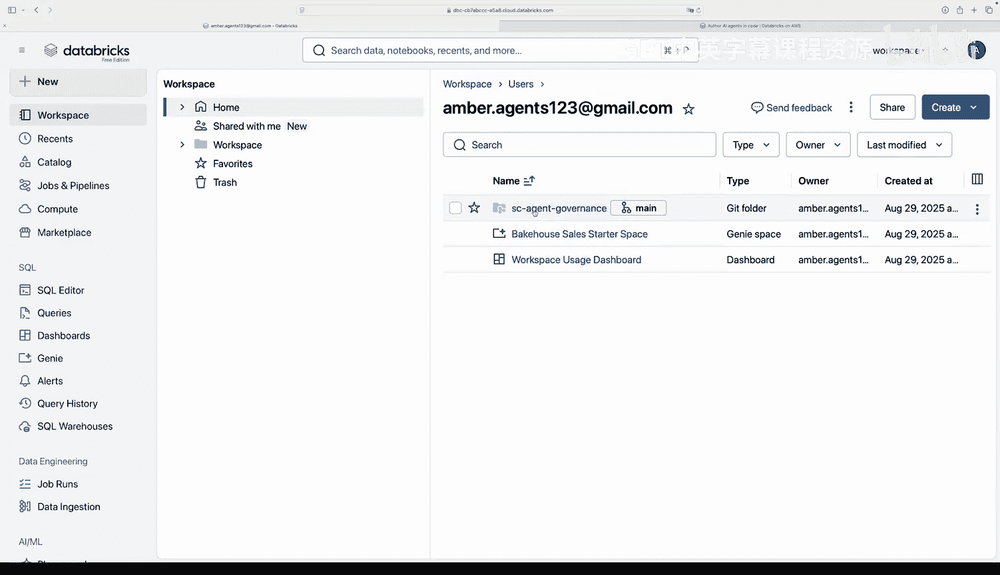
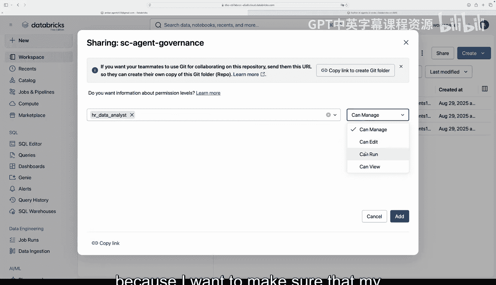
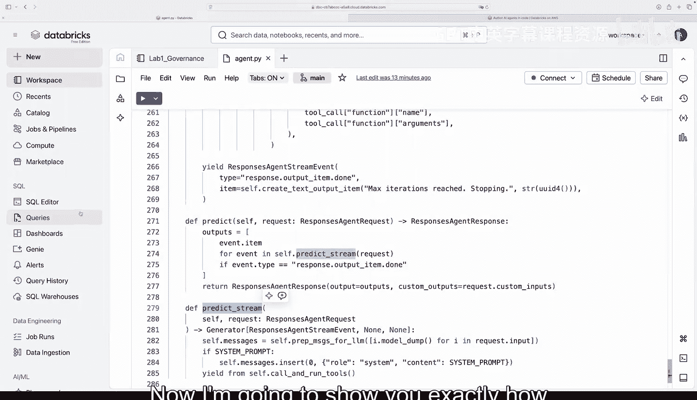
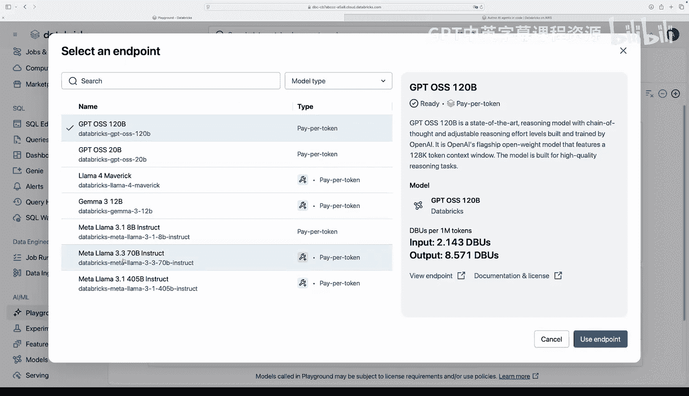
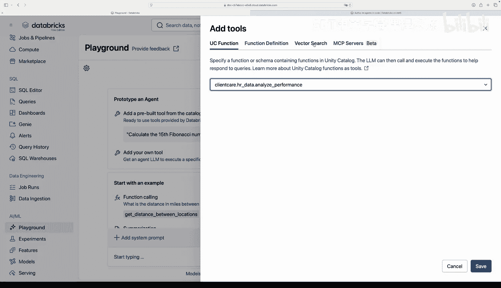
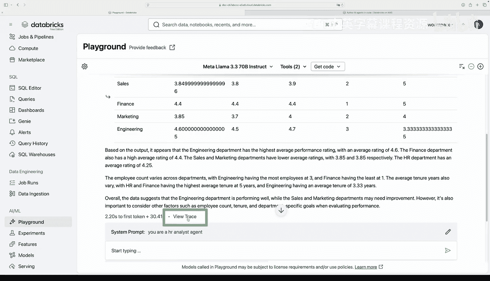
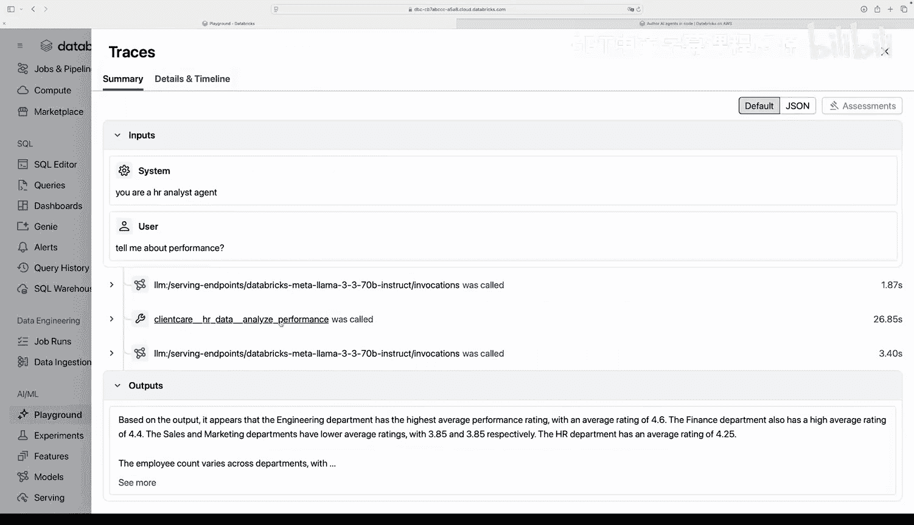
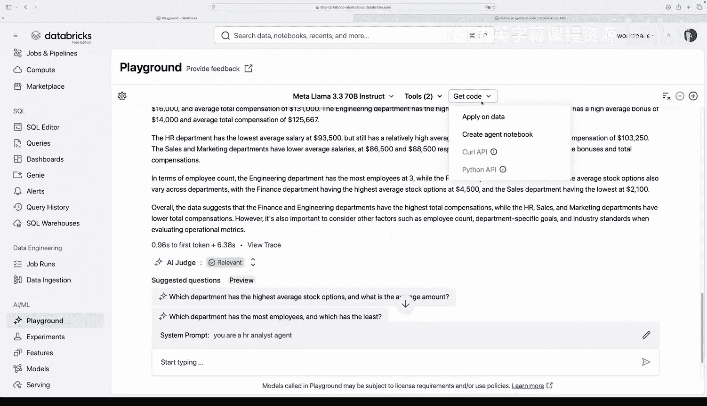
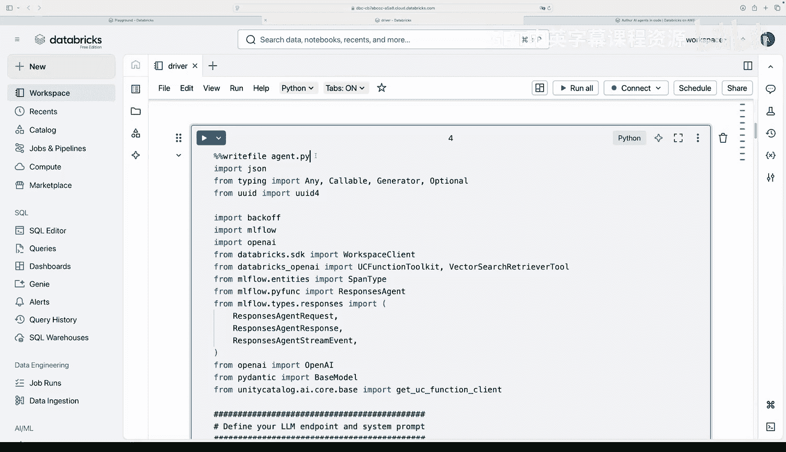

# 007：实验2-构建HR分析智能体

在本节课中，我们将学习如何使用OpenAI SDK构建一个工具调用智能体，并将其封装到MLflow响应式智能体接口中。我们将从设置环境开始，逐步完成智能体的构建、测试和准备部署。

## 概述

上一节我们完成了初始治理设置。本节中，我们将进入实验2，构建一个HR分析智能体。我们将使用Databricks平台、OpenAI SDK以及MLflow接口来创建一个能够调用数据分析工具并回答HR相关问题的智能体。

## 构建智能体

现在，让我们开始编写代码。首先，我们需要确保服务主体拥有正确的权限来运行智能体。

完成权限检查后，我们进入实验2的`agent.py`文件。这是我们的编排核心。我们之前讨论过使用MLflow响应式智能体接口。

首先，我们需要安装关键功能。我们使用Databricks SDK和Databricks OpenAI。如果我们想使用检索增强生成工具，例如构建RAG聊天机器人，我们还可以引入Unity Catalog函数工具包。当然，我们也需要导入OpenAI。

接下来，我们需要选择大语言模型。如果我们选择一个原生支持工具调用的Databricks模型，可以使用`Mistral-7B-Instruct`模型。我们需要定义系统提示词，例如：“你是一名HR数据科学家和分析专家，可以访问提供劳动力绩效、留存率和运营指标洞察的HR分析工具。”这定义了智能体的角色、回答问题的反馈方式以及可用的工具（即我们在Unity Catalog中构建和注册的`analyze_performance`和`analyze_operations`工具）。

然后，我们需要为智能体定义工具。

以下是智能体可用的工具列表，这些工具已在Unity Catalog中定义和注册：

*   `analyze_performance`：分析绩效数据的工具。
*   `analyze_operations`：分析运营指标的工具。

你可以使用Unity Catalog中的这些用户定义函数作为智能体工具。如果你想使用向量数据库，也可以轻松启用该功能。

滚动到文件底部，你可以看到工具调用智能体包含以下关键部分：
*   **LLM端点**：我们定义的大语言模型端点，例如`Mistral-7B-Instruct`模型。
*   **工具**：允许LLM访问数据的工具，这将绑定我们的工具调用智能体。

如果你已经有一个现有的智能体，只需将其用MLflow响应式智能体接口封装即可，正如我们在上一讲中讨论的。如果你好奇如何封装现有智能体，这里有一个示例。

这里我们可以看到代表工具调用智能体的类，它实现了`ResponsesAgent`接口。当一个类实现此接口时，它内部应包含两个方法：`predict`和`predict_stream`。这些方法封装了现有智能体的输出。如果你对工作原理或逐步过程更感兴趣，或者想构建并封装一个LangChain智能体，可以参考我们的文档链接。

## 生成智能体代码

现在，我将展示如何生成这个`agent.py`笔记本。如果我转到Playground，可以为工具调用选择一个模型。如果你看到这个启用了工具表情符号的技能，意味着它是一个启用了工具调用的智能体。这些在Databricks中原生可用。你也可以引入外部模型，如果有任何自定义模型，也可以引入。例如，如果你想使用自己的OpenAI模型，可以自由操作，只需要在此处使用你的密钥。这里我将使用我的`Mistral-7B-Instruct`模型。

对于我的工具，我将添加已创建为UC函数的工具。我可以转到我的目录，选择`HR_data.analyze_operations`，保存该工具。😊

我添加`analyze_performance`，并可以选择HR数据中所有可用的工具。我将只选择有名称的工具，这样你可以清楚地看到我们的智能体如何与它们交互。我们还可以添加向量搜索端点或使用MCP服务器。你可以添加一个系统提示词，正如我们从`agent.py`文件中看到的，我们有一个非常复杂的系统提示词。我这里只输入一点，以便你能看到它最终出现在哪里。

这样，我就可以在获取编排代码之前开始提问来测试这个智能体。例如：“告诉我关于绩效的情况。”

这里我们可以看到，使用我们的`Mistral-7B-Instruct`模型，LLM调用了我们的`analyze_performance`函数，提取了关于绩效的信息（即我们给它的操作），但现在它还包含了一个完整的解释。我们可以看到跟踪功能，以了解它是否使用了多个工具或总延迟。

我也可以询问关于运营的情况：“为了深入了解不同部门的运营指标，我将使用函数`analyze_operations`。”然后它会给出关于这些数据意味着什么、哪些可能有趣的思考过程，即对其可访问数据的完整分析。

如果我认为这看起来不错，我可以去创建智能体笔记本。这将带我进入我的驱动笔记本，其中解释了我们正在编写一个使用OpenAI客户端的工具调用MLflow响应式智能体。请注意，虽然这个笔记本和我们的示例使用了OpenAI SDK，但我们的智能体框架与任何智能体编写框架兼容。你可以使用LlamaIndex、LangChain或纯Python来构建这些智能体。

向下滚动到定义和编写你的`agent.py`文件的部分，这里我们可以看到我们在`agent.py`中经历的所有功能：LLM端点、系统提示词、可用工具。

如果我们愿意，可以添加一个向量搜索数据库。当然，我们还有我们的`ToolCallingAgent`类。然后，当我们将模型记录到MLflow时，我们有MLflow模型记录功能。当然，我们还有我们的LLM端点（将用作智能体“大脑”的LLM）以及将为该LLM提供数据访问权限的工具（用于我们的工具调用智能体）。同样，这与我们`agent.py`文件中的信息完全相同。

因此，如果你使用顶部的单元格魔术来编写这个文件，它将重新创建`agent.py`文件。如果你想确切了解这在LangChain实现中是什么样子，可以查看我们在Databricks上的文档以获取确切的工作流程，甚至了解如何构建多智能体系统。请注意，这个完整的笔记本与我们将在实验3中使用的笔记本是同一个。这里关于如何记录智能体的其余单元格都是可用的，所以这是完整的编排代码。唯一不同的是，如果你想添加自己的自定义评估。

现在，让我们进入实验3，完成这个智能体的构建、运行评估并最终部署它。

## 总结

本节课中，我们一起学习了如何构建一个HR分析智能体。我们从设置环境权限开始，然后使用OpenAI SDK和MLflow接口编排智能体，定义了系统提示词和工具，并在Playground中进行了测试。最后，我们生成了完整的智能体代码文件，为下一步的评估和部署做好了准备。