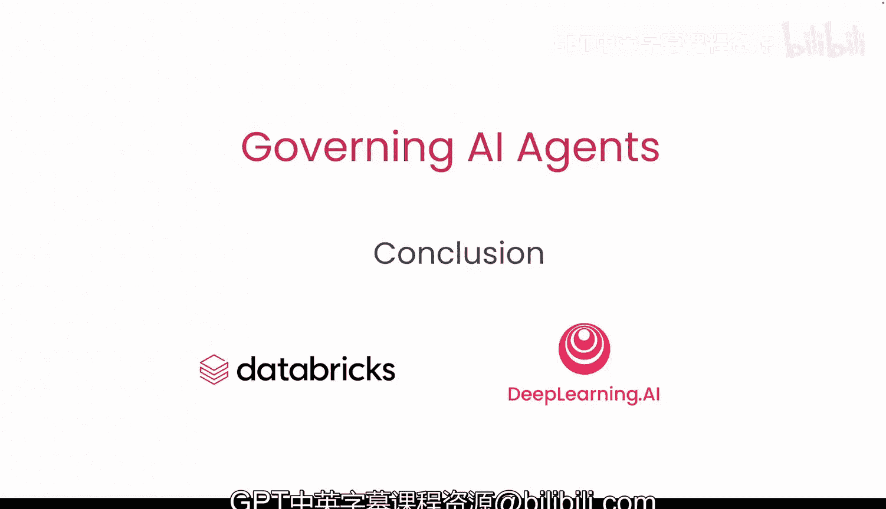
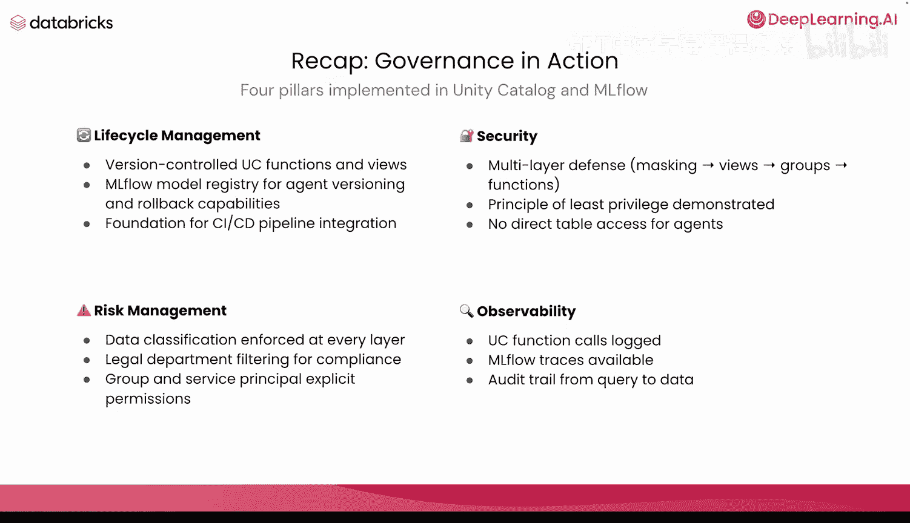
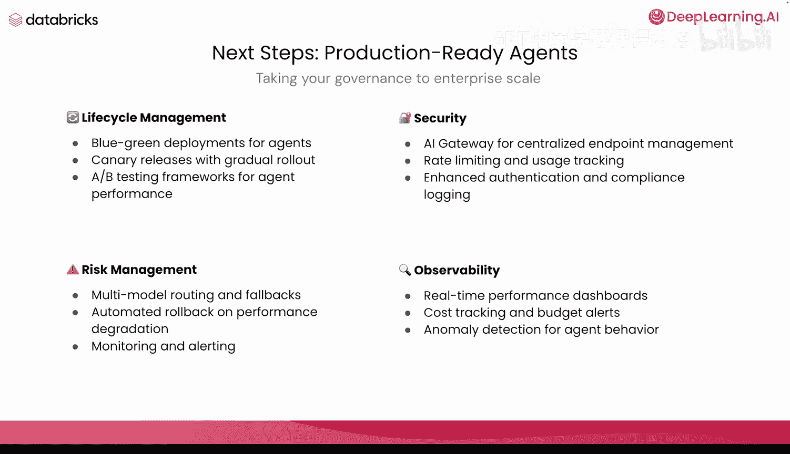
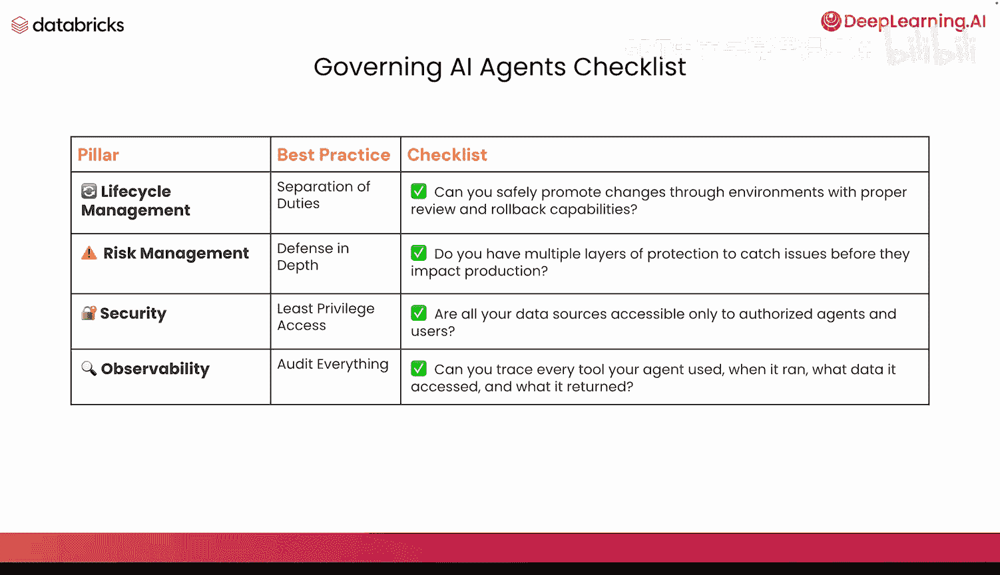

# 009：课程总结 🎯

在本节课中，我们将回顾并总结《治理AI智能体》课程的核心内容，梳理已实现的四大治理支柱，并展望构建生产级智能体的后续步骤。

## 课程内容回顾

恭喜你完成本课程的学习。现在，让我们回顾一下你在“行动中的治理”部分所学到的内容。

我们利用 Unity Catalog 和 MLflow 实现了四大治理支柱。这些支柱分别是：生命周期管理、风险管理、安全性与可观测性。

## 四大支柱实施总结

以下是我们在课程中为每个支柱所构建的具体能力。

### 生命周期管理
我们创建了版本控制的 UC 函数和视图。我们建立了用于智能体版本控制与回滚能力的 MLflow 模型注册表。这为 CI/CD 流水线集成奠定了基础。

### 风险管理
我们在每一层都强制执行了数据分类。我们设置了法律部门过滤以确保合规性。我们明确定义了组和服务主体，并授予了相应权限。

### 安全性
我们构建了多层防御体系。我们的数据脱敏、视图、组和函数协同工作。我们实施了最小权限原则，并且智能体没有直接的表访问权限。所有权限都被明确定义，并严格遵循最小权限原则，确保智能体只能访问其任务所必需的内容。

### 可观测性
我们拥有 UC 函数调用日志、可用的 MLflow 追踪，以及从查询到数据的完整审计追踪。

## 迈向生产级智能体

既然我们已经构建了所有这些能力，那么真正构建生产级智能体的下一步是什么？如何将治理提升到企业级规模？

以下是每个支柱可以进一步深化的方向。

### 生命周期管理的进阶步骤
*   智能体的蓝绿部署。
*   采用渐进式发布的灰度发布。
*   用于评估智能体性能的 A/B 测试框架。

### 风险管理的进阶步骤
*   多模型路由与故障回退机制。
*   性能下降时的自动回滚。
*   额外的监控与告警。

### 安全性的进阶步骤
*   使用类似 AI 网关的工具进行集中式端点管理。
*   在所有端点上实施速率限制和使用情况跟踪。
*   增强的身份验证与合规性日志记录。

### 可观测性的进阶步骤
*   实时性能仪表板。
*   成本跟踪与预算告警。
*   针对智能体行为的异常检测。这也延伸到了对我们所用评估指标的监控上。

## 治理清单核对

现在，让我们根据四大支柱来核对我们的治理清单。

### 生命周期管理核对
我们是否实现了职责分离？你是否能通过适当评审和回滚能力，安全地在不同环境间推进变更？对此，我们核对为“是”。

### 风险管理核对
我们是否最佳地应用了深度防御？我们是否有多个保护层，以便在问题影响生产环境之前将其捕获？是的，我们核对此项。

### 安全性核对
这是我们最小权限访问的最佳实践。是否所有数据源都仅对授权的智能体和用户可访问？对此核对为“是”。

### 可观测性核对
我们能否审计一切？你能否追踪智能体每次运行时使用的每个工具、访问了哪些数据以及返回了什么结果？对此我也将核对为“是”。

## 结束语

我要感谢所有在本课程中坚持学习并积极参与的人，我期待看到你们构建出的成果。

---

**本节课中，我们一起学习了**：AI智能体治理四大支柱（生命周期管理、风险管理、安全性、可观测性）的核心实现与总结，并探讨了如何将这些基础能力扩展至企业级生产环境所需的高级实践。通过核对治理清单，我们确认了已构建的框架能够满足基本治理要求，为开发可靠、安全、可控的AI智能体奠定了坚实基础。