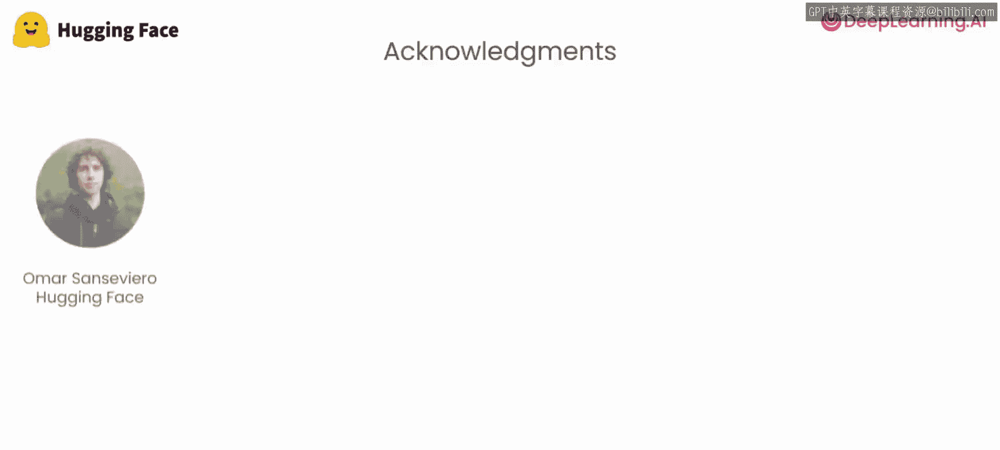

# 001：课程介绍与Gradio概述 🚀

在本节课中，我们将学习这门课程的整体目标，并了解Gradio这一工具如何帮助我们快速为生成式AI模型构建演示界面。

欢迎来到这门与Hugging Face合作开设的“使用Gradio构建生成式人工智能应用程序”课程。我来介绍本课程的讲师——一位名为“Polly”的鹦鹉。

感谢Andrew。很高兴来到这里。Gradio是一种快速便捷的方式，可以直接在Python中通过友好的Web界面来演示你的机器学习模型。在本课程中，我们将学习如何使用它为生成式AI应用程序构建用户界面。

当你构建完一个应用程序的机器学习或生成式AI部分后，你可能想快速构建一个演示程序展示给他人。也许是为了获取反馈并推动系统改进，或者仅仅是因为你觉得这个系统很酷，想要展示它。Gradio让你可以通过Python接口快速做到这一点，而无需编写任何前端、Web或JavaScript代码。

在本课程中，你将看到包括文本摘要、命名实体识别、图像描述、使用扩散模型的图像生成以及基于LLM的聊天机器人在内的多个示例。对于每一个应用，Polly都将展示，在你构建好其机器学习部分后，如何利用Gradio快速构建一个非常酷的演示，并让他人能够交互和体验你所构建的内容。

第一课我们将为简单的NLP任务构建一个应用程序，包括摘要和命名实体识别。

我们感谢许多人为这门短期课程付出的辛勤努力。来自Hugging Face团队的Omar Sanseviero、Pedro Cuenca、Philipp Schmid、Amy Roberts、Sylvain Gugger、Patrick von Platen和Suraj Patil，以及来自DeepLearning.AI的Eddy Shyu和Dina Boon。

接下来，让我们进入下一个视频，正式开始学习。

---

本节课中我们一起学习了本课程的目标和Gradio的基本概念。Gradio是一个强大的Python库，其核心价值在于允许开发者通过简单的代码快速为机器学习模型创建可交互的Web演示界面，而无需掌握前端开发技能。在接下来的课程中，我们将动手实践，利用Gradio为各种生成式AI应用构建用户界面。