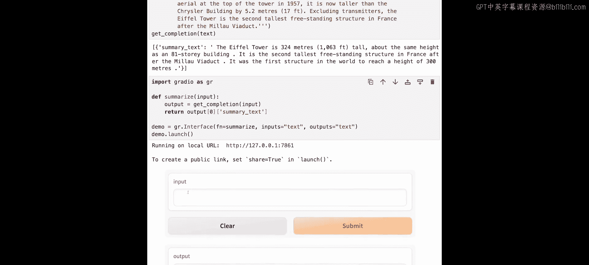
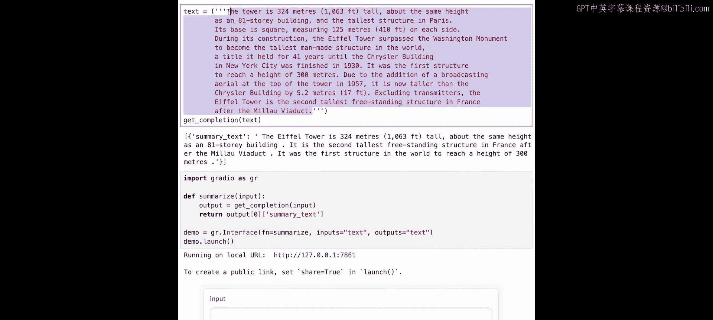
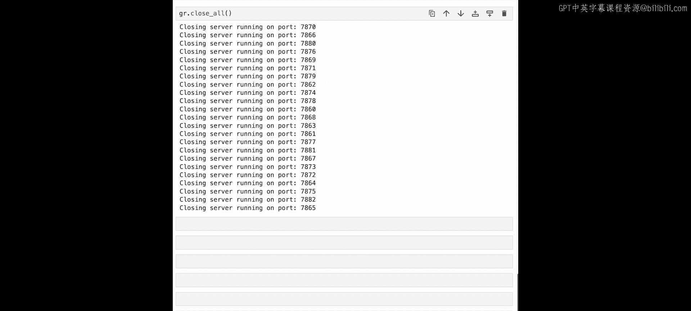

# 002：构建两个NLP应用


在本节课中，我们将学习如何使用Gradio快速构建两个自然语言处理应用：一个用于文本摘要，另一个用于命名实体识别。我们将使用专门为这些任务设计的模型，并通过Gradio为它们创建用户友好的界面。

## 设置与概述

首先，我们需要设置API密钥，并定义一个辅助函数来调用文本摘要的API端点。这个API本质上调用了一个函数，如果你在本地运行，代码会类似这样。

我们首先从Hugging Face的`transformers`库中导入`pipeline`函数。对于文本摘要任务，我们选择`distilbart-cnn-12-6`模型，因为它是目前最先进的文本摘要模型之一。事实上，如果你使用transformers的`pipeline`函数进行文本摘要而不明确指定模型，它默认就会使用这个模型。

由于这个模型是专门为摘要任务构建的，任何输入到模型中的文本，它都会输出一个摘要。考虑到应用的速度和成本，与通用的大型语言模型相比，专用模型通常运行成本更低，并且能为用户提供更快的响应。

另一种提高效率和降低成本的方法是创建模型的“蒸馏”版本，它在保持相似性能的同时体积更小。我们使用的`distilbart-cnn-12-6`模型就是基于Facebook更大的`bart-large-cnn`模型蒸馏而来的。

在本课程中，我们通过API调用来运行这些模型。如果你在自己的机器上本地运行模型，你会使用类似下面的代码：

```python
from transformers import pipeline

summarizer = pipeline("summarization", model="distilbart-cnn-12-6")
```

## 构建文本摘要应用

现在，让我们开始构建第一个应用。我们将首先导入Gradio库。

```python
import gradio as gr
```

接下来，我们将定义一个名为`summarize`的函数。它接收一个输入字符串，调用我们之前定义的`get_completion`函数，并返回摘要。

```python
def summarize(input_text):
    summary = get_completion(input_text, endpoint=summarization_endpoint)
    return summary
```

然后，我们使用Gradio的`Interface`函数来创建界面。传入我们刚刚定义的`summarize`函数，将输入和输出都设置为文本类型，最后调用`launch`来启动用户界面。





```python
demo = gr.Interface(fn=summarize, inputs="text", outputs="text")
demo.launch()
```

让我们看看效果。界面创建成功后，我们可以复制一段关于埃菲尔铁塔的文本并粘贴进去，模型会生成一个摘要。

### 自定义用户界面

目前的界面只显示“输入”和“输出”标签，我们可以通过使用`gr.Textbox`组件来自定义这些标签。

```python
demo = gr.Interface(
    fn=summarize,
    inputs=gr.Textbox(label="待摘要文本"),
    outputs=gr.Textbox(label="摘要结果")
)
demo.launch()
```

为了让用户知道可以输入多行文本，我们可以调整文本框的高度。使用`lines`参数可以实现这一点。

```python
inputs=gr.Textbox(label="待摘要文本", lines=6),
outputs=gr.Textbox(label="摘要结果", lines=3)
```

我们还可以为应用添加标题和描述。

```python
demo = gr.Interface(
    fn=summarize,
    inputs=gr.Textbox(label="待摘要文本", lines=6),
    outputs=gr.Textbox(label="摘要结果", lines=3),
    title="使用DistilBART-CNN进行文本摘要",
    description="输入一段长文本，模型将自动生成摘要。"
)
demo.launch()
```

如果你想与朋友在线分享这个应用，可以在`launch`方法中设置`share=True`来生成一个公共链接。

```python
demo.launch(share=True)
```

## 构建命名实体识别应用

上一节我们构建了文本摘要应用，本节中我们来看看如何构建第二个应用：命名实体识别。这个模型将接收一段文本，并将特定的单词标记为人物、机构或地点等实体。

我们将使用一个基于BERT的命名实体识别模型。BERT是一个通用语言模型，可以执行多种NLP任务，但我们使用的这个版本经过了专门微调，在命名实体识别任务上具有最先进的性能。它能识别四种类型的实体：位置、组织、人物和其他。

以下是调用该模型API的示例：

```python
ner_text = “Andrew is building a course for the Andrew Ng deep learning community.”
entities = get_completion(ner_text, endpoint=ner_endpoint)
```

模型的原始输出是一个字典列表，每个字典包含一个实体的信息。虽然这对下游软件应用有用，但对人类用户来说不够友好。我们可以使用Gradio让输出更直观。

### 创建NER应用界面

首先，我们定义一个函数供Gradio应用调用。这个函数将调用模型并返回原始文本以及模型识别出的实体列表。

```python
def ner(input_text):
    entities = get_completion(input_text, endpoint=ner_endpoint)
    return input_text, entities
```

接下来，我们构建Gradio界面。这次，输出将使用`gr.HighlightedText`组件，它可以高亮显示文本中的实体。

```python
demo = gr.Interface(
    fn=ner,
    inputs=gr.Textbox(label="输入文本", lines=3),
    outputs=gr.HighlightedText(label="识别出的实体"),
    title="命名实体识别",
    description="输入文本，模型将识别其中的人物、地点、组织等实体。",
    allow_flagging="never",
    examples=[
        ["Polly works for Hugging Face in Vienna."],
        ["My name is Andrew and I live in California."]
    ]
)
demo.launch()
```

在界面中，我们添加了`examples`参数，为用户提供示例输入，帮助他们快速了解应用功能。同时，我们通过`allow_flagging=“never”`隐藏了默认的“标记”按钮。

### 处理与合并分词

运行应用后，你可能会发现模型将一些单词（如“Hugging Face”）拆分成了多个“分词”。分词是语言中常见的短字符序列，长单词通常由多个分词组成，这样做是为了提高模型效率。

模型输出的实体标签以“B-”表示开始分词，“I-”表示中间分词。对于面向用户的应用，我们可能希望将属于同一实体的分词合并显示为一个完整的单词。

以下是合并分词的函数示例：

```python
def merge_tokens(tokens):
    merged = []
    for token in tokens:
        if token[‘entity’].startswith(‘I-’) and merged:
            # 合并到前一个token
            merged[-1][‘word’] += token[‘word’].replace(‘##’, ‘’)
            # 可选：平均分数
            merged[-1][‘score’] = (merged[-1][‘score’] + token[‘score’]) / 2
        else:
            # 添加新token，并清理‘##’字符
            new_token = {‘word’: token[‘word’].replace(‘##’, ‘’), ‘entity’: token[‘entity’], ‘score’: token[‘score’]}
            merged.append(new_token)
    return merged
```

将这个函数集成到`ner`函数中，可以使输出对用户更加友好。

## 总结与清理

本节课中，我们一起学习了如何使用Gradio构建两个自然语言处理应用。我们首先构建了一个文本摘要应用，并学习了如何自定义其界面。接着，我们构建了一个命名实体识别应用，并解决了分词合并的问题，以提升用户体验。

在构建了多个应用后，你可能需要关闭所有打开的Gradio端口以释放资源。可以使用以下代码：

```python
gr.close_all()
```



在下一节课中，我们将超越文本输入，构建一个图像描述应用，它可以接收一张图片并输出描述该图片的文字。