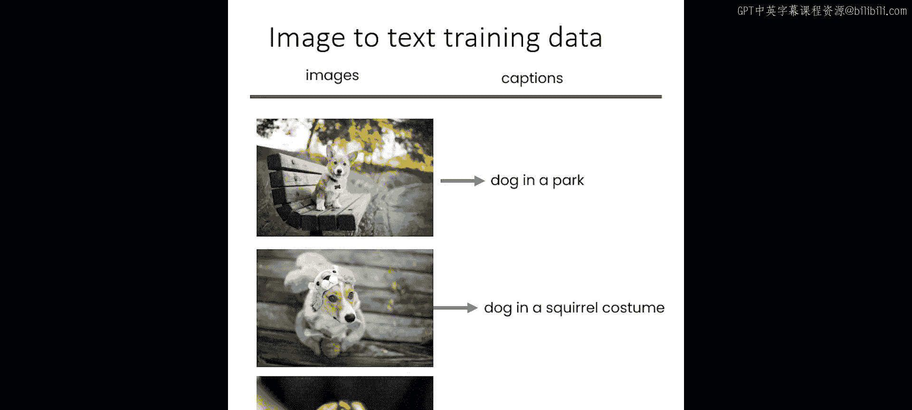
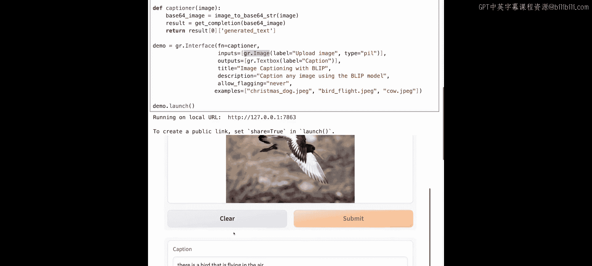
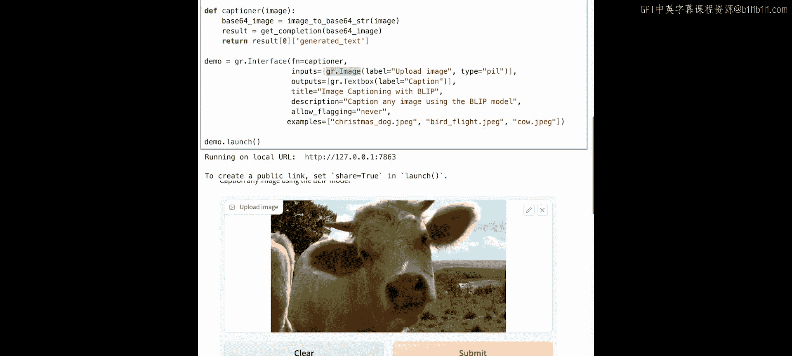
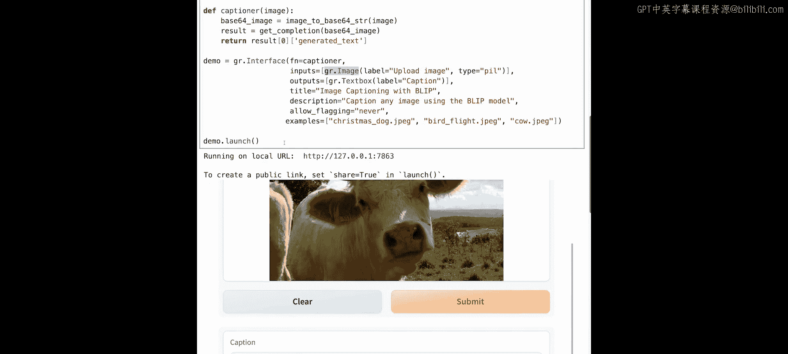

# 003：构建图像描述应用 📸


在本节课中，我们将学习如何使用开源的图像到文本模型，构建一个图像描述（Image Captioning）应用。我们将设置API密钥，调用预训练模型，并通过Gradio创建一个直观的交互界面。


## 概述

上一节我们介绍了Gradio的基本用法。本节中，我们将利用Hugging Face上的Salesforce Blip模型，创建一个能够为上传的图片自动生成文字描述的应用。核心流程是：用户上传图片，应用调用模型API，返回对图片内容的描述文本。

## 设置API与辅助函数

首先，我们需要设置访问Hugging Face模型API所需的密钥。

```python
import os
os.environ[‘HF_API_KEY’] = ‘your_huggingface_api_key_here’
```

接下来，我们定义一个辅助函数 `get_completion` 来调用图像描述模型的API端点。这个端点对应的是Salesforce Blip图像描述模型。

```python
import requests



def get_completion(inputs, parameters=None, ENDPOINT_URL=‘https://api-inference.huggingface.co/models/Salesforce/blip-image-captioning-base’):
    headers = {
        “Authorization”: f”Bearer {os.environ[‘HF_API_KEY’]}”
    }
    data = {“inputs”: inputs}
    if parameters is not None:
        data.update({“parameters”: parameters})
    response = requests.post(ENDPOINT_URL, headers=headers, json=data)
    return response.json()
```

该模型接收一张图片作为输入，并输出对该图片的描述。它是在数百万张图片及其对应文字描述的数据集上训练而成的。训练目标是让模型学会在看到新图片时，能够预测出准确的描述。

## 测试模型函数

现在，让我们用一个示例图片URL来测试这个函数。

```python
image_url = “https://example.com/dog_in_santa_hat.jpg”
result = get_completion(image_url)
print(result)
```

测试结果显示，模型为图片生成的描述是：“a dog wearing a Santa hat and scarf”。这表明模型工作正常。

## 构建Gradio应用界面

了解了模型的工作原理后，我们来看看如何用Gradio为它构建一个用户界面。首先导入Gradio库。

```python
import gradio as gr
```

我们将创建两个主要函数：
1.  `captioner` 函数：接收图片，调用 `get_completion` 函数，并返回生成的描述文本。
2.  `image_to_base64` 辅助函数：将图片转换为Base64格式，这是API调用所需的格式。如果你在本地运行模型则不需要此步骤，但通过API调用时必须进行转换。

以下是应用的核心代码结构：

```python
import base64
import requests
from PIL import Image
from io import BytesIO

def image_to_base64(image):
    buffered = BytesIO()
    image.save(buffered, format=“JPEG”)
    img_str = base64.b64encode(buffered.getvalue()).decode()
    return img_str

def captioner(image):
    # 将图片转换为Base64字符串
    image_b64 = image_to_base64(image)
    # 调用模型API
    result = get_completion(image_b64)
    # 返回描述文本
    return result[0][‘generated_text’]
```

与上一课的Gradio应用结构类似，我们定义输入、输出、标题、描述和示例。

```python
# 定义Gradio界面
demo = gr.Interface(
    fn=captioner,
    inputs=gr.Image(type=“pil”, label=“上传图片”),
    outputs=gr.Textbox(label=“图片描述”),
    title=“🖼️ 图像描述示例 (使用Blip模型)”,
    description=“上传一张图片，AI将尝试描述图片中的内容。”,
    examples=[
        [“example_images/dog_santa.jpg”],
        [“example_images/bird_flying.jpg”],
        [“example_images/cows_field.jpg”]
    ]
)

demo.launch()
```

这里，`inputs` 字段使用了新的 `gr.Image` 组件，它会在界面上呈现为一个图片上传区域。

## 运行与测试应用



运行上述代码后，Gradio应用界面将会启动。界面包含一个图片上传区域和一个用于显示描述的文字框。

以下是使用应用的一些建议：
*   你可以上传宠物、家人或身边有趣事物的照片，看看模型如何描述它们。
*   也可以直接点击界面提供的示例图片进行测试。



例如，使用之前测试过的小狗图片，应用会生成相同的描述：“a dog wearing a Santa hat and scarf”。
再尝试示例中的小鸟图片，模型描述为：“There is a bird that is flying in the yard.”，描述准确。
对于奶牛图片，模型描述为：“There are two cows standing in a field with a lake in the background.”，描述较为完整。

## 总结

本节课中，我们一起学习了如何利用开源的Blip图像描述模型和Gradio库，构建一个交互式的图像描述应用。我们掌握了设置API、编写模型调用函数、处理图片格式转换以及设计Gradio界面的完整流程。这个应用能够接收用户上传的图片，并返回AI生成的文字描述。



在下一节课中，我们将更进一步，学习如何使用生成式模型来创造全新的图像。