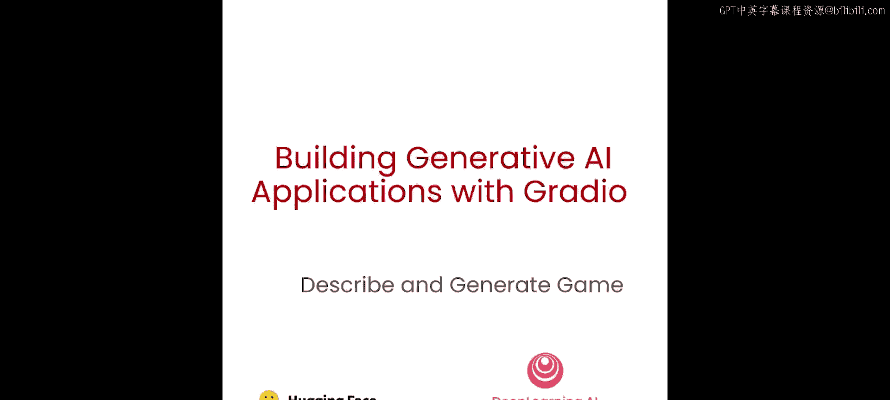
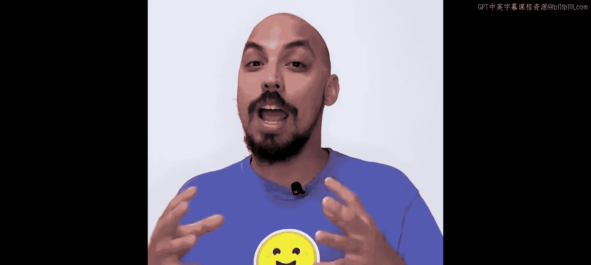
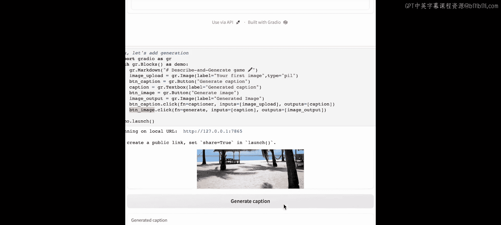
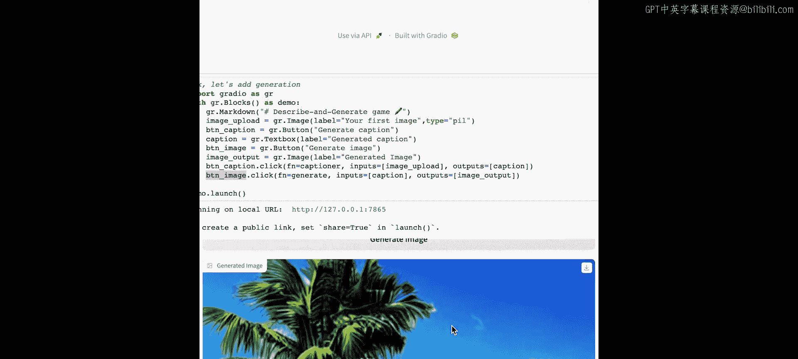
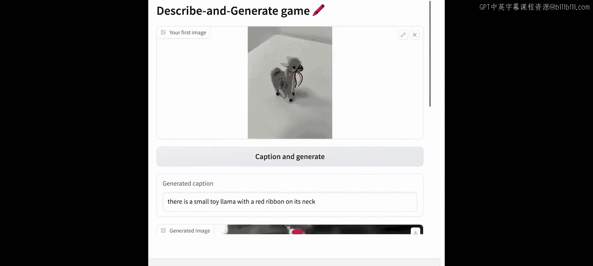
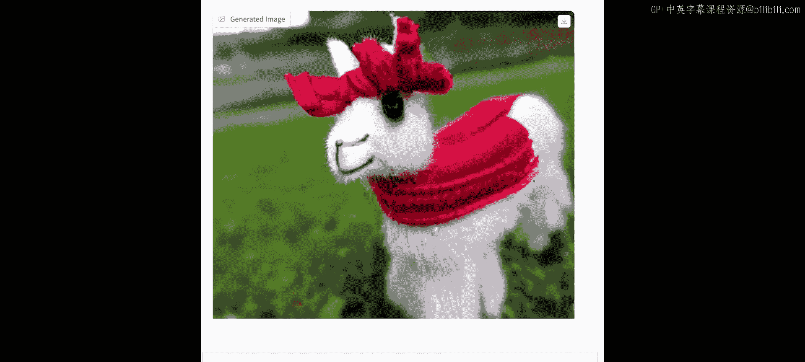
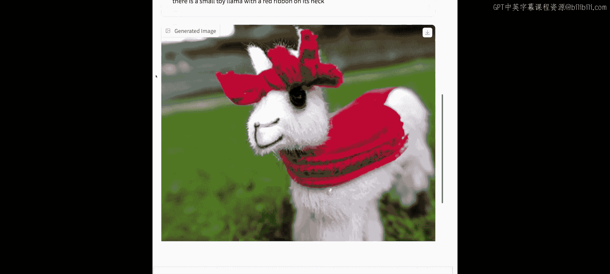
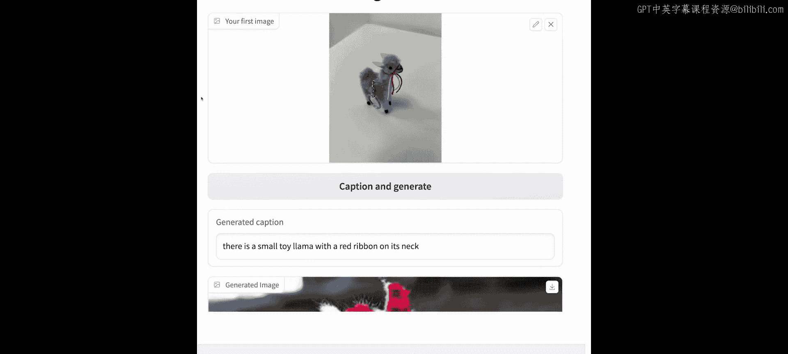
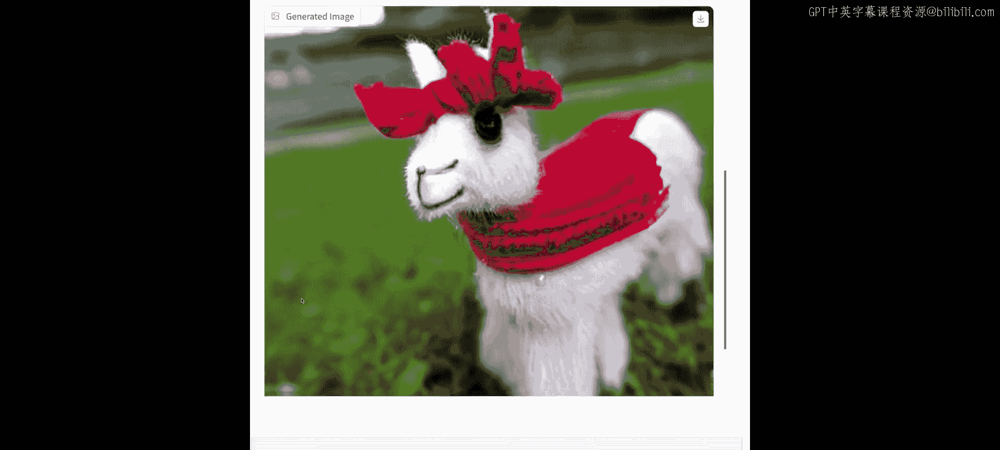
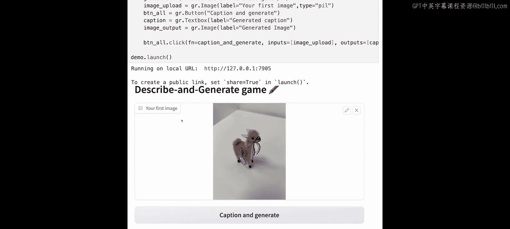

# 005：构建一个图像描述与生成的游戏





在本节课中，我们将综合之前学到的“文本生成图像”和“图像生成文本”知识，构建一个有趣的、可以交互的应用程序。

## 概述

在前几节课中，我们学习了如何为NOP应用构建Gradio应用、如何构建图像描述应用以及如何构建文本到图像应用。本节中，我们将整合这些知识，构建一个有趣的游戏。这个游戏将从图像描述开始，然后根据生成的描述，再创造出一张新的图像。

## 准备工作

首先，我们进行常规的导入操作。在我们的辅助函数中，你会看到这里有一个端点URL和两个端点变量，因为本节课我们将使用两个API：文本到图像API和图像到文本API。

以下是需要导入的函数和库：

```python
import gradio as gr
# 假设以下函数已在之前的课程中定义
from utils import image_to_base64, base64_to_image, captioner, generate
```

我们从前面的课程中引入了以下核心函数：
*   `image_to_base64`：将图像转换为Base64字符串。
*   `base64_to_image`：将Base64字符串转换回图像。
*   `captioner`：接收一张图像并生成描述。
*   `generate`：接收一段文本并生成图像。

## 构建分步式应用

首先，让我们构建一个分两步走的图像描述应用。这个应用的流程是：上传图像 -> 生成描述 -> 根据描述生成新图像。

以下是该应用的核心逻辑：

```python
# 定义处理函数
def caption_image(input_img):
    # 调用描述生成函数
    caption = captioner(input_img)
    return caption

def generate_from_caption(input_caption):
    # 调用图像生成函数
    generated_img = generate(input_caption)
    return generated_img

# 构建Gradio界面
with gr.Blocks() as demo_step:
    gr.Markdown("## 分步式图像描述与生成游戏")
    with gr.Row():
        image_input = gr.Image(label="上传图像", type="filepath")
        caption_output = gr.Textbox(label="生成的描述")
        image_output = gr.Image(label="生成的图像")

    btn_caption = gr.Button("生成描述")
    btn_image = gr.Button("生成图像")

    # 连接按钮与函数
    btn_caption.click(fn=caption_image, inputs=image_input, outputs=caption_output)
    btn_image.click(fn=generate_from_caption, inputs=caption_output, outputs=image_output)
```

在这个界面中，我们有两个按钮。`btn_caption`按钮会调用`captioner`函数，其输入是上传的图像，输出是生成的描述。`btn_image`按钮则会接收上一个函数输出的描述，将其输入到`generate`函数中，最终输出一张新图像。

你可以这样使用它：
1.  上传一张图片。
2.  点击“生成描述”按钮，获得对图片的文字描述。
3.  点击“生成图像”按钮，系统会根据上一步生成的描述，创造出一张全新的图片。

这就形成了一个有趣的“传话游戏”：上传一张图片，模型描述它，然后根据这个描述再生成一张新图片。你甚至可以将新生成的图片再次上传，生成新的描述，如此循环，观察结果会如何变化。

## 构建流线型应用



分步式应用虽然清晰，但可能需要点击多次。接下来，我们看看如何构建一个更流线型的版本，将所有步骤合并到一个函数中。



以下是流线型应用的核心逻辑：



```python
# 定义一个函数，同时完成描述和生成
def caption_and_generate(input_img):
    # 第一步：生成描述
    caption = captioner(input_img)
    # 第二步：根据描述生成图像
    generated_img = generate(caption)
    # 返回描述和图像
    return caption, generated_img

# 构建Gradio界面
with gr.Blocks() as demo_streamlined:
    gr.Markdown("## 流线型图像描述与生成游戏")
    with gr.Row():
        image_input = gr.Image(label="上传图像", type="filepath")
    with gr.Row():
        caption_output = gr.Textbox(label="生成的描述")
        image_output = gr.Image(label="生成的图像")

    btn_all = gr.Button("描述并生成图像")

    # 连接按钮与函数
    btn_all.click(fn=caption_and_generate, inputs=image_input, outputs=[caption_output, image_output])
```



在这个版本中，我们只有一个按钮`btn_all`。点击后，它会调用`caption_and_generate`函数。这个函数内部依次执行描述生成和图像生成两个任务，并一次性返回描述文本和生成的新图像。







例如，上传一张办公室里的羊驼钥匙扣图片，点击一次按钮，你就能立刻得到对它的描述（如“一只戴着红色领结的小玩具羊驼”）以及根据该描述生成的新羊驼图片。

## 总结

本节课中，我们一起学习了如何将文本到图像和图像到文本两个功能结合起来。我们构建了两种风格的Gradio应用：一种是分步式，允许用户分步查看和操作；另一种是流线型，将所有过程整合到一次点击中。这两种方式各有优劣，你可以根据实际需求选择。恭喜你，你已经成功构建了第一个结合了多种生成式AI功能的交互式游戏应用。



在下一节课中，你将学习如何构建一个由先进大语言模型驱动的聊天机器人。