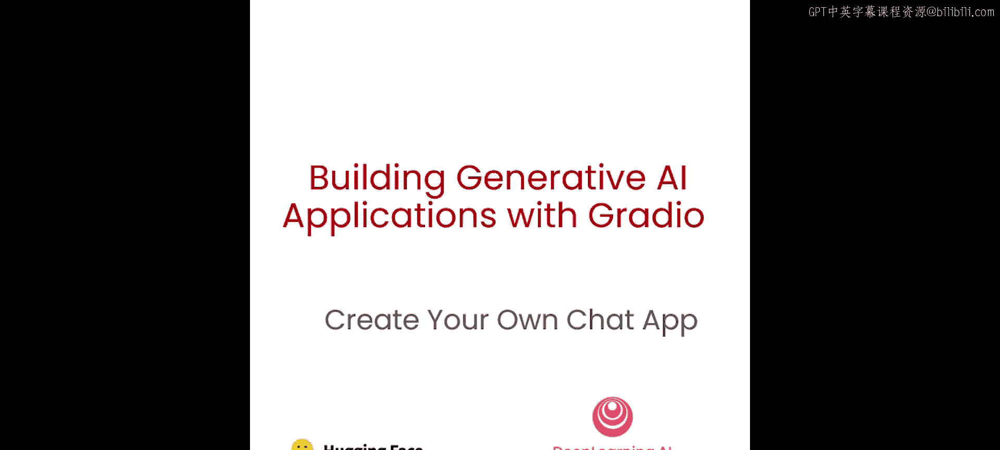
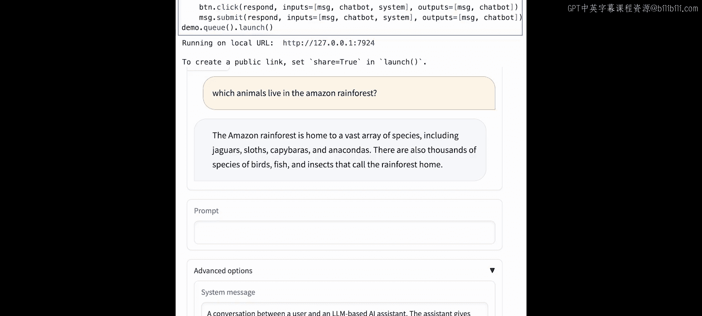

# 006：构建开源LLM聊天机器人应用 🚀




## 概述

在本节课中，我们将学习如何使用Gradio构建一个能与开源大语言模型（LLM）聊天的应用程序。我们将以目前性能最佳的开源模型之一——Falcon 40B Instruct为例，创建一个具备对话记忆和上下文理解能力的聊天机器人界面。

---

## 从简单问答到对话式交互

上一节我们介绍了如何通过Gradio界面与LLM进行简单的单轮问答。本节中，我们来看看如何构建一个能处理多轮对话、理解上下文的聊天机器人。

### 简单问答界面的局限性

我们首先创建一个基础的Gradio界面，包含一个文本框用于输入问题，并调用Falcon模型生成回答。

```python
import gradio as gr
from text_generation import Client

client = Client("https://api-inference.huggingface.co/models/tiiuae/falcon-40b-instruct")
token = "YOUR_HF_TOKEN"

def generate(prompt):
    completion = client.generate(prompt, max_new_tokens=256).generated_text
    return completion

iface = gr.Interface(fn=generate, inputs="text", outputs="text")
iface.launch()
```

运行此代码后，我们可以向模型提问，例如“Has math been invented or discovered?”，模型会生成一个最多256个token的回答。然而，这种交互方式存在明显缺陷：如果我们提出后续问题，模型无法理解上下文，因为它只接收当前输入，没有对话历史记忆。

---

## 引入Gradio Chatbot组件

为了解决上下文缺失的问题，我们需要引入Gradio的Chatbot组件。这个组件能帮助我们管理对话历史，并将其正确地格式化后发送给模型。

以下是创建基础聊天机器人界面的步骤：

```python
import gradio as gr

with gr.Blocks() as demo:
    chatbot = gr.Chatbot()
    msg = gr.Textbox()
    clear = gr.Button("Clear")

    def respond(message, chat_history):
        # 此处暂时使用预设回复进行演示
        bot_message = random.choice(["How are you?", "I love you", "I'm very hungry"])
        chat_history.append((message, bot_message))
        return "", chat_history

    msg.submit(respond, [msg, chatbot], [msg, chatbot])
    clear.click(lambda: None, None, chatbot, queue=False)

demo.launch()
```

在这个示例中，我们创建了一个包含聊天记录显示框、文本输入框和清除按钮的界面。`respond`函数暂时返回随机预设回复，以展示Chatbot组件如何工作：它将用户消息和机器人回复成对地添加到`chat_history`列表中。

---

## 连接LLM与格式化对话提示

现在，我们将预设回复替换为真实的Falcon模型生成内容。但仅仅发送当前用户消息是不够的，模型仍然无法理解对话历史。

我们需要定义一个函数来格式化对话提示，确保模型能区分用户消息和它自己的回复（助手消息）。

```python
def format_chat_prompt(message, chat_history):
    prompt = ""
    for turn in chat_history:
        user_message, bot_message = turn
        prompt = f"{prompt}User: {user_message}\nAssistant: {bot_message}\n"
    prompt = f"{prompt}User: {message}\nAssistant:"
    return prompt

def respond(message, chat_history):
    formatted_prompt = format_chat_prompt(message, chat_history)
    bot_message = client.generate(formatted_prompt, max_new_tokens=256).generated_text
    chat_history.append((message, bot_message))
    return "", chat_history
```

`format_chat_prompt`函数遍历整个`chat_history`，将每一轮对话都格式化为“User: ...\nAssistant: ...\n”的结构。最后，附加上当前的新用户消息和“Assistant:”提示，引导模型开始生成回复。这样，模型在生成回答时就能看到完整的对话上下文。

---

## 处理长对话与停止序列

随着对话轮次增加，我们发送给模型的提示会越来越长，最终可能超过模型的最大上下文长度限制。此外，模型有时可能会错误地开始生成“User:”部分的内容（即模仿用户提问）。

为了解决这些问题，我们可以采取以下措施：
1.  合理设置`max_new_tokens`参数，控制单次生成的长度。
2.  使用`stop_sequences`参数，例如设置为`["\nUser:"]`。当模型在生成过程中遇到“\nUser:”这个序列时，它会立即停止，从而防止它冒充用户。

```python
def respond(message, chat_history):
    formatted_prompt = format_chat_prompt(message, chat_history)
    bot_message = client.generate(
        formatted_prompt,
        max_new_tokens=1024, # 根据硬件和API限制调整
        stop_sequences=["\nUser:"]
    ).generated_text
    chat_history.append((message, bot_message))
    return "", chat_history
```

---

## 构建功能完整的进阶UI

为了获得最佳体验，我们可以构建一个包含更多控制选项的进阶界面。

以下是构建进阶UI的核心要素：

1.  **系统指令**：通过系统消息设定AI助手的角色和行为基调（例如，“你是一个乐于助人的助手”）。
2.  **温度参数**：控制模型输出的随机性。`temperature=0`时输出确定性最强，`temperature`值越高输出越多样。
3.  **流式响应**：让模型逐词生成回复，实现实时显示效果，无需等待整个回答完成。

```python
def format_chat_prompt(message, chat_history, system_message=""):
    prompt = f"System: {system_message}\n"
    for turn in chat_history:
        user_message, bot_message = turn
        prompt = f"{prompt}User: {user_message}\nAssistant: {bot_message}\n"
    prompt = f"{prompt}User: {message}\nAssistant:"
    return prompt

def respond(message, chat_history, system_message, temperature):
    formatted_prompt = format_chat_prompt(message, chat_history, system_message)
    # 使用支持流式生成的方法
    stream = client.generate_stream(formatted_prompt, max_new_tokens=1024, temperature=temperature, stop_sequences=["\nUser:"])

    partial_message = ""
    for token in stream:
        partial_message += token
        # 逐词更新聊天记录
        yield chat_history + [(message, partial_message)]

with gr.Blocks() as demo:
    chatbot = gr.Chatbot()
    msg = gr.Textbox(label="Your Message")
    with gr.Accordion("Advanced Options", open=False):
        system_msg = gr.Textbox(label="System Instruction", value="You are a helpful assistant.", lines=2)
        temperature = gr.Slider(label="Temperature", minimum=0.0, maximum=1.0, value=0.7, step=0.1)
    clear = gr.Button("Clear")

    msg.submit(respond, [msg, chatbot, system_msg, temperature], chatbot)
    clear.click(lambda: None, None, chatbot, queue=False)

demo.queue().launch()
```

在这个进阶示例中：
*   `format_chat_prompt`函数在对话历史前加入了系统指令。
*   `respond`函数使用`generate_stream`来获取流式响应，并通过`yield`逐步更新界面上的聊天记录。
*   界面使用`gr.Accordion`将高级选项（系统指令和温度滑块）收纳起来，保持界面整洁。
*   `demo.queue()`用于处理流式响应所需的请求队列。

---

## 总结

本节课中我们一起学习了如何使用Gradio构建一个功能强大的开源LLM聊天机器人应用。我们从简单的问答界面出发，逐步解决了上下文记忆问题，引入了Chatbot组件和提示格式化函数。最后，我们构建了一个包含系统指令、温度控制和流式响应等高级功能的完整应用。



你可以在此基础上继续探索，例如：调整UI布局、尝试不同的系统指令让模型扮演特定角色（如用法语回答的生物学家），或者集成其他开源模型。请记住，虽然LLM功能强大，但在实际应用中，对于法律、医疗等专业领域，仍需谨慎对待其输出内容，并建立相应的保障措施。