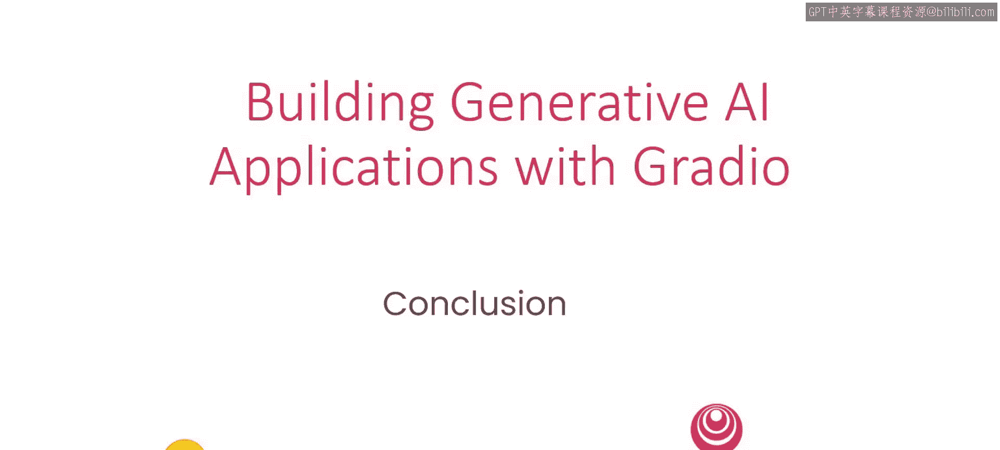

# 007：HuggingFace总结与展望 🚀

在本节课中，我们将总结使用Gradio与HuggingFace构建AI应用的核心要点，并了解如何将你的项目分享给全世界。

## 课程概述

上一节我们介绍了如何将模型集成到Gradio应用中。本节中，我们将对HuggingFace生态进行总结，并探索项目部署与社区参与的途径。

## 旅程的起点

我希望这仅仅是你使用Gradio旅程的开始。

## 探索与社区

你可以探索它的全部功能，并加入其充满活力的开源社区。

以下是深入学习的两个关键方向：
*   **探索功能**：深入研究Gradio的文档，尝试其高级组件和布局选项。
*   **加入社区**：在GitHub或Discord上参与Gradio社区的讨论，获取帮助并分享想法。

## 部署与分享

当你有了想要与世界分享的应用程序时，HuggingFace提供了一个名为**Spaces**的平台，你可以在上面部署它们。

部署应用的基本流程如下：
1.  在HuggingFace网站上创建账户。
2.  点击“新建”并选择“Space”。
3.  按照指引，上传你的Gradio应用代码（通常是一个包含`app.py`的仓库）。
4.  Spaces会自动构建并公开你的应用。

## 总结与展望

本节课中我们一起学习了Gradio与HuggingFace生态的结合，并了解了通过Spaces平台部署和分享AI应用的方法。我十分期待看到你构建出的作品。😊