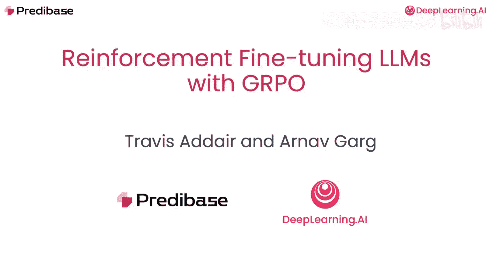
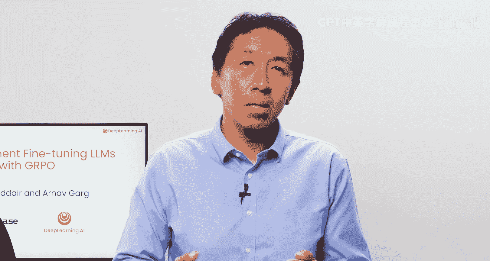
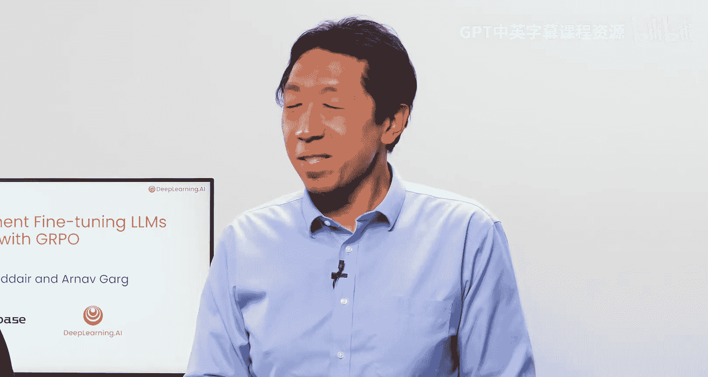
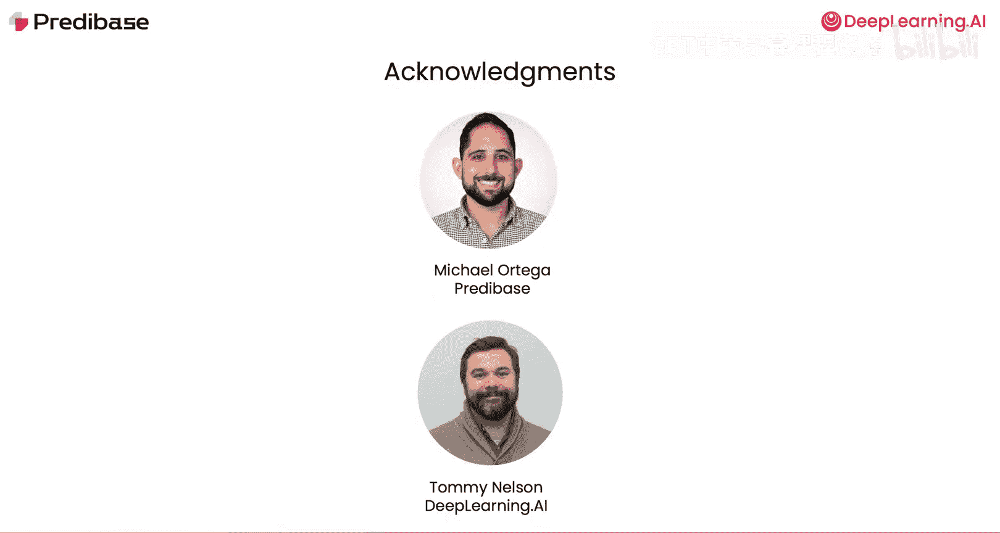

# 001：课程介绍 🎯

在本课程中，我们将学习一种名为**强化微调**的技术。这是一种利用强化学习来提升大型语言模型在需要多步推理任务上性能的训练方法，例如解决数学问题或生成代码。通过引导模型逐步思考，强化微调能让模型自主发现复杂任务的解决方案，而不是像传统监督学习那样依赖已有的示例。

这种方法能让你用比成功监督微调所需数据量少得多的训练数据（可能只需几十个例子）来让模型适应复杂的任务。我们很高兴地介绍本课程的讲师：Predbase公司的联合创始人兼首席技术官Travis，以及高级机器学习工程师兼机器学习负责人Arnav。他们都曾与许多客户密切合作，使用强化微调解决实际业务问题。

---

在课程中，我们将通过一个有趣的例子来探索强化微调的工作原理：训练一个小型语言模型玩**Wordle**游戏。这是一个流行的猜词游戏，玩家需要在六次或更少的尝试中猜出一个五个字母的单词。

我们将从提示一个拥有**25.7亿**参数的模型玩这个游戏开始，分析其表现，并开发一个**奖励函数**来帮助模型学习如何随时间推移做得更好。

这个奖励函数是**GRPO**算法的核心组件。GRPO，即**组相对策略优化**，是由DeepSeek开发的一种用于执行推理任务强化学习的学习算法。在GRPO中，语言模型会对单个提示生成多个响应，然后使用一个基于可验证指标（如正确的格式或可运行的代码）的奖励函数来评估这些响应。

使用奖励函数是GRPO与其他强化学习算法（如依赖人类反馈或复杂多模态系统来分配奖励的PPO或DPO）的关键区别。

在为Wordle示例开发奖励函数后，你将学习一些编写优秀奖励函数的通用原则，这些原则可应用于广泛的问题。我们还将探讨如何避免**奖励黑客**行为，即模型学会了最大化奖励但并未真正解决问题的行为。

接下来，我们将仔细研究在强化微调过程中**损失**是如何计算的。你将看到，GRPO算法中看似复杂的过程（如损失函数中的**裁剪**和**KL散度**），一旦用代码实现，其实比想象中更简单。

最后，课程结束时，你将了解如何使用Predbase API，结合你自己的数据和自定义奖励函数来执行强化微调。

---

推理能力强的语言模型是许多智能体系统的关键组成部分，而强化微调能让较小的模型在智能体工作流程中表现出色。围绕大型语言模型的这一能力，人们充满了兴奋。同时，强化学习本身也是一种非常强大且重要的技术，对许多人来说仍然非常神秘。因此，现在是学习强化学习工作原理以及如何用它来微调你自己的定制推理模型的绝佳时机。相信你会发现学习这些内容非常有收获。

---

在上一节中，我们介绍了课程的整体目标和强化微调的基本概念。接下来，在下一节视频中，我们将学习强化微调与监督微调之间的主要区别。