# 002：强化学习简介 🧠

在本节课中，我们将要学习强化学习如何帮助大型语言模型通过实验和接收结果反馈来学习新任务。你将看到这个过程与监督微调有何不同，并直观地了解最重要的强化学习算法是如何工作的。

## 从监督微调到强化学习

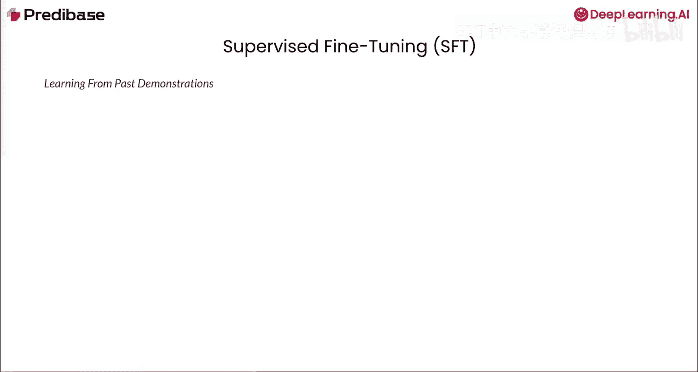

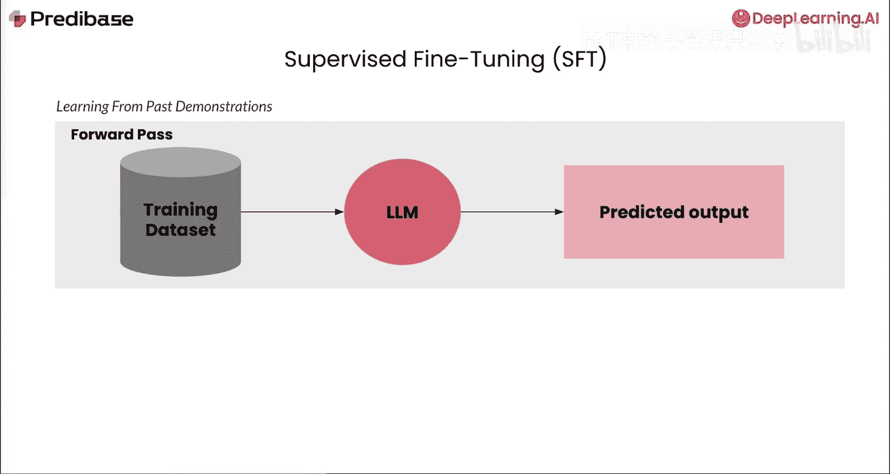

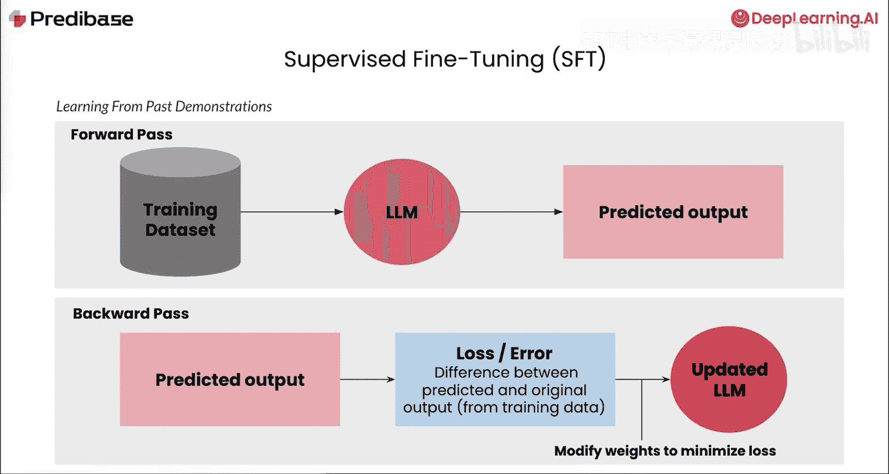

上一节我们介绍了监督微调的基本概念，本节中我们来看看强化学习如何提供一种不同的训练范式。

传统上，我们通过一个称为监督微调的过程来教LLM完成分类、命名实体识别和代码生成等任务。首先，我们收集一个带标签的数据集，即一组提示词和响应对，以展示我们希望LLM学习的行为。然后，在训练期间，每个示例都会经过两个步骤：在前向传播中，模型为给定的提示词生成输出。接着，在反向传播中，我们将模型的输出与正确的响应进行比较，计算误差，并更新模型的权重以减少该误差。当我们对数千个类似示例重复这些步骤时，模型就学会了期望的行为。

监督微调的关键在于它通过演示来教导模型。例如，我们可以向模型展示一组数学问题及其最终答案，它将学会生成这些输出的模式，即使对于以前从未见过的类似数学问题也是如此。对于更复杂的任务，你可以在答案旁边包含推理步骤。通过这种方式构建数据集，你可以同时教导模型两个方面：第一是输出格式，即如何使用标签将思考过程与最终答案分开；第二是这种逐步推理的能力。这个系统教导模型如何生成从提示词到期望解决方案的逻辑链。

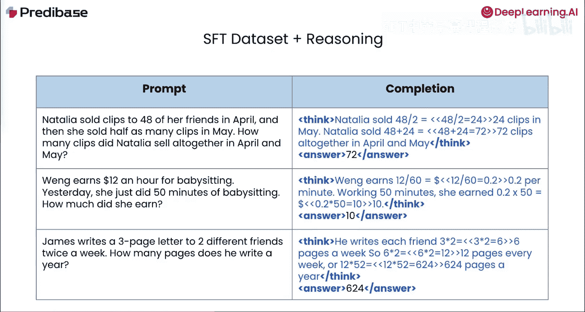

然而，尽管监督微调擅长许多任务，但它确实有一些局限性。为了获得良好的质量改进，通常需要数千个高质量的标记示例供模型学习，而这些示例的收集可能更加困难和昂贵。另一个常见的问题是过拟合现象，即模型过于完美地学习了数据中的模式，而在未见过的示例上表现不佳。这些局限性指向了对一种训练方法的需求，这种方法可以减少对大量标记数据的依赖，减轻过拟合，同时仍能引导模型朝向期望的行为。

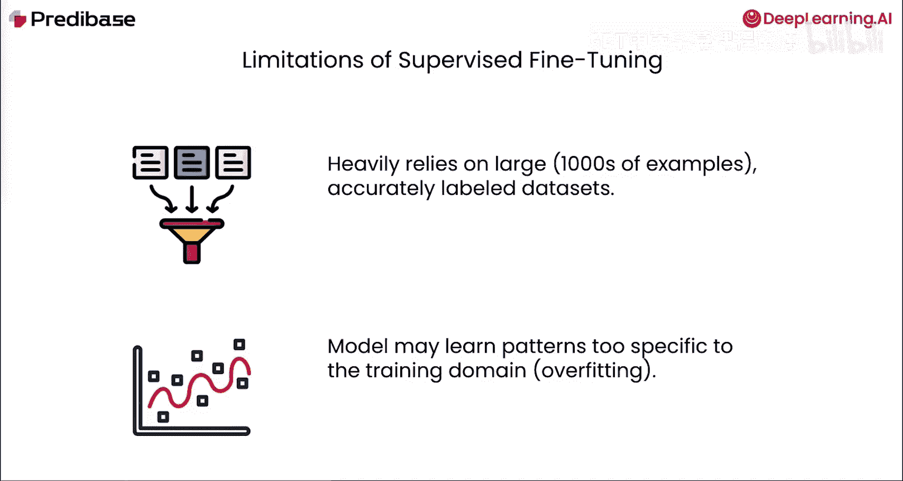

## 强化学习核心概念 🐕

一种这样的替代方法是强化学习，模型通过与环境交互并优化奖励信号来学习，而不是模仿固定的标记示例。为了更好地理解这个想法，让我们仔细看看这个例子。

在这个例子中，你的小狗可以采取许多不同的行动。它可以选择坐在一个地方，可以选择打滚，或者在你扔出棍子时选择去捡回来。小狗从所有可以采取的行动中学习到，当它实际捡回棍子并交还给你时，它会得到零食作为奖励，而不是一直坐在原地。在这个例子中，小狗是**智能体**。捡棍子是**小狗采取的行动**。零食是**从环境中获得的奖励**。小狗观察到的结果是，带回棍子会得到零食，而不是其他行动。

那么，这个想法如何实际转化为LLM训练呢？我们可以从一个示例开始，例如来自环境的**提示词**，并将其输入给作为智能体的**语言模型**。然后，语言模型采取一个行动，即生成一系列**标记**作为其响应。我们可以评估这个响应，并提供一个分数，作为对该行动的**奖励**。这个分数可以基于质量、人类偏好或像准确性这样的自动化指标。然后，模型可以使用这个奖励作为反馈来调整其权重，从而学会为不同的输入提示词最大化其奖励。这个过程可以在新示例甚至相同示例上重复，模型将继续优化其权重以获得更高的奖励。

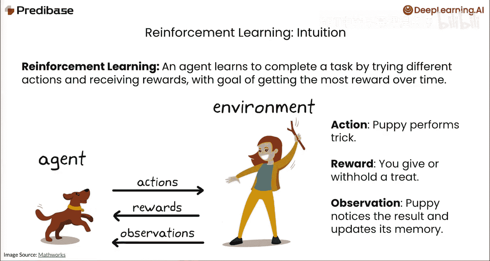

## 主流强化学习算法

以下是两种主流的基于人类反馈的强化学习方法。

### 基于人类反馈的强化学习

那么，我们如何实际实施这样的训练过程呢？一种被证明极其有效的方法是基于人类反馈的强化学习。这正是驱动ChatGPT等模型的核心过程。RLHF工作流程包含四个步骤。

在步骤1中，我们向语言模型发送一个提示词，并使用基于温度的采样方法生成多个候选响应。在步骤2中，我们要求标注者将这些响应从最好到最差进行排序。这产生了一个偏好排序数据集。在步骤3中，我们训练一个单独的奖励模型来学习预测这些人类偏好。它接收一个提示词和响应对作为输入，并输出一个分数来指示该响应的好坏。最后，在步骤4中，我们使用像PPO这样的强化学习算法对原始LLM进行微调。对于每个提示词，语言模型生成一个响应，奖励模型对其进行评分，然后更新语言模型的权重，以增加产生高评分输出的可能性。当我们对数百个提示词重复此步骤时，它就学会了生成能产生高分并与人类偏好一致的响应。

### 直接偏好优化

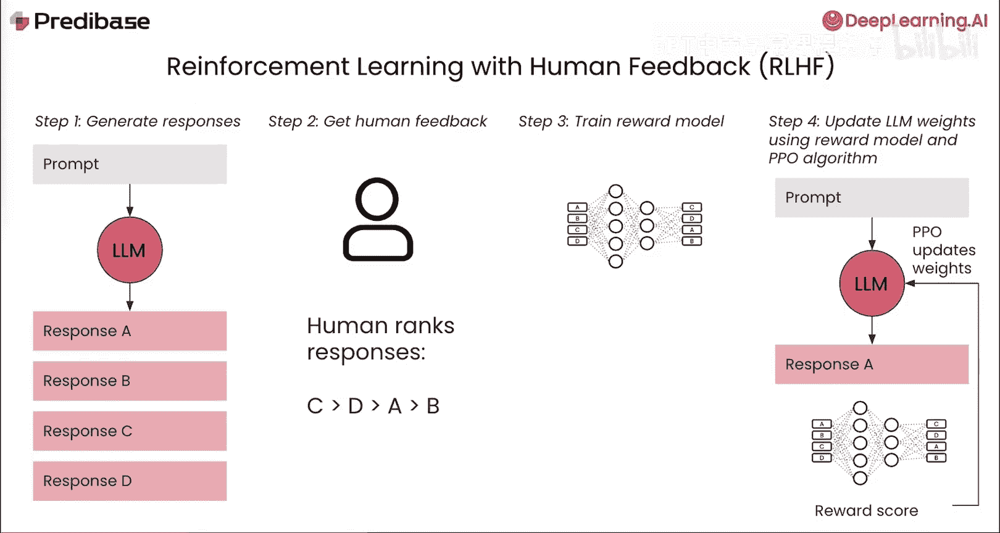

另一种日益流行的强化学习算法是直接偏好优化。与RLHF类似，它也使用人类偏好数据。但它不是首先训练一个单独的奖励模型，而是直接在人类偏好对上微调LLM。让我们看看它是如何做到的。

我们以与RLHF相同的过程开始，将提示词传递给LLM并采样候选响应。然而，在这种情况下，我们只采样两个不同的响应A和B。接下来，我们可以通过要求标注者告诉我们他们更喜欢两个响应中的哪一个来获取人类反馈。这通常在各种应用中使用点赞或点踩来完成，但也有其他收集方式。然后，这些偏好被用来创建一个偏好数据集，该数据集包含一个提示词、被选中的响应以及同一提示词下被拒绝的响应。最后，我们可以使用DPO算法来更新模型的权重，以生成具有更高人类偏好的响应。

训练算法本身背后的思想非常简单：对于每个提示词，比较模型对偏好响应和被拒绝响应的概率分布，看看它更可能生成哪一个。然后我们调整权重，使得模型对偏好响应的概率上升，对被拒绝响应的概率下降。

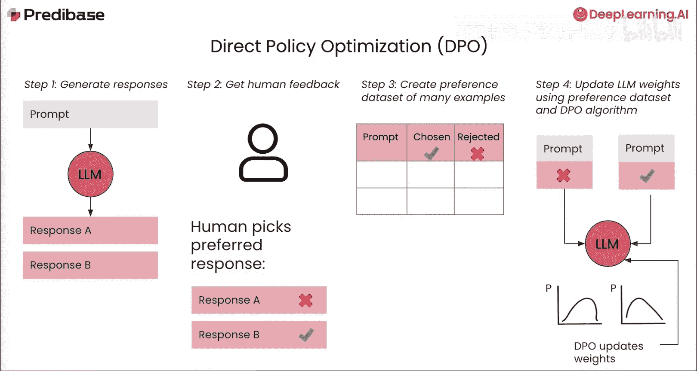

## GRPO：一种新的替代方案

RLHF和DPO都依赖于人类偏好标签，而不是标准答案，但它们在标签格式、成本和风险上有所不同。RLHF需要对许多候选响应进行完整排序以训练奖励模型，并且还需要将模型的多个副本加载到内存中，导致非常高的计算和内存开销。相比之下，DPO使用简单的偏好对，通过不需要奖励模型来减少计算负载，但仍然需要大量带注释的比较数据来学习细微的偏好差异。

然而，这两种方法都没有教导模型全新的任务。它们只是引导模型朝向人类偏好的行为。为了克服对大型偏好数据集的依赖，DeepSeek团队提出了一种新的替代方法，称为组相对策略优化。这是DeepSeek R1背后的算法。

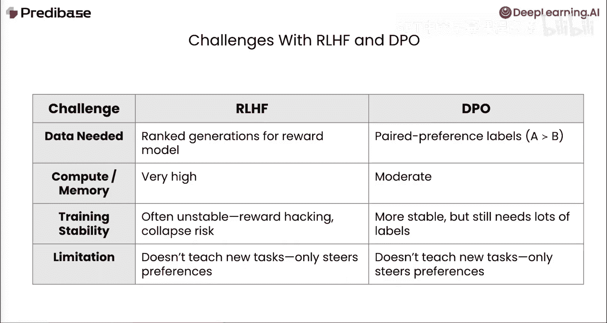

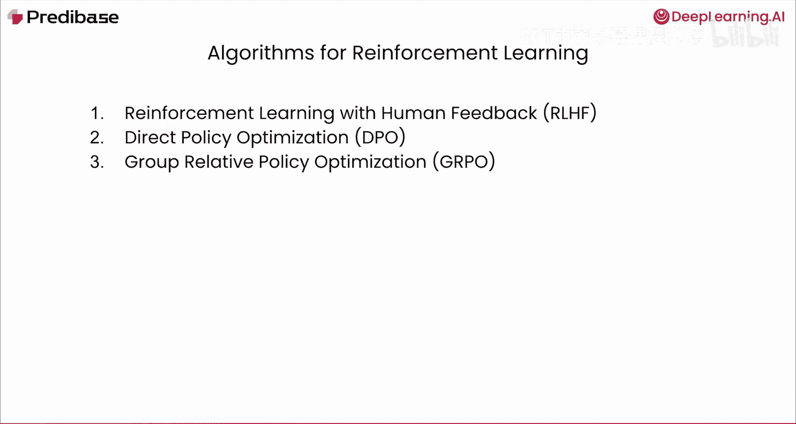

GRPO算法通过依赖我们可以定义的可编程奖励函数，绕过了对任何人类偏好标签的需求。其核心训练循环有三个步骤。与RLHF类似，我们首先向语言模型发送提示词并采样多个候选响应。接下来，我们可以编写一个或多个可编程奖励函数，这些函数接收每个提示词和响应对作为输入，并输出一个分数。例如，你可以检查输出的格式或其正确性。如果这些函数编写得当，生成的响应将获得一系列分数。然后，GRPO算法将每个候选的奖励视为训练信号。它提升组内得分高于平均水平的响应的生成概率，并降低得分低于平均水平的响应的生成概率。通过重复这个循环，GRPO直接在您关心的奖励函数上微调模型，而无需收集偏好数据，从而在人类标签稀缺或成本高昂时也能实现强化微调。关于奖励函数和GRPO训练算法的更多细节，我们将在本课程的其余部分进行介绍。

## 总结

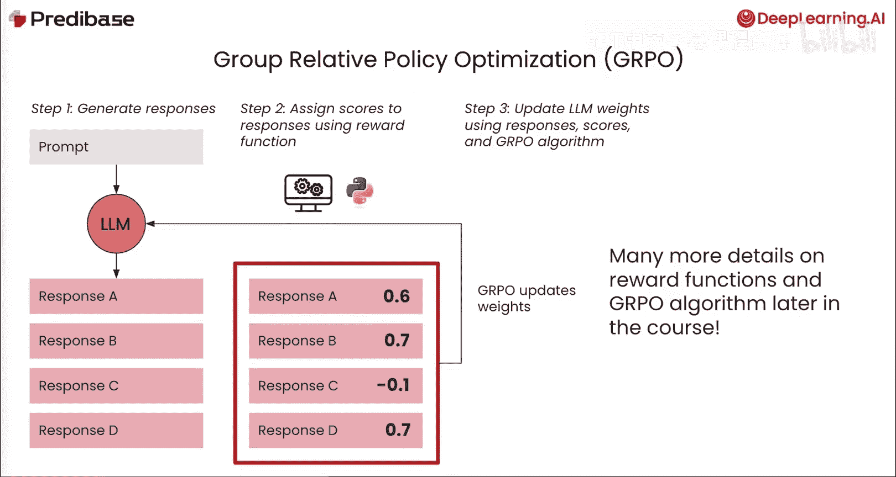

本节课中我们一起学习了强化学习的基本原理及其在大型语言模型微调中的应用。我们回顾了监督微调的局限性，并探讨了强化学习如何通过奖励信号引导模型学习。我们介绍了两种主流方法：基于人类反馈的强化学习和直接偏好优化，并了解了它们各自的优缺点。最后，我们介绍了组相对策略优化这一新方法，它通过可编程奖励函数减少了对人类标注数据的依赖。理解这些基础概念是后续深入学习GRPO等具体算法的关键。