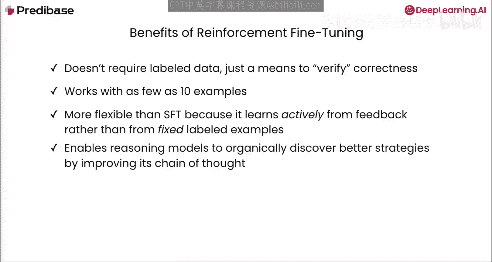
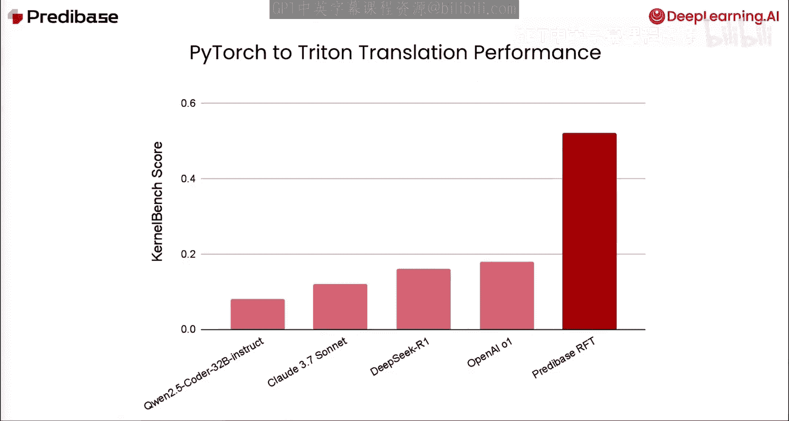
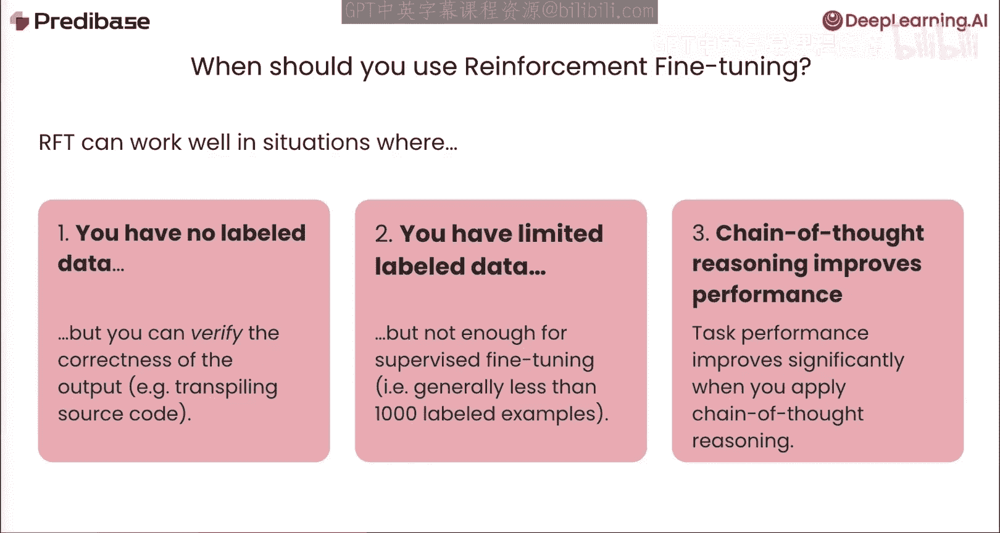
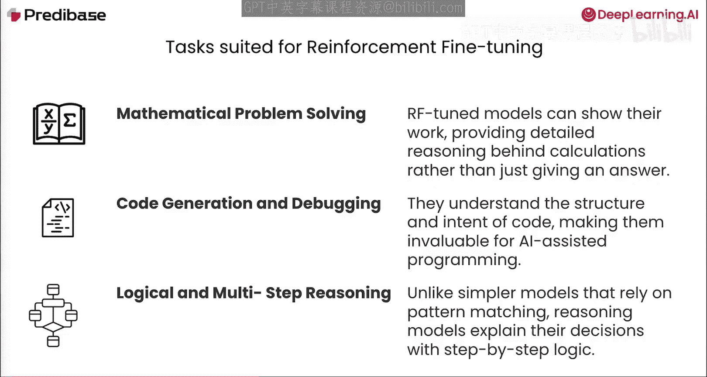
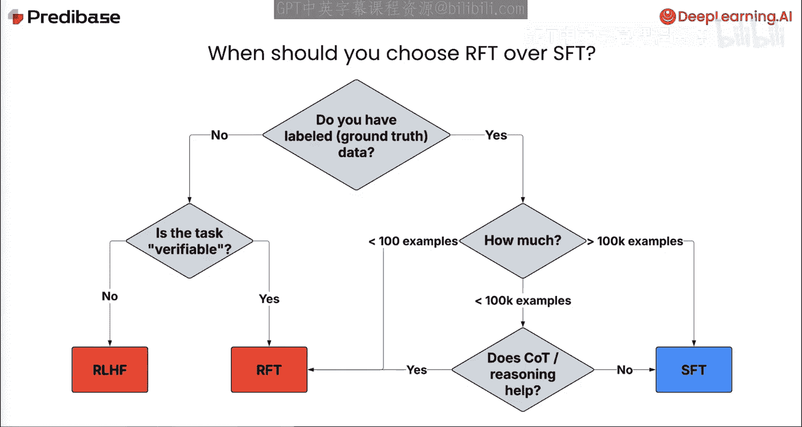

# 003：强化微调的优势 🎯

在本节课中，我们将探讨将强化学习作为一种微调技术能为你的工作带来哪些益处，以及哪些任务最适合使用这种训练方法。我们将具体分析 GRPO 在实践中带来的优势，并帮助你判断何时应该选择强化微调。

## 强化微调的优势

上一节我们介绍了强化学习的基本工作原理，本节中我们来看看 GRPO 作为微调技术所具备的具体优势。

**GRPO 在实践中具有以下主要优势：**

1.  **无需标注数据**：该方法不需要预先标注好的数据。你只需要一种验证输出正确性的方法，例如通过可编程的奖励函数、使用大语言模型作为评判员，或本课程中将讨论的其他方法。
2.  **数据效率高且可扩展**：它可以从少至 1 个示例开始工作，并随着训练过程中向模型展示的提示词数量的增加而有效扩展。
3.  **比监督微调更灵活**：GRPO 在训练过程中主动从反馈中学习，而不是从一个固定的标注数据集中学习。这使得它更加灵活。
4.  **促进推理能力提升**：正因如此，它能使推理模型有机地发现解决复杂问题的更好策略，通过改进其内部的思维链来实现。

## 实践案例：代码翻译

在 Crbase，我们想看看 GRPO 训练的模型在诸如代码翻译这样的艰巨现实任务上表现如何。

我们使用基于 GRPO 构建的强化微调方法，成功创建了一个最先进的 Triton 内核生成模型。该模型从一个开源的 320 亿参数指令模型微调而来，其表现超越了 Cloth 3.7、Thinking Deep C1 甚至 OpenAI 的 o1 模型。

这个结果强调了，**使用可编程奖励的强化微调可以将大语言模型的能力推送到远超监督学习或基于偏好的训练方法的水平**。

## 何时使用强化微调？

那么，你究竟应该在何时使用强化微调呢？它在以下三种情况下效果显著：

以下是三种最适合使用强化微调的场景：

*   **没有标注数据时**：当你没有标注数据，但可以验证模型输出的正确性时，例如代码生成或具有确定性输出的简单智能体工作流。
*   **标注数据有限时**：当你有标注数据，但数量不足以进行有效的监督微调时。这通常指少于 1000 个标注示例的情况。
*   **思维链推理能提升性能时**：当任务性能可以通过思维链推理得到提升时。

> **思维链推理**是一个过程，你要求模型在给出最终答案之前，先输出一些描述其思考过程的词元。事实证明，那些应用思维链后性能得到提升的任务，也非常适合使用强化微调。

## 适合强化微调的任务示例

哪些任务非常适合强化微调呢？有很多，以下是三个典型例子：

以下是三个非常适合强化微调的任务类型：

1.  **数学问题求解**：在这种情况下，强化学习让模型生成并验证详细的解题步骤，并不断优化其思维链，直到计算正确为止。
2.  **代码生成与调试**：这也是强化微调的一个绝佳用例。模型通过针对测试用例或代码规范进行评分来学习，从而生成正确、地道的代码，并迭代地修复错误。
3.  **逻辑与多步推理任务**：例如智能体工作流。当一个任务需要一系列决策时，强化微调鼓励模型进行自我批判，并根据最终结果改进每一步。

在以上每种场景中，**从程序化或基于竞赛的奖励中主动学习的能力，解锁了远比静态监督微调更丰富、更可靠的行为模式**。

## 决策流程：如何选择？

如果你正在决定是否使用强化微调，可以遵循以下决策流程：

以下是帮助你选择微调方法的决策步骤：

1.  **检查标注数据量**：
    *   如果拥有充足的标注数据（例如超过 10 万行），**监督微调**通常是获得一个好模型的最快路径。
    *   如果标注数据量中等（例如少于 10 万行，但大约有 1000 行），你需要自问：思维链或其他推理提示是否能提升初始性能？
        *   如果能，那么**强化微调**可以通过奖励正确的推理步骤来放大这些推理收益。
        *   如果不能，你很可能从使用**监督微调**中获益最多。
2.  **考虑任务可验证性**：
    *   如果你**没有**标注数据，则应考虑任务的可验证性。
    *   如果你可以验证输出并为其分配一个分数，那么你可以使用带有可编程奖励函数的**强化微调**。
    *   然而，如果你的任务**不可验证**，你可能需要使用其他算法，如通过首先收集偏好标签来进行 DPO 或 RLHF。

## 总结与预告

本节课中，我们一起学习了强化微调相较于传统方法的优势，了解了它最适合的应用场景和任务类型，并掌握了一个帮助你做出技术选型的决策流程。

在下一课中，我们将演示如何使用 GRPO 来训练一个玩 Wordle 游戏的模型。尽管 Wordle 是一个游戏，但它为探索 GRPO 算法的每一个组成部分提供了一个理想的沙盒环境，并能让你亲眼看到为何这种方法在强化微调中表现出色。