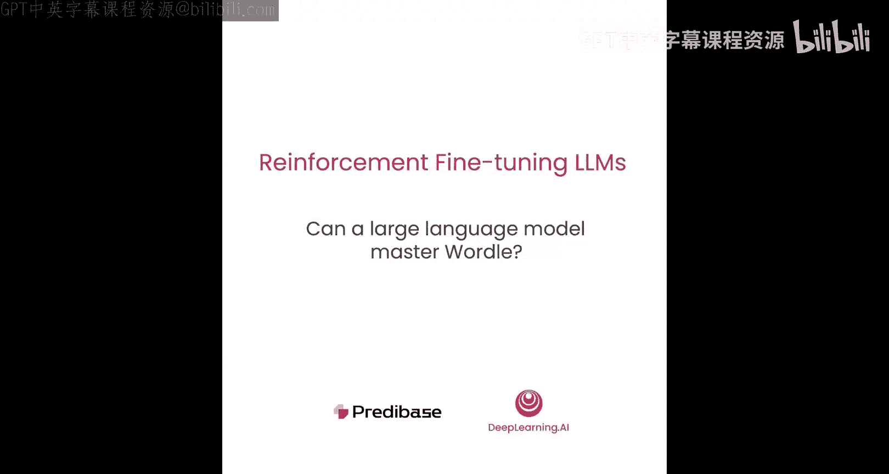
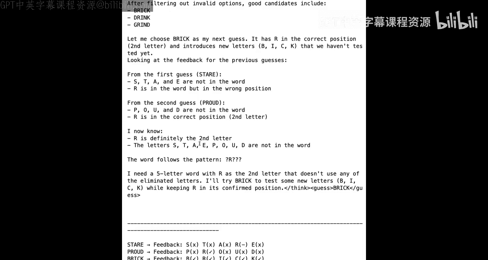

# 004：大型语言模型能掌握 Wordle 吗？🧩

在本节课中，我们将介绍 Wordle 游戏，并将其作为 GRPO 方法的一个贯穿始终的示例。Wordle 是一个简单的游戏，但它需要规划、假设检验和逐步推理才能玩得好。这使其成为一个绝佳的例子，用以观察大型语言模型如何学习规划、分析反馈，并通过强化微调逐步改进其策略。

## 游戏规则回顾 🎯

上一节我们介绍了 Wordle 作为 GRPO 的示例。本节中，我们来看看 Wordle 的具体规则。

游戏目标是在最多 6 次猜测中识别出一个秘密的 5 字母单词。每次猜测后，你会收到关于猜测中每个字母的反馈。绿色表示字母正确且位置正确。黄色表示字母出现在单词中，但位置不同。灰色表示该字母完全不出现在单词中。

由于我们需要将游戏信息输入给语言模型，我们将用文本符号来表示这些颜色：用对勾 `✓` 表示绿色，用短横线 `-` 表示黄色，用叉号 `✗` 表示灰色。

## 将 Wordle 构建为强化学习问题 💻

现在，让我们进入代码，看看如何将 Wordle 构建为一个强化微调问题。

首先，我们需要导入一些必要的包。我们将通过指定不同的基础 URL 来配置 OpenAI SDK，使其指向一个模型托管服务。在本节课中，我们将使用 `Gemma-2-7b-instruct` 模型。

初始化客户端后，我们可以使用 `transformers` 包加载与该模型关联的分词器。

加载分词器后，让我们设置系统提示词，我们将把它传递给模型以进行 Wordle 游戏。系统提示词包含几个关键部分。第一部分是告诉语言模型它正在玩 Wordle 这个猜词游戏。第二部分侧重于给出我们刚刚讨论的三条游戏规则。第三部分告诉模型它将如何接收反馈。

在给出这些基本信息后，我们还会提供一个秘密单词以及猜测和反馈的示例。例如，我们给出秘密单词是 `brisk`，并假设模型猜测了 `storm`，我们会以每个字母对应一个符号的格式给出反馈。在这个例子中，`S` 在单词 `brisk` 中，但位置错误，所以我们给它一个短横线 `-`，而 `O`、`T`、`M` 完全不在单词中。

最后，我们会告诉模型我们想要的响应格式。具体来说，我们将要求它使用思维链推理来解释其思考过程，并将思考过程放在 `<think>` 标签内，然后将猜测的单词放在 `<guess>` 标签内返回。

## 定义辅助类和方法 🛠️

接下来，我们将定义一些辅助类和方法。

我们可以导入一些额外的依赖项来帮助定义。我们将定义一个枚举（`Enum`），用于指示猜测中每个字母的反馈。我们还将定义一个名为 `GuessWithFeedback` 的数据类，它包含一个字符串类型的猜测（`guess`）和一个反馈属性（`feedback`），反馈是一个枚举对象的列表。我们还会定义一个包装器，它的作用是将猜测和反馈转换为可以添加到提示词中的字符串。

现在，我们有了表示反馈的方法，接下来需要定义一个方法，帮助我们将所有这些反馈捕获到一个可以传递给模型的用户提示词中。我们将始终以基础提示词“请猜测一个新的5字母单词”开始，然后使用过去的猜测列表，从 `GuessWithFeedback` 对象创建这些反馈字符串，并在用户提示词中返回。

接下来，我们需要一种方法来捕获系统提示词、带有反馈的用户提示词，并为模型的逐步推理提供一个简短的开场白。

我们将定义这个包含系统提示词、完整渲染的用户提示词和开场白的消息对象。然后，我们将使用分词器，用正确的聊天模板标记来格式化它，以便模型以它期望的格式接收。

最后，我们将定义一个 `generate_stream` 函数，它接收一个提示词和一个可选的适配器 ID。这将调用 OpenAI 的 `completions.create` 端点，并传入提示词、温度、最大令牌数等参数，然后在生成时流式传输输出。需要注意的是，我们将温度设置为 `0` 以产生确定性响应，因为我们正在评估模型的质量。

## 查看格式化数据与模型表现 📊

现在我们已经定义了这些辅助方法，让我们看看格式化后的提示词数据是什么样子。

假设我们想要猜测的秘密单词是 `craft`。到目前为止，模型已经进行了两次猜测：`crane` 和 `crash`。我们可以创建 `GuessWithFeedback` 类的实例，其中包含猜测以及每个字母的详细反馈。当我们将其传入 `render_prompt` 方法时，我们会看到我们的提示词包含了与系统提示词相同的内容，以及格式化的反馈和开始猜测的开场白。

接下来，我们可以看看当我们将这个提示词发送给基础模型时会发生什么。

基础模型理解了很多反馈：`C` 和 `R` 在正确位置，而 `N`、`E`、`S` 和 `H` 不在。然而，它决定重复其最初的猜测 `crane`。这是一个相当不理想的猜测。

现在，我们可以看看微调模型在相同提示词上的表现。注意，我们在这里传入了一个适配器 ID，它指向我们使用将在本课程其余部分继续探索的强化微调过程训练的模型的权重。我们使用一种称为 LoRA 的技术对模型进行了微调，它允许我们仅添加和更新一小部分低秩适配器权重，而不是修改基础模型中的所有权重。

当它开始生成响应时，我们可以看到它理解了 `C` 和 `R` 在正确位置，而 `N` 和 `E` 不在单词中。同样，它也理解了单词 `crash` 的反馈。接着，它逐步思考可能的单词并排除它们。在生成了这一长串思维链后，它根据剩余的所有条件，决定 `craft` 是一个最优的猜测。微调模型实际上利用过去的反馈，在三次猜测中正确猜出了我们的秘密单词。

## 模拟完整游戏流程 🎮

现在我们已经了解了基础模型和微调模型在单轮中的表现，我们可以尝试模拟整个游戏。

为此，我们可以定义两个有用的辅助方法。`get_feedback` 方法将猜测和秘密单词作为输入，并使用上面定义的标准为猜测中的每个字母分配反馈。如果字母在确切位置匹配，我们给它一个正确符号 `✓`；如果它在字母列表中但位置错误，我们给它一个短横线 `-`；如果它完全不在单词中，我们将其标记为错误字母 `✗`。然后，它将返回这些单独反馈的列表作为输出。

我们还可以定义一个函数来逐轮模拟游戏玩法，我们称之为 `next_turn`。它接收三个属性作为输入：过去的猜测列表、秘密单词和一个可选的适配器 ID。它首先获取过去的猜测列表，并生成我们上面看到的渲染后的提示词。接着，它发送给模型以生成输出。一旦我们有了响应，我们将使用正则表达式匹配来提取 `<guess>` 标签之间的单词。如果正则匹配成功，我们就得到了模型的猜测。然后，我们可以使用上面定义的 `get_feedback` 方法为其分配反馈。我们可以将其添加到过去的猜测列表中，并继续这个过程。最后，这个函数将打印此时所有的过去猜测。如果猜测与秘密单词匹配，则将其标记为成功。如果我们进行了超过 6 次猜测，则说明模型没有成功。

## 对比基础模型与微调模型 🤖

定义了所有这些辅助方法后，让我们进入游戏玩法的核心部分。

对于游戏，我们将猜测一个秘密单词 `brick`，这对模型来说是一个相当容易猜测的单词。我们将从一个空的过去猜测历史开始，并将适配器 ID 设置为空，以便首先使用基础模型进行猜测。

接下来，我们可以调用 `next_turn` 函数，传入过去的猜测、秘密单词和适配器 ID，看看它会输出什么。

对于第一次猜测，模型认为猜测一个包含常见元音和辅音的常用单词是个好主意，因此它猜测了单词 `grain`，并相应地得到了一些反馈。让我们看看它在下次猜测中如何整合反馈。

如果你查看模型在第二次猜测时的思维链，我们可以看到它利用了一些反馈，例如 `R` 在正确位置，但它也错误地得出结论认为 `C`、`A`、`N` 和 `E` 完全不在单词中。如果我们阅读思维链的其余部分，我们会看到它决定随机猜测，并猜了单词 `brick`，因此它猜对了这个单词。

现在，让我们看看微调模型对于同一个秘密单词的表现如何。再次，我们定义我们的秘密单词，将过去的猜测设置为空列表，但这次我们将适配器 ID 设置为上面看到的同一个模型。然后，我们可以像之前一样调用 `next_turn` 函数。

微调模型决定它想选择一个首猜单词，它需要包含常见字母、有元音且重复字母最少。它提出了一组合理的候选词，如 `arise`、`stare` 或 `crane`，然后决定 `stare` 是一个很好的首猜，因为它包含很多常见字母。对于这个猜测，它收到了以下反馈。让我们看看它如何在下次猜测中利用其反馈。

模型首先分析其第一次猜测，并正确地了解到 `S`、`T`、`A` 和 `E` 不在秘密单词中。它还承认 `R` 在单词中，但位置错误。基于此，它想出了一个策略，思考它尚未尝试过的常见字母，然后思考如何使用这些信息。基于它知道 `R` 在单词中但位置错误的事实，它认为 `R` 可能应该在第二个位置，并想出了一个可能的单词列表。接着，它排除了像 `print` 这样的单词，因为它知道 `P` 不在单词中。随着它继续思考，它决定 `proud` 是一个好的猜测，因为它测试了多个新字母，这将排除很多单词。

对于猜测 `proud`，它了解到 `R` 确实在第二个位置，但 `O`、`U`、`D` 和 `P` 不在单词中。现在，如果你思考一下，它的猜测 `stare` 和 `proud` 已经测试了五个元音中的四个（`A`、`E`、`O`、`U`）。所以下一次猜测，它实际上应该尝试包含字母 `I` 的猜测。让我们看看它在第三次猜测中是否这样做了。

再次，它从分析前两次猜测开始，并尝试利用这些信息来思考符合以下模式的单词：`? r ? ? ?`。它列出了一个候选单词列表。它还正确地排除了无效的单词（太短或太长），最终得出结论，只有三个有效选项：`brick`、`drink` 和 `grind` 是下次猜测的良好候选。它决定选择 `brick`，因为它引入了我们尚未测试过的新字母。然后，它花了一点时间根据初始反馈的所有标准验证这个猜测是有效的。事实证明，`brick` 确实是正确的猜测。

与基础模型相比，你会注意到微调模型迭代地思考了其推理过程，并采用了更具战略性的方法来解 Wordle 游戏。这实际上是强化微调的好处之一，因为我们要求模型在提供响应之前先输出其思维链，它可以在训练过程中学习如何迭代地改进，以得出更合理的推理来获得良好的结果。

## 总结与展望 📝

本节课中，我们一起学习了如何将 Wordle 游戏构建为一个强化微调问题。我们回顾了游戏规则，定义了必要的辅助类和方法来格式化提示词和模拟游戏流程。通过对比基础模型和经过 LoRA 微调的模型，我们观察到微调模型能够进行更系统、更具战略性的逐步推理，从而更有效地利用反馈并猜出单词。

这是一个很好的时机，可以尝试其他秘密单词，看看基础模型和微调模型如何比较，特别是为了更好地理解微调模型如何在其努力猜测秘密单词的过程中产生一致且合理的推理。

当你完成后，可以在下一节课中与 Travis 一起，他将向你展示如何为 Wordle 游戏定义奖励函数。

