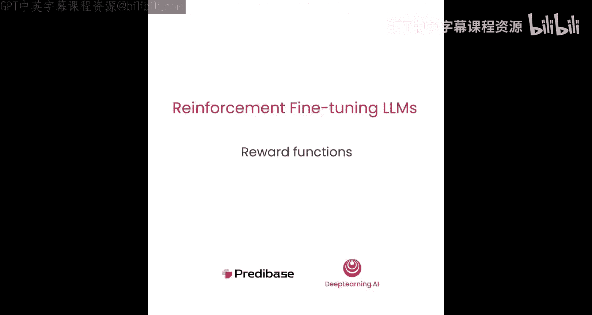
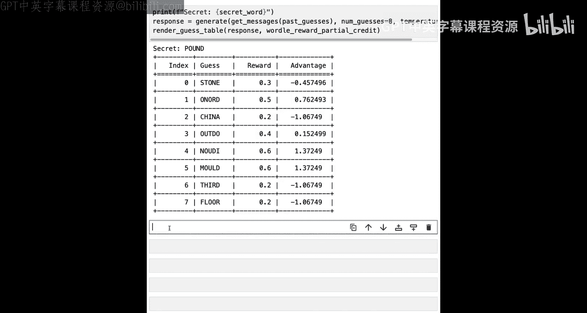

# 005：奖励函数设计 🎯



在本节课中，我们将学习如何设计奖励函数，以驱动强化微调过程。我们将看到奖励如何转化为优势值，从而在学习过程中引导模型产生更好的结果。

上一节我们介绍了如何指示大型语言模型玩 Wordle 游戏。本节中，我们来看看如何设计奖励函数。

## 开始实践

让我们进入 Notebook 开始实践。首先导入所需的依赖项。

```python
import torch
```


本节课我们将使用 PyTorch。接下来，创建我们将用于提示的基础模型部署。本节课的基础模型是 `Qwen2-7B-Instruct` 模型。我们将其定义为一个变量。

## 设计奖励函数

一种直接的奖励函数设计方法是使用简单的二元成功或失败信号。这为正确答案分配奖励值 1，为错误答案分配奖励值 0。

这类似于监督微调领域中的情况，即模型试图获得一个真实的标准答案。

```python
def binary_reward(guess, secret_word):
    return 1 if guess == secret_word else 0
```

## 实践示例

现在让我们看看这个奖励函数在一些示例猜测中如何工作。假设我们的秘密单词是 `pound`，并且模型在此之前已经猜了几个词：`crane`、`blonde`，最后是 `found`。

我们这里有一个名为 `GuessWithFeedback` 的辅助类，它本质上接收我们的猜测和秘密单词作为输入，然后存储关于哪些字母正确、哪些错误、哪些位置错误等信息。

现在，我们获取所有这些过去的猜测，并尝试从我们的模型生成一个新的猜测。

我们将调用生成函数，将过去的猜测转换为完全渲染的提示，获取响应，然后从该响应中提取出猜测。最后，我们将使用上面定义的 Wordle 奖励函数对最终猜测进行评分，看看我们得到了什么。

在这种情况下，模型猜测了 `gone`，获得了 0 的奖励。这意味着从学习过程的角度来看，这个猜测是完全错误的。

## 从奖励到学习

现在，让我们简要讨论一下这些奖励函数最终如何转化为学习过程。在强化学习中，奖励函数向智能体提供关于其实现目标情况的反馈。这些奖励是在采取某些行动后分配的数值，表示结果的可取程度。

我们最终要做的是，获取模型针对特定提示做出的所有不同猜测，然后找出哪些猜测相对更好。智能体的目标是随着时间的推移最大化其总体奖励。

这种学习需要两个要素：一是需要生成响应的多样性，二是最终需要导致奖励的多样性。之所以如此，是因为我们确定一个响应相对于另一个响应的相对可取性的方式，是通过一种称为“优势”的东西。

以下是计算优势的公式：

**优势 = (奖励 - 平均奖励) / 标准差**

我们在这里所做的就是，获取为特定提示计算的所有奖励，然后计算一个归一化值，即减去平均值再除以标准差。最终得到一个以 0 为中心的良好数值。

在代码中，它看起来像这样的函数：

```python
def compute_advantages(rewards):
    mean_reward = torch.mean(rewards)
    std_reward = torch.std(rewards)
    if std_reward == 0:
        advantages = torch.zeros_like(rewards)
    else:
        advantages = (rewards - mean_reward) / std_reward
    return advantages
```

让我们看一个快速示例，了解这个优势计算是如何工作的。假设有一些假的奖励分数，范围从 0 到 1，中间有一些值如 0.2、0.4、0.5 等。让我们看看优势值是什么样的。

可以看到，优势值以 0 为中心。对于那些处于中间的奖励，优势值下降到负值；对于相对较低的奖励，优势值按比例上升。这表明，从学习的角度来看，我们将阻止模型生成那些得分为 0 的响应，并鼓励模型生成更多看起来像产生这些高奖励值的响应。

## 可视化奖励与优势

让我们可视化现有奖励函数在 Wordle 任务上的奖励和优势。我们将定义一个函数来打印猜测表格。对于每个响应和奖励函数，我们将获取猜测、获取奖励，并打印显示这些值的表格。

让我们进行几次猜测，计算奖励和优势，并在此处渲染表格。

我们可以看到，对于秘密单词 `pound`，我们进行了八次不同的猜测：`crane`、`tower`、`sort`、`food` 等。在每种情况下，这些猜测都不是单词 `pound`，因此奖励为 0，结果优势也为 0。因此，从 GRPO 算法的角度来看，这些奖励实际上不会导致任何学习。

## 引入部分奖励

尽管目前所有猜测都获得 0 奖励，但并非所有猜测都同样错误。有些猜测包含正确位置上的正确字母。例如，可以看到 `news` 中的 `N`、`OU` 等字母，它们确实在正确的位置上；`in` 是正确的字母但位置错误。因此，可以说这比像 `Crane` 这样的猜测更好，因为后者在正确位置上的正确字母要少得多。

这表明二元奖励函数可能过于严格。相反，我们可以引入一个部分奖励系统，根据正确性和位置准确性，为更接近目标单词的猜测分配更高的奖励。

让我们引入一个新的分配部分奖励的奖励函数。

首先，我们将比较猜测的长度与秘密单词的长度。如果它们长度不同，我们将直接返回奖励 0，从而在方向上阻止模型进行任何字母数量不正确的猜测。

接下来，我们将获取秘密单词中所有有效字母的集合，然后逐个迭代猜测中和秘密单词中的每个字母并进行比较。

如果秘密字母和猜测字母匹配，那么我们处于字母正确且位置正确的情况，我们将给予 0.2 的奖励。

如果字母在单词中但位置错误，那么我们将给予 0.1 的分数。

否则，我们将不给予任何奖励。

这意味着，对于一个给定的五个字母的单词，如果每个字母都在正确的位置，它将获得总计 1 的奖励。而对于介于两者之间的情况，我们将有部分奖励，正确位置上的正确字母可能导致 0.2 或 0.4 等分数。因此，我们应该希望看到从这个过程中获得的奖励分数有一些变化。

```python
def partial_credit_reward(guess, secret_word):
    if len(guess) != len(secret_word):
        return 0.0
    reward = 0.0
    secret_letters = set(secret_word)
    for g_char, s_char in zip(guess, secret_word):
        if g_char == s_char:
            reward += 0.2  # 正确字母，正确位置
        elif g_char in secret_letters:
            reward += 0.1  # 正确字母，错误位置
    return reward
```

## 尝试新的奖励函数

让我们尝试将新的部分奖励函数应用于之前的秘密单词，并使用我们的模型尝试创建一些猜测。

正如我们将在这里看到的，即使有部分奖励，这个过程也严重依赖于为给定提示获得良好的不同响应多样性。我们控制这种多样性的方式是通过一个称为“温度”的参数。虽然也存在其他采样参数，但温度是我们可以使用的最常见的参数之一。

在这里，我们将看看如果将温度设置为 0 会发生什么，这意味着模型将始终为每个提示选择概率最高的猜测。

不出所料，当我们将温度设置为 0 时，我们基本上创建了一个确定性采样过程，因此每次模型都猜测相同的东西。在这种情况下，单词 `frown` 获得了 0.2 的奖励，但由于它每次都猜 `frown`，我们又回到了优势本身全为零的情况。

在光谱的另一端，我们可以尝试用高温（如这里的 1.3）生成响应，这应该会引入更多的变化。

使用较高的温度值已成功地导致生成的奖励分数有更多种类。因此，我们现在看到了我们所希望的那种优势变化。但我们也看到，猜测总体上平均比贪婪采样时更差。我们看到更多猜测为空白的情况，这意味着模型实际上从未成功生成猜测。

因此，这最终意味着，虽然这里会发生一些方向性的学习，因为我们可以计算优势，但整体学习过程会更慢，因为猜测质量本身通常相当低。

## 寻找平衡

因此，我们想要做的是找到一种方法来平衡这两个极端，这意味着在这里设置一个合理的温度值，比如 0.7。

现在我们可以看到，我们终于开始得到更像我们所希望的东西。猜测通常倾向于具有正确的字母数，它们都是有效的单词，其中一些比另一些更好。我们看到奖励分数有一些变化，优势也有一些变化。总的来说，我们预计这将开始推动我们的模型学习猜测更有可能获得更高奖励的单词，从而更有可能最终在下一课中猜对单词。

在下一课中，我们将看看其他奖励函数的例子，这些函数可用于评估更软性的标准，这些标准有时更主观，或在学习过程中更依赖于人类的价值判断。

## 总结



本节课中，我们一起学习了如何为强化微调设计奖励函数。我们探讨了二元奖励和部分奖励系统，了解了奖励如何通过计算优势值来指导模型学习。我们还看到了温度参数在控制响应多样性方面的重要作用，以及如何在确定性和高多样性之间找到平衡，以促进有效的学习过程。