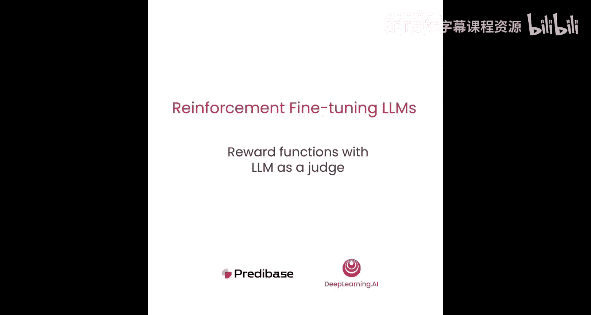
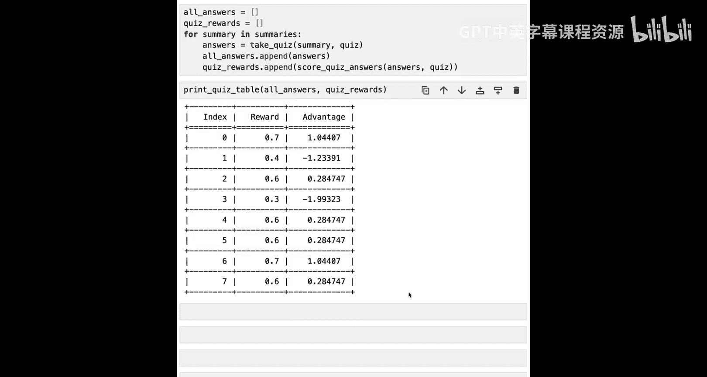

# 006：基于LLM作为评判者的奖励函数设计 🧠

在本节课中，我们将学习如何为一个更主观的任务——总结财报电话会议记录——编写奖励函数。你将看到如何利用大型语言模型作为人类判断的代理，并在结果难以通过代码验证的情况下，创建能够产生学习信号的奖励函数。

## 导入依赖

首先，我们导入必要的标准依赖库。

## 加载数据集与任务定义

上一节我们介绍了奖励函数的基本概念，本节中我们来看看一个具体的应用场景。我们将使用一个与之前不同的用例：总结财报电话会议记录。

我们从Huggingface加载这个数据集，并查看一个示例记录。可以看到，这些记录通常非常冗长。为了本任务的目的，我们假设目标是创建一个对金融分析师有用的摘要，他们只希望了解基于财报电话会议的公司健康状况的关键要点。

## 构建摘要生成提示

以下是构建生成摘要提示的步骤：

1.  定义一个简单的提示，例如：“生成以下财报电话会议记录中信息的简洁摘要。仅用摘要回应，不要包含任何无关文本。”
2.  将记录作为变量插入提示中。
3.  定义一个函数，该函数接收记录和希望生成的样本数量作为输入，并生成摘要。

我们使用OpenAI API兼容的SDK，将提示转换为聊天API格式，并设置温度参数为0.9以确保一定的随机性，从而生成摘要。

生成的摘要比原始记录短得多，但仍包含一些不必要的语言，例如“以下是财报电话会议记录的简洁摘要”。对于我们的金融分析师来说，其中一些内容可能并非必需。

## 设计奖励函数：LLM作为评判者

下一步是思考如何构建一个奖励函数，以引导生成的摘要更符合分析师工作的需求。

一种方法是使用LLM作为分析师判断的代理，尝试在1到10的范围内对摘要进行评分，然后将最终分数用作奖励函数得分。

以下是实现此奖励函数的关键步骤：

1.  设计提示，要求模型根据记录和摘要，在1到10的范围内评分（1代表非常差，10代表非常好），并在特定标签内输出最终分数。
2.  将上述逻辑封装成一个函数，该函数接收记录、摘要和一个评判模型（例如GPT-4-mini）作为输入，并返回一个浮点数值。
3.  函数内部将提示、记录和摘要转换为聊天格式的消息。
4.  调用评判模型生成一个响应（温度设为0以获得其认为的最佳响应）。
5.  使用正则表达式从响应中提取最终分数，转换为整数，然后除以10以得到0到1之间的归一化值。
6.  如果过程中出现任何错误，则返回分数0。

应用此评判奖励函数到我们的摘要和记录上，模型会提供一些推理过程（可用于审核其判断是否合理），并给出最终分数，例如0.9。

## 扩展评估与发现问题

现在，让我们尝试扩展到8个不同的样本，而不是仅一个，以了解评判模型给出的奖励分数的多样性。

我们为原始记录生成了8个不同的摘要，然后使用评判模型根据上面编写的奖励函数对每个摘要进行评分。

评分结果普遍较高（0.8， 0.7等），但重要的是，它从未明确指出任何摘要存在特别严重的问题，也从未给出满分。这是以这种直接方式使用LLM作为评判者的一个普遍问题：它倾向于认为事物总体良好，因为它不想被明确指出错误。这对我们来说是个问题，因为我们希望模型对特定回答的好坏有非常明确的意见，以便更清晰地指导学习过程，使其朝着我们希望的方向发展。

## 改进方法：基于客观测验的奖励

如何解决这个问题？一种思路是尝试将其建立在更客观的基础上。

我们不再直接问模型“你觉得这个摘要怎么样？”，而是尝试基于记录中我们认为对金融分析师最相关的信息生成一个多项选择测验。例如，问题可以是“第一季度的每股收益是多少？”，并附上选项A、B、C、D以及末尾的答案。

因为所有我们关心的信息都在原始记录中，所以对于LLM来说，构建这个测验应该是一个相对直接和客观的任务。然后，在学习过程中，我们可以参考这个测验来给摘要评分，看看摘要是否保留了测验中涉及的所有信息。这是一位客户为其摘要问题提出的技术。

## 实现结构化测验生成

我们可以利用LLM普遍支持的结构化生成功能，使用Pydantic模式定义我们想要的输出结构。

以下是定义测验结构的关键类：

*   **`Question` 类**：表示单个测验问题。
    *   属性：`question_text`（问题文本），`options`（选项列表），`answer`（正确答案的索引）。
    *   辅助函数：`shuffle_options`（打乱选项顺序），`render`（将问题渲染为字符串）。
*   **`Quiz` 类**：包装一系列问题。
    *   属性：`questions`（问题列表）。
    *   辅助函数：`shuffle_all`（打乱所有问题的选项），`to_string`（将整个测验打印为字符串）。

我们定义一个`create_quiz`辅助函数，它接收记录字符串作为输入，使用提示要求模型从中生成测验，并调用`completions.parse` API，传入`Quiz`作为响应格式，温度设为0.7以生成不同变体。得到`Quiz`对象后，我们会打乱每个问题的所有选项顺序。这样做是为了抵消模型在放置正确答案位置上的潜在偏见（例如，经常放在B选项），使其更随机。

## 使用摘要进行测验并评分

生成了测验之后，我们需要编写辅助函数，让评判模型使用摘要来回答这个测验。

以下是实现步骤：

1.  定义提示：“使用提供的记录摘要来回答以下测验。必须回答所有10个问题。如果不知道，请回答0。”
2.  将测验字符串和摘要插入提示中。
3.  调用评判模型（温度设为0）获取其答案列表。
4.  解析响应（预期为括号包围的答案列表），例如 `[‘A’， ‘C’， ‘0’， …]`。

最后，我们需要对`take_quiz`函数输出的答案进行评分。

我们编写`score_quiz_answers`辅助函数：
*   输入：答案列表和测验对象。
*   首先进行完整性检查，确保答案数量与测验问题数量一致。
*   然后遍历每个答案和对应的问题，如果匹配，则增加正确计数。
*   最终得分是正确回答数除以测验问题总数。

## 评估改进后的奖励函数

现在，让我们在之前生成的所有摘要上运行这个基于测验的评分流程。

我们遍历每个摘要，让其参加测验，记录答案，然后使用评分函数计算得分。

结果显示，我们基于测验的方法在得分（以及由此计算出的优势度）上提供了相当不错的多样性。因此，我们可以预期从这个过程中获得良好的学习效果，因为存在多样化的奖励和优势信号。

## 总结与展望

本节课中，我们一起学习了如何为总结财报电话会议记录这个主观任务设计奖励函数。我们首先尝试了直接使用LLM作为评判者进行评分，但发现了其评分偏高、区分度不足的问题。接着，我们引入了一种更客观的改进方法：让LLM基于原始记录生成一个关键信息测验，然后通过评估摘要回答该测验的准确率来获得奖励分数。这种方法能产生更具区分度的奖励信号，更有利于指导模型学习。

在下一节课中，我们将更仔细地研究这个特定用例，并思考我们的奖励模型可能被利用以鼓励不良行为（即所谓的“奖励黑客”）的一些方式。然后，在之后的课程中，我们将回到如何将所有内容整合到一个损失函数中的想法。