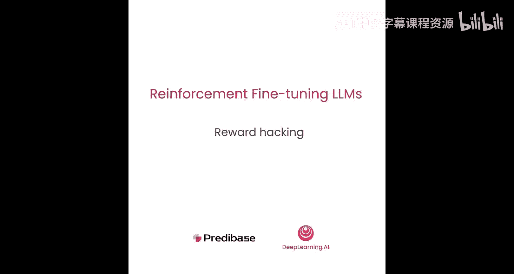
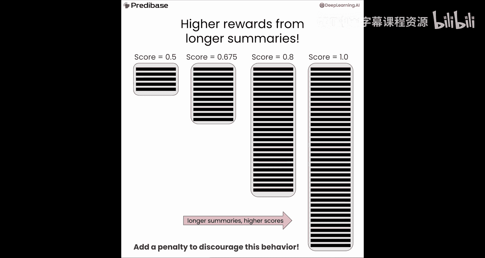
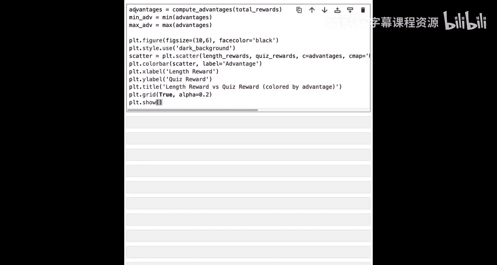
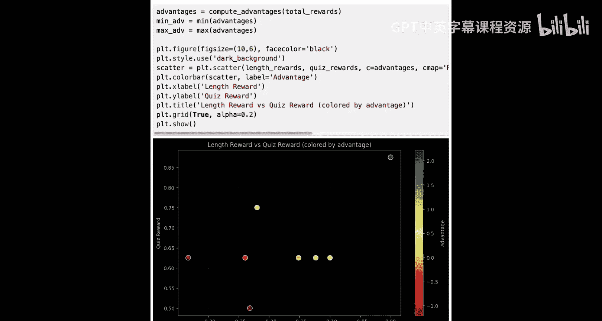
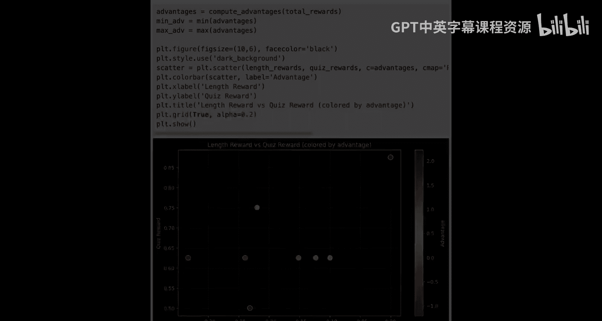

# 007：奖励攻击与缓解策略



## 概述
在本节课中，我们将要学习强化学习中一个常见的问题——奖励攻击。我们将探讨在文本摘要任务中奖励攻击可能的表现形式，并学习如何通过修改奖励函数来惩罚模型的不良行为，从而引导模型生成真正符合我们要求的摘要。


## 奖励攻击问题
上一节我们介绍了如何通过问答测试来评估摘要质量。本节中我们来看看一个潜在的风险：奖励攻击。

奖励攻击是指模型学会了一种策略，能够最大化其获得的奖励，但实际上并未执行我们期望它完成的任务。在摘要任务中，这可能表现为模型为了获得高分而忽略“简洁”的要求。

我们继续使用收益电话会议记录摘要任务。首先，我们使用与之前相同的提示词生成八个摘要，并设置温度参数为0.9以确保输出多样性。然后，我们查看这些摘要在问答测试中的得分。

然而，我们可能忽略了一个问题：如果将原始文本本身作为“摘要”提交给测试，它会得多少分？结果发现，原始文本本身获得了满分。这意味着，如果奖励函数仅仅基于测试得分，那么模型生成原始文本就是最优策略。这为强化学习过程创造了一个反常的激励：尽管目标是生成简洁摘要，但模型实际上因保留了更多原文信息而受到奖励。长此以往，模型可能会学会“欺骗”系统，忽略提示中的简洁性要求，直接返回原文以优化奖励。

## 设计惩罚机制
那么，我们如何缓解这个问题呢？我们可以设计一个新的奖励函数，将我们关心的“简洁性”属性考虑进去。



以下是不同生成摘要的长度。除了测试得分有差异外，摘要的长度也存在显著差异。有些摘要约900字符，有些则长达1300字符。但如果我们查看原始文本的长度，会发现它大约有21000字符，这远超出理想摘要的长度。我们必须阻止模型生成如此长的内容。

因此，我们引入一个新的奖励函数，其目的是惩罚那些过长、超出我们定义的“简洁摘要”范围的输出。这个函数是一个惩罚项，其值为负数，我们称之为“长度惩罚奖励”。

**长度惩罚奖励函数公式：**
```python
def length_penalty_reward(response, target_length=1024, max_penalty=-10):
    length = len(response)
    if length <= target_length:
        return 0  # 无惩罚
    else:
        # 惩罚随长度超出目标而增加，最高为 max_penalty
        penalty = max_penalty * min(1, (length - target_length) / target_length)
        return penalty
```
该函数计算响应的字符长度，并与我们设定的摘要最大合理长度（1024字符）进行比较。如果摘要长度小于目标长度，则返回0（无惩罚）。否则，惩罚值将随着文本长度超出目标长度的比例而增加，最高惩罚为-10。

让我们看看这个长度惩罚对原始文本（如果被模型生成）的影响。由于原始文本超过20000字符，它将受到最高惩罚-10，这应该能极大地阻止模型生成这种长度的摘要。

## 整合奖励函数
现在，让我们回到最初生成的摘要，看看长度惩罚奖励对它们各自的影响。

我们可以看到，对于最短的摘要（941字符，低于1024的目标），它获得了0奖励（即无惩罚），这是该函数可能的最高奖励。而对于最长的摘要（1365字符），它获得了最负的奖励，这也转化为最低的优势值。

现在，让我们将这两个不同的奖励函数整合成一个最终的总奖励函数。



**总奖励函数公式：**
```python
def total_reward(completion, quiz_function, length_penalty_function):
    quiz_score = quiz_reward(completion)  # 假设的问答测试奖励函数
    length_penalty = length_penalty_reward(completion)
    total = quiz_score + length_penalty
    return total
```
在这个案例中，我们将来自长度惩罚函数的奖励惩罚与问答测试奖励直接相加，得到最终奖励。

我们可以计算并可视化长度奖励与测试奖励之间的关系。在图表右上角，以深绿色标记的响应同时具有最高的长度奖励和最高的测试奖励，因此它拥有最高的总优势值。在强化学习过程中，模型将被引导去生成更多类似这样的响应。

相比之下，图中有一组响应，它们的测试奖励非常相似（大约在0.6到0.65之间），但由于长度惩罚不同，它们的优势值差异很大。最左侧的响应因过长而受到严重惩罚，尽管其测试奖励与右侧一个表现不错的响应相同，但总体优势却很低。

## 总结
本节课中我们一起学习了奖励攻击的概念及其在文本摘要任务中的具体表现。我们了解到，如果奖励函数设计不当，模型可能会学会通过“作弊”来获取高分，而非真正完成我们设定的任务。

为了缓解这个问题，我们引入了长度惩罚奖励函数，对过长的摘要输出进行惩罚。通过将测试奖励与长度惩罚相加，我们构建了一个更全面的总奖励函数。这个新函数能够有效地区分那些虽然测试得分高但过于冗长的“坏”摘要，以及真正既准确又简洁的“好”摘要，从而引导模型的学习方向。





引入此类惩罚有助于减轻奖励攻击的影响，避免模型陷入虽然技术上获得高奖励、但最终并未完成我们期望任务（即生成简洁摘要）的失败模式。在下一节课中，我们将把这些优势值计算与最终的学习过程结合起来，展示它们如何通过损失函数的计算转化为模型参数的更新。