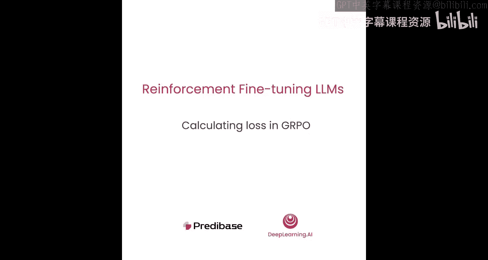
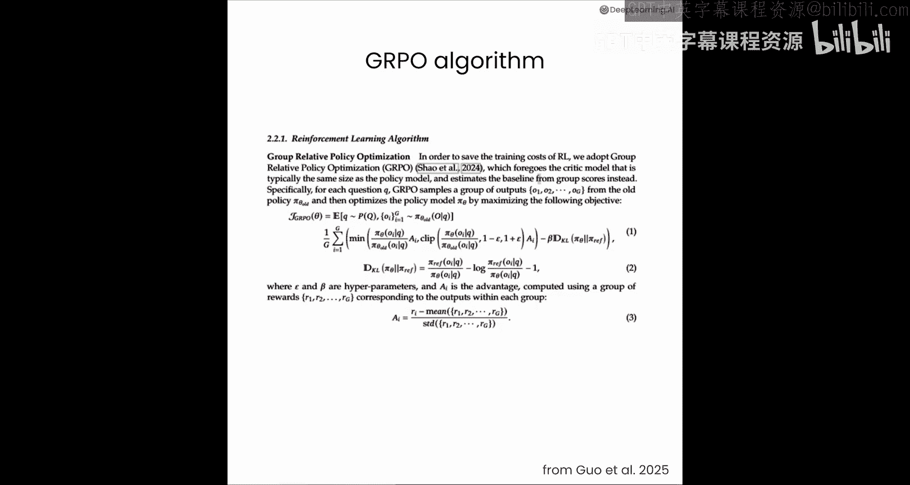

# 008：GRPO 中的损失计算 📉



在本节课中，我们将深入探讨 GRPO 算法中损失函数是如何计算的。这是驱动语言模型在训练过程中从其“实验”中学习的关键步骤。我们将把复杂的公式分解为四个核心组成部分，并通过代码实现来理解其运作机制。


## 概述

上一节我们介绍了如何分配奖励和计算优势值。本节中，我们来看看 GRPO 算法如何利用这些信息来计算损失，从而指导模型参数的更新。GRPO 的损失函数虽然看起来复杂，但可以分解为四个主要部分：策略损失、优势值、裁剪目标和 KL 散度。

## 损失函数的四个组成部分

以下是 GRPO 损失函数的四个核心组件：

1.  **策略损失**：这代表了**带适配器**的模型与**不带适配器**的模型之间，对每个输出令牌的概率分布之比。其核心是衡量策略模型相对于参考模型对生成序列的偏好变化。
    *   **公式**：`ratio = exp(log_prob_policy - log_prob_ref)`
    *   **直观理解**：如果 `ratio > 1`，说明策略模型比参考模型更倾向于生成该令牌；如果 `ratio < 1`，则相反。

2.  **优势值**：这是我们之前从奖励函数计算得到的值。它用于缩放策略损失，告诉模型哪些生成了高奖励的令牌应该被加强，哪些生成了低奖励的令牌应该被抑制。

3.  **裁剪目标**：为了防止任何单个训练步骤中产生过大的损失值，从而确保训练稳定性。它通过限制 `ratio` 的波动范围来实现。
    *   **代码**：`clipped_ratio = torch.clamp(ratio, 1-epsilon, 1+epsilon)`
    *   **参数**：`epsilon` 通常设为 `0.2`。

4.  **KL 散度**：这是一个惩罚项，用于确保在训练过程中，我们正在优化的策略模型不会偏离原始的参考模型（基线模型）太远。这有助于保留模型原有的知识，防止“灾难性遗忘”。
    *   **公式**：`kl_div = (log_prob_policy - log_prob_ref) * ratio - log(ratio) + 1`

## 代码实现：准备模型与输入

现在，让我们看看这个损失函数在代码中是如何实现的。首先，我们需要初始化模型并准备数据。

我们将导入必要的库，并初始化一个名为 `baby_llama` 的基础模型及其分词器。在 GRPO 中，我们使用两个模型：
*   **参考模型**：冻结的、未添加 LoRA 权重的原始模型。
*   **策略模型**：在基础模型上添加了可训练的 LoRA 适配器的模型，这是我们实际要优化的对象。

```python
import torch
from transformers import AutoModelForCausalLM, AutoTokenizer
# 初始化基础模型和分词器
model_name = “baby_llama”
base_model = AutoModelForCausalLM.from_pretrained(model_name)
tokenizer = AutoTokenizer.from_pretrained(model_name)

# 创建参考模型（冻结）
ref_model = AutoModelForCausalLM.from_pretrained(model_name)
for param in ref_model.parameters():
    param.requires_grad = False

# 创建策略模型（添加LoRA）
from peft import LoraConfig, get_peft_model
lora_config = LoraConfig(
    r=8, # LoRA秩
    lora_alpha=32,
    target_modules=[“q_proj”, “v_proj”], # 在哪些层添加LoRA
    lora_dropout=0.1,
    bias=“none”,
    task_type=“CAUSAL_LM”
)
policy_model = get_peft_model(base_model, lora_config)
```

接下来，我们定义两个辅助函数来准备模型输入和计算对数概率。

```python
def prepare_inputs(prompt, completion, tokenizer):
    """将提示词和补全内容转换为模型输入张量。"""
    # 分词
    prompt_tokens = tokenizer(prompt, return_tensors=“pt”).input_ids
    completion_tokens = tokenizer(completion, return_tensors=“pt”).input_ids

    # 合并提示和补全
    input_ids = torch.cat([prompt_tokens, completion_tokens], dim=1)
    # 创建注意力掩码（全部为1，表示所有令牌都参与计算）
    attention_mask = torch.ones_like(input_ids)

    # 创建补全掩码（仅对补全部分的令牌计算损失）
    prompt_len = prompt_tokens.shape[1]
    total_len = input_ids.shape[1]
    completion_mask = torch.zeros(total_len)
    completion_mask[prompt_len:] = 1

    return input_ids, attention_mask, completion_mask

def compute_log_probs(model, input_ids, attention_mask):
    """计算模型对每个输出令牌的对数概率。"""
    with torch.no_grad():
        outputs = model(input_ids=input_ids, attention_mask=attention_mask)
    logits = outputs.logits # 模型输出的原始分数
    # 计算对数概率：log_softmax
    log_probs = torch.nn.functional.log_softmax(logits, dim=-1)
    # 我们关心的是模型实际生成的令牌的概率
    # 通过 gather 操作获取每个位置对应令牌的对数概率
    gathered_log_probs = log_probs[:, :-1, :].gather(dim=-1, index=input_ids[:, 1:].unsqueeze(-1)).squeeze(-1)
    return gathered_log_probs
```

## 实现基础 GRPO 损失函数

有了上述准备，我们可以开始实现 GRPO 损失函数。首先从最核心的策略损失开始。

```python
def compute_grpo_loss_basic(policy_model, ref_model, tokenizer, prompt, completion, advantage):
    """计算基础的GRPO损失（不含裁剪和KL散度）。"""
    # 1. 准备输入
    input_ids, attn_mask, comp_mask = prepare_inputs(prompt, completion, tokenizer)

    # 2. 计算策略模型和参考模型的对数概率
    log_probs_policy = compute_log_probs(policy_model, input_ids, attn_mask)
    log_probs_ref = compute_log_probs(ref_model, input_ids, attn_mask)

    # 3. 计算比率 (ratio)
    ratio = torch.exp(log_probs_policy - log_probs_ref) # 核心公式

    # 4. 计算策略损失：比率 * 优势值
    policy_loss_per_token = ratio * advantage
    # 优化器通常最小化损失，但我们要最大化奖励，所以取负号
    policy_loss_per_token = -policy_loss_per_token

    # 5. 仅对补全部分的令牌计算平均损失
    # comp_mask[1:] 是因为 gathered_log_probs 比 input_ids 少一个时间步
    loss = (policy_loss_per_token * comp_mask[1:]).sum() / comp_mask[1:].sum()

    return loss

# 示例调用
prompt = “The quick brown fox jumps over the”
completion = “ lazy dog”
advantage = 2.0 # 假设奖励函数给出的优势值
loss = compute_grpo_loss_basic(policy_model, ref_model, tokenizer, prompt, completion, advantage)
print(f“基础策略损失: {loss.item()}”)
```

**注意**：在训练的第一步，策略模型和参考模型是完全相同的，因此 `ratio` 全为 1。此时，损失值完全由优势值决定 (`loss = -advantage`)。这强调了设计能产生多样化奖励分数的奖励函数的重要性。如果所有优势值都是 0，训练将无法启动。

## 添加裁剪目标

基础损失函数可能导致某些令牌的 `ratio` 极大或极小，造成训练不稳定。裁剪目标通过限制 `ratio` 的范围来解决这个问题。

```python
def compute_grpo_loss_with_clip(policy_model, ref_model, tokenizer, prompt, completion, advantage, epsilon=0.2):
    """计算包含裁剪目标的GRPO损失。"""
    # 准备输入和计算对数概率（同上）
    input_ids, attn_mask, comp_mask = prepare_inputs(prompt, completion, tokenizer)
    log_probs_policy = compute_log_probs(policy_model, input_ids, attn_mask)
    log_probs_ref = compute_log_probs(ref_model, input_ids, attn_mask)

    ratio = torch.exp(log_probs_policy - log_probs_ref)

    # 计算未裁剪的损失
    unclipped_loss = ratio * advantage
    # 计算裁剪后的比率及对应的损失
    clipped_ratio = torch.clamp(ratio, 1.0 - epsilon, 1.0 + epsilon)
    clipped_loss = clipped_ratio * advantage

    # 取最小值，防止过大的更新
    policy_loss_per_token = torch.min(unclipped_loss, clipped_loss)
    policy_loss_per_token = -policy_loss_per_token # 取负以最大化奖励

    # 计算平均损失
    loss = (policy_loss_per_token * comp_mask[1:]).sum() / comp_mask[1:].sum()
    return loss

# 示例调用
loss_clip = compute_grpo_loss_with_clip(policy_model, ref_model, tokenizer, prompt, completion, advantage, epsilon=0.2)
print(f“带裁剪的损失: {loss_clip.item()}”)
```

裁剪操作作用于每个令牌的 `ratio` 上，而不是最终的损失值。这确保了训练更新的平滑性。

## 添加 KL 散度惩罚

最后，我们引入 KL 散度项，以防止策略模型过度偏离参考模型，从而保留原始模型的有用知识。

```python
def compute_grpo_loss_full(policy_model, ref_model, tokenizer, prompt, completion, advantage, epsilon=0.2, beta=0.1):
    """计算完整的GRPO损失（包含裁剪和KL散度）。"""
    # 准备输入和计算对数概率
    input_ids, attn_mask, comp_mask = prepare_inputs(prompt, completion, tokenizer)
    log_probs_policy = compute_log_probs(policy_model, input_ids, attn_mask)
    log_probs_ref = compute_log_probs(ref_model, input_ids, attn_mask)

    ratio = torch.exp(log_probs_policy - log_probs_ref)
    delta = log_probs_policy - log_probs_ref # 用于计算KL散度

    # 1. 计算策略损失（带裁剪）
    unclipped_loss = ratio * advantage
    clipped_ratio = torch.clamp(ratio, 1.0 - epsilon, 1.0 + epsilon)
    clipped_loss = clipped_ratio * advantage
    policy_loss_per_token = torch.min(unclipped_loss, clipped_loss)

    # 2. 计算每个令牌的KL散度惩罚
    # KL散度公式: (log_prob_policy - log_prob_ref) * ratio - torch.log(ratio) + 1
    kl_div_per_token = delta * ratio - torch.log(ratio) + 1

    # 3. 组合损失：策略损失 - beta * KL散度
    # 取负号，因为我们要最大化（策略损失 - KL惩罚）
    total_loss_per_token = -(policy_loss_per_token - beta * kl_div_per_token)

    # 4. 计算平均损失
    loss = (total_loss_per_token * comp_mask[1:]).sum() / comp_mask[1:].sum()
    return loss

# 示例调用
loss_full = compute_grpo_loss_full(policy_model, ref_model, tokenizer, prompt, completion, advantage, epsilon=0.2, beta=0.1)
print(f“完整GRPO损失（含KL散度）: {loss_full.item()}”)
```

**参数 `beta` 的作用**：
*   `beta` 控制 KL 散度惩罚的强度。
*   `beta = 0`：忽略 KL 散度，模型可以自由探索，但可能遗忘原有知识。
*   `beta = 0.1`（常用）：在学习新任务和保留旧知识之间取得良好平衡。
*   `beta = 0.5` 或更高：强烈要求模型行为接近参考模型，适用于希望保持高度通用性的场景。

KL 散度项的行为是：当策略模型对某个令牌的置信度远高于参考模型时（`delta` 为正且大），惩罚增长较慢；当策略模型置信度远低于参考模型时（`delta` 为负且大），惩罚会迅速增加，从而强力纠正模型的偏离。

## 总结

本节课中，我们一起学习了 GRPO 算法损失函数的完整构成与实现。我们将其分解为四个关键部分：

1.  **策略损失**：通过比率计算策略模型相对于参考模型的行为变化。
2.  **优势值缩放**：根据奖励调整损失，鼓励高奖励行为。
3.  **裁剪目标**：通过限制比率变化范围来稳定训练。
4.  **KL 散度惩罚**：防止策略模型过度偏离原始参考模型，保留已有知识。



尽管强化学习的损失函数初看复杂，但其核心思想与预训练或监督微调中的损失函数相似，关键区别在于每个样本（或令牌）都根据其获得的奖励（优势值）进行加权。裁剪和 KL 散度则像是“刹车系统”，防止训练过程中出现过于激进的更新。如今，许多公司提供了实现这些算法的训练系统，使得开发者无需从头实现这些复杂细节。在下一节，我们将看到如何利用这些服务来微调一个真实的世界模型。