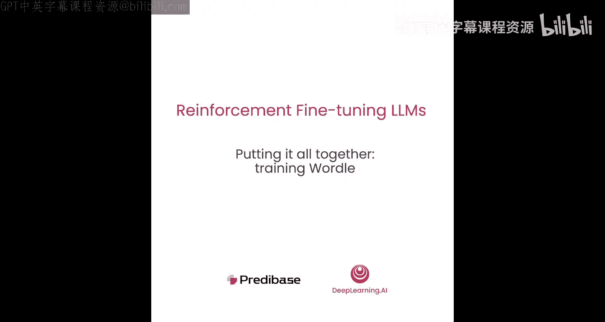
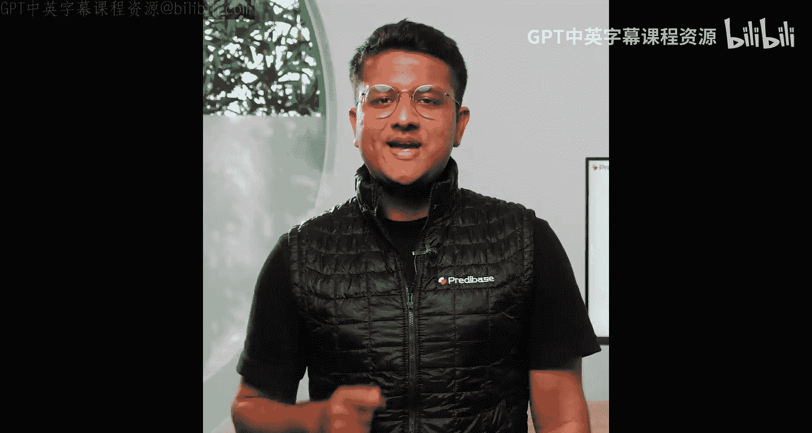
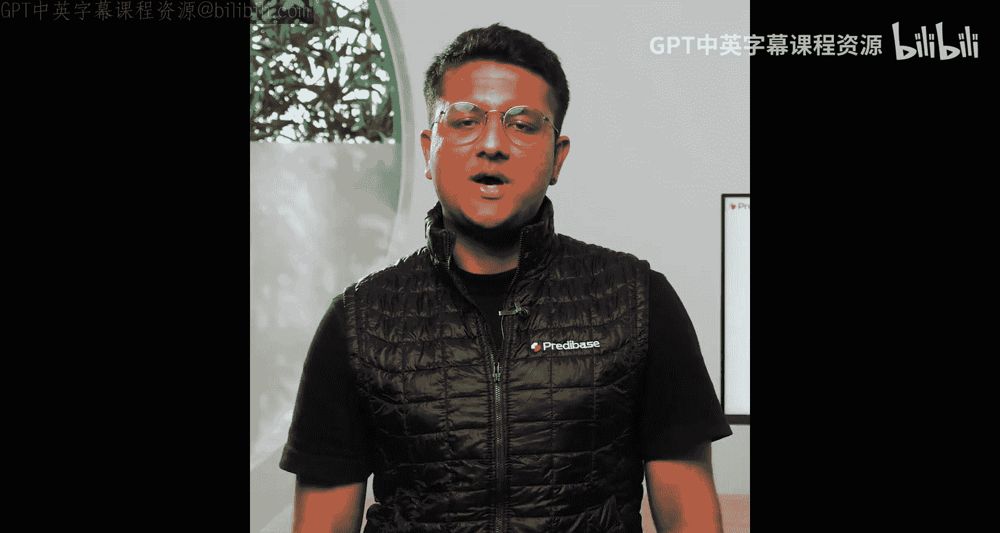
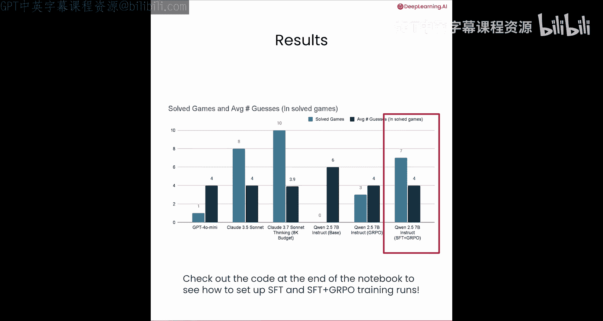
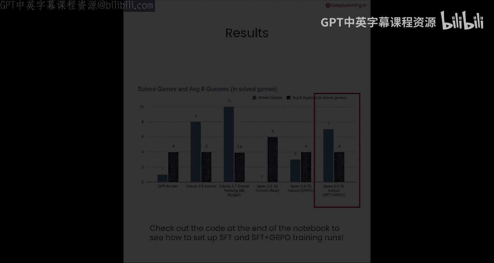

# 009：整合训练 Wordle 模型 🧩



在本节课中，我们将学习如何整合之前介绍的所有概念，使用 GRPO 方法训练一个能够玩 Wordle 游戏的模型。我们将通过 Parabase SDK 设置一个强化微调任务，并比较不同模型的性能。最后，我们还将探讨如何结合监督微调来进一步提升模型效果。

---

## 设置训练流程

上一节我们介绍了奖励函数和 GRPO 损失函数的细节，本节中我们来看看如何将这些组件整合起来，训练一个玩 Wordle 的模型。

我们将使用 Parabase SDK 来设置一个强化微调任务。首先，需要定义系统提示词和用户提示词，这与第 2 和第 3 课的内容一致。系统提示词用于设定游戏规则、反馈格式以及有效回复的示例。用户提示词则包含当前游戏状态、之前的猜测、收到的反馈以及生成新猜测的明确指令。

定义好提示词后，我们将完整的提示词传递给一个 12.57B 参数的指令微调模型，并使用基于温度的采样方法生成 16 个候选回复。






```python
# 伪代码示例：生成候选回复
prompt = system_prompt + user_prompt
candidate_responses = model.generate(prompt, num_candidates=16, temperature=0.8)
```

---

## 评估与奖励

生成了候选猜测后，下一步是使用三个不同的奖励函数对每个猜测进行评分。这些函数比之前看到的更为复杂，是我们在迭代改进模型以学习玩 Wordle 游戏的过程中开发的。

以下是三个奖励函数的简要说明：

1.  **输出格式检查**：确保模型的回复包含正确的 `<think>` 和 `<guess>` 标签，并且输出的是一个有效的五字母英文单词。
2.  **用户先前反馈**：评估新猜测在多大程度上合理利用了之前尝试的反馈，奖励那些在先前线索基础上进行逻辑构建的猜测。
3.  **猜测反馈**：根据一个猜测在排除可能性方面的有效性进行评分。一个猜测能从不正确的单词集合中排除的潜在单词越多，奖励越高。

如果您想了解这些函数的具体实现，请查看本课相关的 `.py` 文件。

最后，我们使用这些奖励分数来计算优势值，应用裁剪以防止训练不稳定，并计算 GRPO 损失来逐步更新模型。这个循环过程推动模型朝着更具策略性和更成功的 Wordle 玩法发展。

---

## 代码实现：在 Parabase 中构建训练任务

现在您已经了解了使用 RF 训练 Wordle 模型的路线图，让我们深入代码，看看如何在 Parabase 中构建它。

首先，我们需要导入必要的库和配置类。

```python
import parabase as pb
from parabase.config import GRPOConfig, RewardFunctionsConfig
from datasets import load_dataset
```

接下来，由于我们通过 Parabase 进行训练，您需要注册一个 Parabase 账户，并通过提供 API 令牌登录 SDK。

```python
pb.login(api_token="your_api_token_here")
```

登录后，第一步是加载用于 GRPO 训练的数据集。我们可以从 Hugging Face 加载一个数据集。

```python
dataset = load_dataset("parabase/wordle-grpo")
```

该数据集包含了从过往 Wordle 游戏中选取的一组种子五字母单词，并由 GPT-3.7 等强大模型模拟游戏过程生成。我们丢弃了模型产生的最终输出，但保留了其在寻找解决方案过程中产生的中间猜测。

然后，我们可以直接从 Pandas DataFrame 将此数据上传到 Parabase。

```python
pb.datasets.upload_from_pandas(df=dataset.to_pandas(), name="wordle_training_data")
```

上传数据后，下一步是创建一个新的代码仓库。一个仓库类似于 GitHub 仓库，但您可以用它在平台上跟踪所有的训练实验。我们将创建一个名为 “wordle” 的仓库。

创建好仓库并上传数据后，我们现在可以设置训练运行了。

在 GRPO 中，我们需要定义奖励函数。这已在我们的 `.py` 文件中完成，因此我们拥有了 `guess_value`、`output_format_check` 和 `users_previous_feedback` 这些奖励函数。

设置好奖励函数后，我们现在可以定义要运行的微调任务。微调任务由四部分组成：一个定义训练内容和奖励函数的配置、一个数据集、仓库以及可选的描述。

让我们放大查看定义 GRPO 训练运行配置的 `GRPOConfig`。

```python
grpo_config = GRPOConfig(
    base_model="Qwen2-57B-Instruct",
    reward_functions=RewardFunctionsConfig(
        runtime={"dependencies": ["pandas"]}, # 指定运行时依赖
        functions={
            "output_format": output_format_check_func,
            "user_feedback": users_previous_feedback_func,
            "guess_feedback": guess_feedback_func
        }
    ),
    sampling_params={
        "max_tokens": 4096,
        "temperature": 0.7,
        "top_k": 50
    },
    num_generations=16
)
```

我们可以指定基础模型为 Qwen2-57B-Instruct。然后使用 `RewardFunctionsConfig` 定义我们的奖励函数集合，它包含两个可设置的属性：`runtime` 和 `functions`（一个从人类可读名称到实际函数定义的映射）。奖励函数在 Parabase 服务器上执行，因此如果它们需要可选的依赖项（如 pandas 或 OpenAI 的 LLM 作为评判），则需要在 `runtime` 配置中指定。

定义好奖励函数后，我们还可以设置可选的采样参数，例如最大令牌数、温度、top-k 采样等。在本例中，我们希望给模型足够的令牌来展开其思维链，因此将 `max_tokens` 设置为 4096。最后，我们可以根据计算预算将 `num_generations` 设置为 8 或 16。

一旦我们的微调任务设置完成，我们就可以运行单元格来启动训练任务。

---

## 模型性能评估

我们使用上述设置训练了一个玩 Wordle 的模型。现在，让我们看看这个模型在一组它从未见过的游戏上的表现。

我们在 10 局 Wordle 游戏上对闭源和开源模型进行了基准测试，具体测量了两个指标：模型能够解决的游戏数量，以及在已解决游戏中的平均猜测次数。

我们发现：
*   GPT-4o-mini 只能解决 1 局游戏。
*   Claude-3.5-Sonnet 能够解决大约 8/10 的游戏，这相当不错。
*   Claude-3.7-Sonnet-Thinking 能够解决所有 10 局游戏，平均猜测次数少于 4 次，但这仅在我们给予它 8000 个令牌的“思考”预算时才成立。
*   基础的 Qwen 模型未能解决任何一局游戏。
*   当我们使用 GRPO 进行强化微调后，Qwen 模型解决了 3/10 的游戏，在已解决的游戏中平均猜测次数为 4 次。对于这个规模的模型来说，这实际上非常惊人，清楚地展示了纯奖励驱动优化带来的策略性游戏能力和效率提升。

---

## 结合监督微调以获得最佳效果

我们还可以结合监督微调和强化微调，以获得两全其美的效果。

**第一步**：我们首先让 Claude-3.7-Sonnet 玩 35 局 Wordle 游戏，并捕获它为每个中间猜测生成的推理轨迹。这些“提示-完成”对构成了我们的监督微调数据集，它教会模型如何以逻辑方式逐步思考其猜测。由此产生的 SFT 检查点为我们提供了进一步优化的强大初始化，本质上是一个模仿良好推理的模型。

**第二步**：我们使用这个 SFT 模型作为 GRPO 的起点。我们将运行与之前描述的相同的强化微调过程：生成补全、用奖励函数评分、计算优势值并更新模型。这将产生我们最终的 GRPO 检查点，它不仅优化了模仿推理，还优化了更高效地解决 Wordle 的能力。

通过将监督微调与强化微调相结合，我们的 Qwen2-57B 模型现在能够正确解决 7/10 的游戏，其性能提升超过 2 倍。

关于 GRPO 和强化学习需要记住的一点是，它是一种**同策略**算法。它用于帮助模型发掘自身知识，以便在下游任务中表现得更好。当您使用强大模型的输出来进行 SFT，然后使用 GRPO 来精炼这些知识时，我们经常发现，小型模型实际上能够在同一任务上击败这些更大的模型。

如果您有兴趣使用 SFT 或结合 SFT 和 GRPO 来训练模型，我们在 Parabase 的笔记本末尾提供了相关代码。

---

## 总结





本节课中，我们一起学习了如何将奖励函数、GRPO 损失和训练流程整合起来，使用 Parabase SDK 训练一个玩 Wordle 游戏的模型。我们看到了如何设置训练任务、评估模型性能，并发现了结合监督微调预热阶段可以显著提升最终模型的效果。这个过程展示了如何通过奖励驱动的优化，让语言模型学会执行复杂的、基于策略的任务。