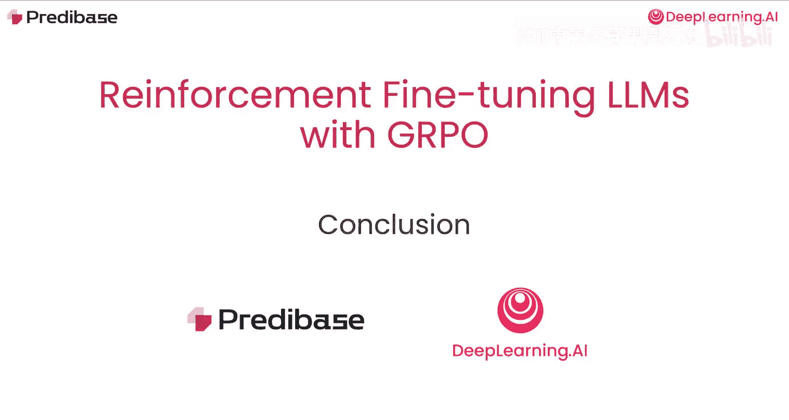
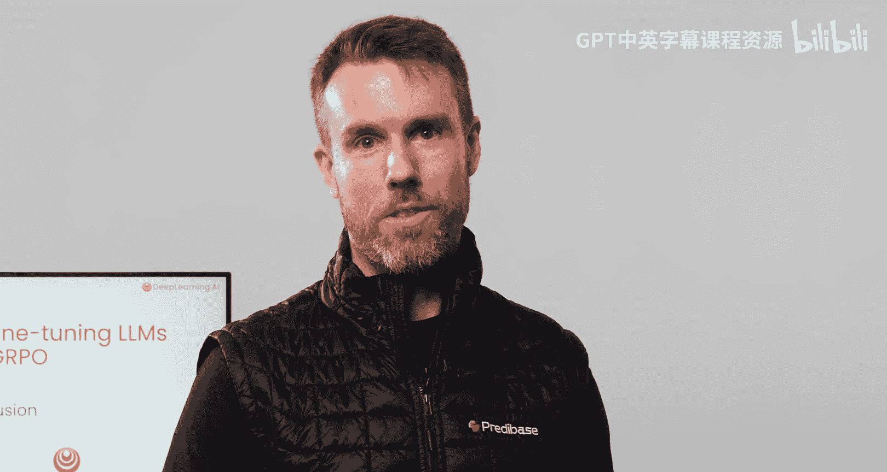

# 010：总结 🎯

在本节课中，我们将对使用GRPO进行大型语言模型强化微调（RFT）的整个课程内容进行回顾与总结。

---

恭喜你完成了本课程的学习。

你已掌握了许多内容，从GRPO强化学习的详细基础，到创建奖励函数以引导大型语言模型在复杂任务上取得良好性能的艺术与科学。

为RFT设计奖励函数非常灵活。由于你需要从头开始构建这些函数，因此有很大的空间可以融入你自己的领域知识。

在Pratabase，我们与许多客户合作，他们正在为其业务问题构思有趣且富有创意的RFT解决方案，包括你在课程早期看到的用于文本摘要的quizta奖励函数。

如果你有兴趣进行更深入的学习，Pratabase网站上提供了更多关于RFT的学习资源。

并且，由于这项技术仍处于起步阶段，我们非常乐意听取你探索的任何用例。

我们希望你喜欢这门课程，并迫不及待想看到你的构建成果。

---

## 总结

本节课中，我们一起回顾了整个课程的核心内容。我们学习了GRPO强化学习的基础，探讨了如何设计与构建有效的奖励函数来引导模型行为，并了解了该技术在现实业务场景中的应用潜力。记住，设计奖励函数是一个融合了领域知识与创造力的过程。随着技术的不断发展，期待你能运用所学，探索并构建出属于自己的解决方案。