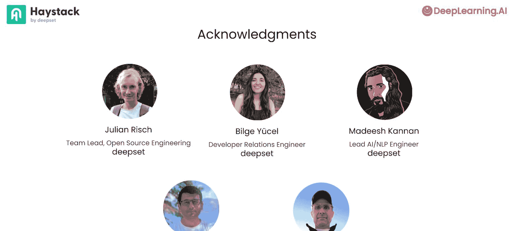

# 001：课程介绍 🚀

在本课程中，我们将学习如何使用Haystack框架来构建人工智能应用。Haystack是一个流行的开源框架，它能帮助我们更高效地集成大型语言模型、向量数据库等多种工具，并构建复杂的AI工作流程。

## 为什么选择使用框架？🤔

上一节我们了解了课程目标，本节中我们来看看为什么应该使用像Haystack这样的框架，而不是完全从头开始构建应用。

完全从头开始构建应用是一次宝贵的学习经历，并能让你完全控制每一步。然而，使用框架可以帮助你更快地完成工作。框架提供了抽象概念，使你的代码更易于维护和阅读。

生成式人工智能技术发展迅速且复杂，它需要集成来自不同语言模型提供商、向量数据库、网络搜索等各种工具的API。将这些功能组合成自定义的工作流程也需要大量工作。像Haystack这样的框架可以帮助管理这种复杂性，让你能够更专注于在更高的抽象级别上开发应用程序。

例如，市场上有许多向量数据库供应商。通过使用一个共同的接口，你的代码可以更容易地适应底层数据库技术的变化，而无需对应用程序进行太多重构。

```
# 框架提供的抽象接口示例（伪代码）
# 无论底层是Pinecone、Weaviate还是Milvus，调用方式可能类似
results = vector_store.query(query_embedding=embedding, top_k=10)
```


此外，框架可以直接提供通用功能，从而加快开发过程。例如，Haystack支持管道中的分支和循环。通过分支，你的管道可以在初始步骤未能提供足够信息时，运行网络搜索等备用方案。

Haystack的管道可视化工具还能帮助你理解和优化构建大型语言模型工作流程的过程。

## Haystack的设计哲学 🧩

上一节我们讨论了使用框架的优势，本节中我们来深入了解Haystack框架的核心设计思想。

本课程的讲师是Tuana Celik，她是Deepset的Haystack开发者关系负责人。Tuana一直在帮助许多开发人员使用Haystack构建自定义人工智能应用。

然而，Haystack作为一个框架，其重点不是提供你可能需要的一切，而是提供一个共同的接口和一个简单的抽象。你可以根据自己的需要扩展框架的能力。

Haystack基于两个主要元素构建：**组件**和**管道**。其核心思想是拥有通过灵活管道连接的强大组件。

框架提供了许多内置组件，如嵌入器（`Embedder`）和生成器（`Generator`）。但在很多情况下，Haystack可能没有提供你所需的特定组件。例如，如果你需要从某个特定API获取数据，你可以创建自己的自定义组件来与该API交互。Haystack只要求你将其包装成一个符合其规范的组件。

## 课程内容概览 📚

在接下来大约一小时的视频课程中，你将学习以下内容：

以下是构成Haystack框架的核心构建块：

*   **核心概念**：了解Haystack的核心抽象，包括组件、管道和文档存储。
*   **基础应用**：学习如何将这些元素组合用于各种人工智能用例。

以下是你将动手构建的具体项目：

*   **RAG管道**：构建并自定义一个简单的检索增强生成（RAG）管道，学习如何根据特定需求调整其行为。
*   **自定义组件**：通过构建一个“黑客新闻摘要器”来创建你自己的自定义组件。
*   **分支管道**：创建一个带有条件路由的分支管道，当初始上下文不足时，可以回退到进行网络搜索。
*   **自我反思代理**：使用Haystack的管道循环机制，构建一个能够迭代完善其响应的自我反思代理。
*   **函数调用代理**：创建一个利用OpenAI函数调用能力的聊天代理，从而能够将Haystack管道作为工具提供给大型语言模型，以增强其能力。

## 致谢 👏

本课程的创建离不开许多人的努力。来自Deepset，我们要感谢整个Haystack团队，特别是Julian Risch、Bilge Yücel和Madhujith Kannan。此外，来自DeepLearning.AI的Eshleen Kaur和Jeff Ludwig也为本课程做出了贡献。



## 总结 🎯

本节课中，我们一起学习了Haystack课程的介绍。我们了解了使用AI框架（如Haystack）相对于从头开发的优势，它能够管理复杂性、提供抽象并加速开发。我们探讨了Haystack以**组件**和**管道**为核心的设计哲学，并预览了课程中将涵盖的核心概念与实战项目，包括构建RAG管道、创建自定义组件以及实现分支和循环等高级工作流。期待你使用Haystack构建出许多令人兴奋的大型语言模型应用程序。