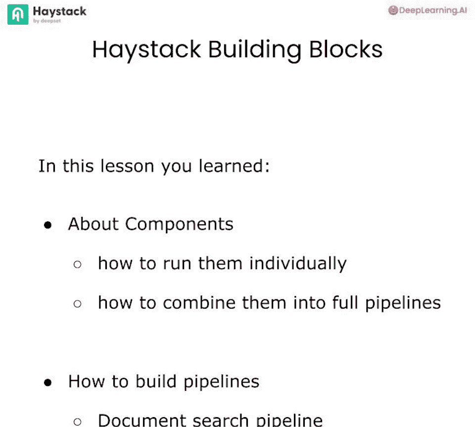
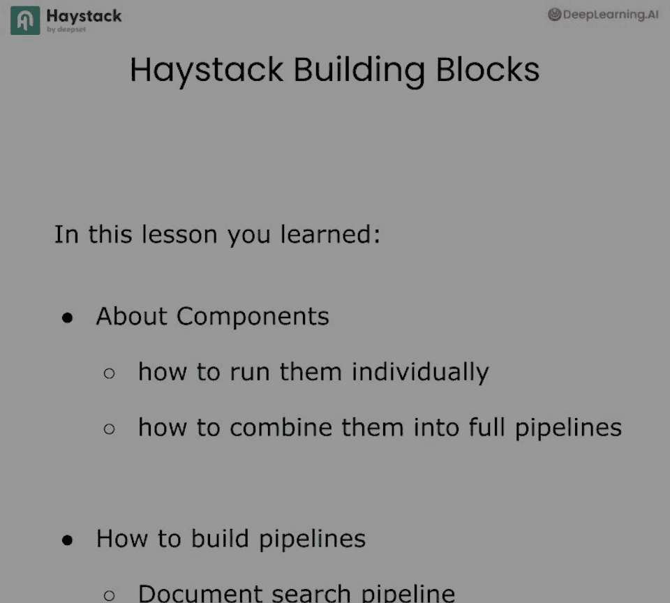

# 002：Haystack核心构建模块 🧱

在本节课中，我们将学习Haystack框架的核心抽象概念。你将了解什么是组件、它们如何工作、以及如何将它们组合成适用于多种AI用例的管道。我们还将介绍文档存储的概念，以及管道如何访问它们。课程将从创建一个简单的索引管道开始，然后构建一个文档搜索管道。

## 概述

人工智能应用通常由多个协同工作的步骤组成，以实现特定目标，例如检索增强生成。这通常包含两个步骤：检索步骤，即从数据库中查找并提取最相关的文档；以及生成步骤，即利用这些文档中的上下文来生成响应。有时，你可能需要在检索和生成之间添加额外的步骤，比如排名。在一个完整的人工智能应用中，许多较小的任务被组合成一个更大的用例。

在Haystack中，所有这些小任务都是通过**组件**来实现的。组件再与其他组件组合，形成一个**管道**。管道是实现我们想要构建的应用的实体。管道还可以访问数据库，在Haystack中，我们称之为**文档存储**。管道通过特定的组件来访问这些文档存储。例如，你可以将数据存储在Weaviate、Quadrant或MongoDB中，并通过组件让管道访问这些数据。

管道通过以特定方式连接组件来构建人工智能应用。一个组件可以接受任意数量的输入，也可以产生任意数量的输出。例如，句子转换器文档嵌入器组件。这个组件期望一个文档列表作为输入，并返回相同的文档列表，但其中包含了嵌入向量。它还会返回元数据。这个组件使用句子转换器嵌入模型来创建这些嵌入向量。

例如，从这个句子开始：“泰勒·斯威夫特是世界女王吗？”。我们可能有一个组件，比如一个嵌入器，它为这个查询生成一个嵌入向量。我们可能还有另一个组件，它期望一个嵌入向量或向量作为输入，然后生成一个文档。我们称这个为检索器。如果我们将这两个组件组合起来，我们就实现了一个相当准确的文档搜索管道。

Haystack提供了许多现成的组件。例如，访问不同模型提供方的生成器、执行嵌入功能的嵌入器、能够从多种数据库检索的检索器。我们还有转换器、排名器、路由器、预处理器等等。我们构建管道来创建像问答、文档搜索、聊天、问题生成、输出验证这样的应用，而且这个列表还在不断增加。

我们用Haystack构建这些管道，但Haystack管道也可以分支。这意味着我们可以有包含决策组件的应用。管道可能会变得相当复杂。Haystack管道也可以循环，即它会循环执行直到满足某个条件。最重要的是，如果Haystack没有你构建应用所需的组件，你可以构建自己的组件，并将它们放入有意义的管道中。

现在，让我们在代码中看到所有这些概念，并开始使用Haystack组件、管道和文档存储。

## 实践：创建和使用组件

首先，添加一行代码来抑制任何不需要的警告。

```python
import warnings
warnings.filterwarnings("ignore")
```

接下来，我们将使用一个辅助函数来导入本实验所需的所有环境变量，例如OpenAI的API密钥等。

```python
from dotenv import load_dotenv
load_dotenv()
```

现在，让我们开始创建第一个组件并使用它。你将使用的第一个组件是OpenAI文档嵌入器。这个组件使用OpenAI的嵌入模型为文档创建嵌入。

首先，导入文档嵌入器。

```python
from haystack.components.embedders import OpenAIDocumentEmbedder
```

然后，初始化一个文档嵌入器。这里，我们将使用`text-embedding-3-small`作为嵌入模型。

```python
embedder = OpenAIDocumentEmbedder(model="text-embedding-3-small")
```

你也可以检查这个组件期望什么样的输入和输出。例如，我们可以看到这个组件期望文档列表作为输入，它将产生文档和元数据作为输出。我们已经知道这是一个嵌入组件，所以它产生的文档也将包含嵌入。

现在，让我们看看如何运行这个组件。为此，我们创建一些示例文档。

```python
from haystack import Document

documents = [
    Document(content="Haystack is a framework for building AI applications."),
    Document(content="You can build pipelines with Haystack components.")
]
```

因为我们知道嵌入器组件期望文档作为输入，我们可以用这些文档来运行它。

```python
result = embedder.run(documents=documents)
print(result)
```

当我们运行这个组件时，你会注意到它产生了文档列表作为输出，并且元信息也告诉我们用于创建这些文档的是什么模型以及向量的大小（例如1536）。

## 构建索引管道

上一节我们介绍了如何单独使用一个组件，本节中我们来看看如何在管道中使用它。首先，我们将初始化一个文档存储，然后构建一个管道，该管道将文档及其嵌入一起写入文档存储。

目前，我们将使用内存中的文档存储。这是在Haystack中你可以使用的最简单的文档存储，使用它没有任何要求。但如果你愿意，可以将其切换为任何文档存储，如Quadrant、Weaviate、Pinecone、Chroma等。

```python
from haystack.document_stores.in_memory import InMemoryDocumentStore

document_store = InMemoryDocumentStore()
```

现在我们有了一个内存中的文档存储，让我们将第一个TXT文件写入这个文档存储。

首先，导入你将用于第一个索引管道的所有组件。你将再次使用OpenAI文档嵌入器，但也将使用一些预处理程序和转换器。对于这个演示，我们将使用这些组件的所有默认变量，但你也可以改变这一点。

```python
from haystack.components.converters import TextFileToDocument
from haystack.components.preprocessors import DocumentSplitter
from haystack.components.writers import DocumentWriter
```

我们将从一个转换器开始，因为我们将有一个关于达芬奇的TXT文件，我们将其写入我们的内存文档存储。

```python
converter = TextFileToDocument()
```

接下来，使用文档分割器。文档分割器是一个将你的文档分块的组件。默认情况下，它按200个单词分割，我们将使用这个默认设置。然而，如果你愿意，可以改变这一点。例如，你可以决定按段落分割。

```python
splitter = DocumentSplitter()
```

接下来，使用一个嵌入器。这里，我们将使用OpenAI文档嵌入器。

```python
embedder = OpenAIDocumentEmbedder()
```

你将使用的最后一个组件是一个文档写入器。你已经有了一个文档存储，所以在这里你将告诉文档写入器它应该写入你的内存文档存储。

```python
writer = DocumentWriter(document_store=document_store)
```

现在你有了所有的组件，接下来要做的就是创建一个管道并将这些组件添加到该管道中。你通过初始化你的管道来做到这一点，然后添加每个组件。这里重要的是，对于每个组件，你将提供一个名称。你可以给你的组件取任何你想要的名字，但之后你必须确保接下来使用这个名字。

```python
from haystack import Pipeline

indexing_pipeline = Pipeline()
indexing_pipeline.add_component("converter", converter)
indexing_pipeline.add_component("splitter", splitter)
indexing_pipeline.add_component("embedder", embedder)
indexing_pipeline.add_component("writer", writer)
```

现在你已经将组件添加到你的管道中，管道可以访问这些组件，但它实际上还不知道这些组件如何相互作用。为此，Haystack使用组件连接。例如，你将从将转换器连接到分割器开始。这基本上是告诉管道转换器的输出应该交给分割器。

```python
indexing_pipeline.connect("converter", "splitter")
indexing_pipeline.connect("splitter", "embedder")
indexing_pipeline.connect("embedder", "writer")
```

当你运行这个时，你也将看到你在管道中创建了什么样的连接。一旦你在管道中连接了所有组件，你还将能够观察到你的管道可以访问哪些组件，以及这些组件之间的确切连接是什么。所以我们基本上看到转换器的文档输出具体地被输入到分割器文档输入。

你会记得之前嵌入器期望文档作为输入。所以它由分割器提供文档，但它也产生文档。只是这次它有嵌入。所以嵌入器的文档输出现在被给到写入器文档输入。

Haystack提供的另一个实用程序是一种可视化这些管道的方法。你只需在你的管道上调用`draw`方法。

```python
indexing_pipeline.draw("indexing_pipeline.png")
```

你将得到一个确切的你的管道样子的图表，包括所有的连接。在这种情况下，我们知道我们的管道从一个转换器开始，它期望的输入是源。

现在你有了你的管道并且你知道连接是准确的，你可以尝试运行它。你已经看到那个管道中的第一个组件是转换器组件，并且它期望一个源列表。对于这个实验，我们有一个关于达芬奇的TXT文件，我们将用它来索引到我们的内存文档存储中。

```python
result = indexing_pipeline.run({"converter": {"sources": ["path/to/leonardo_da_vinci.txt"]}})
print(result)
```

我们运行这个管道。你会看到它用我们与OpenAI文档嵌入器一起拥有的默认嵌入模型计算嵌入。它也让我们知道它已经将一定数量的文档写入我们的内存文档存储。为了检查，你现在也可以检查你的文档存储。

```python
documents = document_store.filter_documents()
print(f"Total documents indexed: {len(documents)}")
print(documents[5].content)
```

## 构建文档搜索管道

上一节我们构建了索引管道，本节中我们来构建一个文档搜索管道。为此，我们首先导入我们将要使用的所有组件。

```python
from haystack.components.embedders import OpenAITextEmbedder
from haystack.components.retrievers.in_memory import InMemoryEmbeddingRetriever
```

然后我们开始创建我们想要使用的组件。这里重要的是，因为我们使用OpenAI文档嵌入器和默认嵌入模型，所以我们知道必须使用相同模型来嵌入用户传入的查询。对于这个用例，那么，我们将使用OpenAI文本嵌入器，我们称其为我们的查询嵌入器。

```python
query_embedder = OpenAITextEmbedder()
```

接下来，需要一个检索器。我们使用内存中文档存储。所以对于这种情况，我们将使用内存中嵌入检索器，告诉它从我们的文档存储中检索文档。

```python
retriever = InMemoryEmbeddingRetriever(document_store=document_store)
```

接下来，初始化我们的管道。我们称这个管道为文档搜索，并且我们简单地将我们拥有的组件添加到该管道中。

```python
search_pipeline = Pipeline()
search_pipeline.add_component("query_embedder", query_embedder)
search_pipeline.add_component("retriever", retriever)
```

最后，就像我们之前做的那样，我们将连接我们的组件。我将从一个实际上将是不正确的连接开始，或者确切地说，连接是什么并不非常清楚。所以如果你运行这个，你会注意到你得到一个错误。这些类型的错误实际上非常有用。它告诉我们有一个管道连接错误，因为它不知道查询嵌入器应该如何确切地连接到检索器，因为这两个组件有多种连接方式。它还为我们提供了这些连接可能看起来像什么的一些建议，并让我们知道两个组件的输出和输入是什么。

为了解决这个问题，我们只需要让管道知道具体地说查询嵌入器的嵌入输出应该给予检索器的查询嵌入输入。

```python
search_pipeline.connect("query_embedder.embedding", "retriever.query_embedding")
```

就是这样。我们现在有一个文档搜索管道。再次，你可以使用显示工具来确保你已经创建了你期望看到的管道。所以你可以看到第一个组件查询嵌入器期望文本。这将是例如用户正在问的问题。然后这个组件将输出嵌入到检索器，检索器然后将返回最相关的文档。

让我们运行我们的文档搜索管道。让我们从问题开始：“达芬奇去世时多大年纪？”。

```python
query = "达芬奇去世时多大年纪？"
result = search_pipeline.run({"query_embedder": {"text": query}})
documents = result["retriever"]["documents"]
print(f"Retrieved {len(documents)} documents.")
for doc in documents:
    print(doc.content)
```

如你所见，这里有相当多的文档。并且因为我们使用默认变量运行我们的管道，我们有10个最相关的文档。

你现在可以做的另一件事是运行这个管道，但在运行时修改各个组件的输入。例如，与其要求10个最相关的文档，我们可以将其改为3个。我们唯一需要做的就是修改检索器的前k个输入。

```python
result = search_pipeline.run({
    "query_embedder": {"text": query},
    "retriever": {"top_k": 3}
})
documents = result["retriever"]["documents"]
print(f"Retrieved {len(documents)} documents.")
```

如你所见，我们现在正在向检索器组件添加输入并调用前k为3。现在不是10个，而是3个最相关的文档。



## 总结



在本节课中，我们一起学习了Haystack的核心构建模块。你了解了什么是组件，如何单独运行组件，以及如何将组件组合成完整的管道。你已经构建了一个将文档索引到内存文档存储中的管道，以及一个文档搜索管道。你可以尝试围绕如何分割你的文档进行试验。例如，不是有200个单词，你可以按不同长度进行分割。你也可以尝试修改你正在问的问题、你的文档搜索管道以及检索器的前k值。在下一个实验中，你将使用这些知识来构建你的第一个检索增强生成管道，并且还将定制这些管道的行为。