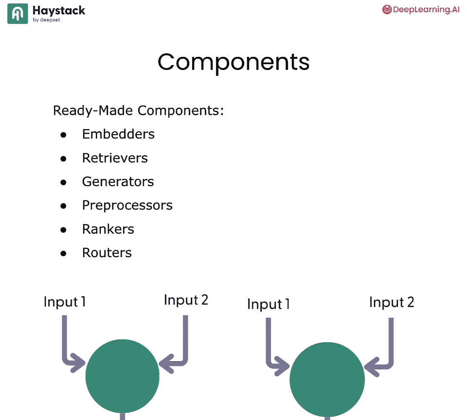
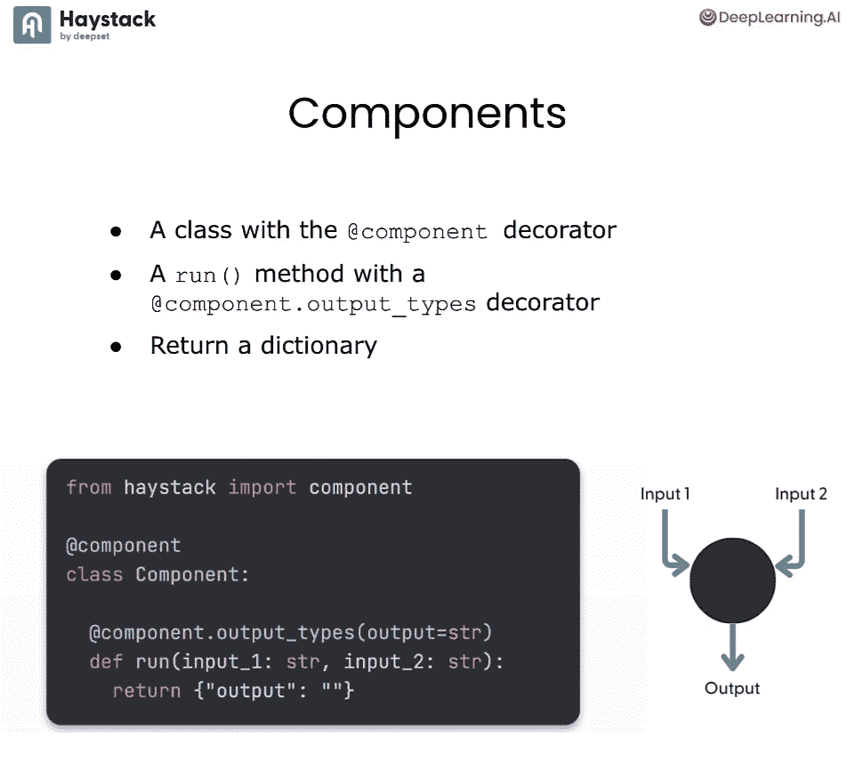
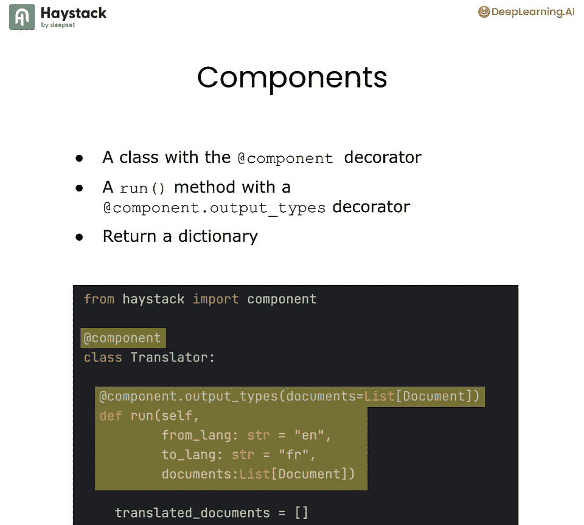
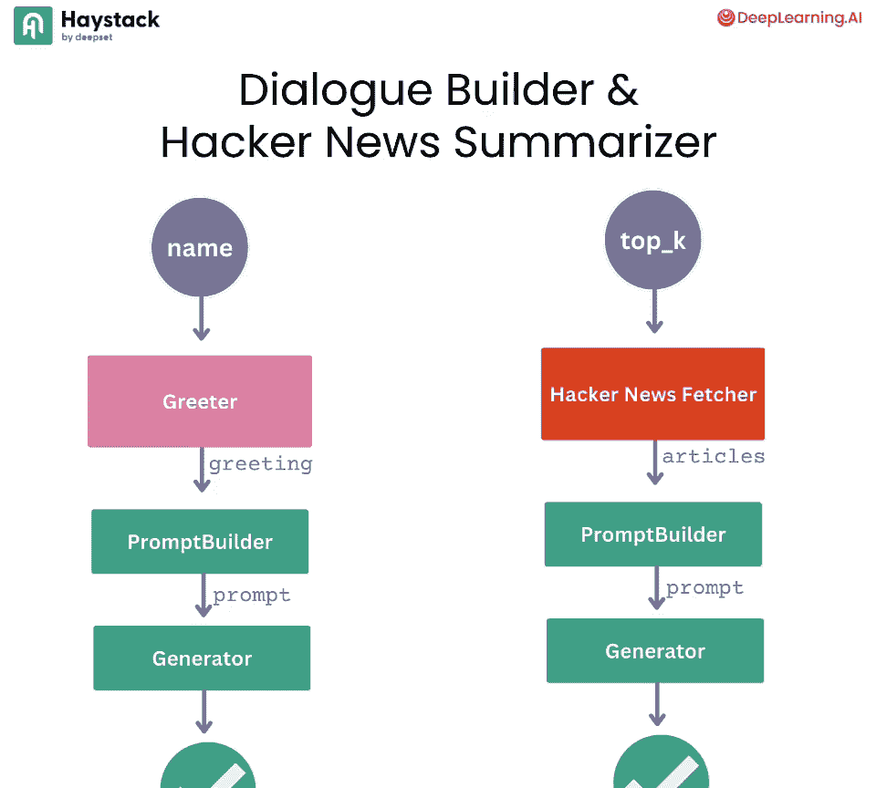
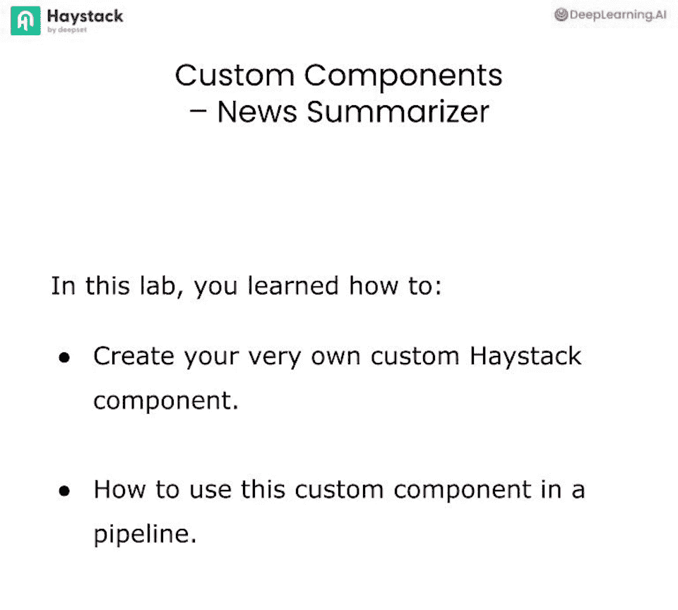

# 004：自定义组件 - 新闻摘要器 🧩

## 概述
在本节课中，我们将学习如何创建自定义的Haystack组件。自定义组件是扩展Haystack功能以满足特定需求的关键。我们将从构建一个简单的问候组件开始，然后创建一个更复杂的、能够获取并总结Hacker News热门帖子的新闻摘要器组件。

---

## 什么是Haystack组件？🤔

上一节我们介绍了课程目标，本节中我们来看看Haystack组件的核心概念。

在Haystack中，组件是构建管道的基本单元。一些现成的组件包括嵌入器（Embedders）、检索器（Retrievers）、生成器（Generators）等。每个组件都期望接收特定数量的输入，并能产生特定数量的输出。

对于一个类要成为Haystack中的有效组件，需要满足几个要求：
1.  使用 `@component` 装饰器装饰类。
2.  类中需要有一个 `run` 方法。
3.  `run` 方法必须返回一个字典。
4.  必须通过装饰器指定组件的输出类型（这在后续的管道连接和验证中非常重要）。



例如，以下是一个有效的翻译组件代码框架：

```python
from haystack import component

@component
class Translator:
    @component.output_types(documents=List[Document])
    def run(self, from_lang: str, to_lang: str, documents: List[Document]):
        # ... 翻译逻辑 ...
        return {"documents": translated_documents}
```



这个组件告诉Haystack：它将输出一个类型为 `List[Document]` 的 `documents`。其 `run` 方法接收三个输入参数，并返回一个包含 `"documents"` 键的字典。

---

## 实验目标 🎯

在本次实验中，我们将构建两个独立的管道：
1.  **对话构建器管道**：使用一个自定义的“问候”组件来生成对话开头。
2.  **黑客新闻摘要器管道**：创建一个自定义的“黑客新闻获取器”组件，用于获取热门帖子，并构建管道对其进行总结。

实验结束时，你将拥有一个能够提供Hacker News上Top K热门帖子摘要的功能性管道。



---

## 准备工作 ⚙️

首先，我们进行常规的警告抑制并加载环境变量（如OpenAI API密钥）。接着，导入本实验所需的所有依赖项。

```python
import warnings
warnings.filterwarnings('ignore')
import os
from dotenv import load_dotenv
load_dotenv()

# 导入必要的Haystack及其他库
from haystack import Pipeline, component
from haystack.components.generators import OpenAIGenerator
from haystack.components.builders import PromptBuilder
# ... 其他导入 ...
```



完成这些步骤后，我们就可以开始编写代码了。

---

## 构建第一个自定义组件：问候器 👋

让我们从一个简单的示例开始，创建一个名为“问候器”（Greeter）的自定义组件。

以下是创建该组件的步骤：

1.  创建一个类并使用 `@component` 装饰它。
2.  使用 `@component.output_types` 装饰器定义其输出（这里输出一个名为 `greeting` 的字符串）。
3.  在类中定义 `run` 方法。该方法接收一个 `username` 参数，并返回包含问候语的字典。

```python
@component
class Greeter:
    @component.output_types(greeting=str)
    def run(self, username: str):
        greeting = f"Hello, {username}"
        return {"greeting": greeting}
```

通过 `@component.output_types(greeting=str)`，我们告知Haystack管道：此组件输出一个字符串类型的 `greeting`。这确保了该组件只能连接到期望接收字符串作为输入的后续组件。

---

## 使用自定义组件构建管道 🔄

现在，让我们看看如何在管道中使用这个新创建的 `Greeter` 组件。我们将构建一个“对话构建器”管道。

以下是构建管道的步骤：

1.  初始化 `Greeter` 组件。
2.  创建一个提示模板，指示大语言模型根据对话开头生成剧本。
3.  使用 `PromptBuilder` 和 `OpenAIGenerator`（默认GPT-3.5）。
4.  将所有组件添加到管道中并正确连接它们。

```python
# 1. 初始化组件
greeter = Greeter()

# 2. 创建提示模板
prompt_template = """
You are given the beginning of a conversation.
Create a short play script using this as the opening.
Conversation opening: {{ conversation }}
"""
prompt_builder = PromptBuilder(template=prompt_template)

# 3. 初始化生成器
llm = OpenAIGenerator()

# 4. 构建并连接管道
conversation_builder = Pipeline()
conversation_builder.add_component("greeter", greeter)
conversation_builder.add_component("prompt_builder", prompt_builder)
conversation_builder.add_component("llm", llm)

conversation_builder.connect("greeter.greeting", "prompt_builder.conversation")
conversation_builder.connect("prompt_builder", "llm")
```

`greeter` 组件输出 `greeting`，而 `prompt_builder` 期望一个名为 `conversation` 的输入。通过 `connect("greeter.greeting", "prompt_builder.conversation")`，我们将问候语作为对话开头传递过去。

现在运行管道：

```python
result = conversation_builder.run({"greeter": {"username": "Tejana"}})
print(result["llm"]["replies"][0])
```

输出将以“Hello, Tejana”开头，并由LLM生成一段简短的对话剧本。你可以更改用户名来获得不同的结果。

---

## 构建复杂组件：黑客新闻获取器 📰

你已经了解了如何创建和使用简单的自定义组件。接下来，让我们构建一个更复杂、更实用的组件——`HackerNewsFetcher`，用于获取Hacker News的热门帖子。

Hacker News提供了一个公共API。例如，我们可以通过以下请求获取当前最流行的帖子：

```
https://hacker-news.firebaseio.com/v0/topstories.json
```

你可以将 `topstories` 替换为 `newstories` 来获取最新帖子。API返回的是故事ID列表，我们需要进一步获取每个ID的详细信息（如标题、URL等）。

---

### 组件结构设计

我们首先搭建组件的基本框架：

```python
@component
class HackerNewsFetcher:
    @component.output_types(articles=List[Document])
    def run(self, top_k: int):
        # 初始化一个空的文章列表
        articles = []
        # ... 获取逻辑将在这里实现 ...
        return {"articles": articles}
```

这个框架是有效的，但目前还不会返回任何实际内容。

---

### 实现获取逻辑

接下来，我们填充 `run` 方法的具体逻辑：

1.  从API获取热门故事ID列表。
2.  遍历前 `top_k` 个ID，获取每个故事的详细信息。
3.  大多数故事有URL，我们使用一个 `HTMLToDocument` 管道来抓取网页内容。
4.  少数故事只有文本，我们直接将其内容转换为Document。
5.  将所有处理后的 `Document` 对象添加到 `articles` 列表中并返回。

```python
import requests
from haystack.components.converters import HTMLToDocument

@component
class HackerNewsFetcher:
    def __init__(self):
        # 初始化HTML转换器，用于抓取URL内容
        self.html_converter = HTMLToDocument()

    @component.output_types(articles=List[Document])
    def run(self, top_k: int):
        articles = []
        # 1. 获取热门故事ID
        top_stories_ids = requests.get("https://hacker-news.firebaseio.com/v0/topstories.json").json()

        # 2. 遍历前 top_k 个故事
        for story_id in top_stories_ids[:top_k]:
            story_url = f"https://hacker-news.firebaseio.com/v0/item/{story_id}.json"
            story_data = requests.get(story_url).json()

            # 3. 处理有URL的故事
            if "url" in story_data:
                # 使用HTML转换器获取网页内容
                doc = self.html_converter.run(urls=[story_data["url"]])["documents"][0]
                # 可选：将原始标题等信息加入元数据
                doc.meta["title"] = story_data.get("title", "")
                articles.append(doc)
            # 4. 处理只有文本的故事
            elif "text" in story_data:
                # 直接创建Document对象
                from haystack import Document
                doc = Document(content=story_data["text"], meta={"title": story_data.get("title", "")})
                articles.append(doc)

        return {"articles": articles}
```

现在，我们可以单独测试这个组件：

```python
fetcher = HackerNewsFetcher()
results = fetcher.run(top_k=3)
for doc in results["articles"]:
    print(f"Title: {doc.meta.get('title')}")
    print(f"URL: {doc.meta.get('url', 'N/A')}")
    print(f"Content snippet: {doc.content[:200]}...\n")
```

组件将输出三个Document，每个都包含从Hacker News获取的帖子标题、URL和内容。

---

## 构建新闻摘要器管道 ✨

现在我们有了可用的 `HackerNewsFetcher` 组件，可以将其集成到一个完整的摘要管道中。

以下是构建摘要管道的步骤：

1.  **创建提示模板**：指示LLM根据提供的文章内容生成摘要。
2.  **初始化组件**：包括我们自定义的 `fetcher`、`prompt_builder` 和 `llm`。
3.  **构建并连接管道**：将获取的文章传递给提示生成器，再交由LLM生成摘要。

```python
# 1. 提示模板
summary_template = """
Here are some top posts from Hacker News.
For each post, provide a brief summary if possible.


Post {{ loop.index }}:
Content: {{ article.content[:500] }}... (truncated)
---

"""
prompt_builder = PromptBuilder(template=summary_template)

# 2. 初始化组件
fetcher = HackerNewsFetcher()
llm = OpenAIGenerator()

# 3. 构建管道
summarizer_pipeline = Pipeline()
summarizer_pipeline.add_component("fetcher", fetcher)
summarizer_pipeline.add_component("prompt_builder", prompt_builder)
summarizer_pipeline.add_component("llm", llm)

summarizer_pipeline.connect("fetcher.articles", "prompt_builder.articles")
summarizer_pipeline.connect("prompt_builder", "llm")
```

运行管道，获取前3个帖子的摘要：

```python
result = summarizer_pipeline.run({"fetcher": {"top_k": 3}})
print(result["llm"]["replies"][0])
```

由于Hacker News内容实时变化，你的输出将与示例不同，显示的是你运行当天热门帖子的摘要。

---

## 增强提示：包含来源URL 🔗

我们可以进一步改进提示模板，要求LLM在摘要后附上原文的URL。这利用了 `HTMLToDocument` 自动将源URL存入 `Document` 元数据的特性。

修改提示模板如下：

```python
enhanced_summary_template = """
Here are some top posts from Hacker News.
For each post, provide a brief summary followed by the URL to the full post.


Post {{ loop.index }}:
Content: {{ article.content[:500] }}... (truncated)
URL: {{ article.meta['url'] }}
---

"""
```

使用新模板重建管道并运行，你将获得包含摘要和原文链接的更丰富结果。

```python
enhanced_prompt_builder = PromptBuilder(template=enhanced_summary_template)

enhanced_summarizer = Pipeline()
enhanced_summarizer.add_component("fetcher", fetcher)
enhanced_summarizer.add_component("prompt_builder", enhanced_prompt_builder)
enhanced_summarizer.add_component("llm", llm)
# ... 连接组件 ...

result = enhanced_summarizer.run({"fetcher": {"top_k": 2}})
print(result["llm"]["replies"][0])
```

如果输出不完全符合预期，你可以继续编辑提示词使其更精确，甚至在后续实验中实现“自我反思”机制，让LLM自行改进结果。

---

## 总结 🎓

在本节课中，我们一起学习了：

1.  **Haystack组件的核心要求**：使用 `@component` 装饰器、定义 `run` 方法、返回字典、声明输出类型。
2.  **创建简单自定义组件**：我们构建了一个 `Greeter` 组件，并将其成功集成到对话生成管道中。
3.  **创建复杂自定义组件**：我们构建了 `HackerNewsFetcher` 组件，它调用外部API获取数据，并内部使用其他Haystack组件（如 `HTMLToDocument`）处理内容。
4.  **构建功能管道**：利用自定义组件，我们创建了一个完整的新闻摘要管道，能够获取并总结网络上的热门内容。



自定义组件功能强大，它不仅让你能够接入Haystack尚未官方支持的API（如本例中的Hacker News）或模型供应商，还能实现你独有的处理逻辑。Haystack社区也贡献了许多集成组件，值得探索。在下一个实验中，我们将学习如何实现带有分支的Haystack管道，以创建更复杂的流程（如回退机制）。