# 006：构建带循环的自我反思智能体 🧠

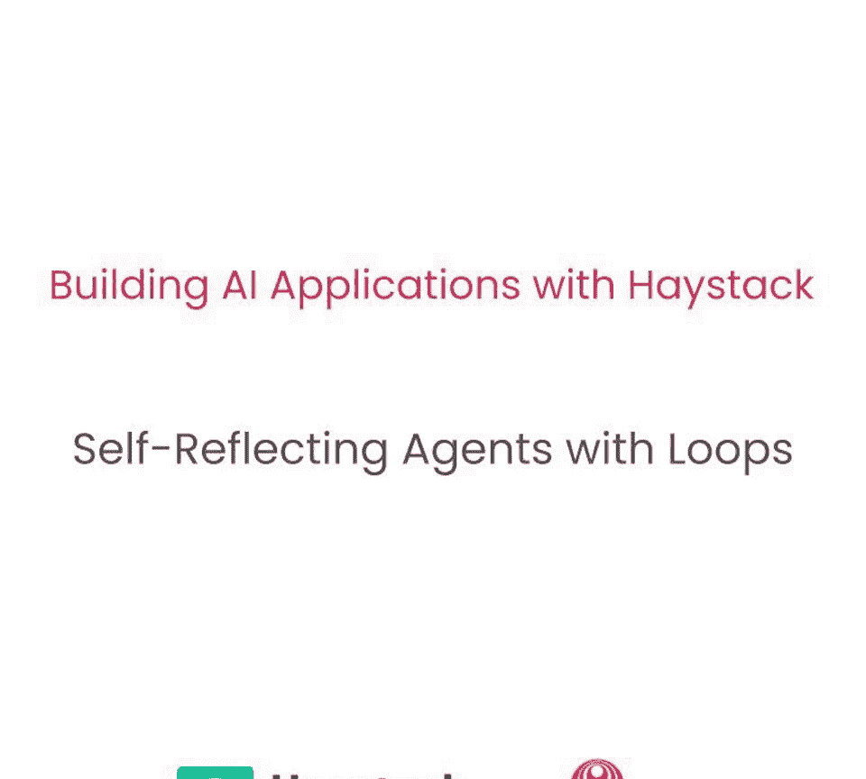

在本节课中，我们将学习如何构建一个能够进行自我反思的Haystack智能体管道。这个管道将包含一个循环机制，允许大型语言模型（LLM）评估并迭代改进自己的输出。我们将通过一个具体的例子来实现：让LLM从非结构化文本中提取命名实体，并通过自我反思来优化结果。

## 概述

自我反思是一种让模型自我评估和纠正的机制。通过提供反馈，模型可以生成更可靠和准确的信息。在本教程中，我们将构建一个简单的管道，其中LLM会反复检查自己提取的实体，直到它对自己的结果满意为止。我们将使用自定义组件和循环逻辑来实现这一过程。

## 构建自定义组件：实体验证器

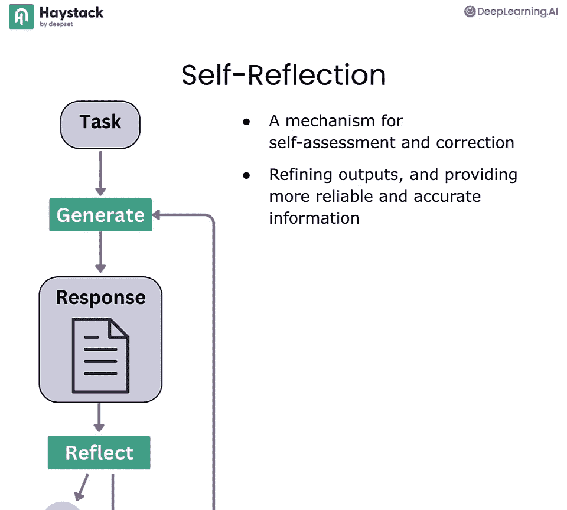

首先，我们需要创建一个自定义的Haystack组件，用于验证LLM的回复。这个组件将决定LLM是否完成了任务，或者是否需要进一步反思。

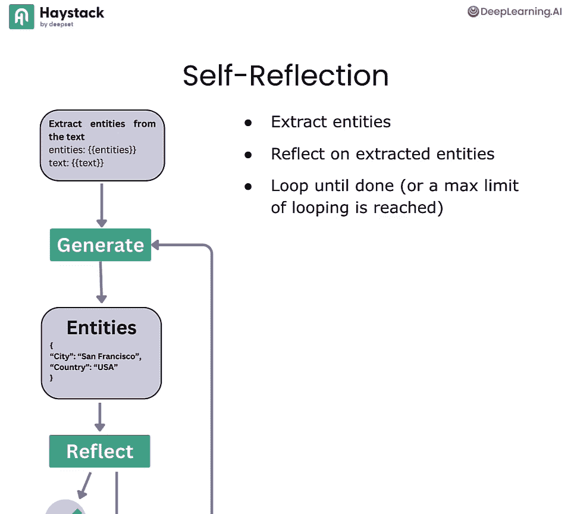

以下是创建 `EntityValidator` 组件的代码：

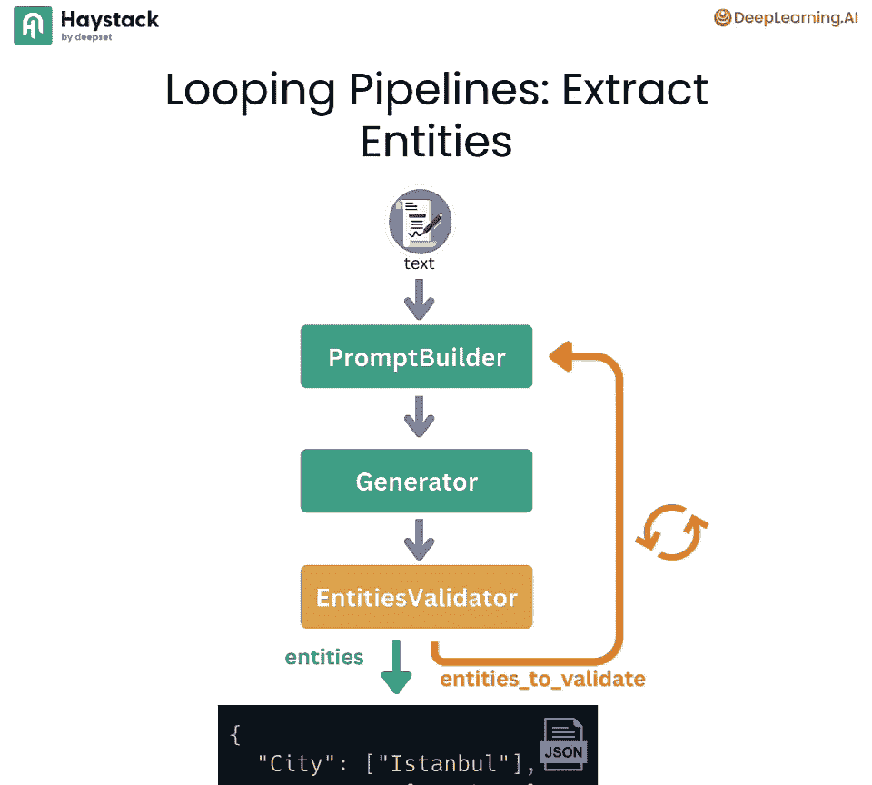

```python
from haystack import component
from typing import Dict, Any

@component
class EntityValidator:
    @component.output_types(entities_to_validate=str, entities=str)
    def run(self, replies: str):
        if "完成" in replies:
            return {"entities": replies}
        else:
            # 用红色打印需要验证的实体，便于观察循环过程
            print(f"\033[91m{replies}\033[0m")
            return {"entities_to_validate": replies}
```

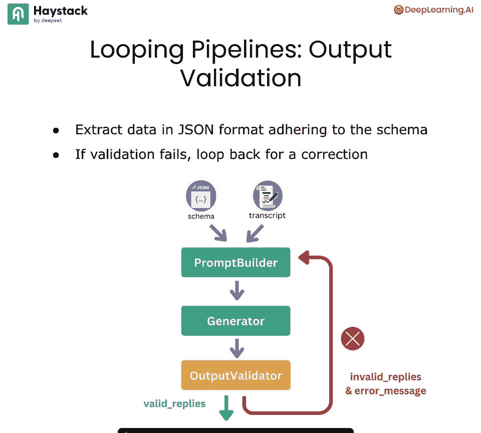

这个组件的逻辑很简单：
*   如果LLM的回复中包含“完成”这个词，组件就将回复作为最终“实体”输出。
*   如果不包含“完成”，组件会用红色打印回复，并将其作为“需要验证的实体”输出，以便进行下一轮反思。

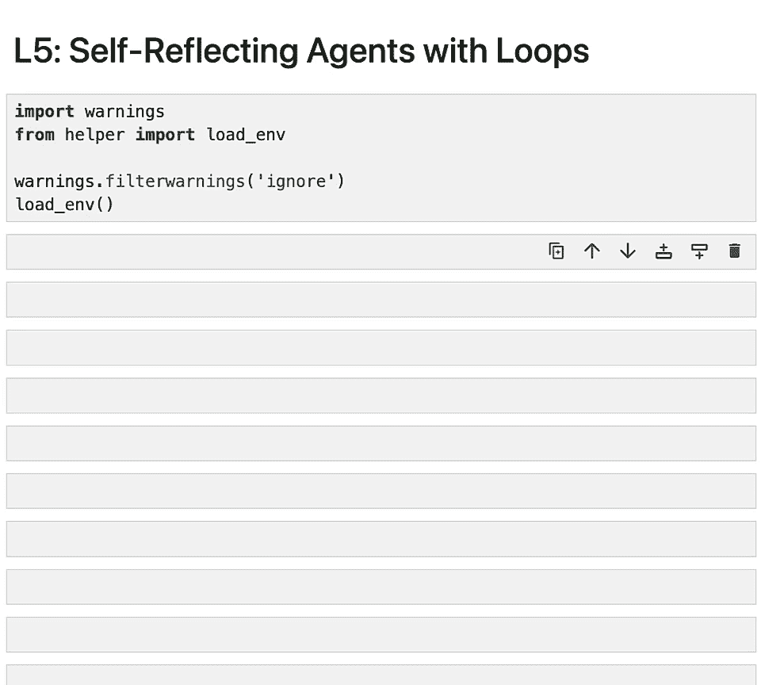

## 设计动态提示模板

为了让LLM能够根据上下文（首次尝试或反思后）接收不同的指令，我们需要创建一个动态的提示模板。我们将使用Jinja2模板的 `if-else` 语句来实现。

```python
from haystack.components.builders import PromptBuilder

template = """

你之前从以下文本中提取了实体：
文本：{{ text }}
你提取的实体：{{ entities_to_validate }}

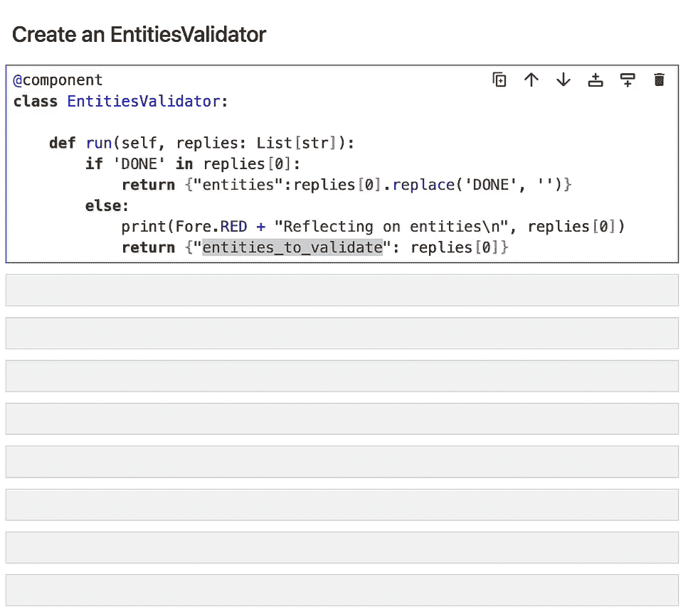

请反思并改进你的答案。考虑以下几点：
- 确保提取了所有要求类型的实体（人物、地点、日期）。
- 如果某个类别没有实体，请返回空列表。
- 确保格式正确（键值对形式）。
如果你认为已经完善，请说“完成”。

改进后的实体：

请从以下文本中提取实体。
文本：{{ text }}

提取要求：
- 实体类型：人物、地点、日期。
- 格式：以键值对形式呈现，例如 {"人物": [...], "地点": [...], "日期": [...]}。
- 如果某个类别没有实体，请返回空列表。

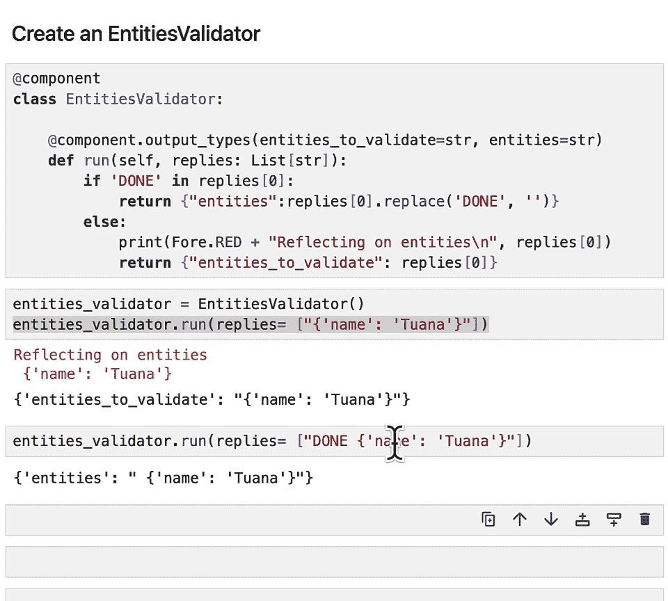

提取的实体：

"""

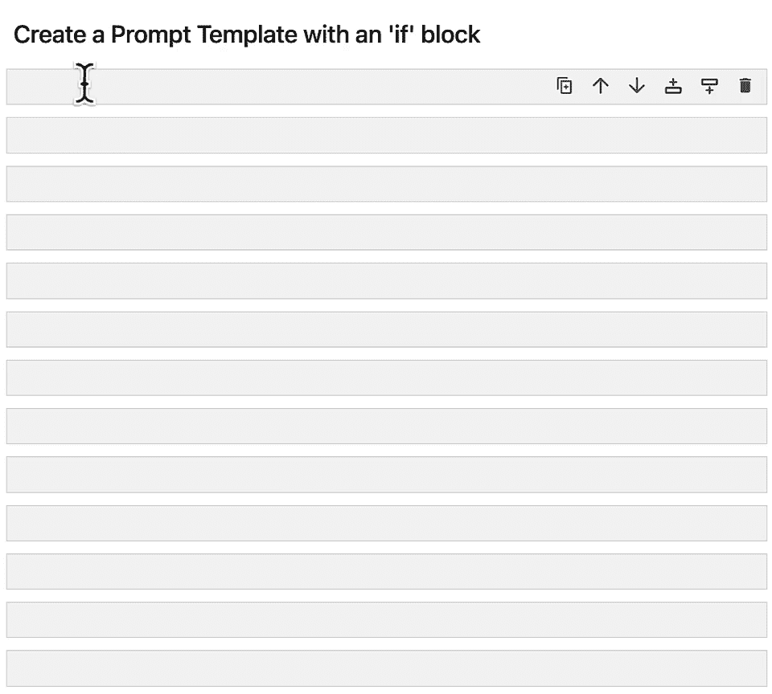

prompt_builder = PromptBuilder(template=template)
```

这个模板的核心在于：
*   **首次运行**（`else` 部分）：指示LLM从给定文本中提取指定类型的实体。
*   **反思运行**（`if` 部分）：向LLM展示它上一轮提取的实体，并提供具体的改进要点，引导它进行反思和修正。

## 组装循环管道

现在，我们将生成器、提示构建器和验证器组件连接起来，形成一个可以循环的管道。关键点在于设置循环逻辑和最大循环次数，以控制成本和防止无限循环。

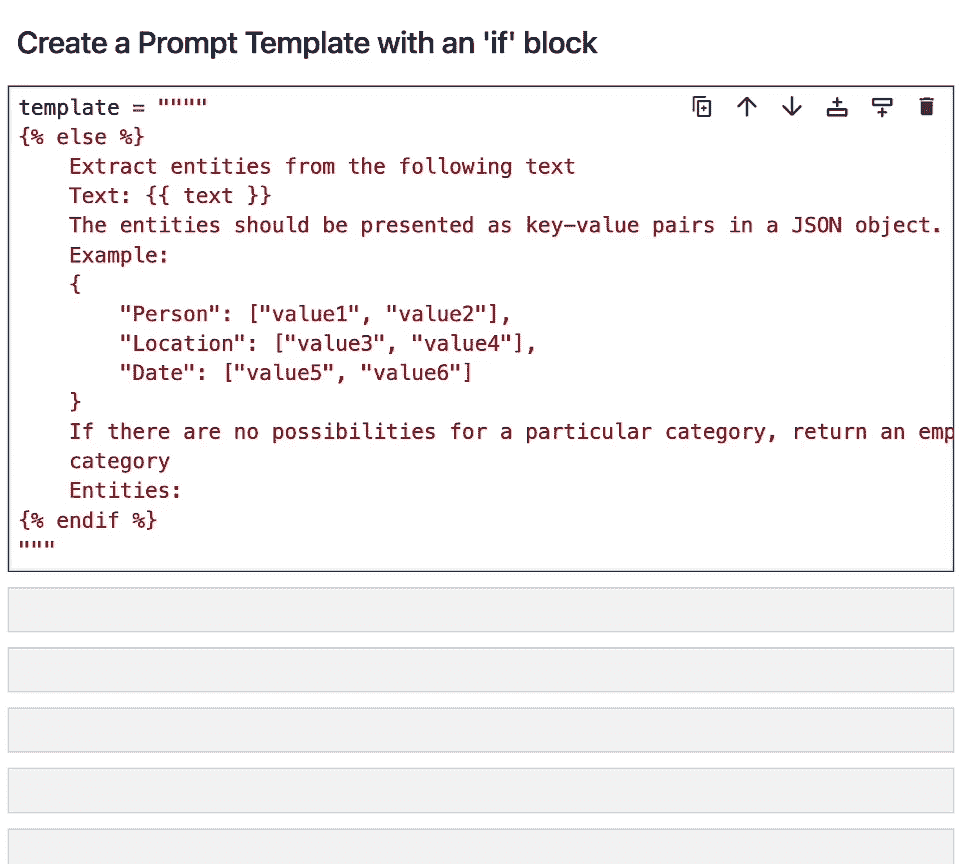

```python
from haystack import Pipeline
from haystack.components.generators import OpenAIGenerator

# 1. 初始化组件
prompt_builder = PromptBuilder(template=template)
llm = OpenAIGenerator(model="gpt-3.5-turbo") # 使用OpenAI生成器
validator = EntityValidator()

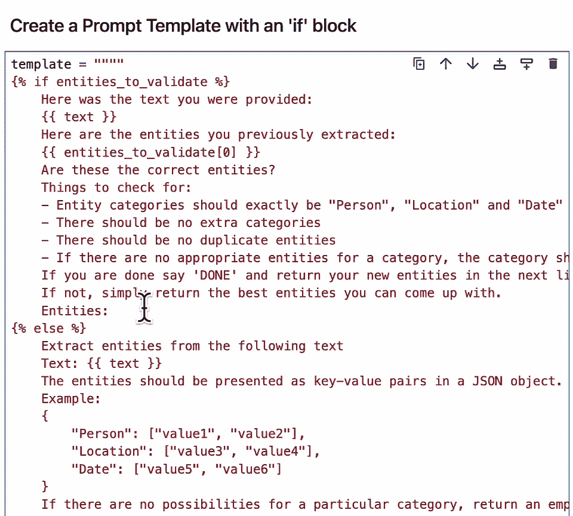

# 2. 创建管道并设置循环
pipeline = Pipeline(max_loops_allowed=10) # 限制最大循环次数为10

# 3. 添加组件到管道
pipeline.add_component("prompt_builder", prompt_builder)
pipeline.add_component("llm", llm)
pipeline.add_component("validator", validator)

# 4. 连接组件
# 提示构建器接收初始文本或反馈的实体，输出给LLM
pipeline.connect("prompt_builder", "llm")
# LLM的回复交给验证器判断
pipeline.connect("llm.replies", "validator.replies")

# 5. 建立循环：如果验证器输出“需要验证的实体”，则将其反馈给提示构建器
pipeline.connect("validator.entities_to_validate", "prompt_builder.entities_to_validate")
```

管道的工作流程如下：
1.  `prompt_builder` 根据输入（初始文本或反馈实体）构建提示。
2.  `llm` 根据提示生成回复。
3.  `validator` 检查回复。
    *   若回复含“完成”，则流程结束，输出最终实体。
    *   若不含“完成”，则将回复作为 `entities_to_validate` 输出。
4.  管道将 `entities_to_validate` 重新发送给 `prompt_builder`，开启新一轮的“反思-生成”循环。
5.  循环持续，直到LLM回复“完成”或达到最大循环次数。

## 运行与测试

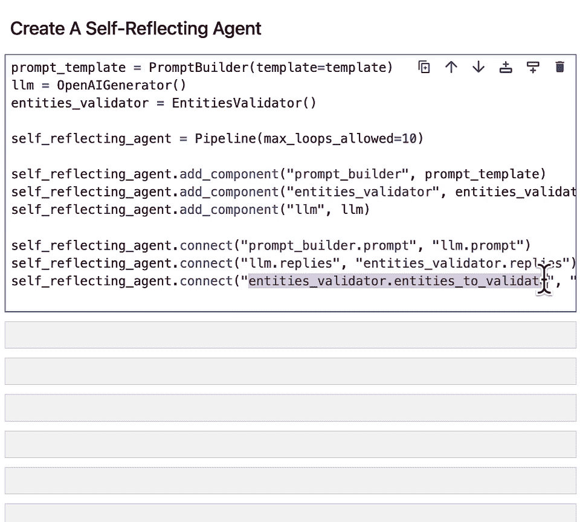

让我们用两段示例文本来测试这个自我反思智能体。

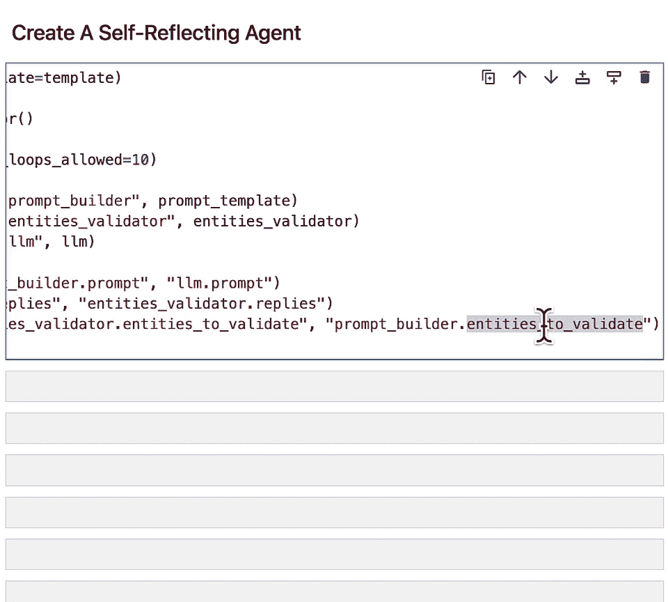

**示例 1：关于城市的描述**

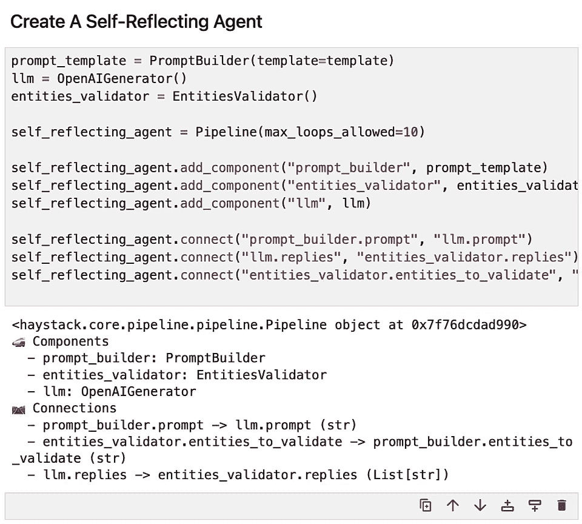

```python
text_1 = “””
伊斯坦布尔是土耳其最大的城市，横跨欧亚大陆。它历史上被称为拜占庭和君士坦丁堡。该市人口超过1500万。苏丹艾哈迈德清真寺和圣索菲亚大教堂是其主要地标。
“””

# 运行管道，初始输入是文本，没有需要验证的实体
result = pipeline.run({
    "prompt_builder": {
        "text": text_1,
        "entities_to_validate": None # 初始运行时为None
    }
})

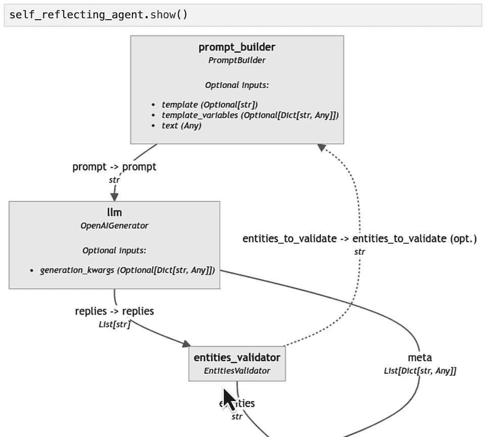

# 打印最终结果
print(f"\033[92m最终实体：{result['validator']['entities']}\033[0m")
```


**示例 2：会议记录**

```python
text_2 = “””
项目启动会议于2023年10月26日举行。与会者包括张三（项目经理）、李四（首席开发员）和王五（UI设计师）。会议在北京的办公室进行。讨论了项目使用React和Python进行开发。
“””

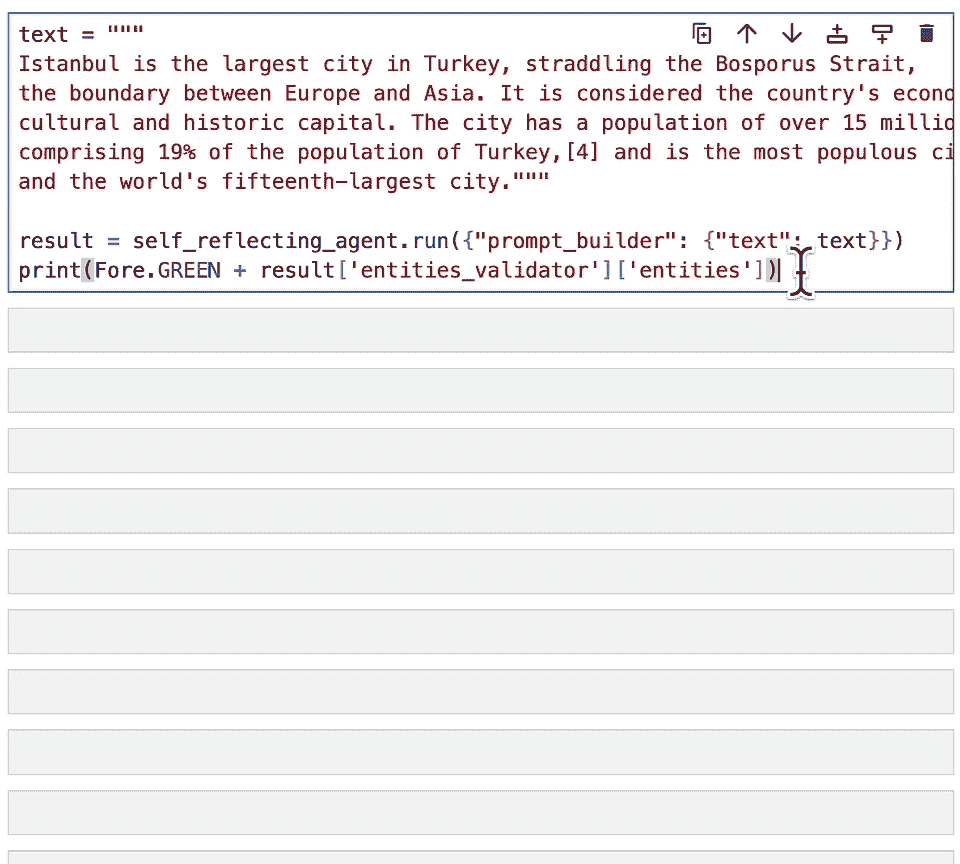

result = pipeline.run({
    "prompt_builder": {
        "text": text_2,
        "entities_to_validate": None
    }
})
print(f"\033[92m最终实体：{result['validator']['entities']}\033[0m")
```

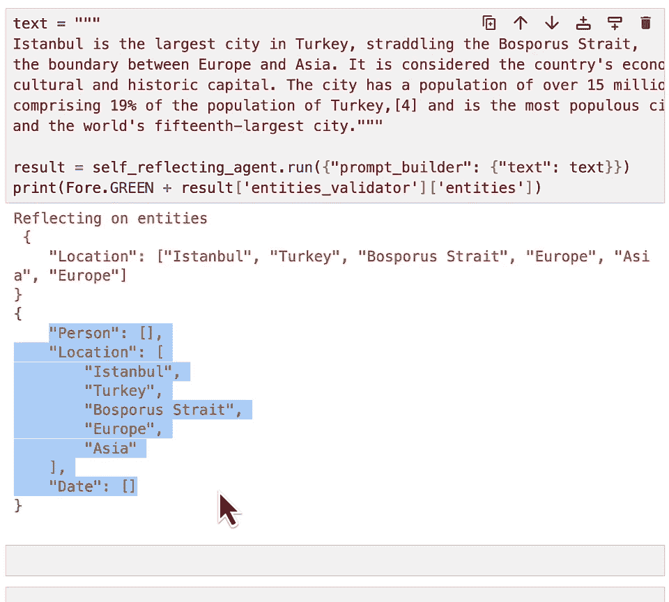

运行过程中，控制台会以红色显示LLM在反思过程中生成的中间实体，最后以绿色显示它最终满意的实体结果。你可以观察到LLM如何从第一次可能不完整或格式不正确的输出，通过反思逐步修正为符合要求的答案。


## 总结

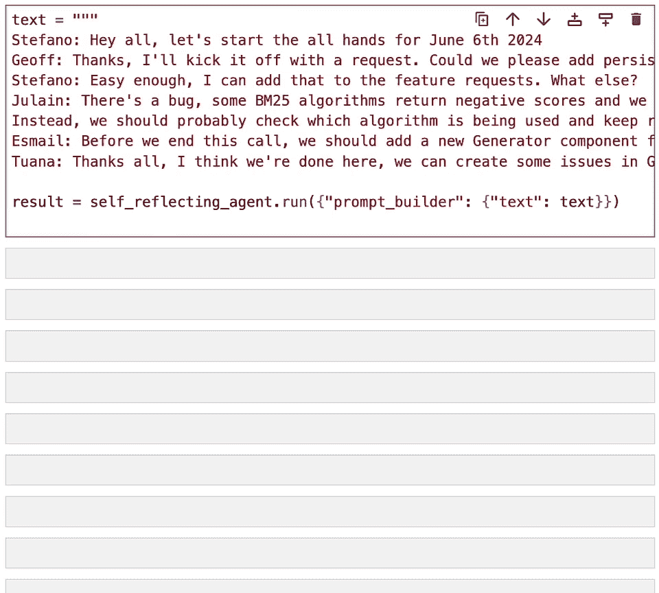

在本节课中，我们一起学习了如何构建一个带循环功能的自我反思智能体。我们实现了以下核心步骤：

1.  **创建自定义验证器**：用于判断LLM的输出是否“完成”，并据此决定流程走向。
2.  **设计动态提示模板**：利用条件语句为LLM提供初次指令和反思指令。
3.  **组装循环管道**：将各组件连接，并通过 `max_loops_allowed` 参数控制循环上限，实现了“生成-验证-反馈”的闭环。

这个例子展示了实现自我反思的一种简单而有效的方法。你可以在此基础上进行扩展，例如：
*   让模型反思并生成不同类型的输出（如摘要、情感分析）。
*   集成更复杂的验证逻辑（如使用Pydantic验证JSON模式）。
*   构建能够使用函数调用的更高级的聊天代理。

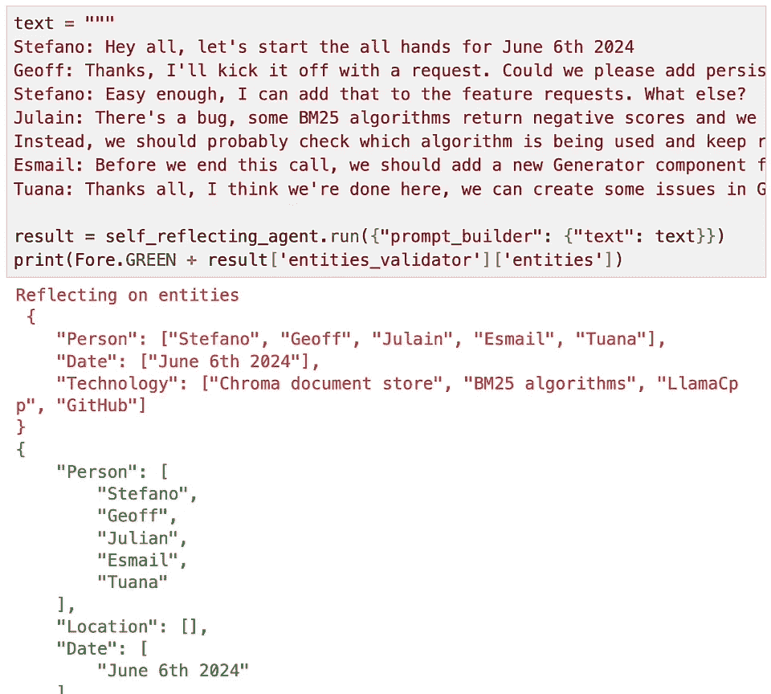

通过本节课，你已经掌握了在Haystack中创建具有迭代和自我改进能力AI应用的基础。