# 007：7.L6 使用函数调用的聊天代理 🛠️🤖

在本节课中，我们将学习如何利用OpenAI的函数调用能力，将Haystack的RAG管道和其他功能封装为“工具”，从而构建一个功能强大的聊天代理。这个代理能够理解用户意图，并动态调用合适的工具来获取信息并生成回答。

---


## 概述

函数调用是大型语言模型（LLM）领域一项激动人心的进展。它允许模型在对话中决定并调用外部函数（如API或自定义管道）来获取信息。本节课，我们将创建一个聊天代理，它能将Haystack的RAG管道和模拟的天气API作为工具来使用。

---

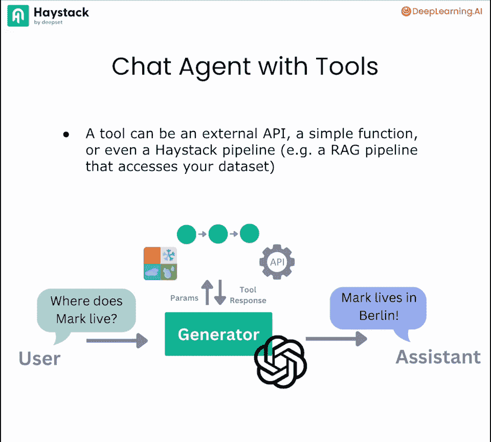

## 准备工作

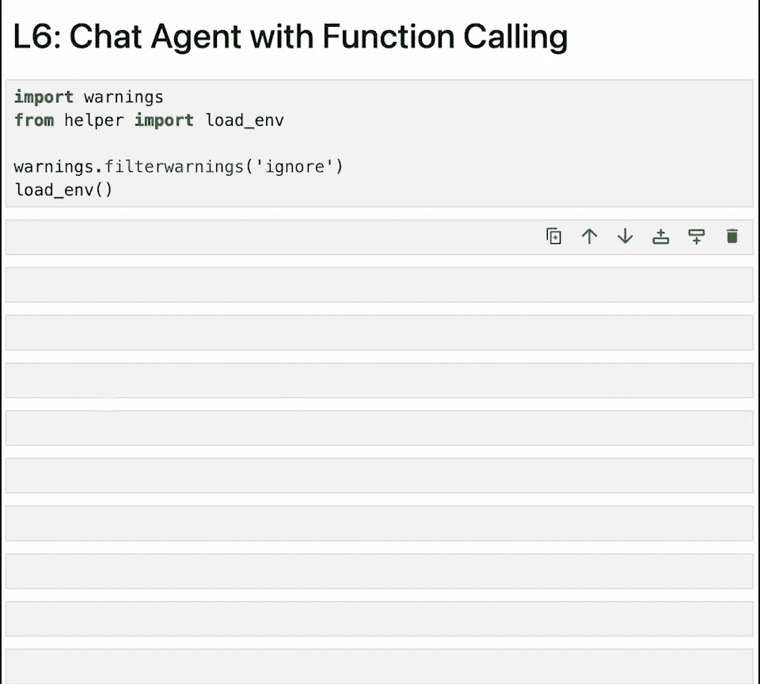

首先，我们需要设置环境并导入必要的库。这包括抑制警告、加载环境变量以及导入Haystack和OpenAI相关的组件。

```python
import warnings
warnings.filterwarnings('ignore')
import os
from dotenv import load_dotenv
load_dotenv()

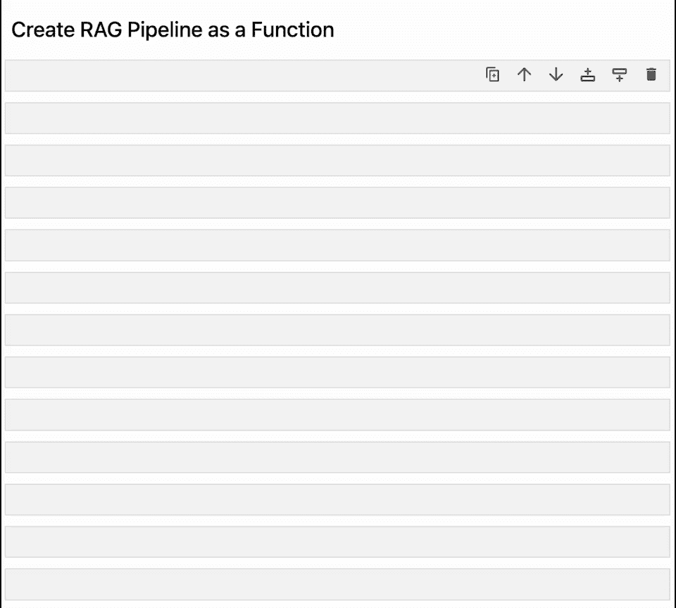

from haystack import Pipeline
from haystack.components.builders import ChatPromptBuilder
from haystack.components.generators import OpenAIChatGenerator
from haystack.dataclasses import ChatMessage
from haystack.components.joiners import BranchJoiner
from haystack.experimental.components.function_call import OpenAIFunctionCaller
```

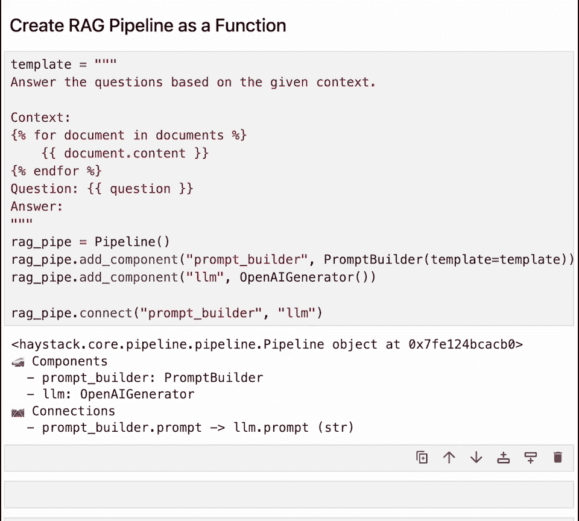

---

## 第一步：创建RAG管道函数

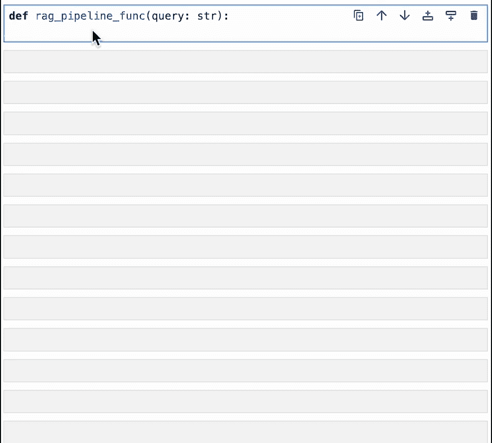

上一节我们完成了基础设置，本节中我们来看看如何将RAG管道包装成一个可被调用的函数。

我们将创建一个标准的RAG管道，但为了演示，这里使用一些预设的“虚假”文档数据。

```python
# 假设的文档数据
documents = [
    "马克住在柏林。",
    "乔治住在罗马。",
    "安娜住在巴黎。",
    "丽莎住在马德里。",
    "约翰住在伦敦。"
]

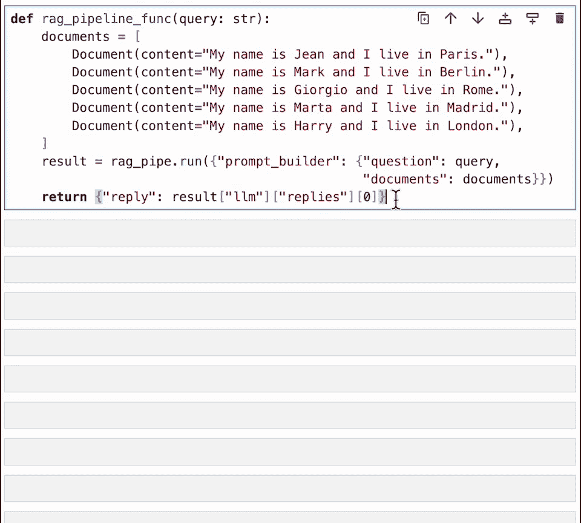

# 创建一个简单的RAG管道（此处为概念演示，非完整代码）
# 通常包含文档存储、检索器和生成器
def create_rag_pipeline():
    # ... 初始化文档存储、检索器等组件 ...
    pipeline = Pipeline()
    # ... 添加组件并连接 ...
    return pipeline

rag_pipeline = create_rag_pipeline()
```

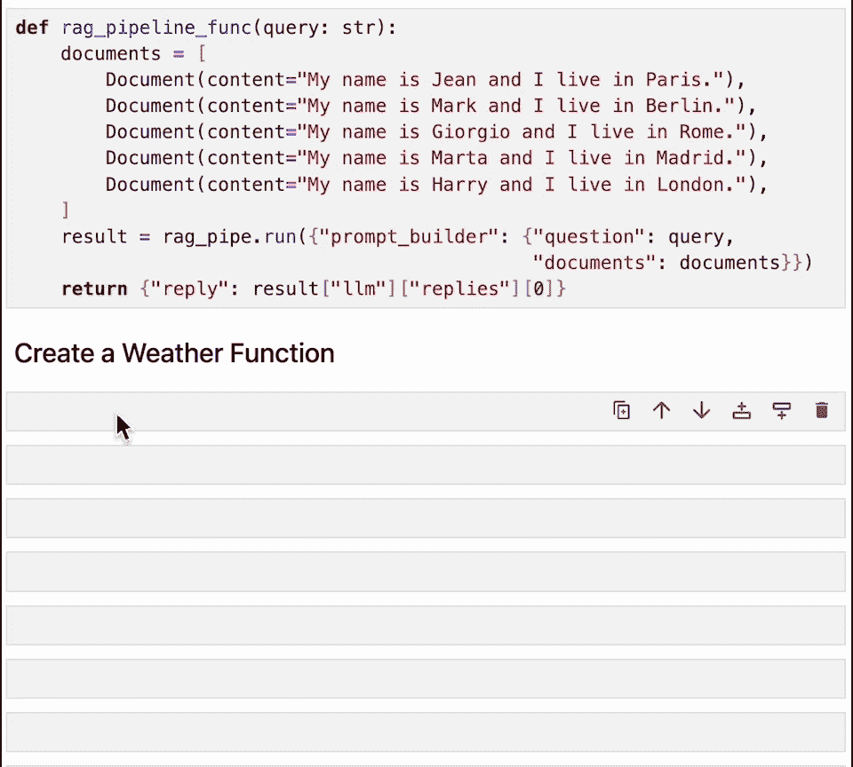

现在，我们将这个管道包装成一个Python函数，以便后续作为工具调用。

```python
def rag_pipeline_func(query: str):
    """
    这是一个RAG管道函数。
    参数:
        query (str): 用户提出的问题。
    返回:
        str: 根据文档生成的答案。
    """
    # 在实际应用中，这里会运行完整的RAG管道
    # 为了演示，我们简单地在预设文档中查找答案
    for doc in documents:
        if query in doc:
            return doc
    return "根据现有文档，我无法找到相关信息。"
```

---

## 第二步：创建模拟天气函数

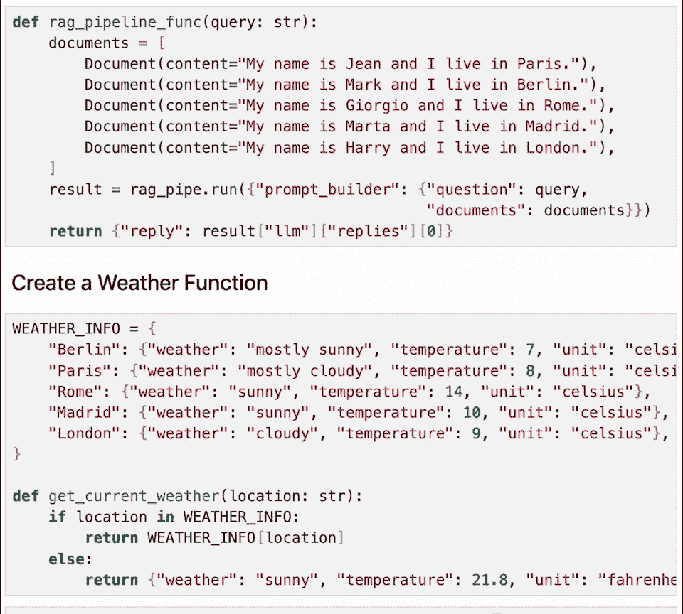

除了RAG管道，我们还可以为代理提供其他工具。接下来，我们创建一个模拟的天气查询函数。

以下是模拟的天气数据：

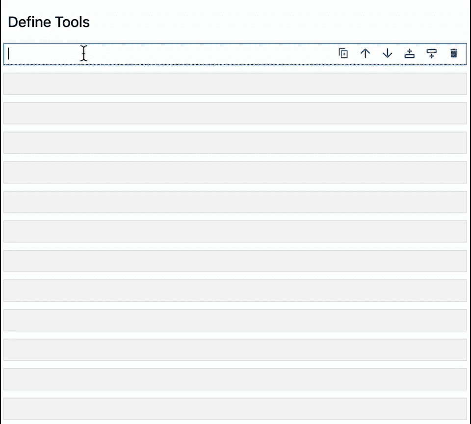

```python
weather_data = {
    "柏林": "天气以晴朗为主，气温7°C。",
    "巴黎": "天气多云，气温10°C。",
    "罗马": "天气晴朗，气温15°C。",
    "马德里": "天气以晴朗为主，气温12°C。",
    "伦敦": "天气多云，气温8°C。"
}
```

然后定义天气函数：

```python
def get_current_weather(location: str):
    """
    获取指定城市的当前天气。
    参数:
        location (str): 城市名称。
    返回:
        str: 该城市的天气描述。
    """
    # 查找城市天气，如果未找到则返回默认值
    return weather_data.get(location, "天气晴朗，气温21.8°C。")
```

现在，我们有了两个可用的工具：一个用于回答居住地问题的RAG函数，另一个用于查询天气的函数。

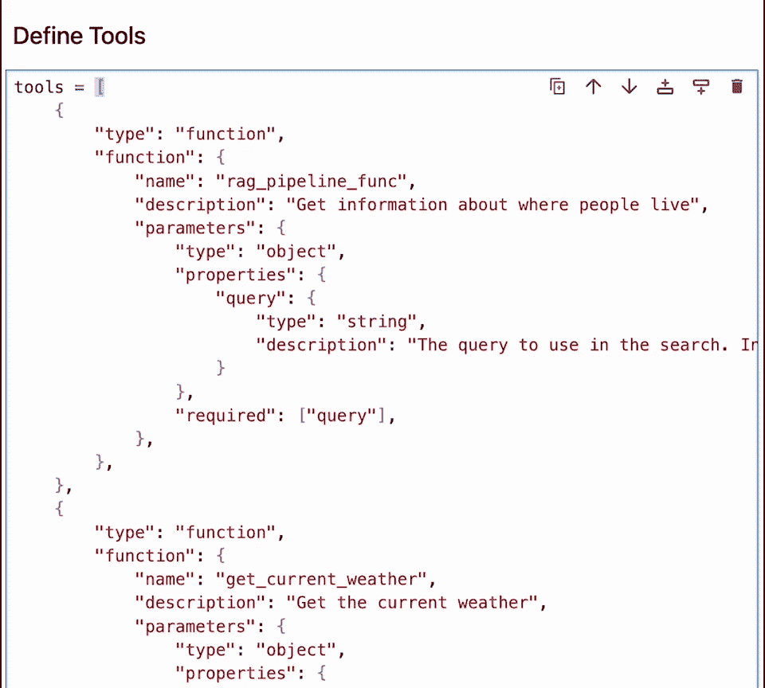

---

## 第三步：将函数描述为OpenAI工具

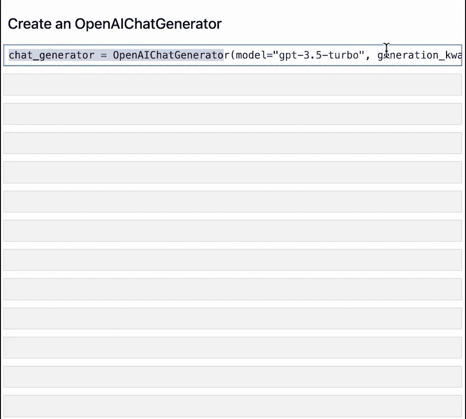

为了让OpenAI模型理解并调用我们的函数，我们需要按照OpenAI API的规范来描述这些工具。

以下是描述工具的方法：

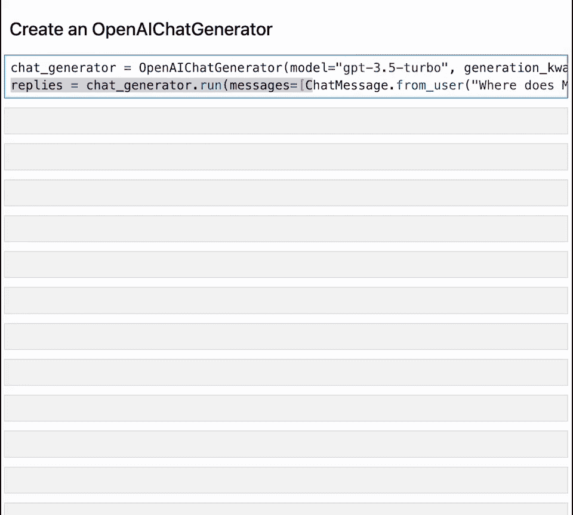

```python
tools = [
    {
        "type": "function",
        "function": {
            "name": "rag_pipeline_func",
            "description": "在文档中搜索信息以回答关于人物居住地的问题。",
            "parameters": {
                "type": "object",
                "properties": {
                    "query": {
                        "type": "string",
                        "description": "在搜索中使用的查询，应从用户消息中推断。"
                    }
                },
                "required": ["query"]
            }
        }
    },
    {
        "type": "function",
        "function": {
            "name": "get_current_weather",
            "description": "获取指定城市的当前天气信息。",
            "parameters": {
                "type": "object",
                "properties": {
                    "location": {
                        "type": "string",
                        "description": "需要查询天气的城市名称。"
                    }
                },
                "required": ["location"]
            }
        }
    }
]
```

---

## 第四步：初始化聊天生成器与函数调用器

有了工具描述，我们就可以配置聊天生成器了。OpenAIChatGenerator组件可以接收这些工具列表。

```python
# 初始化聊天生成器，并为其提供工具
chat_generator = OpenAIChatGenerator(model="gpt-3.5-turbo", generation_kwargs={"tools": tools})
```

接下来，我们需要一个组件来实际执行模型要求调用的函数。我们将使用Haystack实验包中的`OpenAIFunctionCaller`。

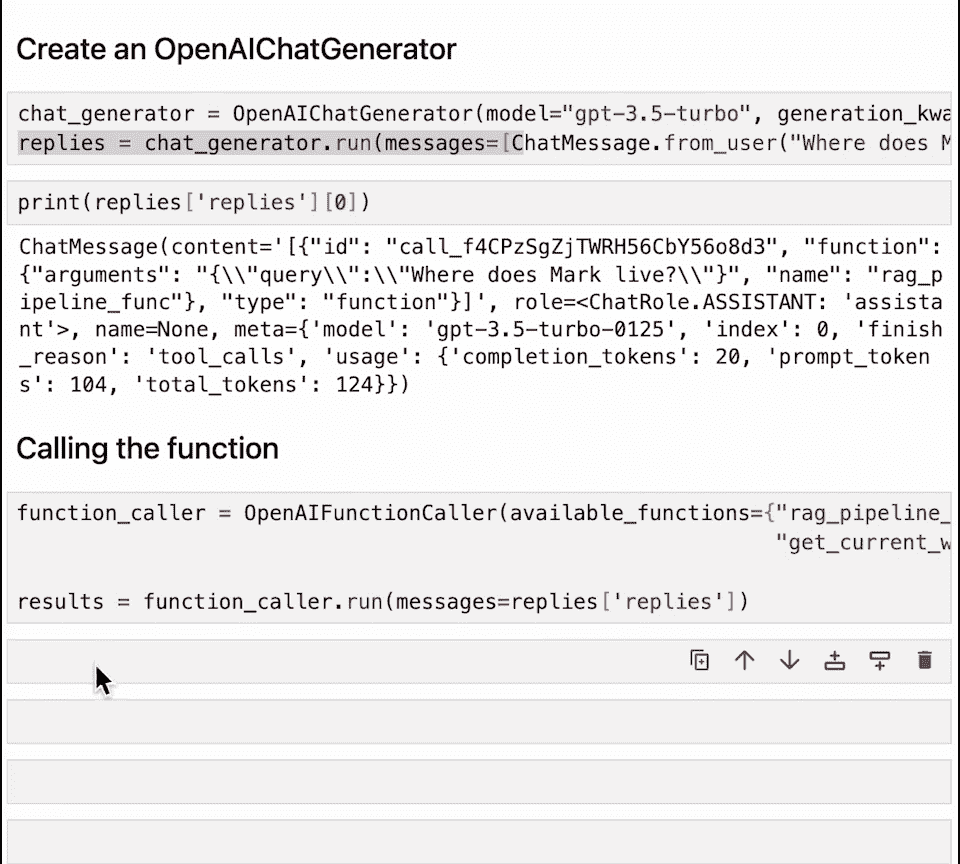

```python
# 初始化函数调用器，并为其提供可用的函数字典
available_functions = {
    "rag_pipeline_func": rag_pipeline_func,
    "get_current_weather": get_current_weather
}
function_caller = OpenAIFunctionCaller(functions=available_functions)
```

---

## 第五步：构建聊天代理管道

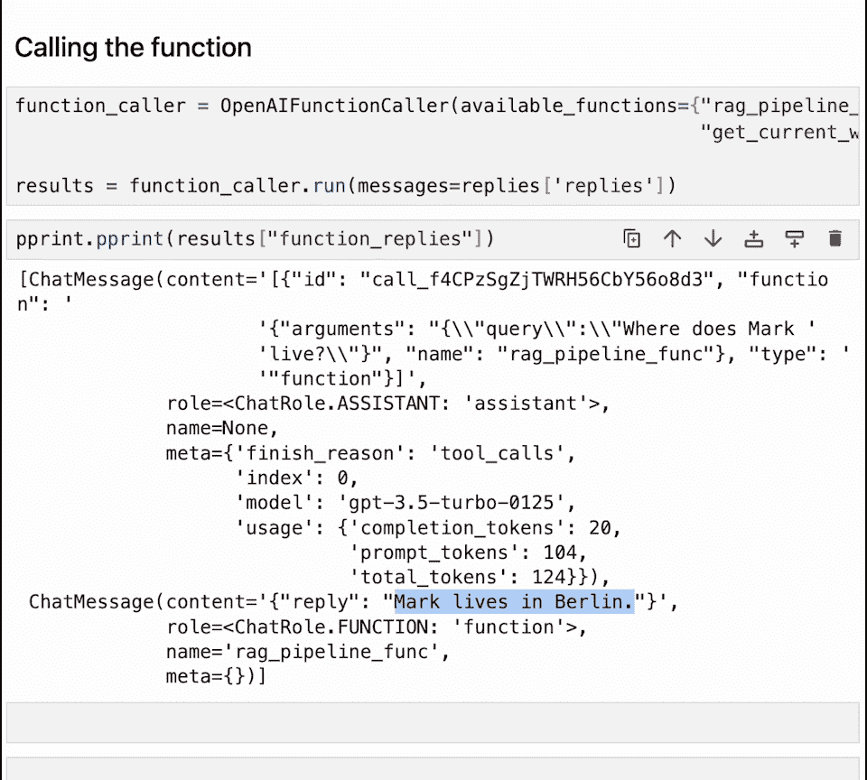

现在，我们将各个组件组合成一个完整的聊天代理管道。这个管道需要处理消息的流转、工具的调用以及响应的生成。

以下是构建管道的步骤：

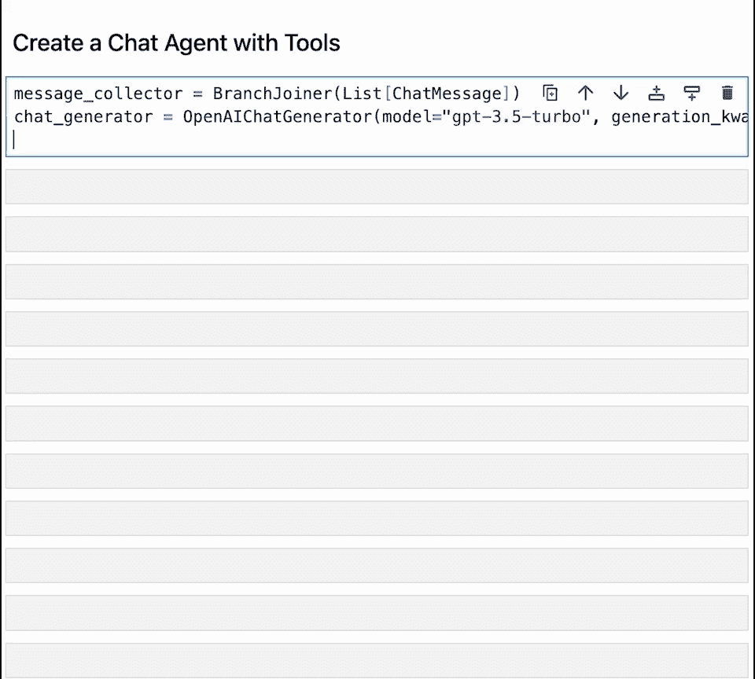

1.  **消息收集器**：使用`BranchJoiner`来合并来自用户和函数调用器的消息，形成一个连贯的消息历史。
2.  **聊天生成器**：接收消息历史，决定是否需要调用工具，并生成回复。
3.  **函数调用器**：如果生成器决定调用工具，则由它来执行具体的函数，并将结果返回。

```python
# 创建管道
chat_agent = Pipeline()

# 添加组件
chat_agent.add_component("message_collector", BranchJoiner())
chat_agent.add_component("generator", chat_generator)
chat_agent.add_component("function_caller", function_caller)

# 连接组件
# 消息收集器的输出作为生成器的输入
chat_agent.connect("message_collector", "generator.messages")
# 生成器的输出传递给函数调用器
chat_agent.connect("generator.replies", "function_caller.messages")
# 函数调用器的输出返回到消息收集器，形成循环，以便模型能将函数结果转化为自然语言回复
chat_agent.connect("function_caller.replies", "message_collector")

# 可视化管道（可选）
# chat_agent.draw("./chat_agent_pipeline.png")
```

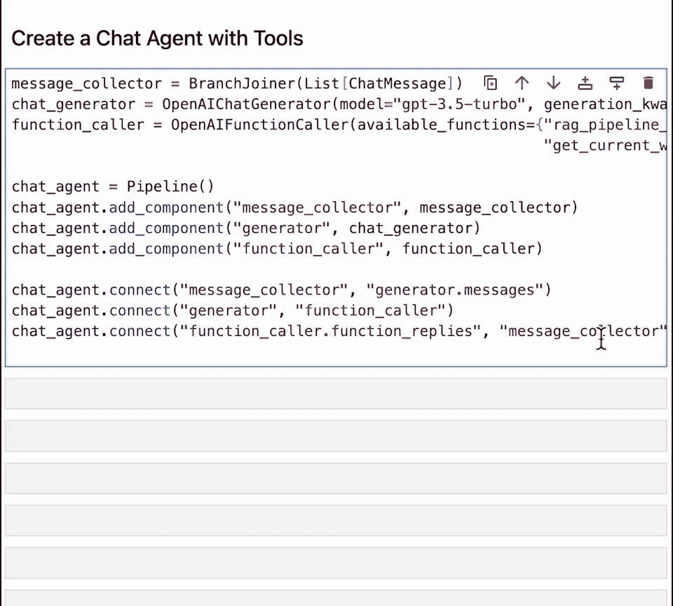

---

## 第六步：与聊天代理交互

管道构建完成后，我们可以创建一个简单的交互循环来测试它。

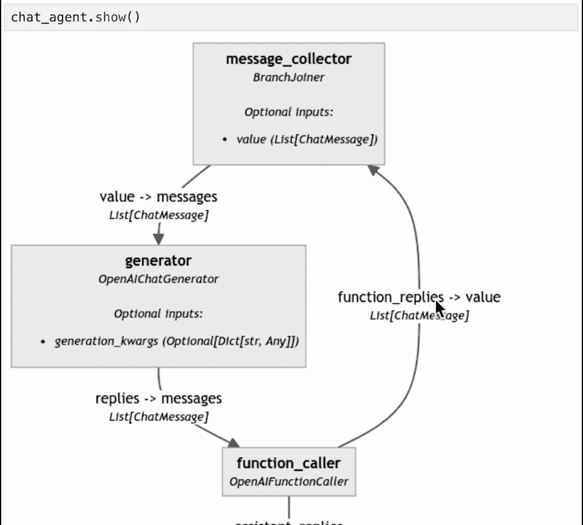

首先，初始化消息队列，并可以加入一个系统消息来指导模型行为。

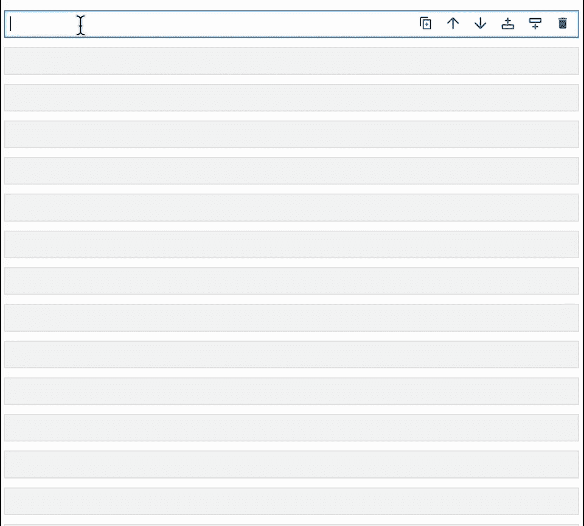

```python
messages = [ChatMessage.from_system("如果需要，请将用户问题分解为更简单的问题。不要对要插入函数的值进行假设。")]
```

然后，启动一个交互循环：

```python
print("聊天代理已启动。输入‘退出’或‘离开’来结束对话。")
while True:
    user_input = input("\n你: ")
    if user_input.lower() in ["退出", "离开"]:
        print("再见！")
        break

    # 将用户消息加入队列
    messages.append(ChatMessage.from_user(user_input))

    # 运行管道，从`message_collector`组件输入当前消息
    result = chat_agent.run({"message_collector": {"value": messages}})

    # 获取最新的助手回复
    # 回复可能来自`generator`（直接回答）或`function_caller`（函数调用后的结果）
    latest_reply = result.get("generator", {}).get("replies", []) or result.get("function_caller", {}).get("replies", [])
    if latest_reply:
        assistant_message = latest_reply[-1]
        print(f"助理: {assistant_message.content}")
        # 将助理的回复也加入消息历史，以便进行多轮对话
        messages.append(assistant_message)
```

---

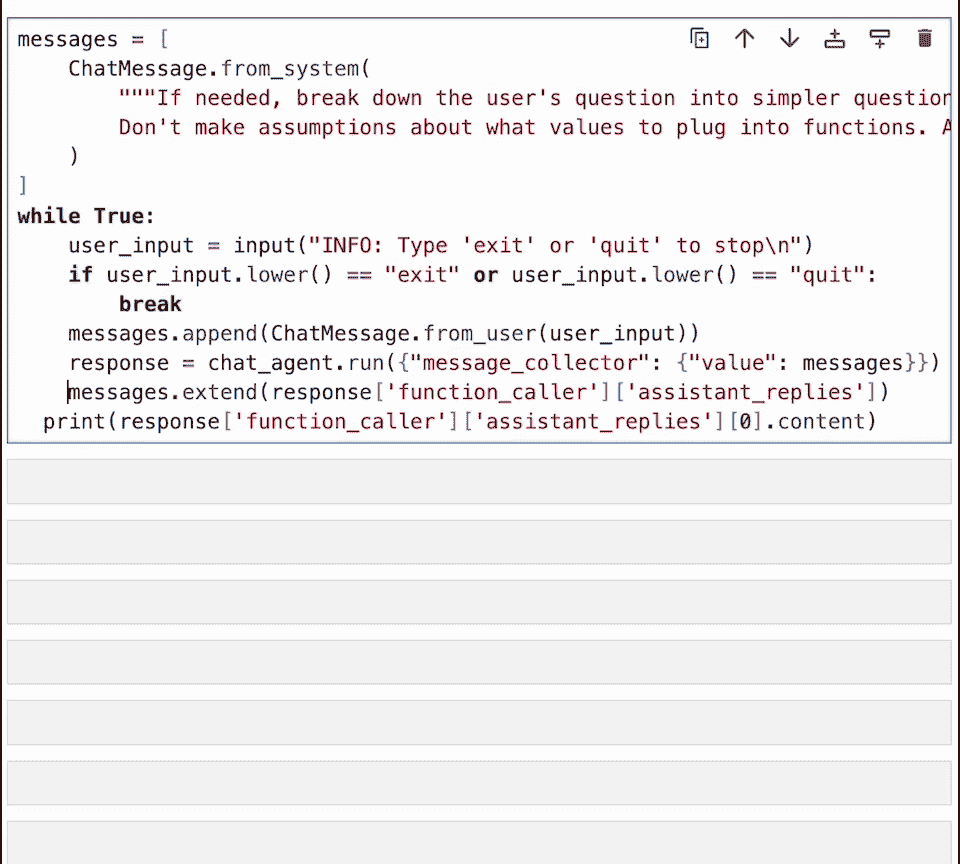

## 第七步：创建Gradio Web界面（可选）

为了使聊天代理更易于使用，我们可以使用Gradio快速创建一个Web界面。

```python
import gradio as gr

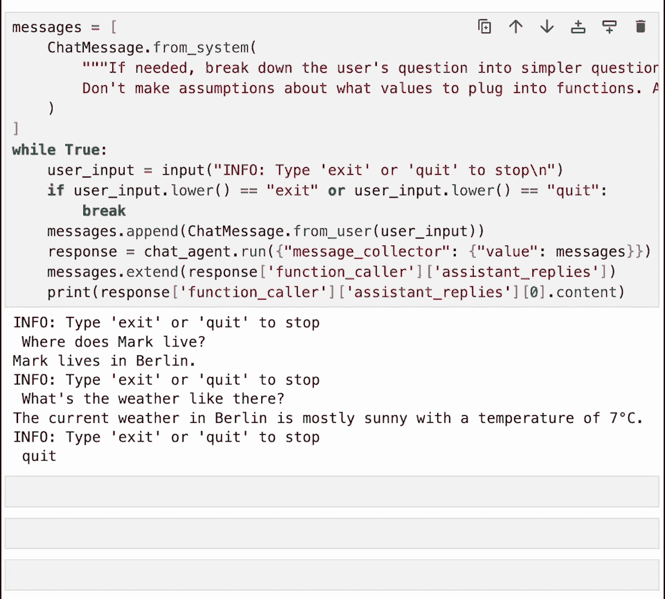

# 重用之前的消息列表和管道
demo_messages = [ChatMessage.from_system("如果需要，请将用户问题分解为更简单的问题。不要对要插入函数的值进行假设。")]

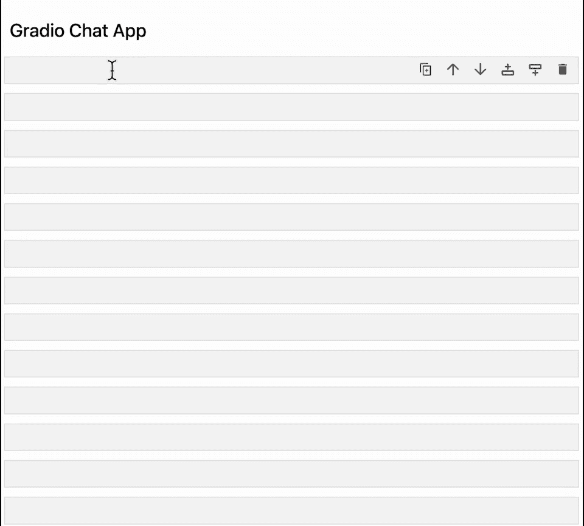

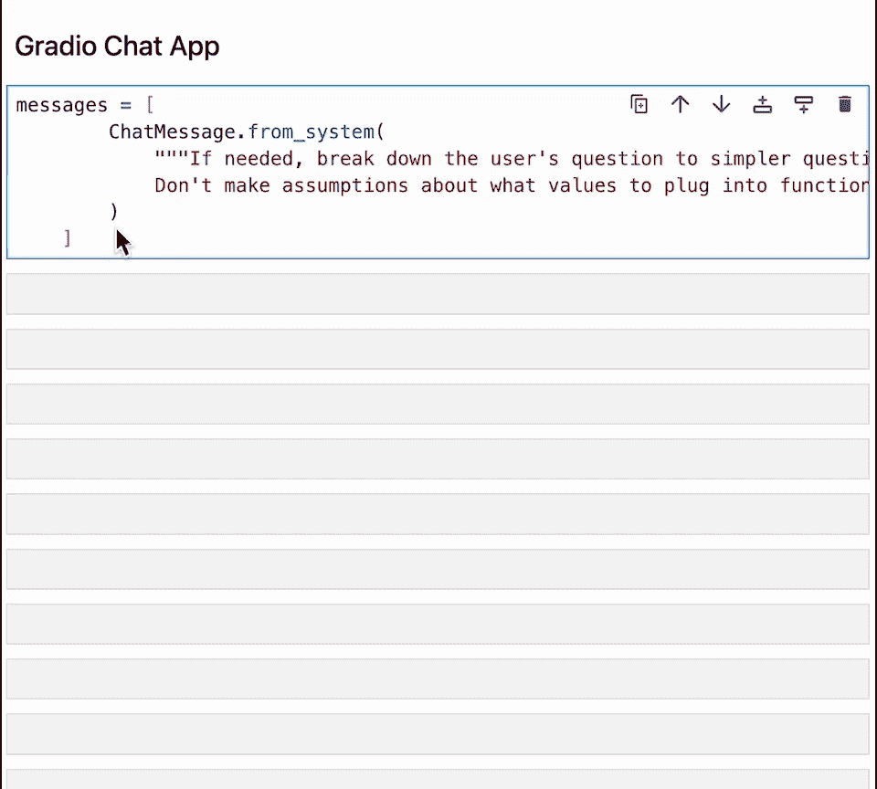

def chat_function(message, history):
    """Gradio聊天函数"""
    demo_messages.append(ChatMessage.from_user(message))
    result = chat_agent.run({"message_collector": {"value": demo_messages}})
    latest_reply = result.get("generator", {}).get("replies", []) or result.get("function_caller", {}).get("replies", [])
    if latest_reply:
        assistant_message = latest_reply[-1]
        demo_messages.append(assistant_message)
        return assistant_message.content
    return "抱歉，我没有收到回复。"

# 创建Gradio界面
demo = gr.ChatInterface(
    fn=chat_function,
    title="Haystack 智能聊天代理",
    examples=["马克住在哪里？", "那里的天气怎么样？", "他今天适合穿什么衣服？"]
)

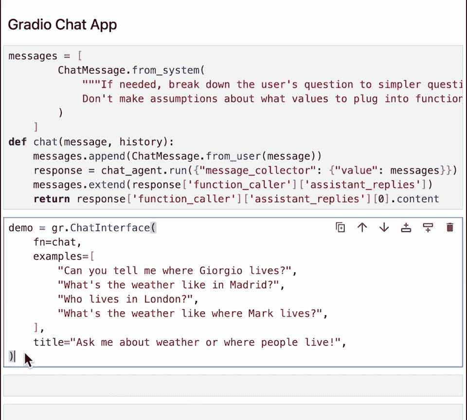

# 启动应用
if __name__ == "__main__":
    demo.launch()
```

---

## 总结

在本节课中，我们一起学习了如何构建一个使用函数调用的聊天代理。我们主要完成了以下工作：

1.  **创建工具函数**：将Haystack RAG管道和模拟天气API封装成可调用的Python函数。
2.  **描述工具**：按照OpenAI的规范，将函数描述为模型可以理解的“工具”。
3.  **配置核心组件**：使用`OpenAIChatGenerator`来集成工具，使用`OpenAIFunctionCaller`来执行函数调用。
4.  **构建代理管道**：通过`Pipeline`连接消息收集、生成、函数调用等环节，形成一个可以循环对话的智能体。
5.  **实现交互**：通过命令行循环和Gradio Web界面两种方式与代理进行交互。

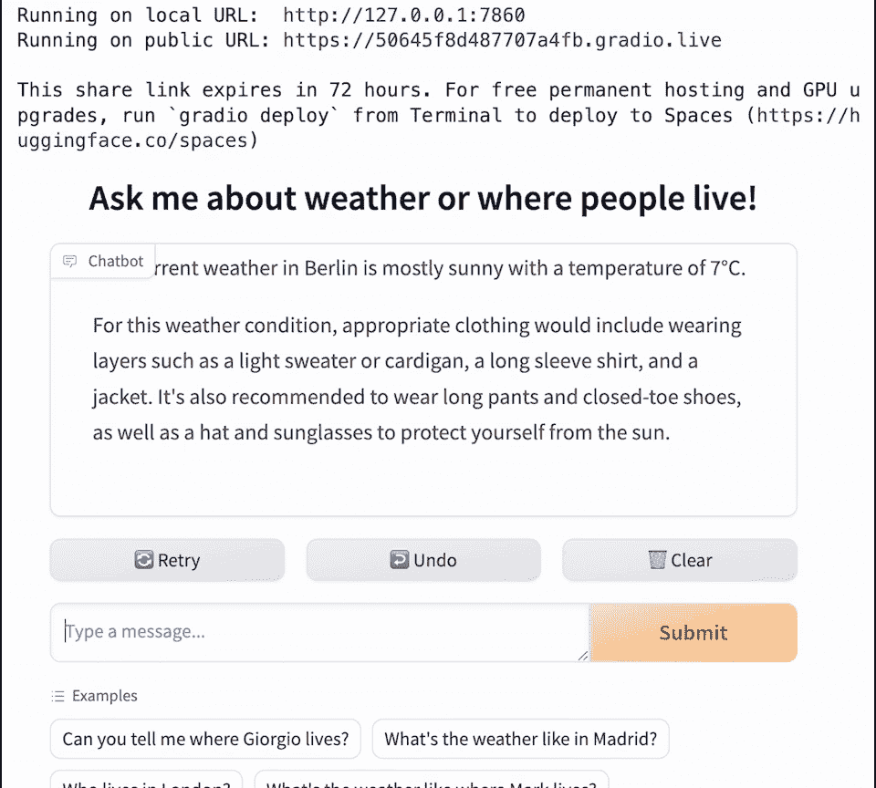

通过本节课，你掌握了利用Haystack和OpenAI函数调用构建复杂AI应用代理的核心方法。你可以尝试用真实的API替换模拟的天气函数，或者接入更复杂的自定义管道，从而扩展聊天代理的能力。