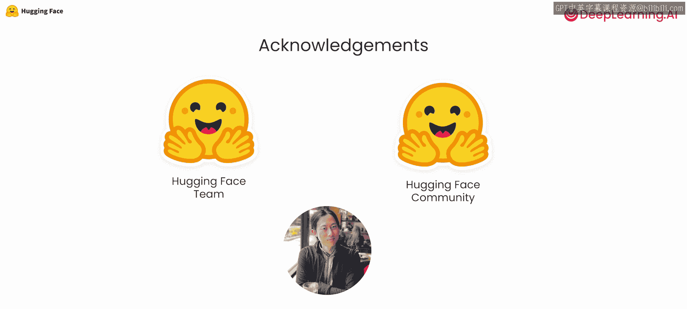

# 001：课程介绍 🎯

在本课程中，我们将学习如何利用Hugging Face平台上的开源模型，快速构建各种人工智能应用。课程内容涵盖文本、音频和图像处理，并教你如何将这些模型组合起来，实现更复杂的功能。

欢迎来到这门与Hugging Face合作打造的短期课程《拥抱开源模型》。得益于开源软件，如果你想构建一个AI应用，你可以从这里获取一个图像识别组件，从那里获取一个自动语音识别模型，再从其他地方获取一个大型语言模型，然后将它们快速串联起来，构建一个新的应用。

Hugging Face通过让众多开源模型易于获取，极大地改变了AI社区，使得任何人都能轻松做到这一点。这极大地加速了人们构建AI应用的过程。在本课程中，你将直接向Hugging Face团队学习如何做到这一点，并亲自构建很酷的应用，其速度可能比你之前想象的还要快。

例如，你将使用模型进行自动语音识别，将语音转录为文本，同时也会使用文本转语音模型，将文本转换为音频。这些模型与大型语言模型相结合，为你提供了构建自己的语音助手所需的基础模块。

你还会看到如何使用Hugging Face的Transformers库来快速预处理以及后处理机器学习模型的输出。例如，预处理音频，就像在我刚才提到的ASR或TTS示例中控制音频采样率一样，以及预处理或后处理图像和文本等数据。

利用开源组件快速构建应用的理念，已经成为AI应用构建方式的一次范式转变。在本课程中，你将亲自体验如何做到这一点。我很高兴向大家介绍本课程的讲师。

Eunice Valgoar是Hugging Face的一名机器学习工程师，他参与了开源团队的工作，涉足Hugging Face开发的许多开源工具的交集，例如Transformers、参数高效微调和TRL。

Markson同样是Hugging Face的一名机器学习工程师，也是开源团队的一员，他为Transformers库和Ace等库做出了贡献。

Maria haousoverva是Hugging Face的技术团队成员，她领导Hugging Face的教育项目，并致力于跨库协作，使机器学习对每个人来说都更容易上手。

Andrew，我们很高兴能与你和你的团队合作。

首先，你将使用开源大型语言模型创建自己的聊天机器人。你将使用来自Meta的开源大型语言模型，同样的代码也适用于更强大的开源大型语言模型，前提是你拥有更强大的硬件。你将使用开源模型将文本从一种语言翻译成另一种语言、总结文档以及计算句子嵌入，以便比较两个句子之间的相似性。

接下来，你将使用Transformers处理音频。

当你向语音助手询问天气预报时，你认为它可能执行哪些音频任务？它知道在你叫它的名字时被唤醒，这是分类任务。它将你的语音转换为文本来查找你的请求，这是自动语音识别。它向你回复，这是文本转语音。在本课程中，你将分类任意声音、转录语音录音以及从文本生成语音。

Transformers在计算机视觉中的应用非常丰富。你将学习如何检测图像中的物体，并将图像分割成称为语义区域的区域。例如，你可以应用此代码来检测图像中存在一只小狗，并分割出构成小狗耳朵的部分。

在你学会处理文本、音频和图像任务后，你可以将这些模型按顺序组合起来，以处理更复杂的流程。例如，如果你的应用想通过描述图像来帮助有视力障碍的人，你该如何实现？在本课程中，你将应用物体检测来识别图像中的物体，应用图像分类以文本形式描述这些物体，然后应用语音生成来叙述这些物体的名称。

你还会使用一个可以接受多种数据类型作为输入的模型，这些模型被称为多模态模型。例如，你将构建一个视觉问答应用，你可以向模型发送一张图像以及关于该图像的问题，然后你的应用可以根据图像返回该问题的答案。

你还将使用Gradio库将AI应用部署到Hugging Face Spaces上，这样任何人都可以通过互联网进行API调用来使用你的应用执行任务。

当然，所有这些示例的目标不仅仅是让你真正构建这些特定的例子，而是让你了解所有这些基础模块，以便你能够真正将它们组合成自己独特的应用。

许多人共同努力创建了这门课程。我要感谢Hugging Face方面，整个Hugging Face团队对课程内容的审核，以及Hugging Face社区对开源模型的贡献。来自DeepLearning.AI的Eddie Shu也为本课程做出了贡献。

在第一课中，你将学习如何在Hugging Face Hub上浏览数千个模型，为你的任务找到合适的模型，以及如何使用Transformers库中的pipeline对象开始构建你的应用。

这听起来非常令人兴奋。让我们进入下一个视频，开始学习吧。

---

本节课中，我们一起学习了本课程的整体目标和结构。我们了解到，通过Hugging Face平台，我们可以便捷地获取和使用各种开源AI模型，快速构建从文本处理、语音识别到计算机视觉的多样化应用。课程将引导我们从基础模块学起，最终学会组合这些模块，实现更复杂的多模态应用。