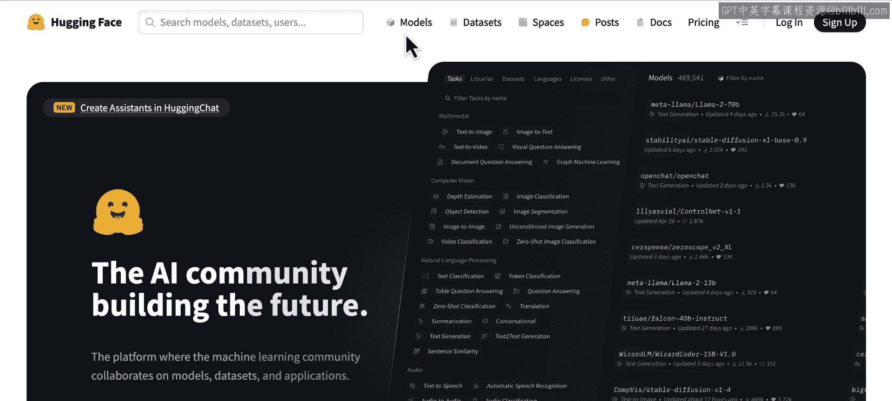
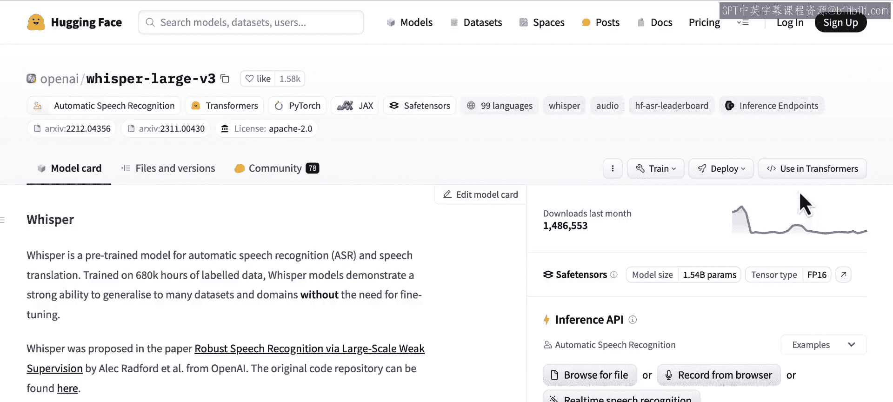
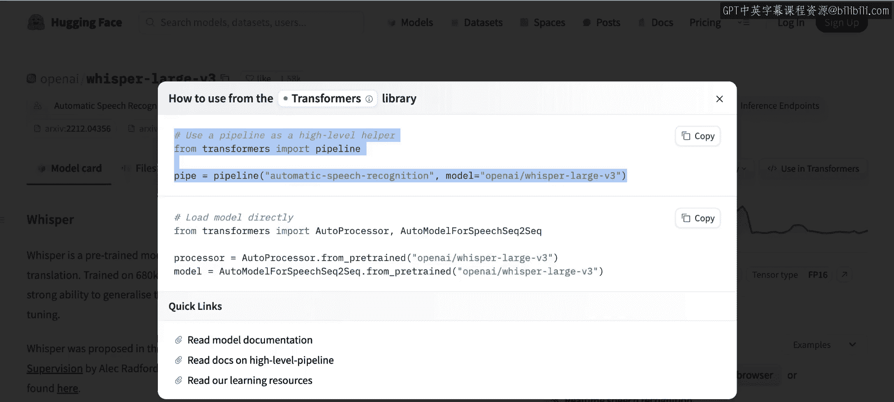

# 002：模型选择 🎯

在本节课中，我们将学习如何在Hugging Face Hub上从数千个开源模型中，为你的项目找到最合适的模型。我们将了解如何利用任务、语言、许可证等条件筛选模型，并学习如何评估模型的技术细节。

## 概述

如今，有数千个开源模型可供使用。每周都有许多新模型在Hugging Face Hub上发布。Hugging Face Hub是一个托管模型、数据集和机器学习演示（称为Spaces）的开放平台。那么，如何为你的项目找到所需的模型呢？让我们前往Hugging Face Hub一探究竟。

## 在模型页面筛选

在模型页面上，你可以找到适用于许多任务的模型。

这里的模型数量可能看起来令人不知所措。开始搜索时，一个好方法是先确定你在机器学习术语中正在处理的任务。在本课程中，你会看到许多任务示例。假设我想进行自动语音识别。

让我们从左侧面板中选择它。仍然有很多模型可供选择，但你可以进一步缩小搜索范围。假设你需要一个转录法语语音的模型。

你可以在这里选择语言。再假设你需要一个具有宽松许可证的模型。所谓宽松，是指允许你将模型用于大多数类型的应用程序（包括商业用途）的许可证。这会大大减少你的选项。

你可以按下载量排序，以找到该任务中常用的模型。或者，如果你想尝试社区最近热议的新模型，可以按趋势排序。

## 查看模型卡片

在选择一个模型之前，请查看它们的模型卡片。一份编写良好的模型卡片就像是模型的README文件。它包含大量有用信息，例如模型架构、训练方式、存在的局限性等等，正如你在这里看到的。

模型可以拥有不同参数数量的检查点。因此，我们说这种类型的模型有不同的尺寸。检查点指的是已保存的模型，包括预训练权重和所有必要的配置。我们常说加载一个模型，但从技术上讲，是加载一个模型检查点。

有些检查点有数千万个参数，另一些则有十亿或数十亿个参数。根据你的硬件，你可能无法运行最大的检查点。

## 估算内存需求

让我展示一个我用来估算运行模型所需内存的经验法则。我们转到“文件和版本”页面。

在这里，你可以找到一个名为 `pytorch_model.bin` 的文件。这个文件存储了模型的训练权重，你可以轻松看到它的大小。

将该大小乘以1.2（换句话说，增加20%），这大致就是你运行此模型所需的内存。

## 通过任务页面发现模型

现在让我快速展示另一种为任务、数据集或演示寻找模型的方法。让我们转到任务页面。

在这个页面上，你可以了解不同的机器学习任务。让我们选择一个我们感兴趣的任务。再次选择自动语音识别。

在这个页面上，你可以了解任务本身，这是发现你尚未接触过的机器学习任务的好方法。你还可以找到适用于此任务的模型建议、可以使用的数据集，以及可以试用执行此任务的模型的演示。

请注意，OpenAI的Whisper在这里被建议为首选。让我们回到模型页面。

## 使用Transformers库加载模型

要从Hugging Face Hub加载此模型，你可以使用Transformers库。注意“使用Transformers”按钮。

如果你点击它，你会找到两个有用的代码片段，展示如何加载模型检查点。在本课程中，你将使用 `pipeline` 对象来处理模型，如第一个示例所示。

`pipeline` 对象提供了一个高级抽象来解决任务。它还负责复杂的输入预处理，以匹配模型的期望。例如，一些音频模型期望输入音频以对数梅尔频谱图的形式提供。文本通常需要转换为所谓的标记，图像通常需要适当调整大小并进行归一化。使用 `pipeline`，你无需手动执行任何这些预处理步骤。

## 总结

现在你已经知道如何为你的任务寻找模型以及在哪里找到 `pipeline` 代码片段。让我们构建你的第一个应用程序。我们进入下一课。

