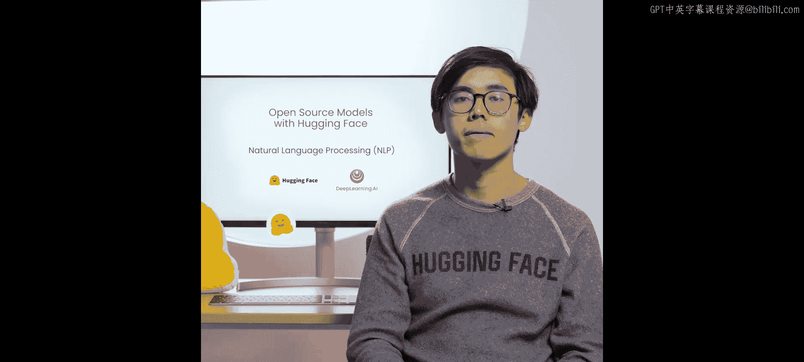
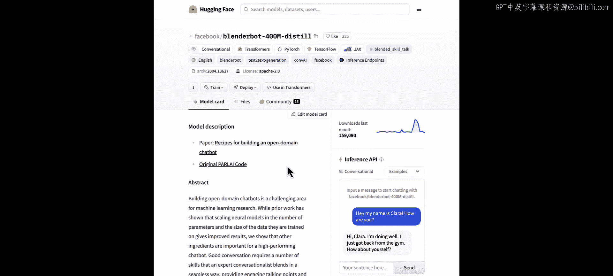
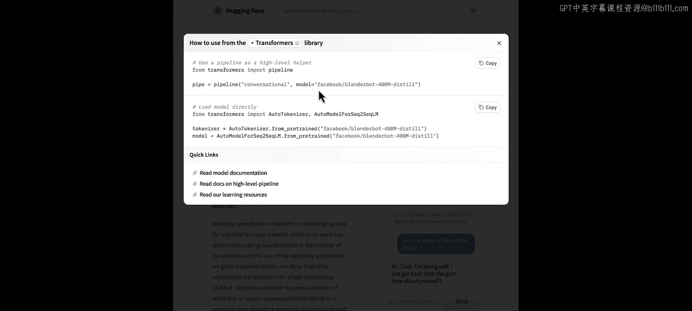
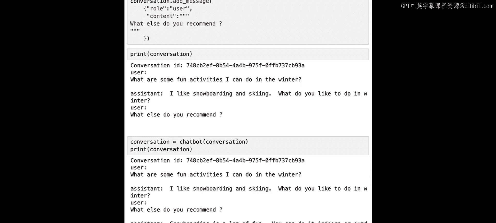

# 003：3.nlp.zh - 使用开源模型构建聊天机器人 🤖

在本节课中，我们将学习如何使用 Hugging Face Transformers 库来执行自然语言处理任务。具体来说，我们将构建一个自己的聊天机器人，使用一个由 Meta 开发的开源模型。我们将从了解 NLP 的基本概念开始，逐步学习如何使用 `pipeline` 函数，并探索如何为不同任务选择合适的模型。



---

## 什么是自然语言处理？ 📖

上一节我们介绍了课程目标，本节中我们来看看自然语言处理（NLP）的定义。NLP 是一个结合了语言学和机器学习的领域，其核心关注点是与人类语言相关的一切。自 2017 年著名论文《Attention Is All You Need》提出 Transformer 架构以来，该领域取得了显著进展。如今，Transformer 架构已成为许多先进机器学习模型的核心。

在本课程中，我们将使用 Transformers 库，特别是其中的 `pipeline` 函数。

## 开始使用 Transformers 库 🚀

首先，我们需要导入必要的函数。如下所示，我们从 `transformers` 库中导入了 `pipeline` 函数。

```python
from transformers import pipeline
```

对于本课程环境，相关库已预先安装。如果你在自己的机器上运行，可以通过运行以下命令来安装 Transformers 库（此处无需执行，故注释掉）：

```python
# pip install transformers
```

现在，我们已经具备了创建聊天机器人所需的一切。

## 创建聊天机器人 💬

以下是创建聊天机器人的步骤：

我们使用来自 Facebook（现 Meta）的 `Blenderbot` 模型创建了一个对话管道。

我们选择这个模型的主要原因是它体积小且性能良好，仅需 1.6 GB 内存即可加载。由于本课程环境只有 4 GB 可用内存，我们无法使用 Llama 等其他大型模型。

```python
chatbot = pipeline(“conversational”, model=“facebook/blenderbot-400M-distill”)
```

`pipeline` 函数的第一个参数是任务类型，这里我们传入 `“conversational”`。第二个参数是需要加载的模型，我们指定了 Facebook 的模型。

现在聊天机器人已加载完成，让我们传递一条用户消息。我们将询问聊天机器人：“冬天有哪些有趣的活动可以做？”

为了将用户消息传递给聊天机器人，我们首先需要将其放入一个 `Conversation` 对象中。因此，让我们导入这个对象。

```python
from transformers import Conversation
```

你只需要将用户消息放入 `Conversation` 对象中，然后将整个对话对象传递给聊天机器人。

```python
conversation = Conversation(“What are some fun activities I can do in the winter?”)
conversation = chatbot(conversation)
print(conversation.generated_responses[-1])
```

如你所见，助手回复道：“我喜欢滑雪和单板滑雪。你冬天喜欢做什么？” 你可以自由更改用户消息，例如询问关于生日的点子、夏天可以做的事情，或者任何你想问聊天机器人的问题。

## 探索其他 NLP 任务 🔍

现在让我们退一步，回顾一下你可以使用开源模型执行的其他 NLP 任务。你将看到如何搜索 Hugging Face Hub 来为各种任务寻找合适的模型。

NLP 有许多应用。你一定听说过 OpenAI 的 ChatGPT，或者其开源替代品 Hugging Chat，后者允许用户选择任何开源语言模型（如 Llama 2 或 Mistral）进行对话。NLP 也存在于我们日常使用的许多工具中，例如文档中的自动补全、翻译工具，甚至垃圾邮件过滤器。

NLP 包含许多任务。在接下来的几节课中，你将学习其中几个，但也可以自行尝试其余任务。

以下是几个主要的 NLP 任务：
*   **文本生成**：用于构建聊天机器人的任务。
*   **句子相似度**：判断两个句子的语义相似度。
*   **文本摘要**：将长文档浓缩为简短摘要。
*   **机器翻译**：将文本从一种语言翻译成另一种语言。

## 如何选择合适的模型？ 🧐

一个关键问题仍然存在：我们应该选择哪个模型？有如此多的开源模型可供选择。

要浏览模型，你可以使用 Hugging Face Hub。我将展示我如何为我们的对话管道选择 Facebook 的模型。





1.  访问 Hugging Face Hub 的模型板块。
2.  添加过滤器，选择“对话”任务。对话任务是指根据提示生成相关、连贯且知识丰富的对话文本，该模型可用于聊天机器人和语音助手。
3.  默认情况下，模型按趋势排序。我们可以将其改为“最多点赞”。
4.  可以看到有很多不同的模型。由于课程环境只有 4 GB 内存，我们需要选择一个较小的模型。
5.  第二个模型（`facebook/blenderbot-400M-distill`）似乎是一个很好的选择，因为它只有 4 亿参数，体积相当小。我们看到它被下载了很多次，并且有很多点赞。
6.  我们可以点击进入“文件”选项卡，看到模型大小仅为 730 MB。
7.  点击“使用 Transformers”可以学习如何加载它。这个命令对你来说应该很熟悉，它告诉我们要使用 `pipeline` 对象，指定对话任务，并通过在此处填入模型名称来加载模型。

## 处理多轮对话 💭

现在，让我们尝试进行多轮对话。例如，接着问聊天机器人：“你还有其他推荐吗？”

如果我们简单地创建一个包含新问题的新对话对象，助手给出的答案将与之前的冬季活动对话无关，因为它不记得早先的对话。

正确的方法是向现有的对话对象中添加新消息。大语言模型本身不会自然记住你之前的消息，但当你使用 `Conversation` 对象时，你可以添加后续消息。该对象会保存你之前的提示以及 LLM 的回复，从而使 LLM 能够像记得早先对话一样与你交流。

让我们试一下：

```python
conversation.add_user_input(“What else do you recommend?”)
conversation = chatbot(conversation)
print(conversation.generated_responses[-1])
```

如你所见，助手的回答显示出对之前关于冬季活动的对话有一定的记忆。由于模型非常小，回答可能不够深入。如果你有足够的硬件来运行它们，有许多先进的开源模型可以表现得相当出色。

## 了解开源模型生态 🌐

在 Hugging Face，我们有一个开放大语言模型排行榜，使用户和公司能够评估开源 LLM 和聊天机器人。让我们看看哪些聊天机器人表现最好。我们首先只选择预训练模型（即从头开始训练的模型）。

排行榜顶部的模型大多来自大公司，因为并非每个人都有能力训练这些大型模型。你可以看到一些熟悉的名字，例如新的 Mixtral 模型、Falcon 模型、Yi 模型和 Qwen 模型。

围绕这个排行榜存在很多讨论，人们怀疑所选的基准测试是否能代表模型的真实性能。我们知道它们并不完美，但我们会不断增加更多基准测试，以便能够公平地评估所有模型。

如果你想查看另一个排行榜，可以看看 Chatbot Arena 排行榜。该排行榜收集了超过 20 万次人类偏好投票，使用 Elo 排名系统对 LLM 进行排序。排行榜中包含 GPT-4 等专有模型，但正如你在列表中看到的，开源模型也正在快速追赶专有模型。

例如，列表中的 Mixtral 模型采用 Apache 2.0 许可证，这意味着它允许你使用、修改和分发该模型，也可以将其用于商业用途。

---

## 总结 📝

本节课中，我们一起学习了自然语言处理的基础概念，并使用 Hugging Face Transformers 库的 `pipeline` 函数，基于 Meta 的 `Blenderbot` 模型构建了一个简单的聊天机器人。我们探讨了如何为特定任务（如对话）在 Hugging Face Hub 上选择合适的模型，并学习了如何使用 `Conversation` 对象来处理多轮对话，使模型能够保持一定的对话上下文。最后，我们简要了解了当前开源大语言模型的生态和评估方式。



在下一节课中，我们将学习如何总结长文档以及将文本从英语翻译成法语。