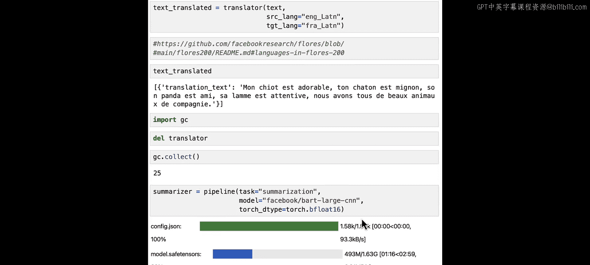
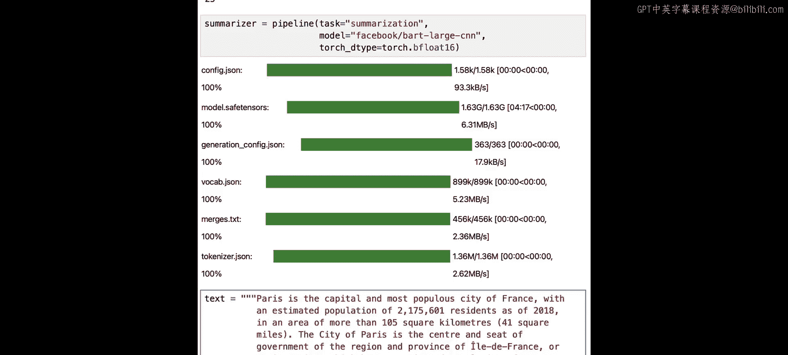
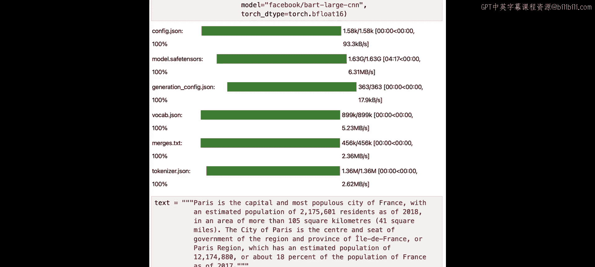
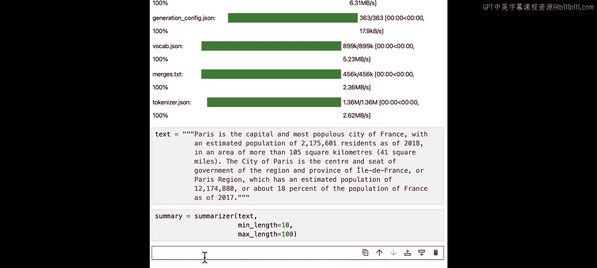
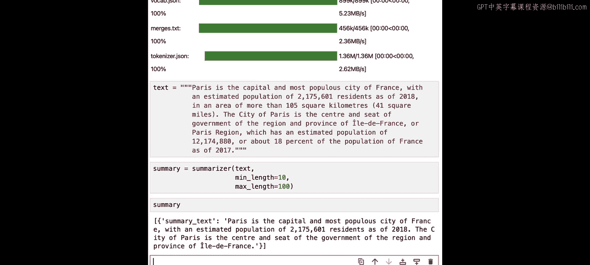

# 004：翻译与摘要 📚

在本节课中，我们将学习如何使用Hugging Face的开源模型完成两项核心任务：**文本翻译**和**文档摘要**。我们将使用Meta公司发布的模型，将英文文本翻译成法文，并对长文档进行内容总结。


## 环境准备与库导入 🛠️

开始之前，需要确保必要的库已安装。在本课程环境中，这些库已预先安装好。如果您在自己的机器上运行，需要手动安装。

以下是需要安装的库：
*   **Transformers库**：`pip install transformers`
*   **PyTorch库**：`pip install torch`

由于课程环境已就绪，我们直接导入所需的函数。

```python
# 导入pipeline函数和torch
from transformers import pipeline
import torch
```

## 文本翻译 🌐

上一节我们导入了核心工具，本节中我们来看看如何构建一个翻译器。

首先，我们使用 `pipeline` 函数创建一个翻译管道。需要指定任务类型、模型，并为了高效运行，设置模型的数据类型。

```python
# 创建翻译管道
translator = pipeline(
    task="translation", # 指定任务为翻译
    model="facebook/nllb-200-distilled-600M", # 使用Meta的NLLB模型
    torch_dtype=torch.bfloat16 # 使用bfloat16数据类型压缩模型，保持性能
)
```

这里使用的模型是Meta的 **NLLB（No Language Left Behind）**，它支持**200种**不同语言之间的翻译。设置 `torch_dtype=torch.bfloat16` 可以在几乎不损失精度的情况下减少模型内存占用。

现在翻译器已加载，可以开始翻译文本了。

以下是翻译的步骤：
1.  准备要翻译的英文文本。
2.  调用翻译器，指定源语言和目标语言。

```python
# 定义要翻译的文本
text_to_translate = "Hello, my name is LLaMA. I'm a helpful AI assistant created by Meta AI."

# 执行翻译
translated_text = translator(text_to_translate, src_lang="eng_Latn", tgt_lang="fra_Latn")

# 查看翻译结果
print(translated_text[0]['translation_text'])
```

代码中，`src_lang="eng_Latn"` 表示源语言是英文，`tgt_lang="fra_Latn"` 表示目标语言是法文。每种语言都有特定的代码，可以在相关文档中查找。

执行后，文本被成功翻译成法文。您可能会注意到某些翻译细节（如专有名词“LLaMA”）可能不够完美，这展示了当前模型的能力与局限。

**建议您在此暂停视频，尝试翻译自己的文本或更换其他目标语言进行实验。**

完成翻译任务后，为了释放内存以进行下一项任务，我们清理当前模型。

```python
import gc

# 删除翻译器以释放内存
del translator
gc.collect() # 调用垃圾回收
```

## 文档摘要 📄

我们已经学会了翻译，接下来看看如何用管道轻松实现文档摘要。

创建摘要管道与翻译类似，只需更改任务和模型。



```python
# 创建摘要管道
summarizer = pipeline(
    task="summarization", # 指定任务为摘要
    model="facebook/bart-large-cnn", # 使用Meta的BART-large-CNN模型
    torch_dtype=torch.bfloat16 # 同样使用bfloat16压缩模型
)
```

这里我们使用了Meta的 **BART-large-CNN** 模型，它特别擅长生成文本摘要。

现在，让我们对一段关于巴黎的长文本进行总结。



```python
# 定义长文本
long_text = """
Paris is the capital and most populous city of France. It is located on the Seine River in the north of the country. Known as the ‘City of Light’, Paris is famous for its art, culture, and history. Major landmarks include the Eiffel Tower, the Louvre Museum (home to the Mona Lisa), and the Notre-Dame Cathedral. The city is also a global center for fashion, gastronomy, and luxury goods. Paris hosts numerous international organizations such as UNESCO. With its charming streets, cafes, and vibrant cultural life, it remains one of the world's top tourist destinations.
"""



# 执行摘要生成
summary = summarizer(long_text, max_length=100, min_length=10)[0]['summary_text']

# 查看摘要结果
print(summary)
```

在调用摘要器时，我们通过 `max_length` 和 `min_length` 参数控制了摘要的长度范围，使输出更加精炼。



模型生成了一段简洁的摘要，概括了原文关于巴黎的核心信息。

**鼓励您在此暂停，尝试从网上找一些文章或长邮件，用这个管道进行摘要实践。**

## 课程总结 🎯

本节课中我们一起学习了如何使用Hugging Face的`pipeline`接口快速实现两大实用NLP任务：
1.  **文本翻译**：利用Meta的NLLB模型，在多种语言间进行翻译，并了解了如何指定语言代码和控制模型精度。
2.  **文档摘要**：利用Meta的BART-large-CNN模型，将长文档浓缩为简洁的摘要，并掌握了控制摘要长度的方法。



这些任务展示了开源预训练模型的强大能力，只需几行代码即可投入应用。在下一节课中，我们将探索如何**测量两个句子之间的相似度**，这是一个在信息检索、问答系统中非常有用的任务。