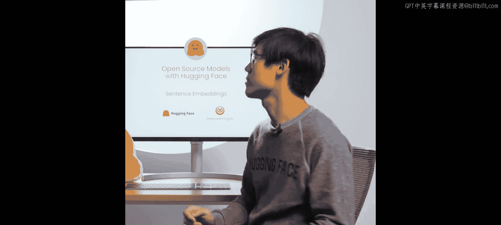
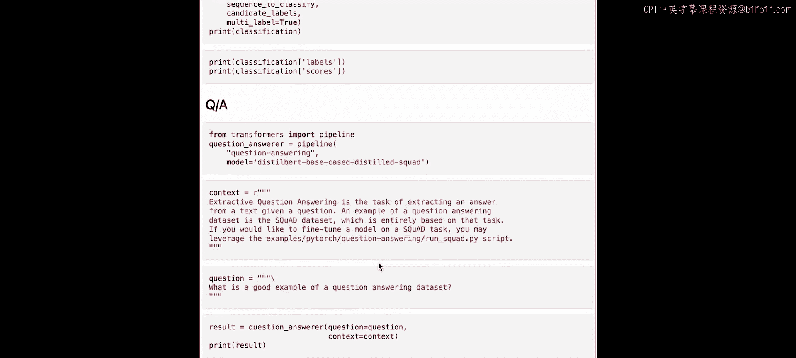

**Hugging Face开源模型课程：P5：句子嵌入与相似度计算**

在本节课中，我们将学习如何使用 `sentence-transformers` 库来测量句子之间的相似度。句子相似度衡量的是两段文本在语义上的接近程度。这在信息检索、文本聚类或分组等任务中非常有用。

---

### **加载库与模型**


首先，我们需要加载必要的库和模型。在本课程环境中，相关库已预先安装。如果你在自己的机器上运行，可以通过 `pip install sentence-transformers` 命令进行安装。



我们从 `sentence-transformers` 库中导入 `SentenceTransformer` 类。这个类允许你加载多种预训练模型。

```python
# 导入SentenceTransformer类
from sentence_transformers import SentenceTransformer
```

要加载一个特定的模型，只需将模型名称传递给 `SentenceTransformer` 类。本节课我们将使用 `all-MiniLM-L6-v2` 模型来计算句子相似度。这个模型是2021年Hugging Face与谷歌组织的“社区周”活动中，由开源社区训练出来的成果之一。

```python
# 加载预训练模型
model = SentenceTransformer('all-MiniLM-L6-v2')
```

---

### **将句子编码为向量（嵌入）**

句子相似度模型的核心功能是将输入的文本转换为向量，也称为“嵌入”。这些嵌入向量能够捕捉文本的语义信息。

让我们来编码第一组句子：

```python
# 定义第一组句子
sentences1 = [
    "The cats sit outside",
    "A man is playing guitar",
    "The movies are awesome"
]

# 将句子编码为向量，并确保输出为张量格式
embeddings1 = model.encode(sentences1, convert_to_tensor=True)

# 打印嵌入向量
print("第一组句子的嵌入向量：")
print(embeddings1)
```

如你所见，我们成功地将文本转换成了数值向量。

现在，我们对第二组句子进行同样的操作：

```python
# 定义第二组句子
sentences2 = [
    "The dog plays in the garden",
    "A woman watches TV",
    "The new movie is so great"
]

# 编码第二组句子
embeddings2 = model.encode(sentences2, convert_to_tensor=True)

print("\n第二组句子的嵌入向量：")
print(embeddings2)
```

---

### **计算句子相似度**

上一节我们成功将句子转换成了向量。本节中，我们来看看如何计算这些向量之间的相似度。我们将使用**余弦相似度**作为衡量标准，它计算的是两个向量在方向上的接近程度。

首先，我们需要从 `sentence-transformers` 库中导入用于计算相似度的工具函数。

```python
# 导入相似度计算工具
from sentence_transformers import util
```

计算相似度非常简单，只需调用 `util.cos_sim` 函数并传入两组嵌入向量即可。

```python
# 计算两组句子嵌入之间的余弦相似度
cosine_scores = util.cos_sim(embeddings1, embeddings2)

print("句子相似度矩阵：")
print(cosine_scores)
```

输出的矩阵显示了第一组中每个句子与第二组中每个句子的相似度得分。矩阵对角线上的元素，分别对应着两组列表中位置相同的句子之间的相似度。

为了更清晰地查看配对结果，我们可以按对输出得分：

```python
# 遍历所有句子对，打印相似度得分
for i in range(len(sentences1)):
    for j in range(len(sentences2)):
        print(f"句子1: \"{sentences1[i]}\"")
        print(f"句子2: \"{sentences2[j]}\"")
        print(f"相似度得分: {cosine_scores[i][j]:.2f}\n")
```

---

### **结果分析**

以下是配对分析的结果：
*   **“The cats sit outside” 与 “The dog plays in the garden”**：得分约为 **0.28**。这表明两个句子存在一定的相似性，模型可能捕捉到了“猫”和“狗”都是宠物以及“外面”和“花园”都是户外场所的语义关联。
*   **“A man is playing guitar” 与 “A woman watches TV”**：得分非常低（接近0）。这符合预期，因为这两个句子描述的是完全不同的活动，几乎没有语义重叠。
*   **“The movies are awesome” 与 “The new movie is so great”**：得分约为 **0.65**。这是正确的，因为这两个句子都表达了对电影的积极评价，含义高度相似。

---

### **总结**



本节课中，我们一起学习了如何使用 `sentence-transformers` 库进行句子相似度计算。我们首先加载了一个预训练的句子嵌入模型，然后将文本句子编码为语义向量，最后通过计算余弦相似度来量化句子之间的语义接近程度。你可以尝试使用这个工具完成其他任务，例如文本分类、零样本分类或问答。让我们继续下一节课的学习。