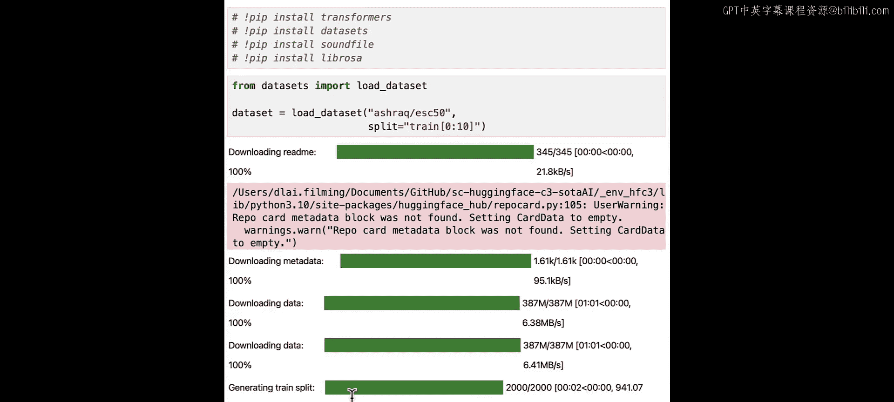
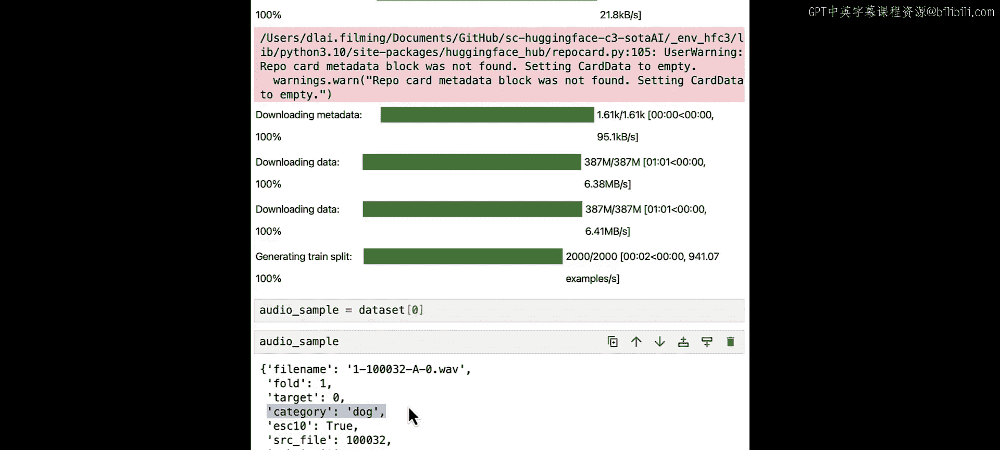
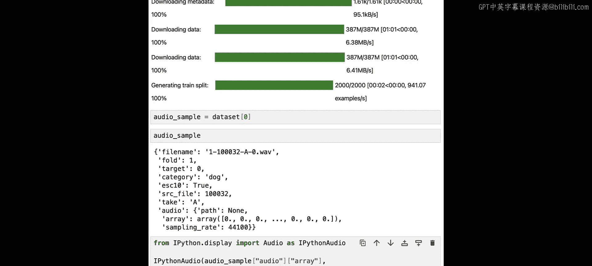
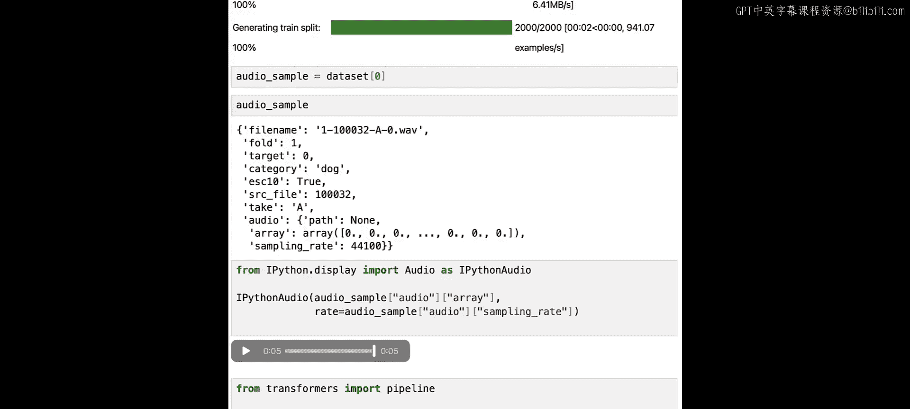
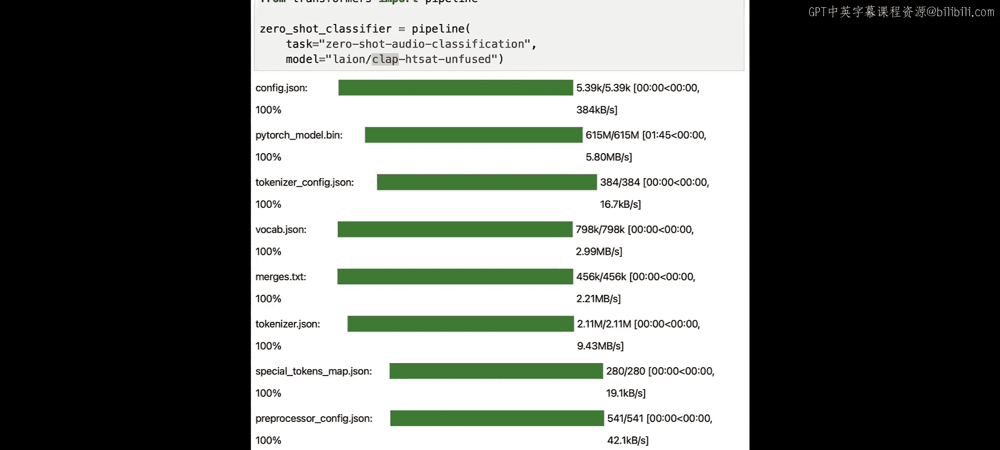
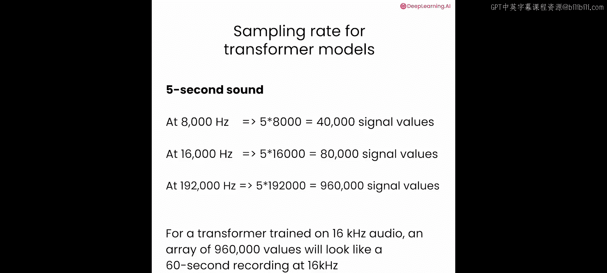
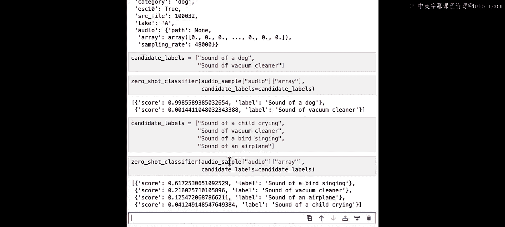
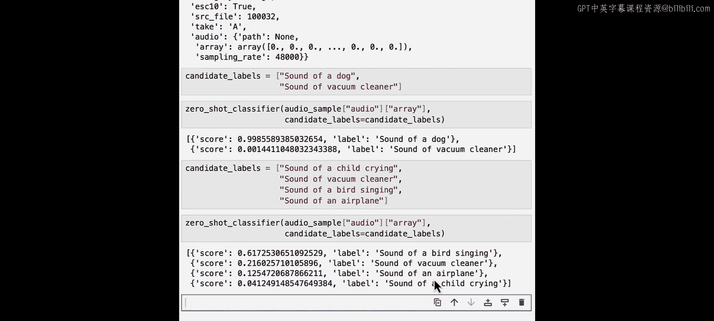

# 006：零样本音频分类 🎵

在本节课中，我们将学习如何构建一个无需微调的音频分类器。我们将使用Hugging Face的CLAP模型，通过比较音频与文本标签的相似度，来识别声音的类别。这种方法特别适用于没有针对特定类别进行过训练的模型场景。

音频分类有许多应用场景。例如，你可能想识别某人正在说的语言，或者想知道你所在区域有哪些鸟类。

## 音频分类的传统挑战

让我们构建一个声音分类器，但传统分类方法存在一个限制。在传统分类中，模型从一个预定义的、它训练过的类别集合中预测标签。如果没有针对你特定类别集合训练过的模型，你就必须收集数据集并微调一个模型。

在这里，你将使用一种不需要微调的替代方法。

## 准备环境与数据

对于这个课堂环境，所需的库已经为你安装好了。如果你在自己的机器上运行，可以通过运行以下命令来安装 `transformers`、`datasets` 和其他必需的库。我将把它们注释掉，因为它们在这里已经安装了。

我们需要一个声音来进行分类。所以，让我们从Hugging Face Hub加载一个音频数据集。ESC50数据集是一个包含5秒环境声音的带标签集合，例如动物和人类发出的声音、自然声音、室内声音、城市噪音等。你不需要整个数据集，所以我们只加载几个示例。

这个示例被标记为“狗”。所以它很可能是一段狗叫的录音，让我们听一下。

听起来像狗叫声。接下来，让我们构建分类流程。

## 构建分类流程

对于这种音频分类，你将需要一个预训练的CLAP模型。目前，它是可用于此任务的唯一一种架构，因此你可以在Hugging Face Hub上通过筛选特征提取、多模态任务，然后按名称“clap”来找到它。

为了对你的音频示例进行分类，你只需要音频数据的数组。然而，示例必须具有模型期望的采样率。让我们退一步谈谈采样率。

## 理解采样率

声波是一个连续信号。这意味着在给定时间内它包含无限数量的信号值，但你的计算机可以处理的音频是一系列离散值，称为数字表示。

为了获得连续音频信号的数字表示，我们首先用麦克风捕获声音。然后模拟信号被转换为电信号。接着，电信号被采样以获得数字表示。

采样意味着在固定的时间步长测量连续信号的值。结果，采样后的波形是离散的，在均匀间隔处具有有限数量的值。

数字化音频的一个非常重要的特性是采样率。它是一秒钟内采集的样本数，以赫兹或千赫兹为单位测量。例如，8千赫兹是电话或对讲机中音频的采样率；16千赫兹是足以清晰捕捉人类语音而不显得沉闷的采样率；192千赫兹的采样率是你可以从专业高保真音频录制设备中预期的。

## 采样率对AI模型的重要性

但为什么采样率在处理AI模型时很重要？考虑一个例子：一个5秒的声音，采样率为8千赫兹，将被表示为40,000个信号值的序列。相同的5秒声音样本在16千赫兹下将表示为80,000个信号值的序列，而在192千赫兹下，它将用近一百万个值表示。

对于Transformer模型，这三个数组非常不同。Transformer模型将输入视为序列，并依赖注意力机制来学习音频表示。它们在所有示例都具有相同采样率的数据集上进行训练，并且不能很好地泛化到其他采样率。因此，对于一个在16千赫兹音频上训练的Transformer模型，一个用近百万个值表示的高质量5秒音频，看起来会像一段60秒的录音。

## 回到代码：处理采样率

让我们回到代码。如果一个Transformer模型是用每个都以48千赫兹采样率录制的音频样本训练的，那么它将把任何输入都视为以相同采样率录制的。所以，让我们拿一个以192千赫兹采样率录制的1秒声音。代表该声音的数组将有多少个值？

192,000个值。但如果我们采用一个在16千赫兹采样率的音频示例上训练的模型，它会将其视为1秒还是更长？让我们看看。模型将看到192,000个值。它期望1秒包含16,000个值。所以对于这个模型，录音看起来像是12秒。

那么，如果我们现在有一个5秒的高清录音（即192千赫兹），而模型是在16千赫兹的音频样本上训练的，这个5秒的高清录音对这个模型来说看起来有多长？我们有5秒乘以每秒192,000个值。所以这个样本将是一个960,000个值的数组。模型期望每秒包含16,000个值。让我们将我们拥有的值数量除以16,000。这样，我们就能看到模型会认为这个示例是多少秒。

如你所见，原始声音只有5秒，但每秒有很多样本。然而，对于一个以较低采样率训练的模型，这个确切的音频看起来像一段60秒的录音。

## 调整数据采样率

现在让我们回到我们的任务，检查本课中模型期望的采样率。我们可以从流程中获取此信息。所以这个模型是在以48千赫兹录制的音频示例上训练的。让我们检查我们示例的采样率。

在这种情况下，采样率的差异不大，模型可能表现尚可。但情况并非总是如此，正如你在其他示例中将看到的那样。所以，让我们看看在使用datasets库加载数据集时，如何自动将整个数据集转换为正确的采样率。

让我们再次检查第一个采样。现在它具有与模型相同的采样率。当你以这种方式加载数据集时，所有音频示例都将具有正确的采样率。

## 使用CLAP模型进行分类

现在音频样本已准备好供模型使用。然而，你还需要为流程提供候选标签。CLAP同时接受音频和文本作为输入，并计算两者之间的相似度。如果你传递与音频输入强相关的文本输入，你将获得高相似度分数。相反，传递与音频输入完全无关的文本输入将返回低相似度分数。

所以，让我们定义一些候选标签来与样本进行比较。

将音频样本和候选标签传递给流程，看看哪个标签最有可能。

现在尝试两个以上的候选标签，然后尝试一些完全无关的标签。看看你是否能对这种方法的局限性有一些直观理解。

让我们尝试一些完全无关的标签。我们将使用相同的流程和相同的音频样本。记住，那是一段狗叫声。

如你所见，候选标签现在与狗或叫声无关。然而，模型仍然试图在给定的选项中找出最合理的标签。

## 总结与下节预告

在本节课中，我们一起学习了零样本音频分类。我们了解了采样率的重要性，以及如何将音频数据调整到模型期望的采样率。我们使用了Hugging Face的CLAP模型，通过比较音频与一系列文本标签的相似度来对声音进行分类，而无需对模型进行任何微调。这种方法为快速原型设计和探索性任务提供了便利。

在下一课中，我们将进行自动语音识别。