# 007：使用Hugging Face进行语音转文字 📝

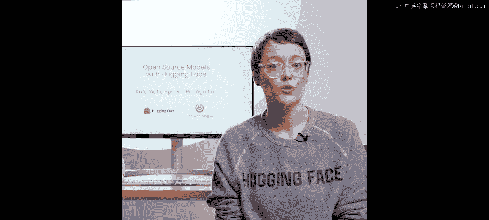

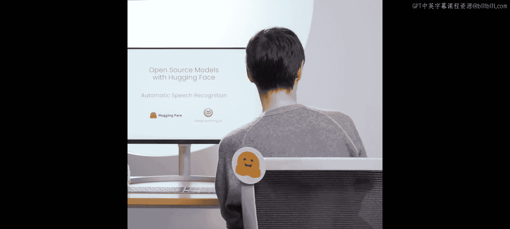

在本节课中，我们将学习自动语音识别任务。你将了解如何使用Hugging Face库和OpenAI的Whisper模型，将语音录音转录为文本。我们还将构建一个简单的转录演示应用。

自动语音识别是一项将语音录音转录为文本的任务。例如，会议记录或自动生成视频字幕。对于此任务，你将学习使用OpenAI的Whisper模型。

## 加载语音数据集 🗣️

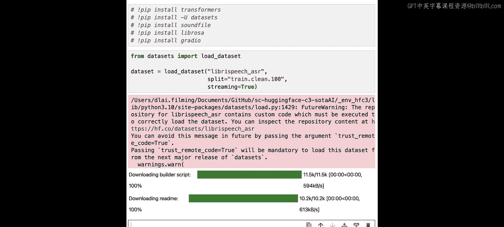

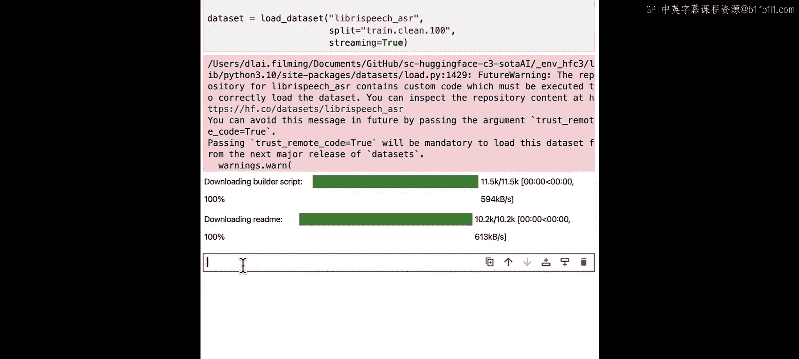

与之前一样，所有必要的库都已为你安装好。但如果你在自己的机器上运行，则需要与之前相同的库集，外加音频接口。这次我们加载LibriSpeech数据集。这是一个包含约1000小时数据的语料库，数据来源于有声读物朗读。

音频数据集通常非常大，因此了解如何以流模式加载它们很有用。这样，示例将根据需要逐个加载。对于流式数据集，你可以逐个访问示例，这是获取第一个示例的方法。

顺便说一下，如果你想访问多个示例，例如前五个，可以使用`take`函数。在此列表中，你可以使用索引访问各个示例。你可以选择你喜欢的任何示例，但现在我们坚持使用第一个。与之前一样，你只需要此示例的音频部分。让我们听一下这段叙述。

## 选择与加载模型 🤖

Hugging Face Hub上有数千个用于自动语音识别的预训练模型。你可以通过选择自动语音识别任务来找到它们。然而，OpenAI的Whisper仍然是此任务的最佳模型之一。Whisper在大量带标签的音频转录数据上进行了预训练，准确地说，是68万小时。更重要的是，其中11.7万小时的预训练数据是多语言或非英语的。这产生了可应用于超过96种语言的检查点。这里为了效率，我们将使用模型的蒸馏版本，该版本仅适用于英语。所谓蒸馏，是指使用完整Whisper模型的响应进行训练的较小模型。此检查点比大模型小10倍以上，快5倍，且单词错误率在大模型的3%以内。

与之前一样，让我们检查Whisper期望的采样率。

现在，让我们看看示例的采样率是多少。这次它们相同，所以我们可以将音频原样传递给流水线。它成功了。现在让我们将其与示例附带的转录进行比较。

请注意，与示例附带的转录不同，Whisper返回的转录带有正确的大小写和标点符号，这使得它更容易阅读。

## 构建转录演示应用 🎤

现在，让我们构建一个简单的转录演示，我们将为此使用Gradio。让我们创建一个`transcribe_speech`函数，它将作为我们流水线的包装器。

接下来，你可以创建一个选项卡式界面，其中一个选项卡允许从麦克风录制音频，另一个选项卡允许用户上传音频文件。

以下是我们创建允许用户从麦克风录制音频的选项卡的方法：我们需要创建一个Gradio界面，传递`transcribe_speech`函数，定义音频输入来源（本例中为麦克风），以及输出应呈现的形式（本例中为文本框）。

如果你想了解更多关于Gradio的信息，有一门关于部署AI的课程。

我们将以同样的方式创建用于上传文件的选项卡。

现在，只需将所有内容整合在一起并启动演示。尝试演示，尝试录制自己对着麦克风说话，或尝试上传音频文件，看看转录是否与你所说的内容匹配。

让我们测试Whisper是否能转录我现在说的话。

尝试说大约一分钟，看看转录会发生什么。你可能会注意到，如果你说话时间超过30秒，此演示只转录了你所说的部分内容。这是因为Whisper期望音频样本在30秒以下，其他所有内容都将被截断。实际上，你可能希望转录更长的录音，例如整个会议。你仍然可以使用此流水线完成此操作，但需要提供一些额外的参数。

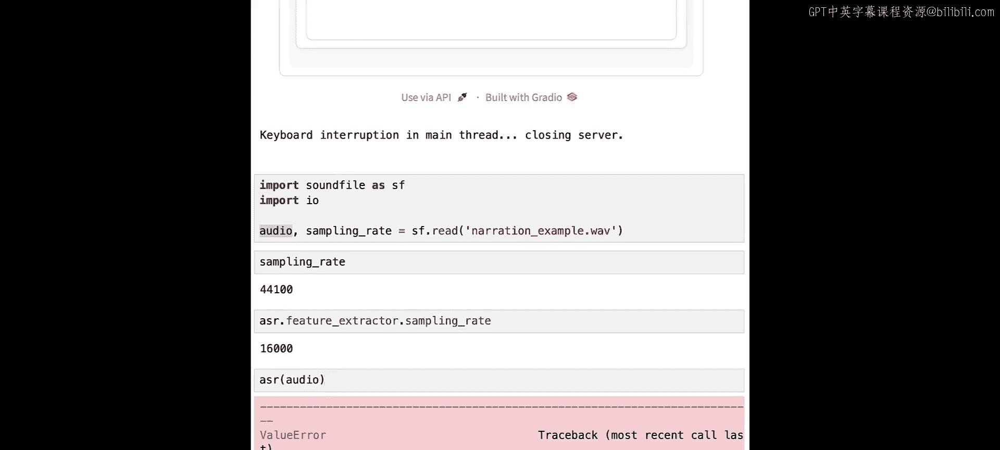

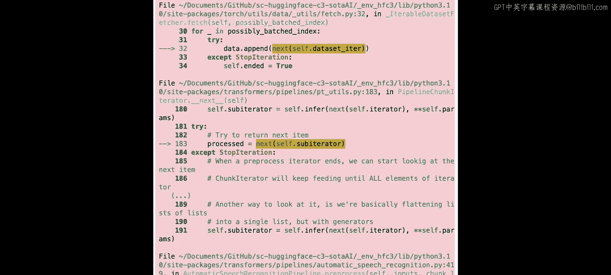

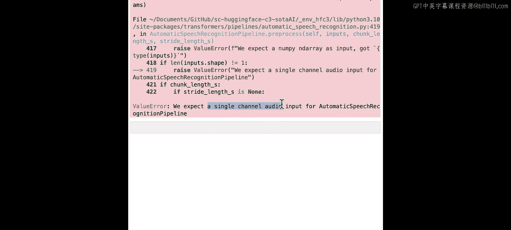

## 处理长音频文件 ⏱️

让我们直接说明这一点。首先，我们获取一个更长的音频示例。我们将停止演示，否则它将阻止我们运行更多单元格。要停止Gradio演示，请单击中断内核的方形图标。

我们将使用相同的自动语音识别流水线。让我们再次检查模型期望的采样率。

现在，采样率存在很大差异。

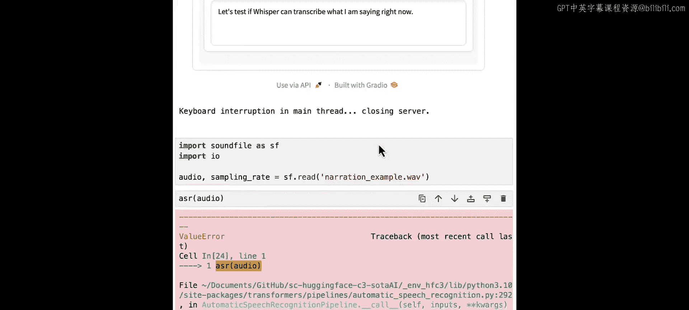

错误信息显示模型期望单声道音频输入，而我们可能有不止一个声道。

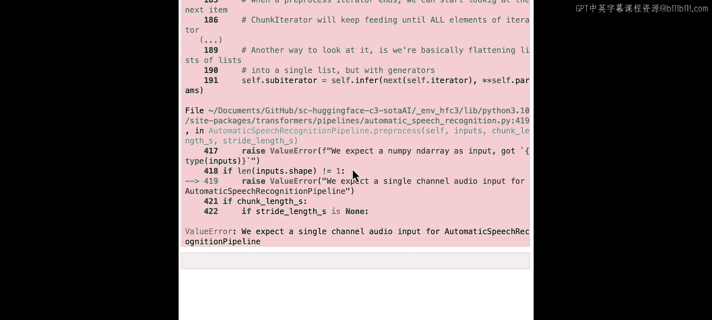

我们可能正在处理立体声音频。立体声使用双声道音频。这有助于在声音中创造空间感和方向感，从而增强聆听体验。立体声擅长为音频添加空间分量。因此，当你听音乐时，你会获得更好的体验，但对于Transformer模型来说，通常不需要。大多数Transformer模型使用单声道音频。这是因为你实际上不需要空间信息来识别声音是狗叫还是猫叫，你不需要知道语音来自哪里，你只需要知道说了什么。同时，立体声音频有两个声道，所以数据量是两倍，这增加了计算的复杂性，而没有真正提供任何好处。

让我们看看如何将此音频转换为单声道。让我们检查音频数组的形状。

如你所见，此音频中有两个声道，但我们只需要一个。我们将使用一个名为Librosa的库将此音频数组从立体声转换为单声道。Librosa期望音频数组的形状是声道数在前，然后是数据，所以在进行转换之前，还需要一步，即转置此数组。

让我们再次检查形状。现在，让我们将此音频转换为单声道。完成后，让我们听一下这个示例。

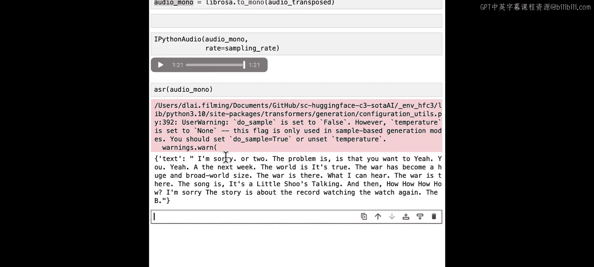

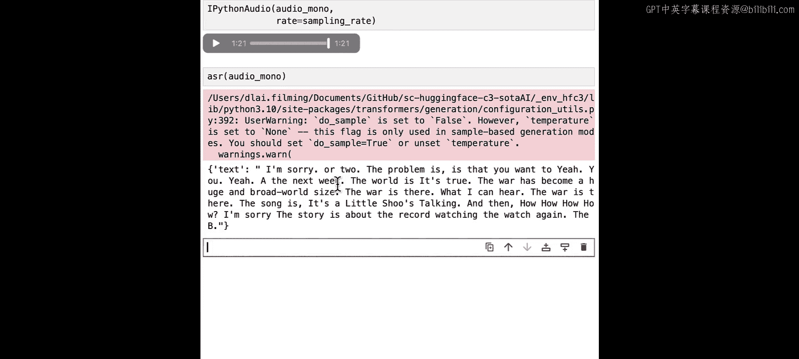

好的，让我们尝试直接将此音频传递给流水线，看看会发生什么。

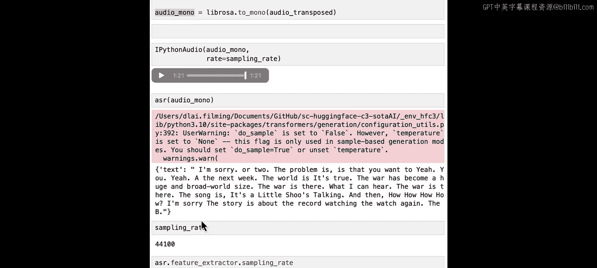

哦，不，模型生成的文本与音频并不真正匹配。为什么会这样？这是因为音频示例的采样率与模型的采样率不匹配。模型试图猜测生成的内容，但未能成功。让我们仔细检查一下。让我们看看这个示例的采样率是多少。

示例的采样率是44.1千赫兹。让我们看看流水线期望什么。

流水线期望音频以16千赫兹采样。让我们修复这个问题。我们可以使用Librosa重新采样单个文件。

现在，音频示例已准备好用于流水线。为了使流水线能够转录更长的视频，我们需要向它传递一些参数。但首先，让我们谈谈自动语音识别流水线如何处理更长的录音。因为Whisper一次只能处理最多30秒的音频。为了转录这个更长的示例，流水线会将长文件分割成块。我们可以为Whisper指定块长度，30秒的块是最佳的，因为这匹配模型期望的输入。每个段将与前一个段有少量重叠。这使得流水线能够在边界处准确地将段拼接在一起，因为它可以找到段之间的重叠并相应地合并转录。由于音频被分割成块，流水线可以独立转录每个块，然后合并结果。因此，你可以并行转录一批块。

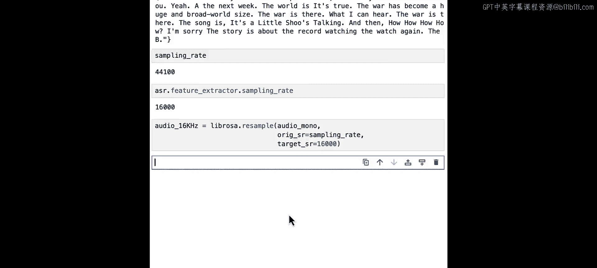

让我们看看将传递给流水线的参数。

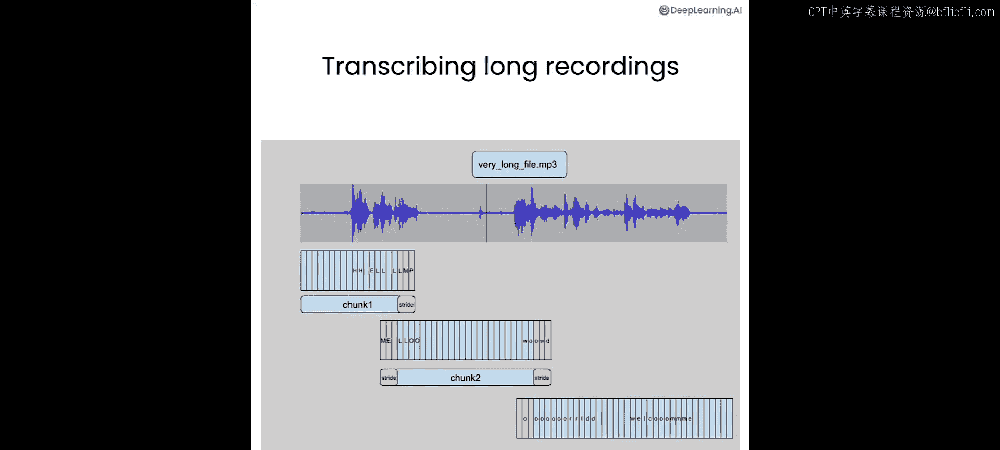

接下来是块的长度，本例中为30秒。

接下来，我们将指定希望并行处理多少个块，使用`batch_size`。在本例中，原始文件只有1分21秒，因此不需要将`batch_size`设置为大于三或四。对于更大的文件，`batch_size`将取决于你的硬件和可用内存。如果你尝试较大的`batch_size`并出现内存不足错误，你就知道需要尝试较小的批处理大小。在第一节介绍课中，我给了你一个经验法则来估算运行模型所需的内存量。要估算`batch_size`，可以将其视为该内存量的乘数，即你可以并行运行多少个模型。因此，如果你有硬件支持，可以拥有大量的批处理。在本例中，对于管理器来说，我们也不需要更多，因为30秒的分割带有一点重叠可能甚至是冗余的，也许我们可以做三个。但以防万一，对于这种情况，三或四个是可以的。尝试并实验批处理大小，看看你的硬件能处理什么。

最后，你可以将`return_timestamps`设置为`True`，这可以预测音频数据的段级时间戳。这些时间戳指示短段音频的开始和结束时间，对于将转录与输入音频对齐特别有用。要输出带时间戳的转录，你可以打印输出的`chunks`部分。

现在我们获得了完整音频的转录，并且得到了时间戳。

## 修改演示以接受长音频录音 🔧

现在，让我们看看如何修改演示以接受更长的音频录音。首先，让我们复制原始演示。让我们复制`transcribe_speech`函数。

在这里，我们将修改调用流水线的方式。我们不只是给它音频文件，还将传递额外的参数。

我们需要在界面中更新的唯一内容是函数的名称。

启动演示的代码片段没有变化。所以它已经准备好了。

尝试上传一个超过30秒的音频文件，或者再次录制自己对着麦克风说话超过30秒，看看它是否有效。

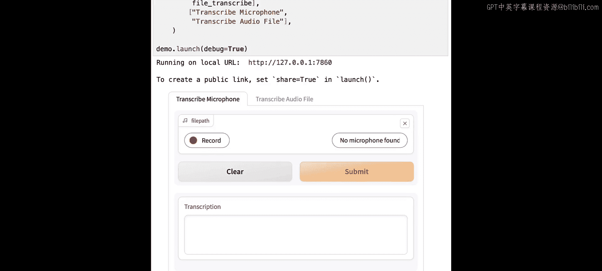

在本节课中，我们一起学习了自动语音识别的基础知识，包括加载数据集、使用Whisper模型进行转录、处理立体声和采样率问题，以及构建和扩展一个能够处理长音频的转录演示应用。在下一课中，你将学习如何朝相反方向进行，即从文本到语音。