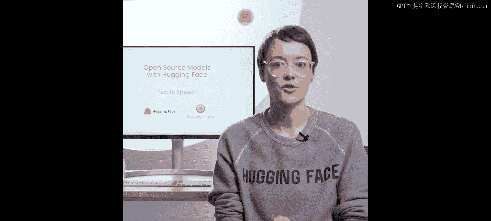
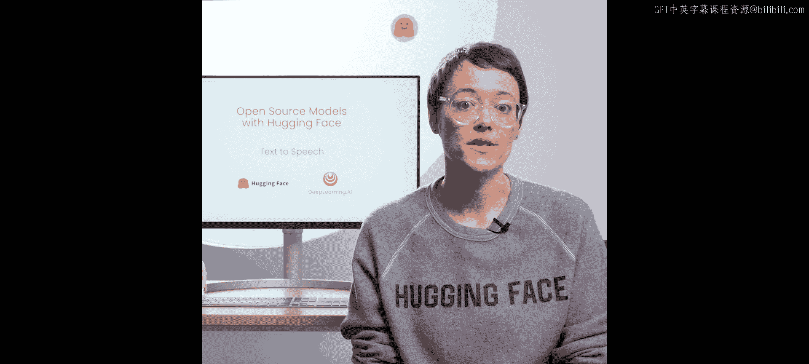
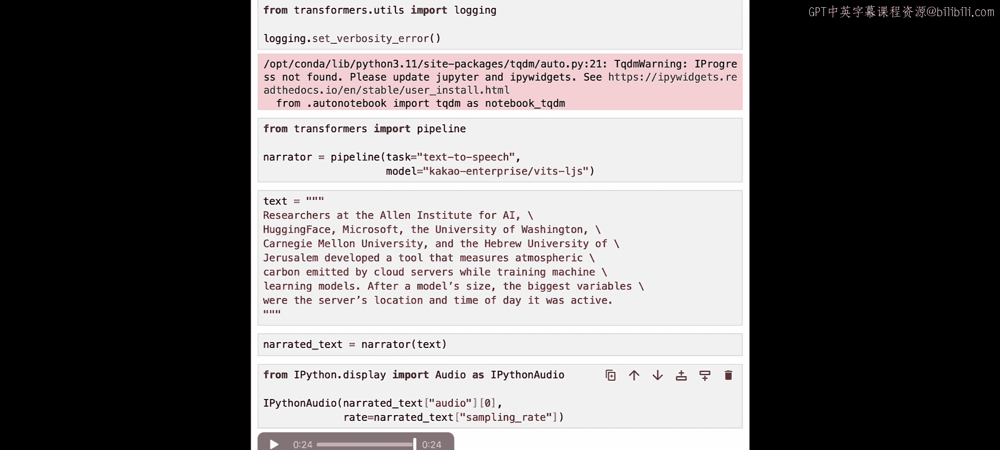

# 008：文本转语音（TTS）

在本节课程中，我们将学习如何将文本转换为语音，即文本转语音（Text-to-Speech, TTS）任务。这是音频生成领域的最后一个环节，我们将使用Hugging Face上的一个开源模型来实现这一功能。

## 概述：文本转语音的挑战

文本转语音是一项具有挑战性的任务，因为它是一个“一对多”问题。在分类任务中，一个输入通常对应一个或几个正确的标签。在自动语音识别中，一段语音通常对应一个正确的文本转录。然而，对于同一句话，存在无数种不同的朗读方式。每个人的声音、方言、说话风格都不同，但所有这些方式都是有效且正确的。



尽管存在这些挑战，开源社区已经开发出能够出色处理此任务的模型。接下来，我们将使用其中一个模型。


## 使用VITS预训练模型

我们将使用来自Cacao Enterprise的VITS预训练模型。这是少数几个能在此学习环境中运行的模型之一，并且它拥有宽松的开源许可协议。




一旦我们建立了处理管道（pipeline），只需要向其中传入文本即可。

以下是创建和使用TTS管道的步骤：

1.  **导入并加载管道**
    首先，我们需要从`transformers`库中导入`pipeline`函数，并指定我们要使用的模型。

    ```python
    from transformers import pipeline

    # 创建文本转语音管道，指定模型
    tts_pipeline = pipeline("text-to-speech", model="facebook/mms-tts-eng")
    ```

2.  **准备输入文本**
    接下来，我们准备一段希望转换为语音的文本。

    ```python
    # 定义要转换的文本
    text_to_speak = "Researchers at the Allen Institute, AI, Microsoft, the University of Washington, Carnegie Mellon University and the Hebrew University of Jerusalem developed a tool that measures atmospheric carbon emitted by cloud servers while training machine learning models. The biggest variables were the server's location and time of data use."
    ```

3.  **生成并播放音频**
    最后，我们将文本传入管道，生成音频数据，并可以将其保存为文件或直接播放。

    ```python
    # 生成语音
    speech_output = tts_pipeline(text_to_speak)

    # 将音频数据保存为WAV文件
    import soundfile as sf
    sf.write("output_speech.wav", speech_output["audio"], samplerate=speech_output["sampling_rate"])

    # 或者在Jupyter Notebook等环境中直接播放
    # from IPython.display import Audio
    # Audio(speech_output["audio"], rate=speech_output["sampling_rate"])
    ```

运行上述代码后，你将得到一个名为`output_speech.wav`的音频文件，其中包含了模型根据输入文本生成的语音。你可以自由替换`text_to_speak`变量中的内容，尝试生成不同的语音。

## 总结

在本节课中，我们一起学习了文本转语音的基本概念。我们了解到TTS是一个“一对多”的生成任务，并实践了如何使用Hugging Face的`transformers`库和VITS预训练模型，通过简单的几步将任意文本转换为语音。只需加载管道、传入文本，即可获得合成的音频输出。



在下一节课中，Eunice将向你展示如何构建一个目标检测器。让我们继续学习。