# 009：目标检测 🎯

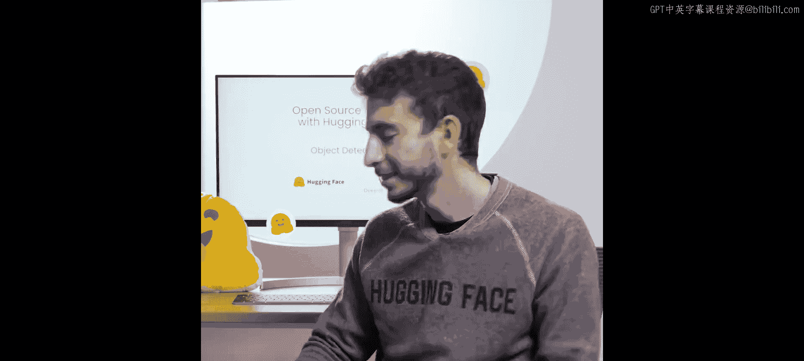

在本节课中，我们将探索计算机视觉模型，并动手实践，构建一个能够帮助视障人士理解图片内容的智能助手。我们将重点学习目标检测任务，并使用Hugging Face的`transformers`库来实现它。

## 概述

目标检测是计算机视觉中的一项核心任务，它不仅能识别图像中的物体，还能定位它们的位置。本节课我们将学习如何使用Hugging Face Hub上的预训练模型进行目标检测，并将检测结果转化为语音描述，从而构建一个完整的AI助手。

---

## 环境准备与模型加载

在开始之前，请确保已安装必要的库。如果你在自己的机器上运行，可以使用以下命令安装：

```bash
pip install transformers torch pillow gradio
```

首先，我们需要导入一些工具函数和`pipeline`。

```python
from transformers import pipeline
# 假设 helper 模块中定义了 load_image_from_url 和 render_results_on_image 函数
from helper import load_image_from_url, render_results_on_image
```

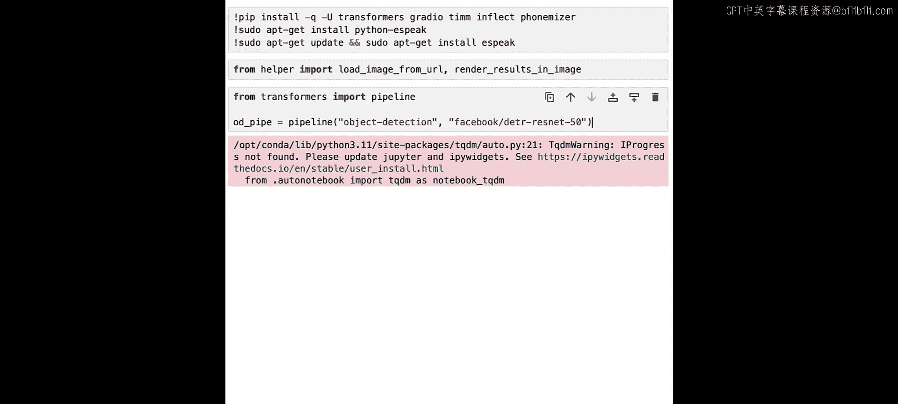

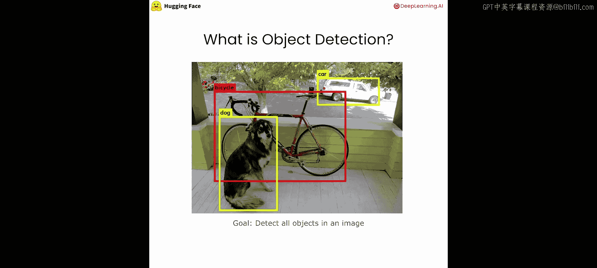

接下来，我们加载目标检测模型。我们将使用Facebook的`Detr-ResNet-50`模型。

```python
od_pipe = pipeline("object-detection", model="facebook/detr-resnet-50")
```

---

## 理解目标检测任务

上一节我们加载了模型，本节我们来深入了解一下目标检测任务。

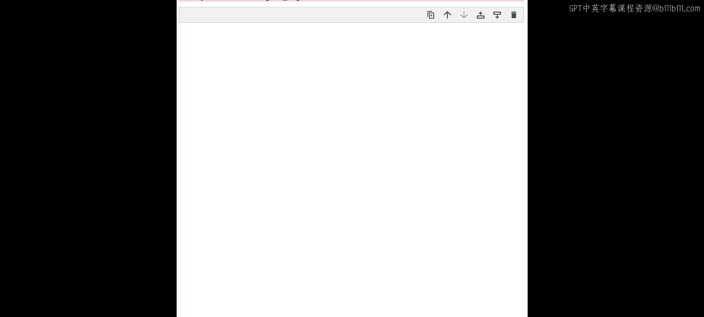

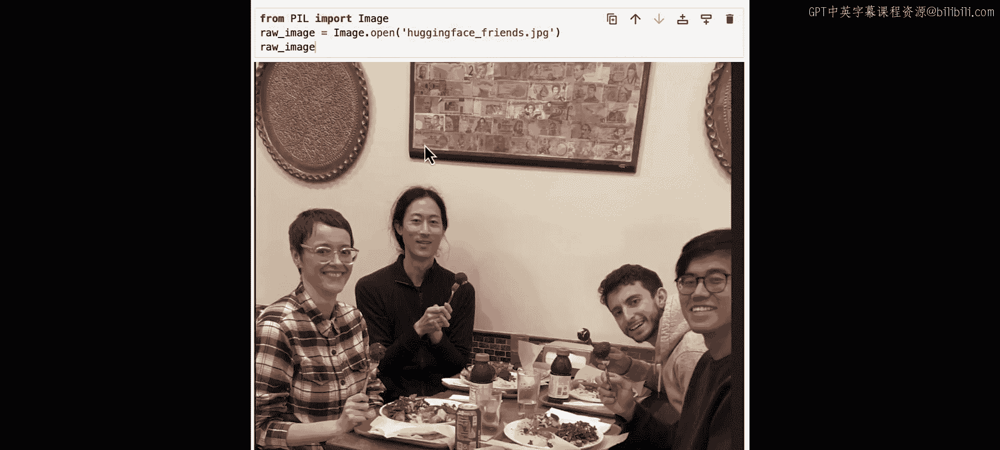

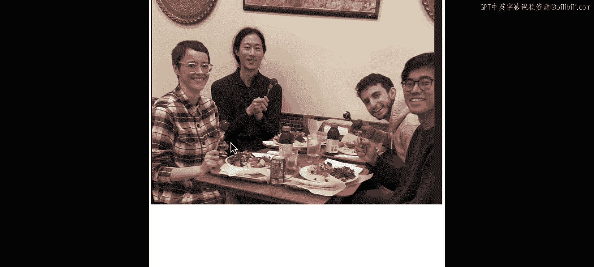

目标检测的任务是识别图像中感兴趣的物体，并为每个检测到的物体提供**类别标签**和**边界框位置**。它结合了分类和定位两个子任务。

**公式表示**：对于一个图像 `I`，目标检测模型 `f` 的输出是一组边界框 `B` 和对应的类别标签 `C` 及置信度 `S`。
`f(I) = {(B_i, C_i, S_i)} for i = 1 to N`

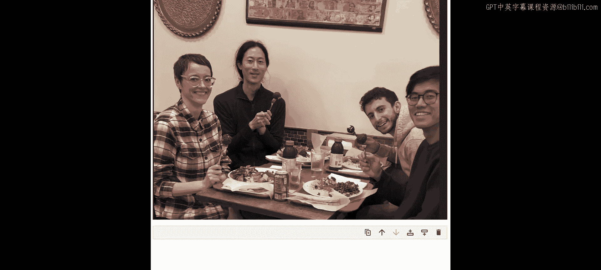

如何选择模型？你可以访问[Hugging Face Hub](https://huggingface.co/models)，使用左侧的“Object Detection”过滤器浏览所有可用模型。选择模型时，可以参考下载量、点赞数以及模型卡中提供的在特定数据集上的评估指标。

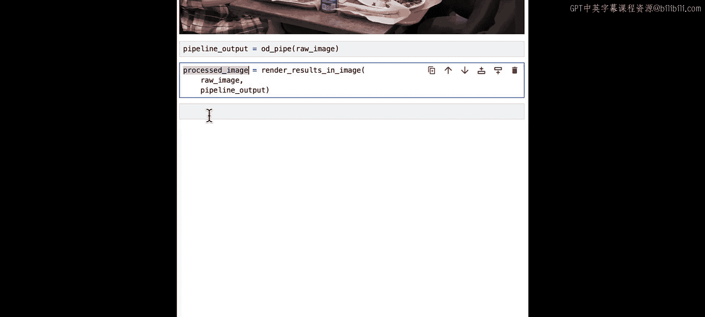

---

## 使用模型进行预测

现在，让我们使用加载好的管道对一张图片进行预测。以下是操作步骤：

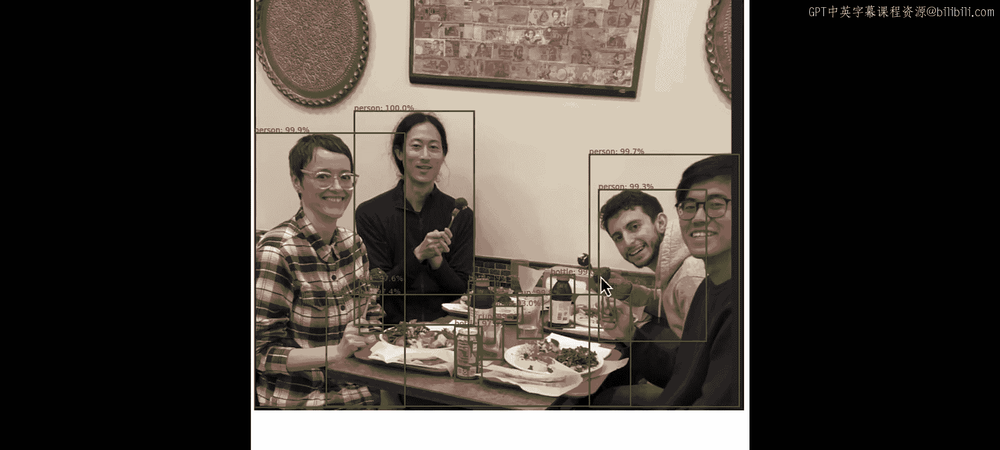

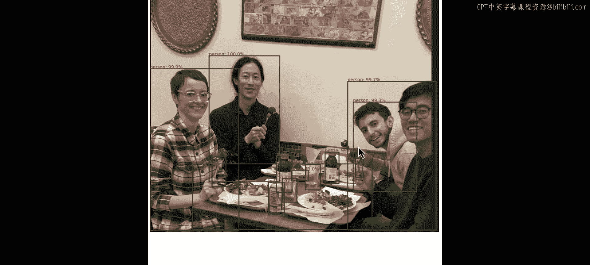

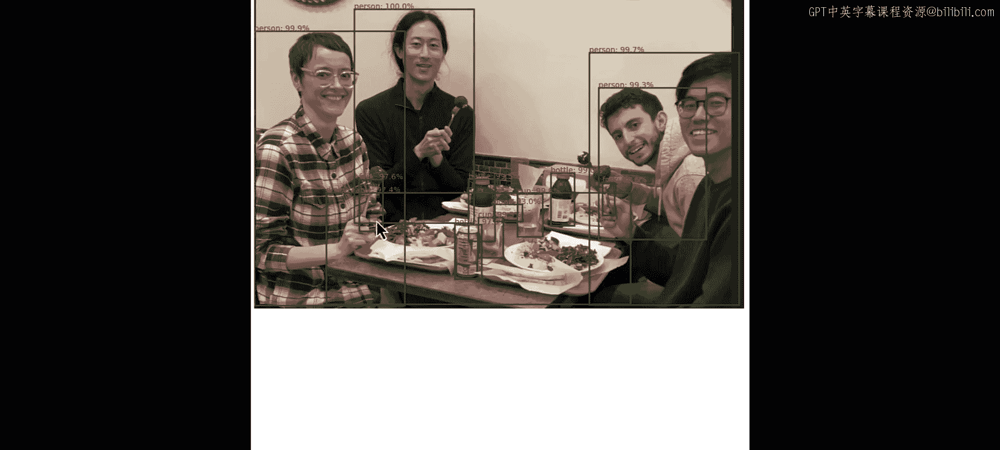

1.  加载一张图片。
2.  将图片传入管道。
3.  使用辅助函数可视化结果。

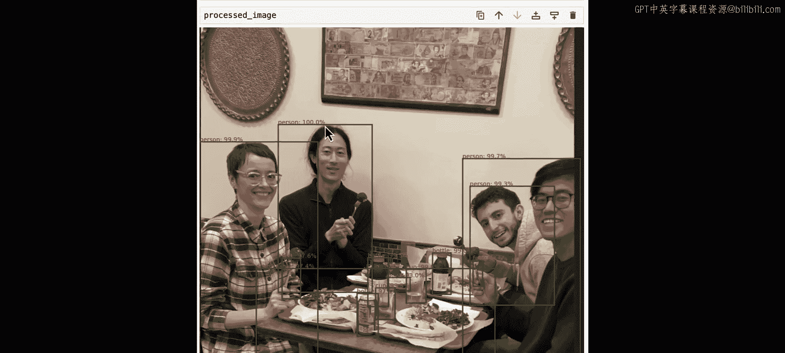

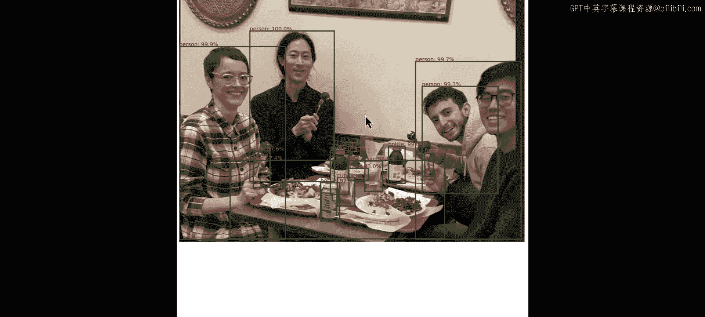

```python
# 加载示例图片（这里假设通过 helper 函数从URL加载）
image = load_image_from_url("https://example.com/your_image.jpg")

# 进行预测
predictions = od_pipe(image)

# 在图片上渲染结果
result_image = render_results_on_image(image, predictions)
result_image.show()
```

运行后，你将看到原图上绘制了边界框，并标注了物体类别和置信度。模型成功检测出了人、瓶子、杯子等物体。

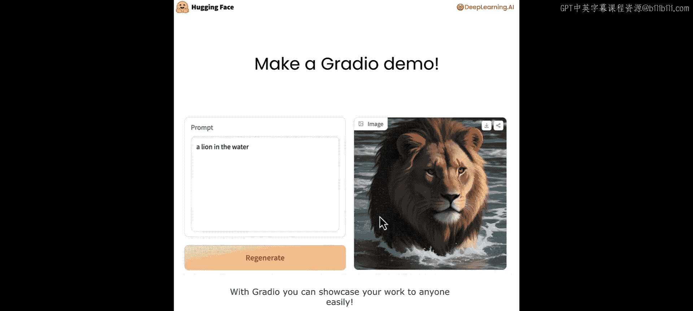

你可以暂停视频，尝试使用自己的本地图片或网络图片URL进行测试。

---

## 创建交互式演示应用

为了让模型更易于使用和分享，我们可以使用`Gradio`库创建一个简单的Web界面。

以下是创建界面的步骤：

1.  定义一个处理函数，它接收图片并返回带标注的结果图片。
2.  使用`Gradio`的`Interface`类包装这个函数。
3.  启动应用。

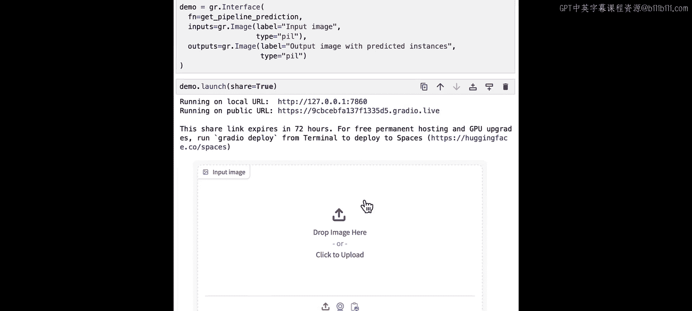

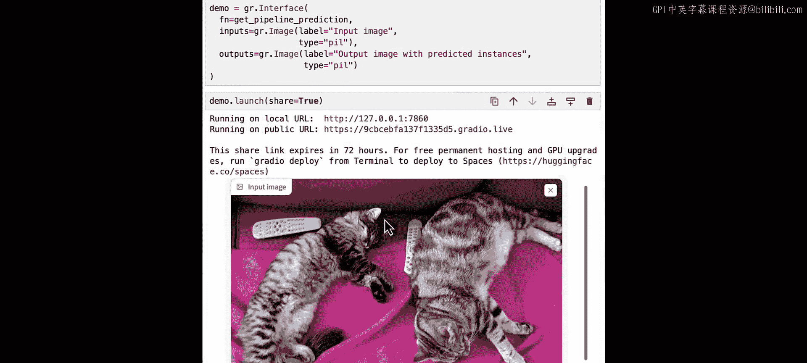

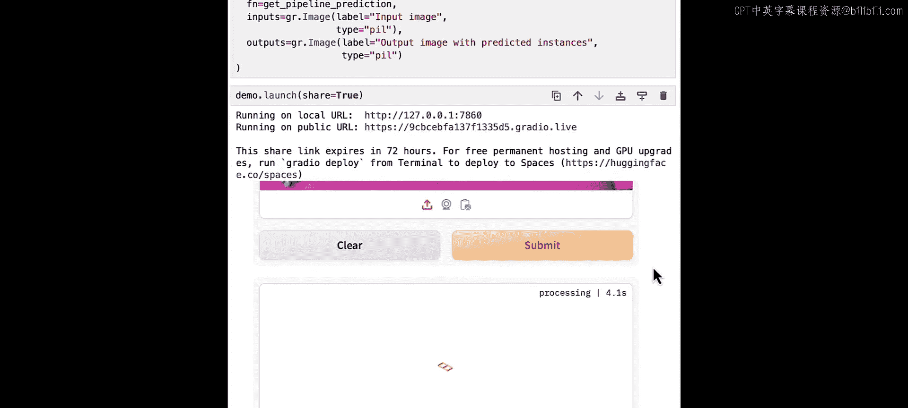

```python
import gradio as gr

def get_pipeline_prediction(pil_image):
    # 使用全局已加载的管道进行预测
    predictions = od_pipe(pil_image)
    # 渲染结果
    result_image = render_results_on_image(pil_image, predictions)
    return result_image

# 创建Gradio界面
demo = gr.Interface(
    fn=get_pipeline_prediction,
    inputs=gr.Image(type="pil"),
    outputs=gr.Image(type="pil"),
    title="目标检测演示"
)

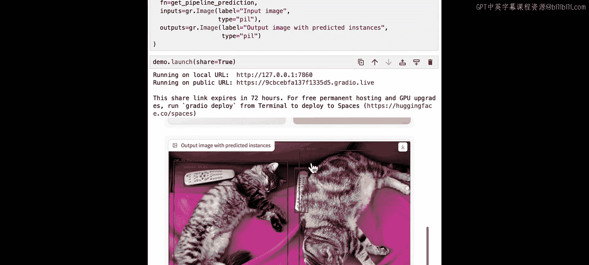

# 启动应用，并生成可分享的链接
demo.launch(share=True)
```

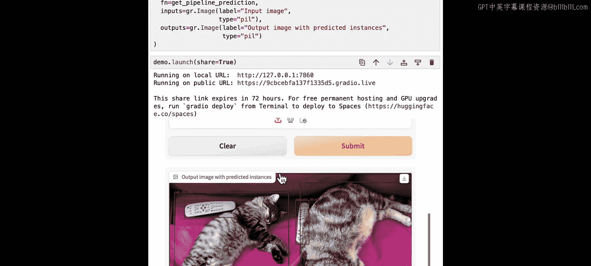

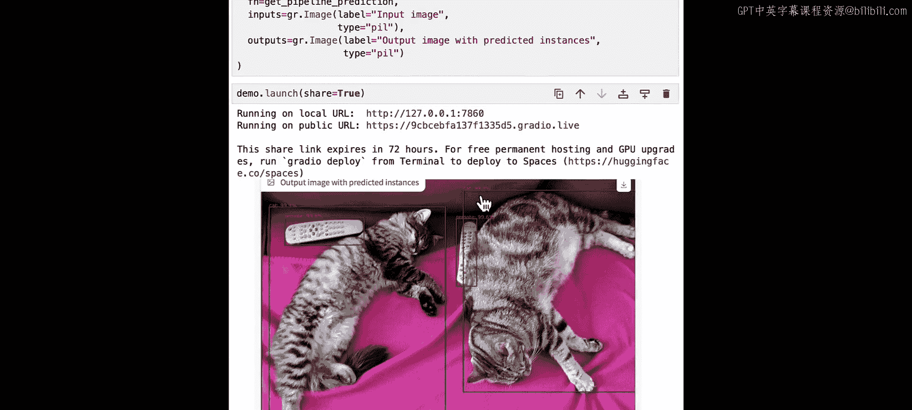

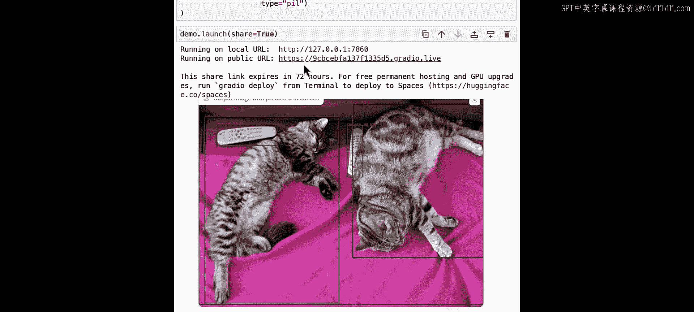

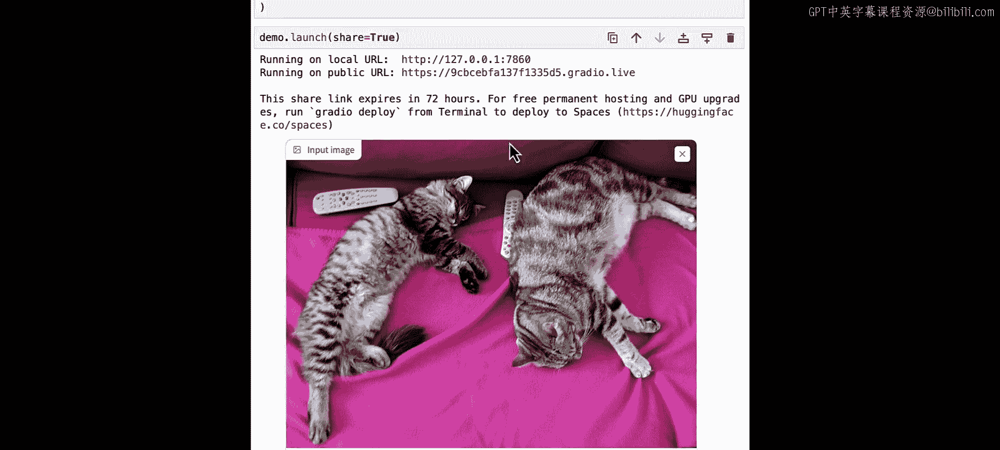

运行这段代码后，会弹出一个本地网页。你可以上传图片，点击“Submit”，右侧就会显示检测结果。通过`share=True`参数生成的链接，你可以与朋友分享这个应用。

---

## 构建AI视觉助手

最后，我们将结合目标检测和文本转语音模型，构建一个能“描述”图片的AI助手。

整个流程分为三步：
1.  **目标检测**：识别图片中的物体及其数量。
2.  **文本生成**：将检测结果组织成一句自然的描述文本。
3.  **语音合成**：将描述文本转换为语音。

首先，我们处理目标检测的输出，将其总结成一句话。假设我们有一个辅助函数`summarize_predictions_natural_language`来完成这个任务。

```python
from helper import summarize_predictions_natural_language

# 对同一张图片进行预测
predictions = od_pipe(image)
# 生成描述文本
description_text = summarize_predictions_natural_language(predictions)
print(description_text)
# 输出示例：“在这张图片中，有2把叉子，3个瓶子，2个杯子，4个人，1个碗和1张餐桌。”
```

接着，我们使用文本转语音模型将这段描述读出来。

```python
# 加载文本转语音管道
tts_pipe = pipeline("text-to-speech", model="kakao-enterprise/vits-ljs")

# 生成语音
speech_output = tts_pipe(description_text)

# 播放语音（需要IPython环境或保存为文件）
# 例如，保存为文件
import scipy.io.wavfile as wavfile
wavfile.write("output_audio.wav", rate=speech_output["sampling_rate"], data=speech_output["audio"])
```

现在，你可以听到AI助手用语音描述图片内容了。你可以将整个流程封装成一个函数或另一个Gradio应用，方便他人使用。

---

## 总结

在本节课中，我们一起学习了：
1.  **目标检测**的概念与原理，它结合了分类与定位。
2.  如何使用Hugging Face的`pipeline`快速加载和使用预训练的目标检测模型。
3.  如何利用`Gradio`库为模型构建一个用户友好的交互式Web演示界面。
4.  如何将目标检测模型与文本转语音模型结合，创建一个能够描述图片内容的AI视觉助手。

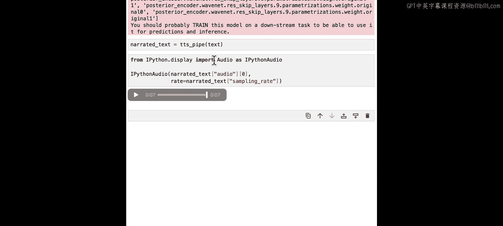

你可以尝试使用Hub上的其他模型，比较它们的性能，并将整个流程打包成应用与朋友分享。