# 010：图像分割与深度估计 🖼️

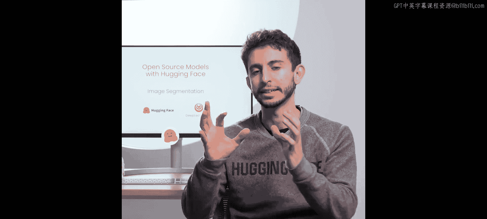

在本节课中，我们将学习两种计算机视觉任务：图像分割和深度估计。我们将使用Hugging Face的`transformers`库，探索Segment Anything Model（SAM）和Dense Prediction Transformer（DPT）模型。通过实践，你将学会如何通过视觉提示（如指定一个点）来分割图像中的特定对象，以及如何估计图像的深度信息。

---

## 图像分割与掩码生成 🎯

上一节我们介绍了课程概述，本节中我们来看看图像分割，特别是掩码生成任务。

传统的图像分割任务会为图像中的每个像素预测一个类别标签。例如，天空的像素被标记为“天空”，桥梁的像素被标记为“桥梁”。

**公式**：`像素标签 = 模型(输入图像)`

而掩码生成任务则不同。它允许用户通过**视觉提示**来引导模型，例如在图像上指定一个点或一个边界框，模型将预测该感兴趣对象的精确分割掩码。Segment Anything Model（SAM）就是这样一个模型。与经典分割不同，预测出的掩码没有类别标签，它只表示“这是用户指定的那个对象”。

此外，SAM还支持**自动掩码生成**。该流程会在图像上采样多个点，尝试不同的点组合，并筛选出得分最高的分割掩码，从而得到图像中所有主要对象的掩码。

为了在硬件资源有限的环境下运行，本实验将使用SAM的一个轻量级、压缩版本——**SSM**模型，它在保持相似性能的同时，模型体积更小。

---

## 使用Pipeline进行自动掩码生成 🤖

理解了基本概念后，我们开始动手实践。首先，我们将使用`pipeline`对象进行自动掩码生成。

以下是初始化掩码生成pipeline的步骤：
1.  从`transformers`库导入`pipeline`。
2.  指定任务为`mask-generation`，并加载SSM模型。

```python
from transformers import pipeline

pipe = pipeline("mask-generation", model="facebook/sam-vit-base")
```

接下来，我们加载一张示例图片。图片中包含人物和羊驼。

对于自动掩码生成，可以设置`points_per_batch`参数。更高的值意味着推理更高效，但对硬件要求也更高。对于小型硬件，建议使用较小的值。

运行pipeline后，我们使用一个辅助函数来可视化结果。可以看到，模型成功分割了图像中的许多小区域，例如每个人的头部、每只羊驼、墙壁和背景中的小物件。

这种方法的缺点是需要在所有采样点上迭代并后处理生成的掩码，对于某些应用场景可能较慢。

---

## 使用视觉提示进行精确分割 ✨

上一节我们使用pipeline进行了全图分割，本节中我们来看看如何通过指定点来进行精确分割。

我们将直接使用模型类和处理器，而不是pipeline。首先加载模型和处理器：

```python
from transformers import SamModel, SamProcessor
import torch

model = SamModel.from_pretrained("facebook/sam-vit-base")
processor = SamProcessor.from_pretrained("facebook/sam-vit-base")
```

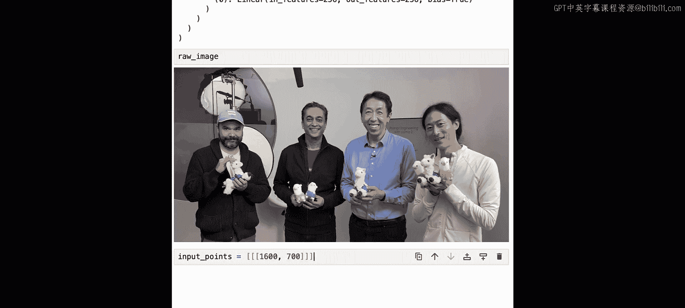

我们使用同一张图片，并希望分割图中Andrew的蓝色衬衫。为此，我们在衬衫区域指定一个二维坐标点（例如`[1600, 700]`，坐标系原点在左上角）。

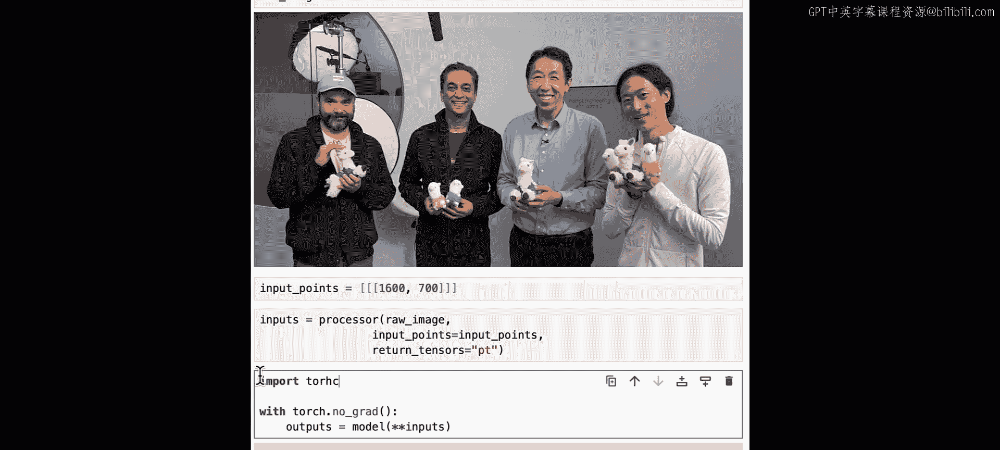

以下是编码和推理步骤：
1.  使用处理器同时编码图像和输入点。
2.  在`torch.no_grad()`上下文管理器中进行推理，以避免计算梯度。

```python
# 准备输入
input_points = [[[1600, 700]]] # 格式：[[[x, y]]]
inputs = processor(image, input_points=input_points, return_tensors="pt")

# 推理
with torch.no_grad():
    outputs = model(**inputs)
```

模型会一次性预测三个分割掩码及其置信度分数。我们需要后处理这些掩码，将它们调整到原始图像尺寸，并选择置信度最高的一个。

```python
# 后处理掩码
masks = processor.post_process_masks(outputs.pred_masks, inputs["original_sizes"], inputs["reshaped_input_sizes"])
best_mask = masks[0][0][0] # 取第一个图像的第一个掩码
```

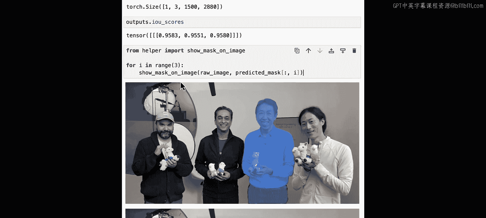

可视化结果显示，三个预测掩码中有两个准确地分割出了衬衫区域，另一个则分割出了整个人物。为了获得更好的效果，可以尝试为同一个掩码提供多个点，或者提供一个包围目标区域的边界框。

---

## 使用DPT模型进行深度估计 📏

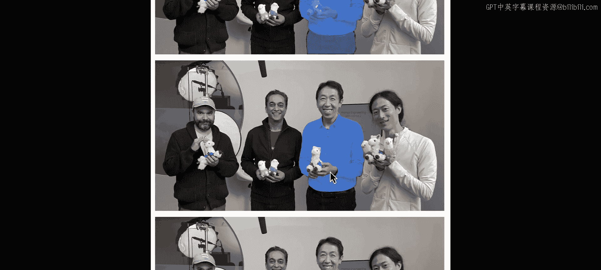

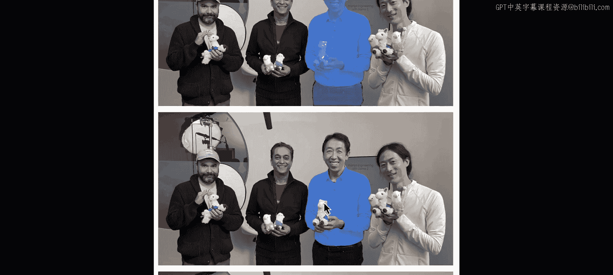

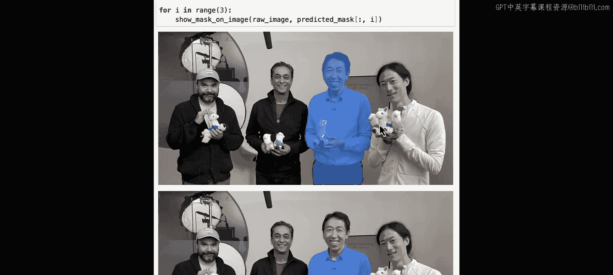

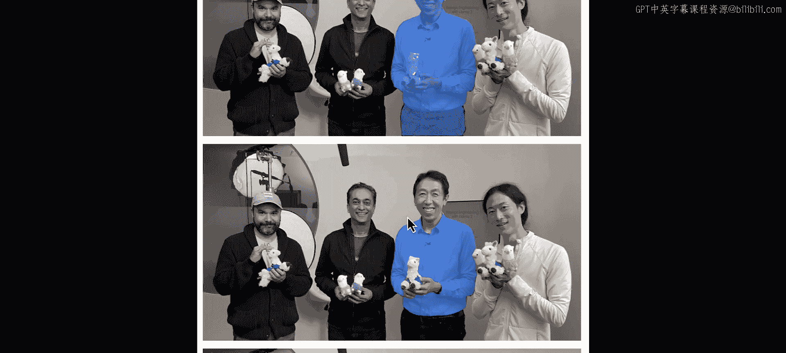

现在我们已经学会了如何使用SAM分割对象，接下来看看另一个任务：深度估计。我们将使用DPT（Dense Prediction Transformer）模型。

深度估计是计算机视觉中的常见任务，例如在自动驾驶中广泛应用。我们将使用Intel的`dpt-hybrid-midas`模型。

同样，我们使用`pipeline`来简化流程：

```python
from transformers import pipeline

depth_estimator = pipeline("depth-estimation", model="Intel/dpt-hybrid-midas")
```

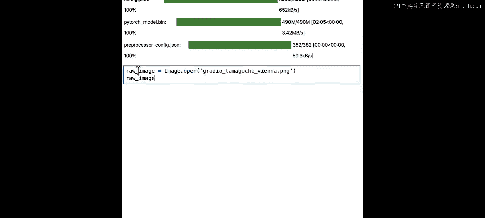

加载一张测试图片（例如一个站在路上的玩具），然后进行深度估计：

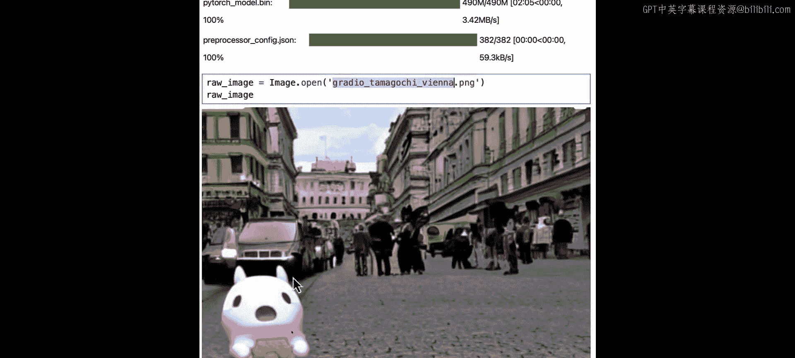

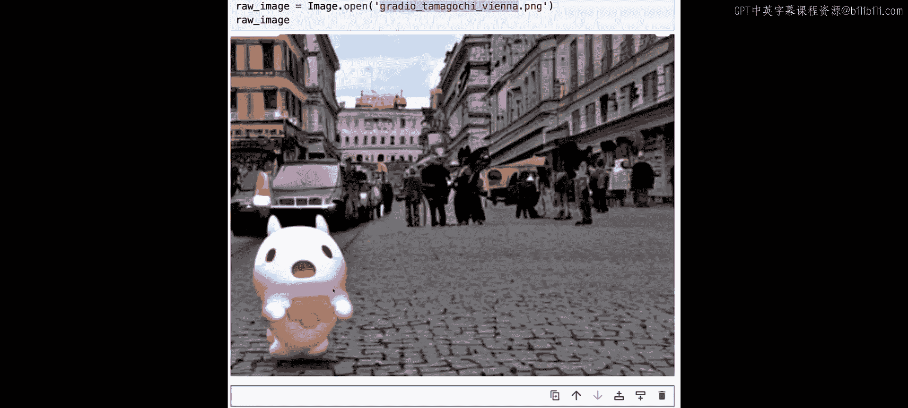

```python
output = depth_estimator(image)
predicted_depth = output["predicted_depth"] # 原始的深度张量
```

模型输出的深度图尺寸可能与原图不同。我们需要将其调整到原图尺寸，并将值归一化到0-255范围以便显示。

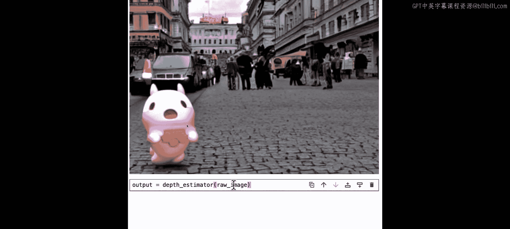

```python
import torch.nn.functional as F

# 调整尺寸到原图大小
prediction = F.interpolate(
    predicted_depth.unsqueeze(1),
    size=image.size[::-1], # (高度, 宽度)
    mode="bicubic",
    align_corners=False,
).squeeze()

# 归一化到0-255
formatted = (prediction - prediction.min()) / (prediction.max() - prediction.min()) * 255.0
depth_image = formatted.to(torch.uint8)
```

可视化深度图，可以看到前景的玩具颜色较亮（深度值小，距离近），背景则颜色较暗（深度值大，距离远），模型预测得相当准确。

---

## 创建交互式深度估计演示 🚀

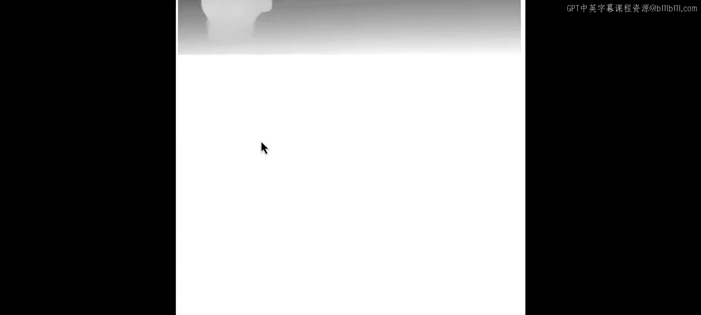

最后，我们可以使用Gradio库将深度估计模型包装成一个交互式Web应用，方便分享。

首先，定义一个处理函数，它接收输入图像，执行所有深度估计和后处理步骤，并返回可视化后的深度图。

```python
import gradio as gr
from PIL import Image
import numpy as np

def depth_estimation_demo(input_image):
    # 1. 使用pipeline估计深度
    output = depth_estimator(input_image)
    predicted_depth = output["predicted_depth"]

    # 2. 调整尺寸和归一化（代码同上，此处省略）
    # ... [调整尺寸和归一化的代码] ...

    # 3. 转换为PIL图像返回
    return Image.fromarray(depth_image.numpy(), mode='L')
```

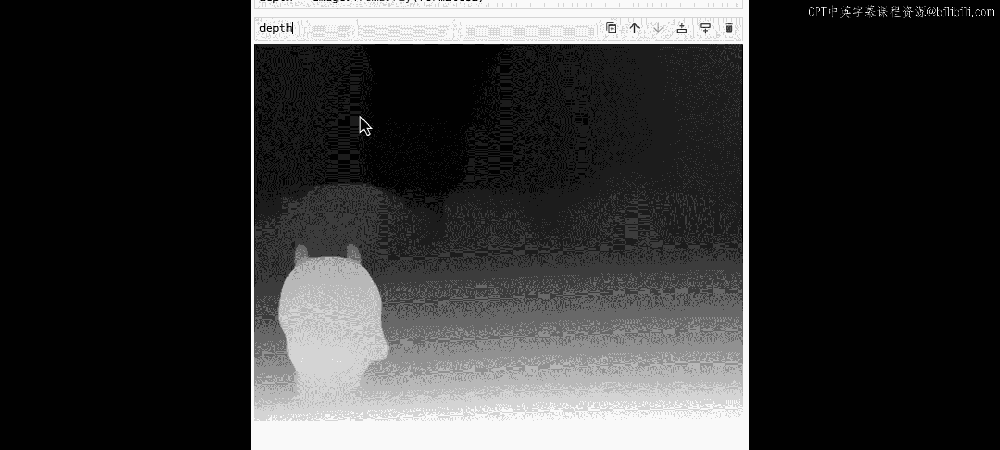

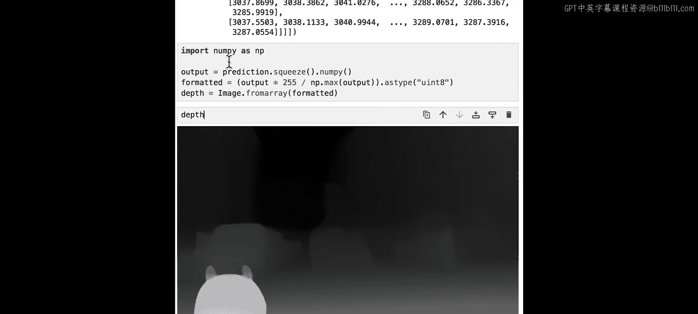

然后，创建Gradio界面，指定输入和输出类型为图像，并启动应用。设置`share=True`可以生成一个可分享的链接。

```python
iface = gr.Interface(
    fn=depth_estimation_demo,
    inputs=gr.Image(type="pil"),
    outputs=gr.Image(type="pil"),
    title="深度估计演示"
)

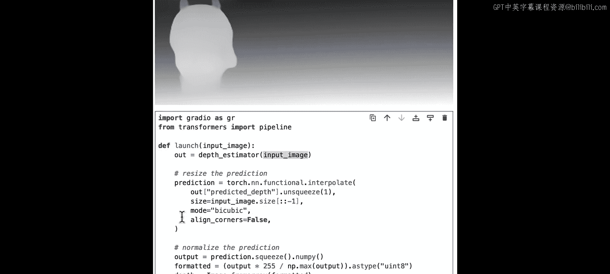

iface.launch(share=True)
```

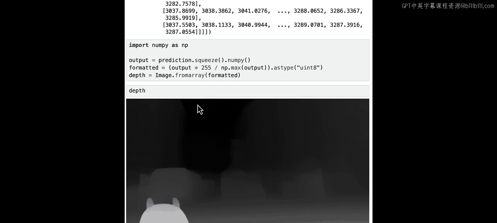

现在，你就可以通过生成的链接与朋友或同事分享这个深度估计工具了。

---

## 总结 📝

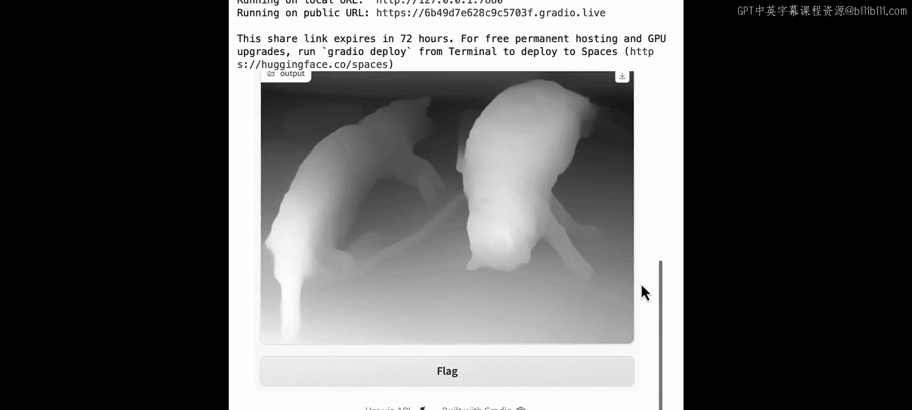

本节课中我们一起学习了：
1.  **掩码生成**与经典图像分割的区别，以及如何使用SAM模型通过视觉提示分割特定对象。
2.  使用`pipeline`进行**自动掩码生成**，以及直接使用模型进行**基于点的精确分割**。
3.  使用DPT模型进行**单图像深度估计**，并理解了后处理深度图的关键步骤。
4.  利用**Gradio**快速构建和分享一个交互式的深度估计演示应用。

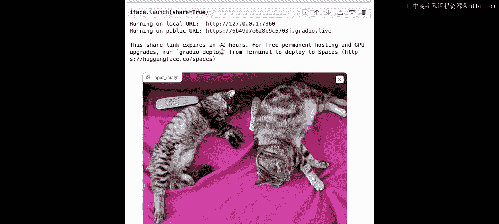

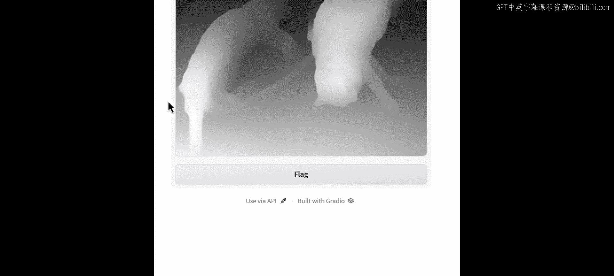

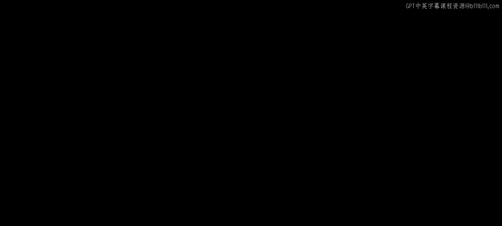

这些技能为你处理更复杂的计算机视觉任务和多模态模型应用打下了基础。