# 011：图像文本匹配 🖼️🔍

在本节课中，我们将学习使用多模态模型进行图像文本匹配。具体来说，我们将使用Salesforce的开源模型BLIP，来计算一张图片和一段描述文本之间的匹配程度。

## 什么是多模态模型？🤔

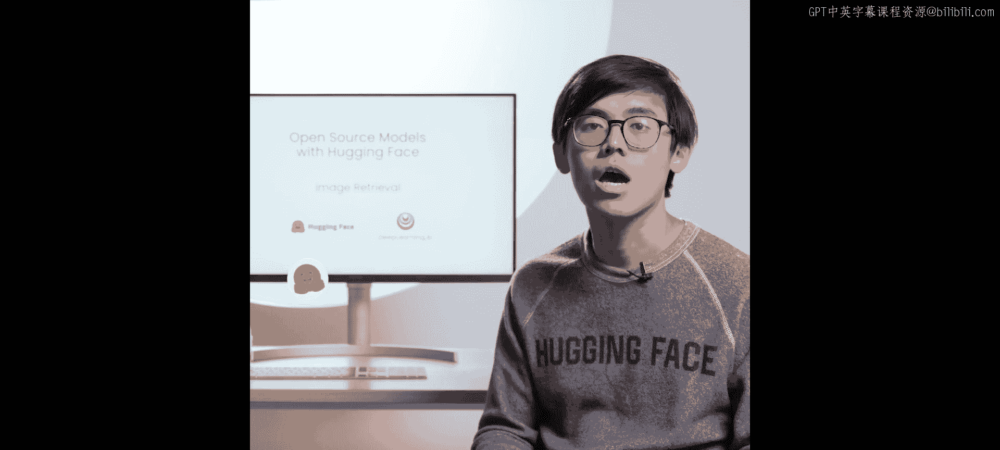


上一节我们介绍了课程目标，本节中我们来看看什么是多模态模型。当一个任务需要模型能够处理多种类型的数据作为输入时，例如同时输入一张图片和一句话，我们称其为多模态模型。本课程中我们将采用这个定义。提到多模态模型，你可能会想到ChatGPT和GPT-4V，它们可以接收文本、图像甚至音频。如果你想尝试开源的多模态聊天模型，也一定要试试Llama。

在接下来的几节课中，我们将学习几个常见的多模态任务：图像文本匹配、图像描述生成、视觉问答以及零样本图像分类。前三个任务我们将使用Salesforce的BLIP模型，最后一个任务（零样本图像分类）我们将使用OpenAI的CLIP模型。

## 图像文本匹配任务 📊

现在，让我们深入了解第一个任务：图像文本检索或匹配。该模型将判断输入的文本是否与输入的图像匹配。例如，我们传入一张男人和狗的照片，以及文本“穿蓝衬衫的男人戴着眼镜”，模型应该返回文本与图像不匹配。接下来让我们开始编码。

对于本课程，相关库已经安装完毕。如果你在自己的机器上运行，可以通过以下命令安装Transformers库：

```python
# pip install transformers
```

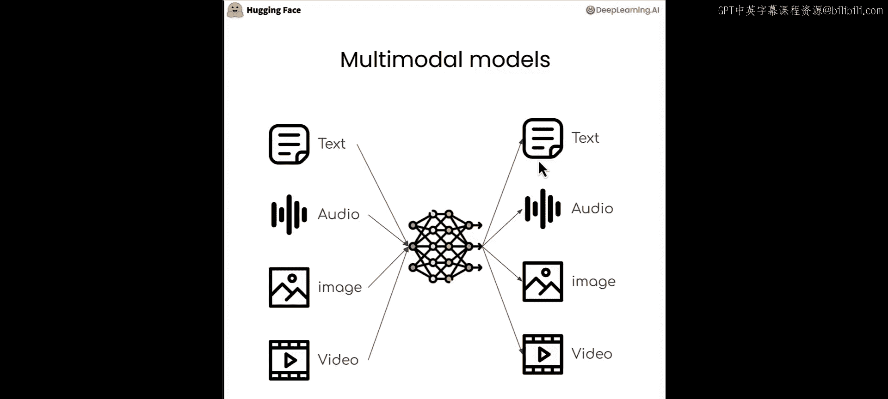

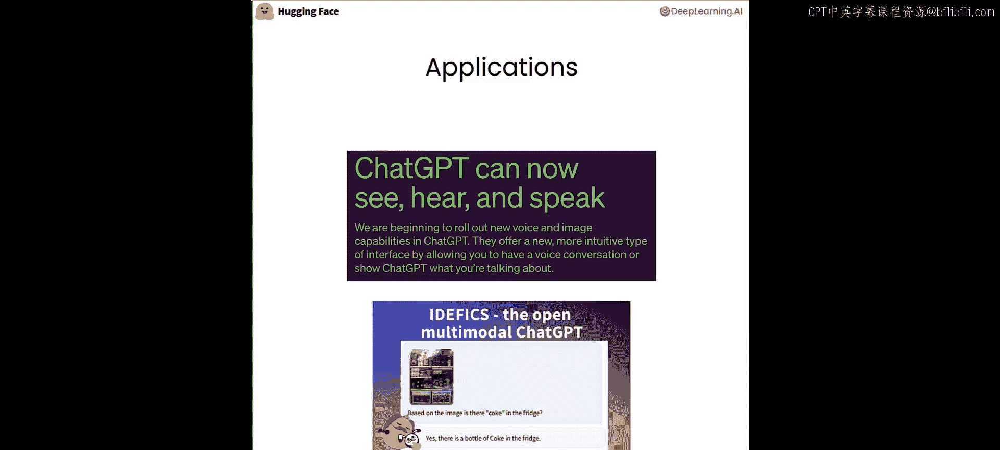

由于本课程环境已安装所有库，我们无需执行此命令，故将其注释。

## 加载模型与处理器 🚀

要执行任务，我们需要加载模型和处理器。首先，从Transformers库中导入用于图像文本匹配的BLIP类。

```python
from transformers import BlipForImageTextRetrieval
```

然后，加载模型。只需调用我们刚导入的类，并使用`from_pretrained`方法加载预训练的检查点。如前所述，我将使用Salesforce的BLIP模型来执行此任务，这是该特定任务对应的检查点。

```python
model = BlipForImageTextRetrieval.from_pretrained("Salesforce/blip-itm-base-coco")
```

对于处理器，过程基本相同。我们需要从transformers导入AutoProcessor类。

```python
from transformers import AutoProcessor
```

接着，加载正确的处理器，同样使用`from_pretrained`方法并传入相关的检查点。

```python
processor = AutoProcessor.from_pretrained("Salesforce/blip-itm-base-coco")
```

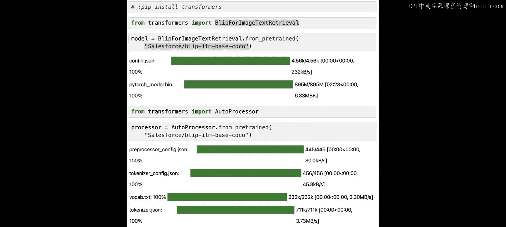

处理器的角色是为模型处理图像和文本。

## 准备输入数据 🖼️📝

现在，让我们获取将要传递给处理器的图像和文本。处理器将以模型能够理解的方式修改图像和文本。

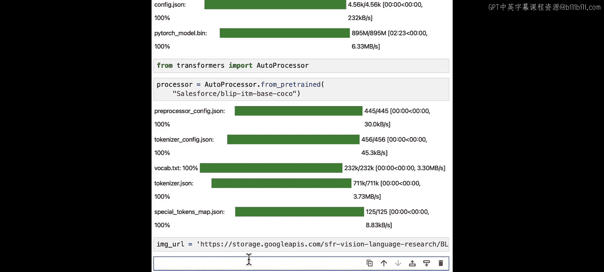

对于图像，我们将使用以下URL链接。为了加载图像，我们将使用PIL库的Image类。安装Python时默认会安装PIL库。

```python
from PIL import Image
import requests

url = "你的图片URL"
image = Image.open(requests.get(url, stream=True).raw).convert("RGB")
```

这段代码从指定URL下载图像，打开它，获取原始二进制数据，然后将其转换为RGB色彩模式。打印`image`对象，你应该能看到图像。

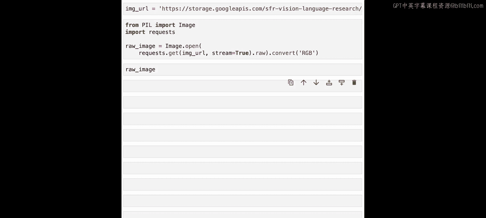

现在我们有了图像，我们将检查模型是否能成功判断图像与以下文本匹配：“一张女人和狗在海滩上的图片”。

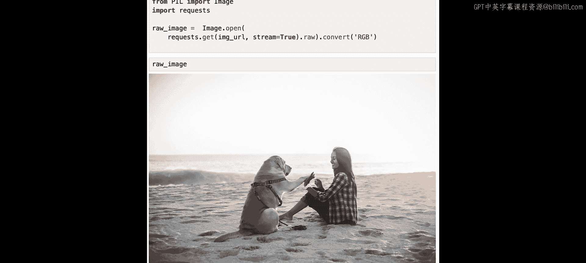

## 处理输入并运行模型 ⚙️

我们需要获取模型能够理解的输入。为此，我们需要调用处理器，并传入几个参数：图像、文本，并将`return_tensors`设置为“pt”以获得PyTorch张量。

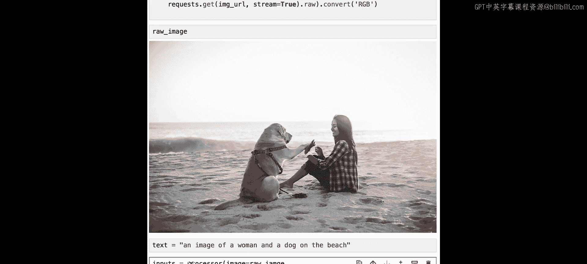

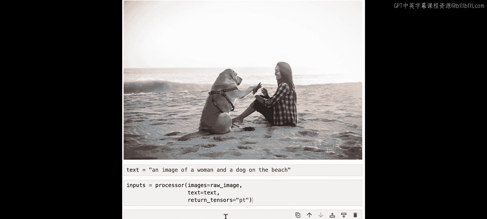

```python
text = "一张女人和狗在海滩上的图片"
inputs = processor(images=image, text=text, return_tensors="pt")
```

打印`inputs`以查看其结构。你会看到一个包含多个参数的字典，例如`pixel_values`、`input_ids`和`attention_mask`。

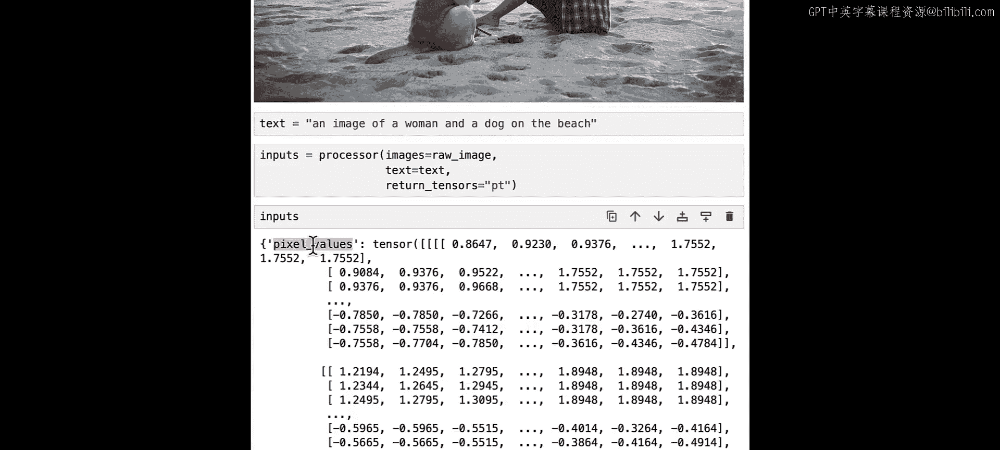

现在我们已准备好获取输出，只需将我们得到的`inputs`传递给模型。注意，我们需要添加`**`，因为我们传递的是一个包含参数的字典。

```python
outputs = model(**inputs)
scores = outputs.logits
print(scores)
```

## 解读模型输出 📈

如你所见，这些数字目前没有明确意义，因为它们是模型的原始输出（logits）。为了将这些值转换为我们能理解的形式，我们需要将它们传递给一个softmax层。softmax层的输出将给出概率。

我们需要导入torch，然后将得到的分数传递给softmax层。

```python
import torch
probs = torch.nn.functional.softmax(scores, dim=-1)
print(probs)
```

现在这个数字更有意义了。第一个值是图像和文本不匹配的概率，这个概率非常低。第二个值是匹配的概率。从数值来看，文本和图像确实以很高的概率匹配。

综上所述，我们可以说图像和文本以约98%的概率匹配。现在是暂停视频，尝试使用你自己的图像和提示词进行测试的好时机。

## 总结 🎯

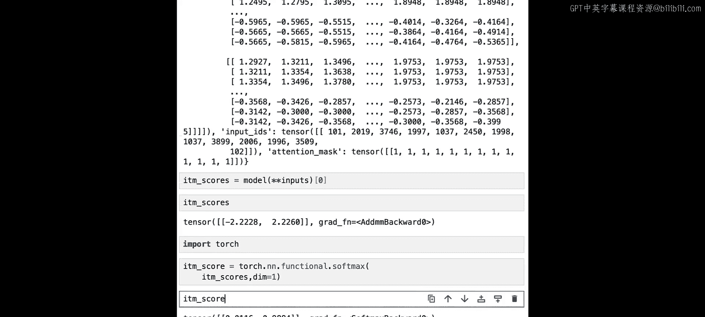

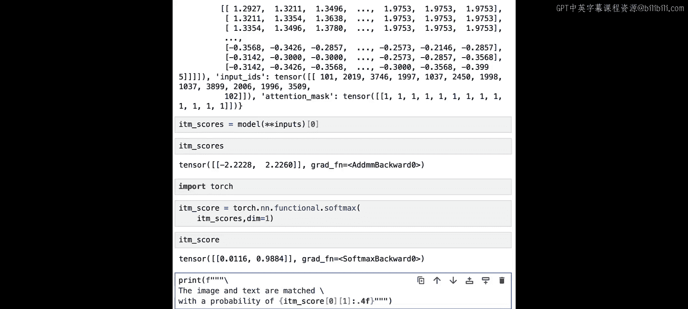

本节课中，我们一起学习了如何使用BLIP多模态模型进行图像文本匹配。我们了解了多模态模型的概念，加载了特定的模型和处理器，准备了图像和文本输入，运行了模型，并通过softmax函数将模型的原始输出解读为可理解的匹配概率。在下一课中，我们将使用相同的模型但下载不同的权重，来完成图像描述生成任务。