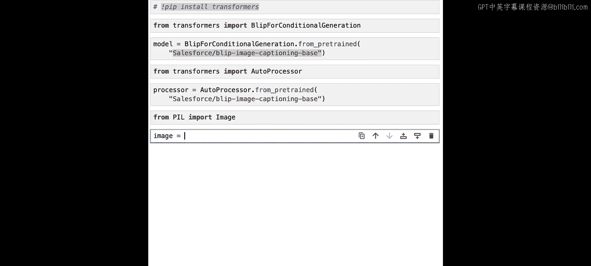
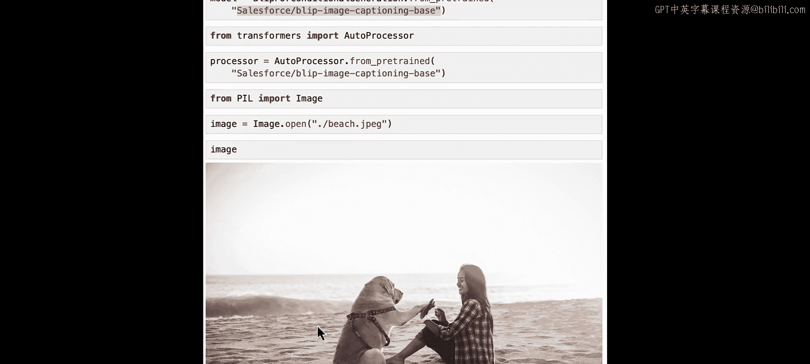
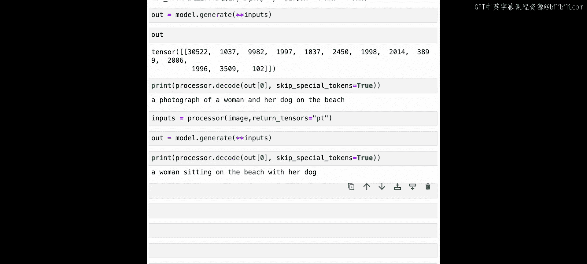

# 012：图像描述生成

在本节课中，我们将学习如何使用Hugging Face的模型进行图像描述生成。我们将使用BLIP模型，并分别尝试有条件的图像描述和无条件的图像描述。


## 概述

图像描述生成任务要求模型根据输入的图像，生成一段描述该图像内容的文字。例如，对于一张图片，模型应能输出“一个男人和一只狗在一起看书”。我们还可以为模型提供一个起始文本，引导其生成特定开头的描述。

## 加载模型与处理器

首先，我们需要加载用于图像描述生成的模型和相应的处理器。我们将使用 `transformers` 库中的 `BlipForConditionalGeneration` 模型。

```python
from transformers import BlipForConditionalGeneration, BlipProcessor
```

接下来，我们使用预训练的方法加载模型，并指定一个特定的检查点。

```python
model = BlipForConditionalGeneration.from_pretrained("Salesforce/blip-image-captioning-base")
```

处理器的加载方式与模型类似。

```python
processor = BlipProcessor.from_pretrained("Salesforce/blip-image-captioning-base")
```

## 准备图像

现在，我们有了执行图像描述生成的所有组件，只缺少图像本身和可选的引导文本。让我们先加载一张图像。我们将使用PIL库的 `Image` 类。

```python
from PIL import Image

image = Image.open("path_to_your_image.jpg")
```

为了演示，我们假设加载的是一张女人和狗在海滩上的图片。



## 有条件的图像描述生成

有条件的图像描述生成意味着我们可以为模型提供一个文本，作为其输出描述的开头。例如，我们可以输入“A photograph of”。

首先，我们需要使用处理器来处理文本和图像。

```python
text = "A photograph of"
inputs = processor(image, text, return_tensors="pt")
```



`return_tensors="pt"` 参数确保返回的是PyTorch张量。`inputs` 是一个字典，包含了 `pixel_values`、`input_ids` 和 `attention_mask` 等参数。

现在，我们可以使用模型的 `generate` 方法来生成图像描述。

```python
outputs = model.generate(**inputs)
```

`outputs` 是一个包含令牌ID（token IDs）的列表。为了将其解码为可读文本，我们需要调用处理器的 `decode` 方法。

```python
caption = processor.decode(outputs[0], skip_special_tokens=True)
print(caption)
```


输出结果可能是：“a photograph of a woman and her dog on the beach”。

## 无条件的图像描述生成

无条件的图像描述生成意味着我们不提供任何起始文本，完全让模型自由发挥，从头开始生成描述。

这次，我们只将图像传递给处理器。

```python
inputs = processor(image, return_tensors="pt")
```

然后，同样使用 `generate` 方法生成描述。

```python
outputs = model.generate(**inputs)
caption = processor.decode(outputs[0], skip_special_tokens=True)
print(caption)
```

输出结果可能是：“a woman sitting on the beach with her dog”。

## 动手尝试

现在是一个很好的时机，你可以暂停视频，尝试上传自己的图片，并为模型提供不同的条件文本，观察生成结果的变化。

## 总结

在本节课中，我们一起学习了如何使用Hugging Face的BLIP模型进行图像描述生成。我们实践了两种方式：
1.  **有条件的图像描述生成**：通过提供起始文本来引导模型输出。
2.  **无条件的图像描述生成**：让模型完全自主地生成描述。

我们了解了如何加载模型和处理器，处理图像和文本输入，使用 `generate` 方法生成描述，以及解码令牌ID得到最终文本。



下一节课，我们将测试视觉问答任务，即向模型提问关于图像的问题，并让它返回答案。