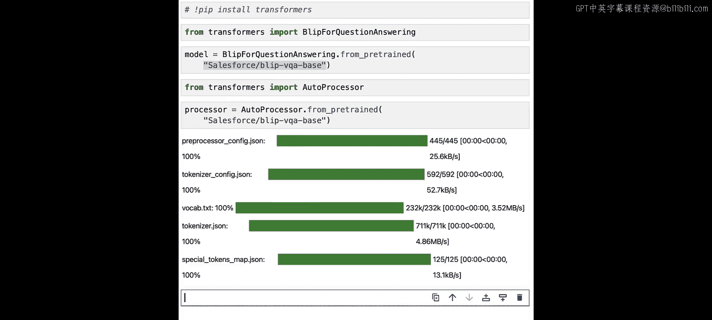
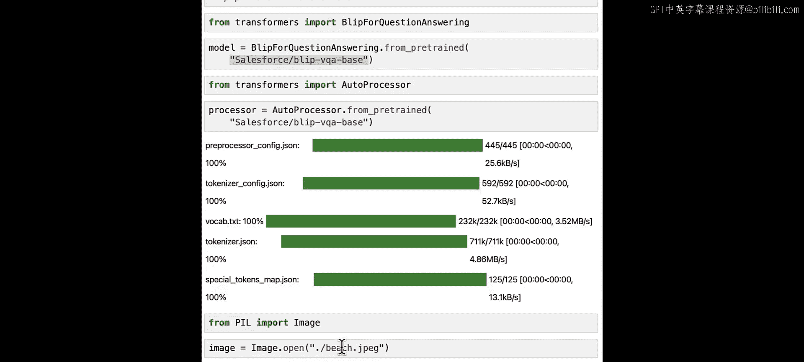
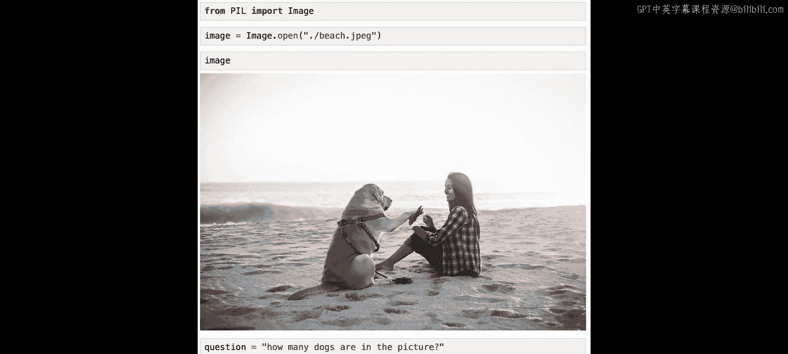
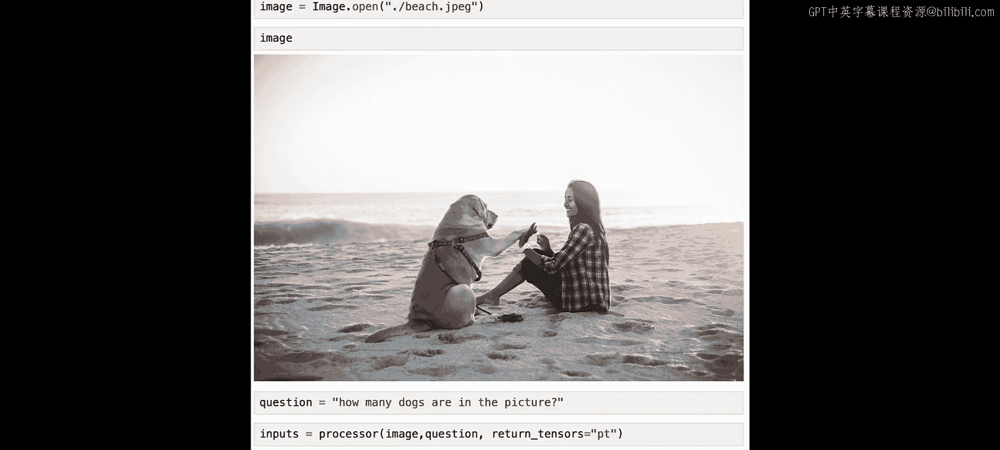
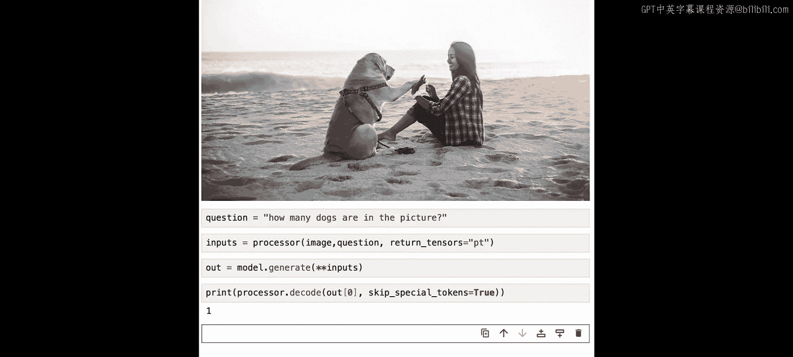

# 013：多模态视觉问答 👁️🗨️

在本节课中，我们将学习如何利用Hugging Face的BLIP模型进行多模态视觉问答。我们将向模型展示一张图片，并提出一个关于图片内容的问题，模型将根据图像信息生成答案。

## 概述

上一节我们介绍了图像描述生成。本节中，我们来看看如何让模型根据图像内容回答具体问题。我们将复用BLIP模型，但这次是用于“视觉问答”任务。这意味着你可以给模型一张图片和一个问题，模型会分析图片并给出答案。


## 加载模型与处理器

与之前任务类似，执行视觉问答任务需要模型和处理器。以下是加载它们的步骤：

首先，从`transformers`库中导入用于视觉问答的`BlipForQuestionAnswering`类。

```python
from transformers import BlipForQuestionAnswering
```

接着，使用`.from_pretrained()`方法加载预训练模型，并传入相关的模型检查点。

```python
model = BlipForQuestionAnswering.from_pretrained("Salesforce/blip-vqa-base")
```

然后，我们加载处理器。同样从`transformers`库导入`AutoProcessor`类。

```python
from transformers import AutoProcessor
```

使用相同的方法和检查点加载处理器。

```python
processor = AutoProcessor.from_pretrained("Salesforce/blip-vqa-base")
```



## 准备输入数据

现在，我们需要加载待处理的图像，并将其与问题一起传递给处理器以生成模型输入。

我们将使用PIL库来加载图像。

```python
from PIL import Image
image = Image.open("path/to/your/image.jpg")
```



假设我们加载的是一张“沙滩上的狗和女人”的图片。

## 执行视觉问答

接下来，我们可以向模型提出关于这张图片的问题。例如，我们可以问“图片中有多少只狗？”。

首先，使用处理器同时处理图像和文本问题，并返回PyTorch张量格式的输入。

```python
inputs = processor(images=image, text="How many dogs are in the picture?", return_tensors="pt")
```



然后，将处理好的输入传递给模型的`.generate()`方法以获取输出。



```python
outputs = model.generate(**inputs)
```

最后，使用处理器的`.decode()`方法将模型输出的张量解码为人类可读的文本答案。

```python
answer = processor.decode(outputs[0], skip_special_tokens=True)
print(answer)  # 输出应为：1
```

模型正确地回答了图片中只有一只狗。

## 总结



本节课中我们一起学习了如何使用Hugging Face的BLIP模型进行多模态视觉问答。我们回顾了加载模型与处理器的步骤，学习了如何准备图像和文本输入，并实践了向模型提问并获取答案的完整流程。你可以尝试对同一张图片提出其他问题，或者上传自己的图片进行测试。在下一课，我们将学习使用OpenAI的CLIP模型进行零样本分类。