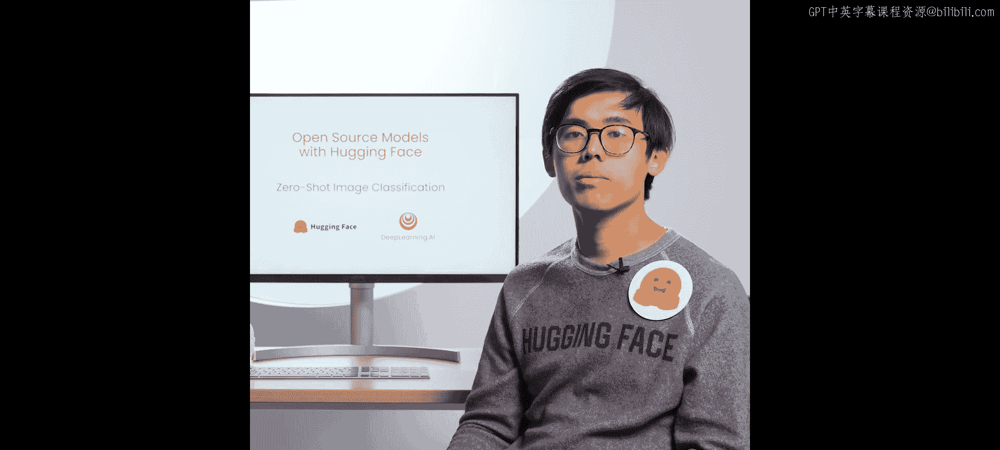
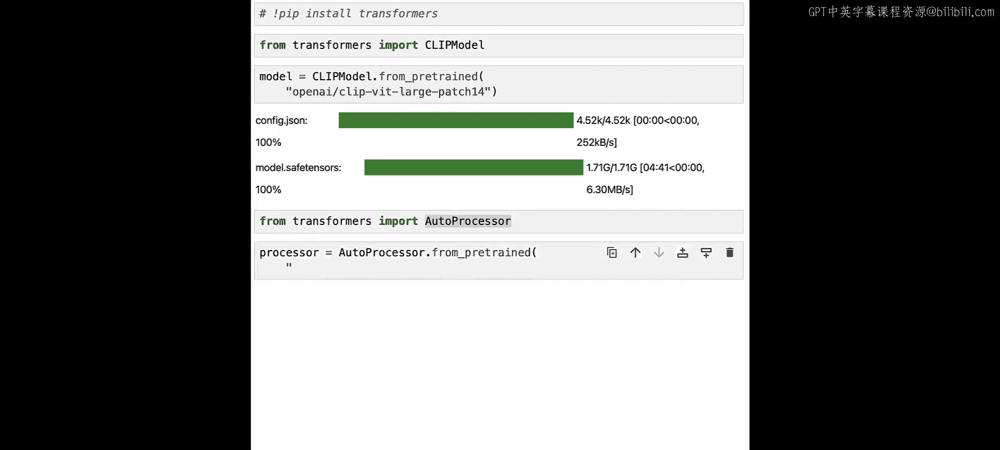
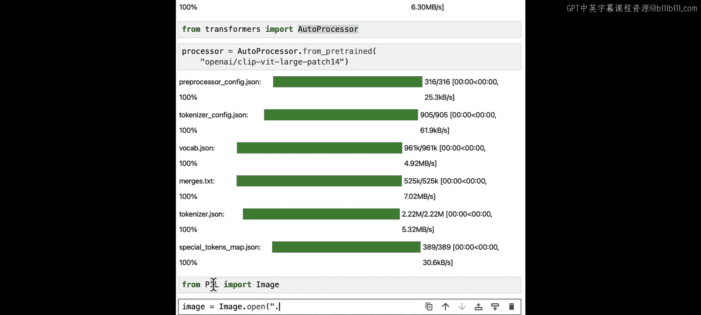
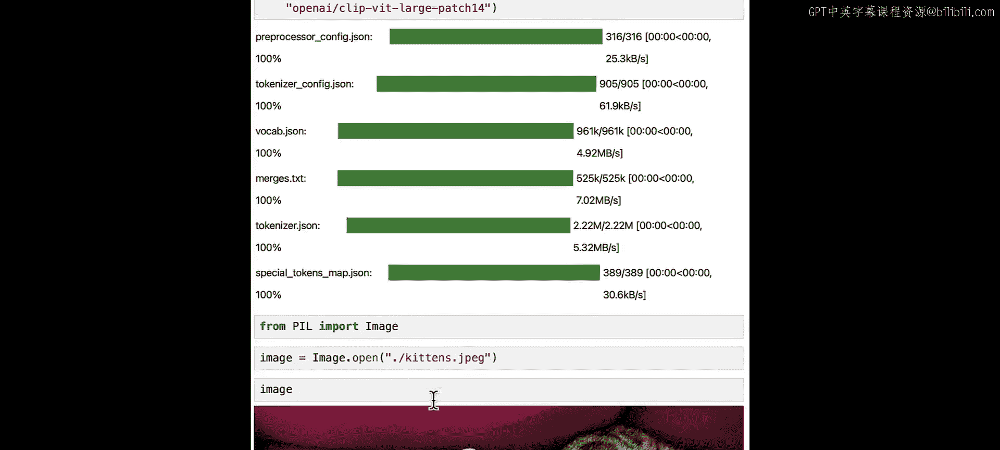
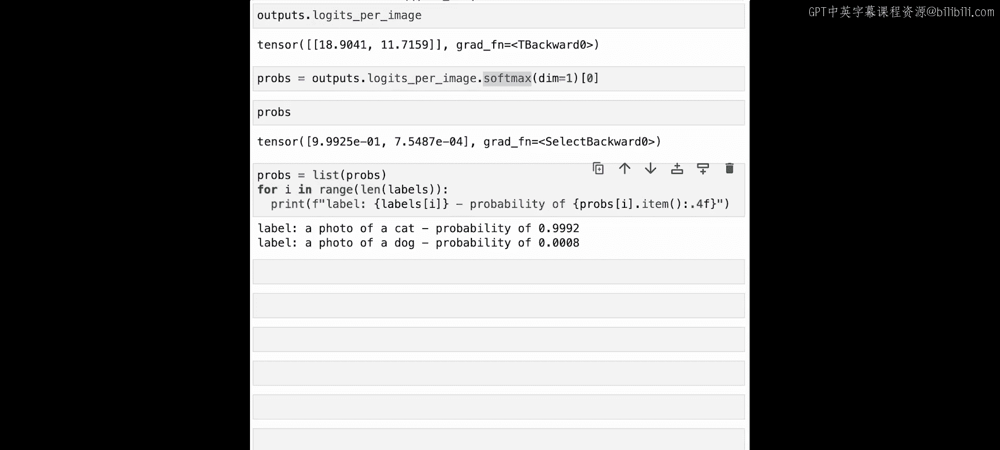

# 014：使用CLIP模型进行零样本图像分类 🖼️

在本节课中，我们将学习如何使用Hugging Face的CLIP模型进行零样本图像分类。零样本分类意味着模型能够根据你提供的任意标签列表来对图像进行分类，而无需针对特定类别进行额外的模型微调。

## 概述



上一节我们介绍了模型的基本加载。本节中，我们来看看如何利用CLIP模型执行零样本图像分类任务。CLIP是由OpenAI开发的多模态视觉-语言模型，它能够理解图像和文本之间的关联，从而实现无需特定训练的分类。

## 加载模型与处理器

与之前的课程类似，我们需要准备两样东西：模型本身和对应的处理器。

首先，我们从Transformers库中加载CLIP模型。我们使用`from_pretrained`方法，并传入适用于此任务的正确检查点。

```python
from transformers import CLIPModel, CLIPProcessor

model = CLIPModel.from_pretrained("openai/clip-vit-base-patch32")
```

模型加载完成后，我们接着加载处理器。处理器负责将原始图像和文本标签转换为模型可以理解的格式。

```python
processor = CLIPProcessor.from_pretrained("openai/clip-vit-base-patch32")
```

## 准备图像与标签

现在，让我们准备一张待分类的图像。我们将使用PIL库来加载图像。



```python
from PIL import Image
image = Image.open("path/to/your/image.jpg")
```

假设我们加载的图像是两只可爱的小猫。接下来，我们需要定义一组候选标签供模型选择。例如，我们可以创建以下两个标签：





*   `a photo of a cat`
*   `a photo of a dog`

## 执行分类推理

准备工作就绪后，我们可以开始进行分类了。以下是处理步骤：

首先，使用处理器同时处理图像和文本标签，生成模型所需的输入张量。

```python
inputs = processor(text=["a photo of a cat", "a photo of a dog"], images=image, return_tensors="pt", padding=True)
```

接着，将处理好的输入传递给模型，得到输出结果。

```python
outputs = model(**inputs)
```

模型的输出中，我们关注的是`logits_per_image`，它代表了图像与每个文本标签的匹配分数。为了得到概率值，我们需要对这些分数应用softmax函数。

```python
import torch
probs = outputs.logits_per_image.softmax(dim=1)
```

现在，`probs`是一个概率张量。例如，它的值可能类似于`tensor([[0.9999, 0.0001]])`。这意味着模型认为图像是“猫”的概率接近100%，是“狗”的概率接近0%。

## 尝试与探索

你可以暂停视频，尝试以下操作来加深理解：
*   更改标签列表，使用与图像内容无关的标签（例如“一辆汽车”、“一棵树”），观察模型的响应。
*   上传一张全新的图像，并使用不同的标签组合进行测试。

## 总结



本节课中，我们一起学习了如何使用Hugging Face的CLIP模型进行零样本图像分类。我们完成了从加载模型、准备数据、执行推理到解读结果的全过程。关键在于理解CLIP作为一个多模态模型，能够直接计算图像与文本描述之间的相似度，从而实现灵活且强大的零样本分类能力。在下一节课中，我们将学习如何部署BLIP模型。