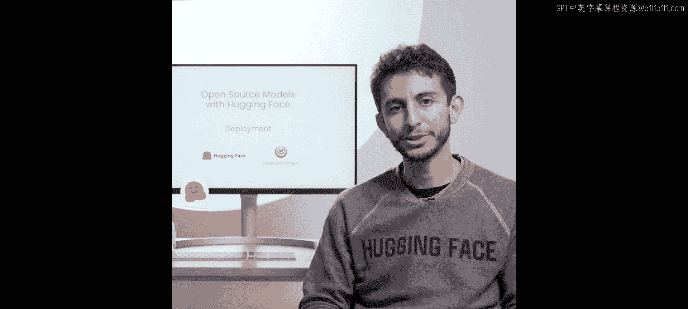
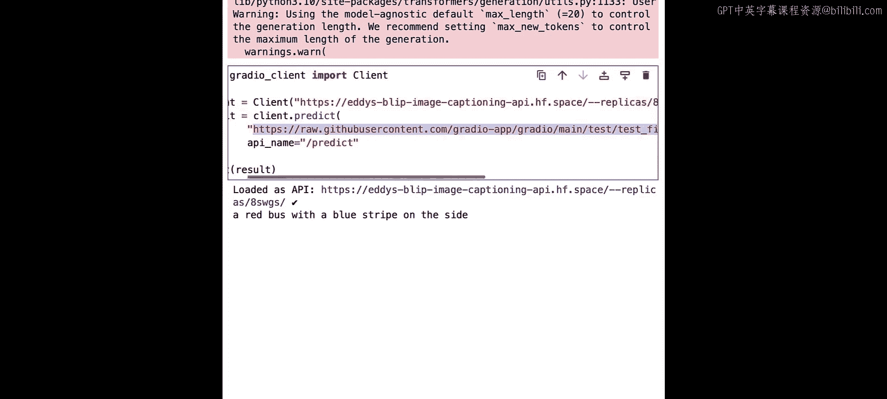
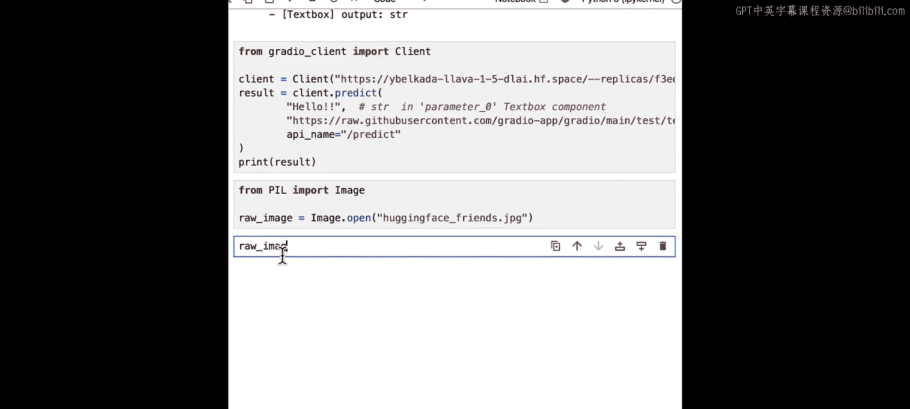
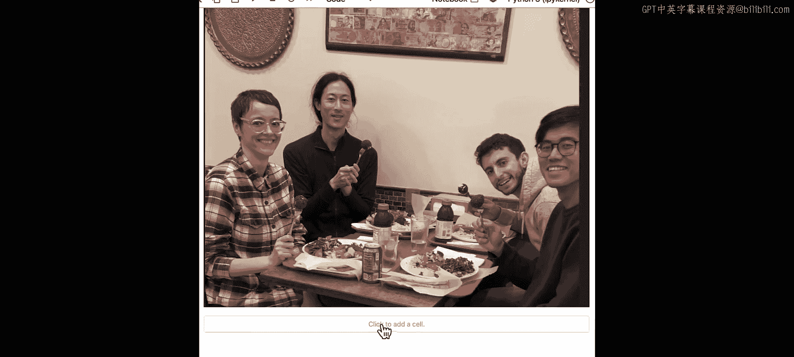
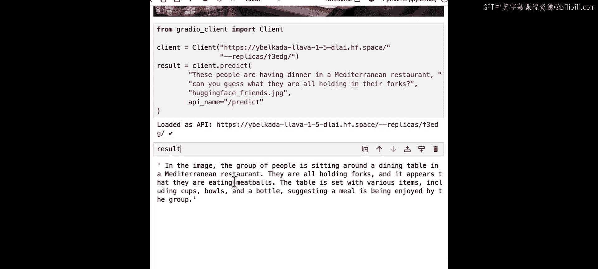
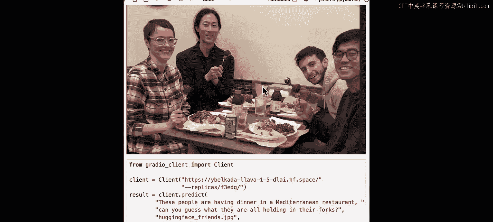
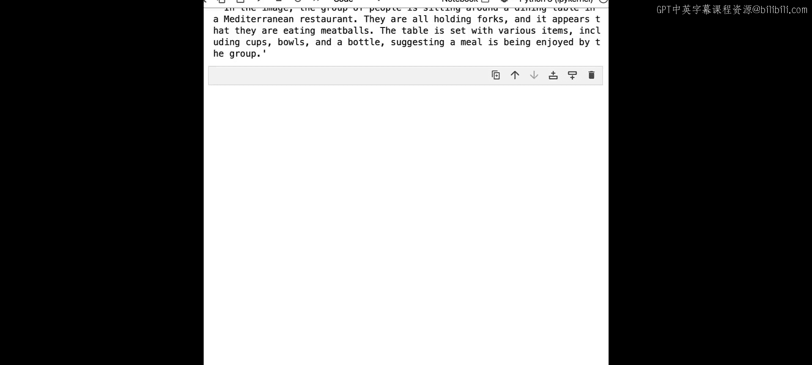

# 015：模型部署 🚀

## 概述



在本节课中，我们将学习如何利用Hugging Face Spaces将你的机器学习模型部署为可公开访问的演示应用和API。你将学会如何将本地运行的模型迁移到云端，使其无需依赖你的个人计算机即可持续运行。

---

## 创建Hugging Face Space

上一节我们介绍了Hugging Face生态系统中的各种任务。本节中我们来看看如何将你的应用部署到云端。

首先，你需要在Hugging Face网站（hf.co）上创建一个账户。登录后，在页面右上角点击“New Space”来创建一个新的空间。

以下是创建空间时需要填写的关键信息：
*   **空间名称**：例如 `blip-image-captioning-api`
*   **许可证**：可选择默认许可证
*   **SDK**：选择 `Gradio`
*   **硬件**：选择 `CPU basic`
*   **可见性**：设置为 `Public` 以便他人访问

创建完成后，你需要为该空间准备两个核心文件。

---

## 准备部署文件

空间创建后，需要配置运行环境。这主要通过两个文件实现。

**1. `requirements.txt` 文件**
此文件用于列出运行应用所需的所有Python库。

```txt
transformers
torch
gradio
```

**2. `app.py` 文件**
这是应用的主文件，包含了模型加载和Gradio界面的所有逻辑。

在编写部署代码前，最好先在本地进行测试。

---

## 本地测试与代码迁移

为了确保部署顺利，我们首先在本地Jupyter环境中测试应用的核心功能。

我们将使用 `transformers` 库的 `pipeline` 功能来加载BLIP图像描述模型，并用Gradio构建一个简单的交互界面。

```python
from transformers import pipeline
import gradio as gr

# 加载图像描述管道，使用BLIP基础模型
image_to_text = pipeline("image-to-text", model="Salesforce/blip-image-captioning-base")

# 定义处理函数
def launch(image):
    # 使用全局定义的pipeline进行处理
    result = image_to_text(image)
    # 提取生成的描述文本
    return result[0]['generated_text']

# 创建Gradio界面
demo = gr.Interface(
    fn=launch,
    inputs=gr.Image(type="pil"),
    outputs="text"
)

# 启动界面，并生成可分享链接
demo.launch(share=True)
```




本地测试成功后，即可将 `app.py` 文件中的代码（移除 `share=True` 参数）复制到Hugging Face Space的 `app.py` 文件中。等待Space自动构建完成后，你的应用就上线了。

---

## 将Space用作API

应用部署成功后，其价值不仅在于交互界面，更在于可以作为一个API被其他程序调用。

在Space页面上，点击“Use via API”选项卡，可以获取调用该API的代码示例。

以下是调用API的基本步骤：
1.  安装 `gradio_client` 库：`pip install gradio_client`
2.  使用提供的链接实例化客户端。
3.  调用 `predict` 方法并传入图像路径或URL。

```python
from gradio_client import Client

client = Client("你的Space链接")
result = client.predict(
    "path/to/your/image.jpg", # 图像路径或URL
    api_name="/predict"
)
print(result)
```

你还可以通过 `client.view_api()` 方法查看API的详细结构，包括输入参数和返回类型。

---

## 高级功能：私有空间与GPU加速

除了公开部署，Hugging Face Spaces还支持更高级的用例。

**部署私有模型**
如果你希望部署的模型或应用不公开，可以将Space的可见性设置为 `Private`。调用私有API时，需要在客户端实例化时传入你的Hugging Face访问令牌。





```python
client = Client("你的私有Space链接", hf_token="你的Hugging Face Token")
```

**使用免费GPU资源（Zero GPU）**
对于大型模型，CPU实例可能速度慢或内存不足。Hugging Face提供了免费的GPU资源（Zero GPU）。

使用方法如下：
1.  访问 `huggingface.co/zero-gpu-explorers` 组织并申请加入。
2.  申请通过后，创建新Space时，硬件选择中会出现 `Zero GPU` 选项。
3.  选择该选项，即可在需要时自动获得GPU加速，非常适合运行大模型。

---



## 总结与探索



本节课中我们一起学习了如何利用Hugging Face Spaces进行模型部署。我们涵盖了从创建Space、准备文件、本地测试到最终部署上线的完整流程。你还学会了如何将部署的应用作为API调用，以及如何使用私有部署和免费GPU资源来满足更复杂的需求。

鼓励你浏览Hugging Face Spaces主页，探索“本周精选空间”，从中获取灵感，并将你在整个课程中学到的知识转化为可以轻松分享给朋友和同事的酷炫应用。

---



**下一节**：我们将对课程进行总结。