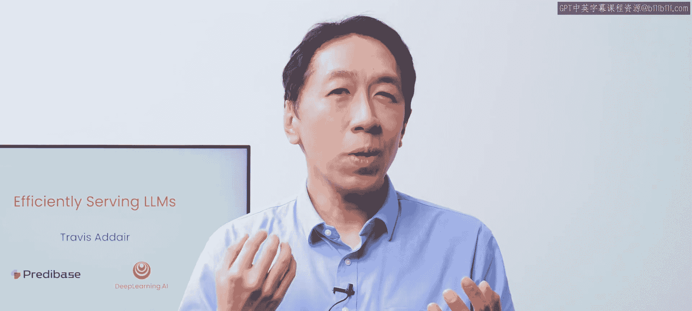
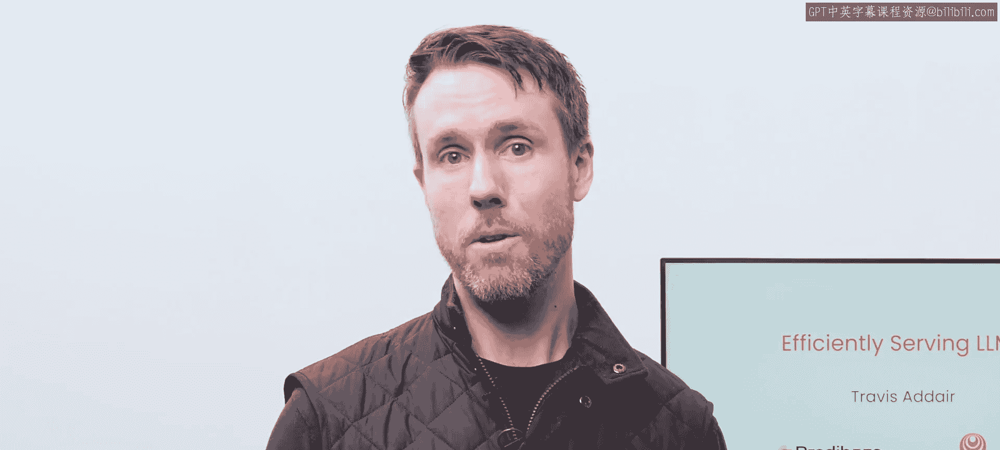
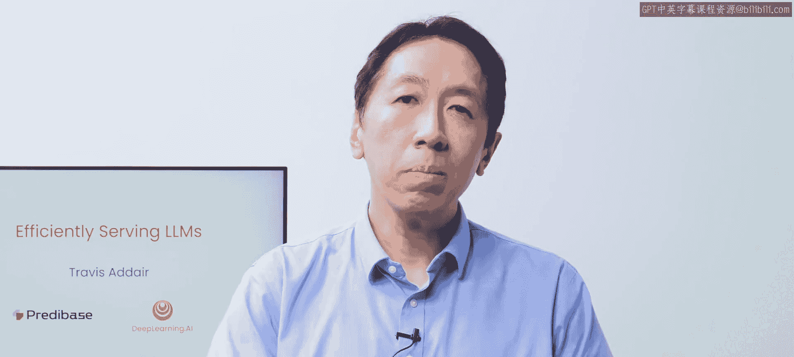
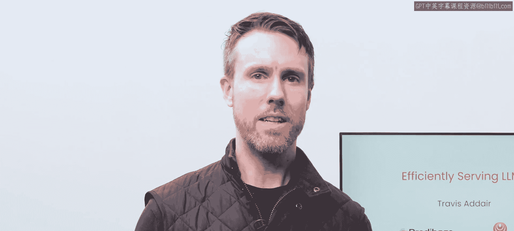
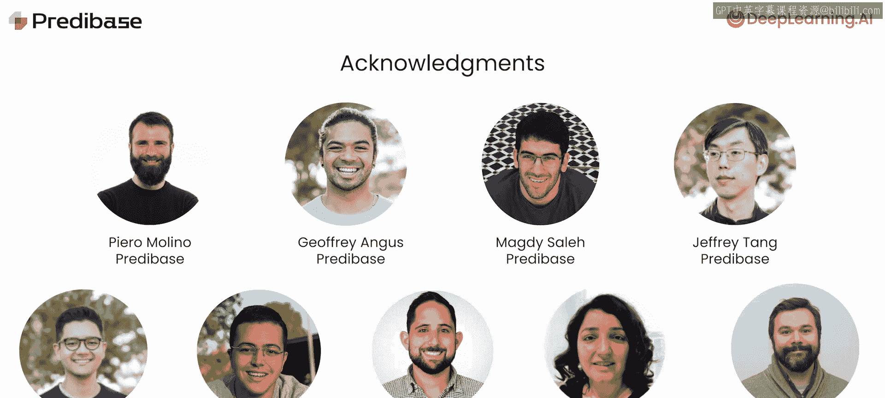

# 001：引言 🎯

在本课程中，我们将学习如何高效地服务大型语言模型。我们将深入探讨使LLM服务能够同时处理大量用户请求并保持良好性能的关键技术细节。理解这些内容将帮助您为自己的应用选择合适的服务方案，并优化其延迟和吞吐量。

欢迎来到《高效服务大型语言模型》课程，本课程是与Predbase合作制作的。

我是Andrew，与我一同授课的是Travis，他是Predbase的联合创始人兼首席技术官，也是本课程的讲师。

感谢Andrew。我很高兴能在这里与您一起教授这门课程。在这门课程中，您将学习关于如何服务大型语言模型的深层技术细节。

具体来说，您将学习关键技术思想，例如如何缓存Transformer网络推理过程中的部分计算，以便在构建使用LLM的应用程序时使这一过程更高效。这种深入的理解将帮助您评估LLM应用的各项指标，例如首词元生成时间和吞吐量，或许还能帮助您为服务自定义LLM选择合适的供应商。

许多LLM开发团队最初都从使用云托管API开始，这是快速上手的好方法。但随着团队逐渐成熟，我遇到越来越多希望使用开源LLM的开发者，包括针对自有数据进行微调的LLM。

但当使用开源或微调模型时，您需要找到托管或服务它的方法。在本课程中，您将学习LLM如何被高效服务的细节，包括允许您处理来自多个用户的许多请求的技术。这种深入的理解将帮助您就如何服务您的LLM做出正确的决策。

是的，Andrew。我曾与一些开发者合作，他们从Hugging Face上的开源LLM开始，并用Flask这样的简单Web服务器将其封装起来，结果发现性能远不及他们从商业LLM API获得的水平，尽管他们使用了强大的GPU来服务它。😊

结果是一个系统一次只能缓慢地处理一个请求，大多数用户只是在等待接收响应。幸运的是，得益于Predbase等公司的努力，现在比以往任何时候都更容易高效地同时为许多客户服务您的LLM。

这之所以成为可能，是因为采用了诸如**向量化**等技术，该技术允许模型在单次操作中处理多组用户输入，甚至同时处理多个微调模型。此外，还有像**KV缓存**这样的技术，它通过在每个词元生成后将Transformer网络注意力计算的部分结果存储在内存中来加速推理，这样在生成后续词元的每一步中就不必重新进行这些计算。😊

通过同时实施这几项技术，您可以同时改善**延迟**（即用户从发出提示到收到响应所需的时间）和**吞吐量**（即服务器处理请求的速率）。最好的托管服务已经将这些技术落实到位，它们是使您构建的任何自定义应用在部署中表现良好的绝佳选择。

在本课程中，您将首先详细了解自回归大型语言模型如何一次一个词元地生成文本。您将实现Andrew刚才提到的KV缓存技术，并了解它如何大幅降低后续每个词元的延迟。

接下来，您将学习如何将多个提示批处理成单个张量，以便LLM可以同时处理多个输入。然后，您将把这个想法扩展到一个称为**连续批处理**的技术，该技术允许您在新请求到达和旧请求完成时动态更新批次。这使得像Predbase这样的LLM托管服务能够同时为许多客户提供服务，并保持良好的延迟和吞吐量。

之后，您将实现一个**量化**函数，通过将模型权重转换为较低精度的表示形式来减少其内存占用。

在最后两节课中，您将学习像**LoRA**这样的参数高效微调技术如何使得在运行时动态加载和集成专门的微调适配器到您的LLM成为可能。然后，我们将结合多个LoRA与连续批处理，以同时服务数百个微调模型，同时保持高吞吐量和低延迟。

在Predbase，我们使用这些技术来经济高效且可扩展地为客户服务许多微调模型。因此，正如您所看到的，本课程呈现了一套非常详细的技术主题。

我认为开发者拥有这些基础知识非常重要，这样您就可以在设计和构建应用程序时做出明智的决策。

没错。掌握了本课程的知识后，您在考虑应用程序性能时将更好地理解必须做出的权衡，并且将更有能力评估潜在供应商为您提供的服务以及他们的承诺是否现实。

这将帮助您为您的项目和公司做出最佳决策。

许多人为本课程的制作提供了帮助。来自Predbase，我要感谢Pierero Molinino、Jeffrey Angus、Mar Di Sala、Jeffrey Tang、Noah Yohida、Michael Oteger。来自DeepLearning.AI，Dialla Eadin和Tommy Nelson也为本课程做出了贡献。

我希望您喜欢这门关于高效服务LLM的课程，并且您获得的知识将高效地服务于您的开发需求。让我们进入下一个视频开始学习吧。😊

---

**本节课总结**

在本节课中，我们一起学习了《高效服务大型语言模型》课程的引言部分。我们了解了课程的目标，即深入探讨高效服务LLM的核心技术，如**KV缓存**、**向量化/批处理**、**连续批处理**、**量化**和**LoRA**。这些知识旨在帮助开发者优化应用性能、理解延迟与吞吐量的权衡，并为服务自定义LLM做出明智的架构与供应商选择决策。