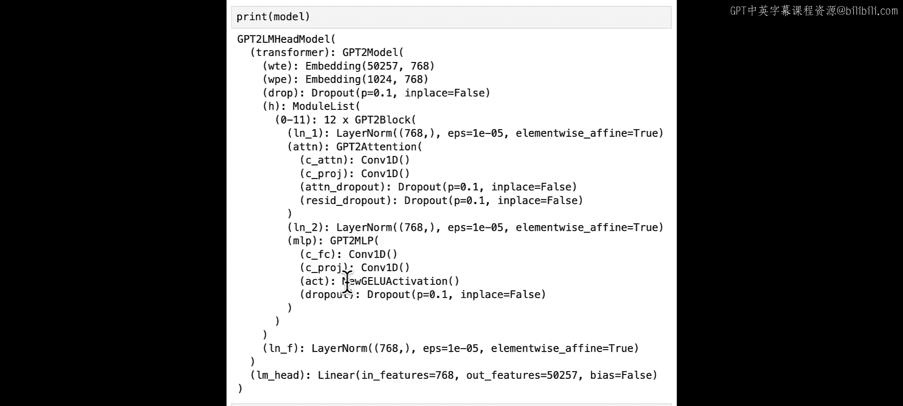
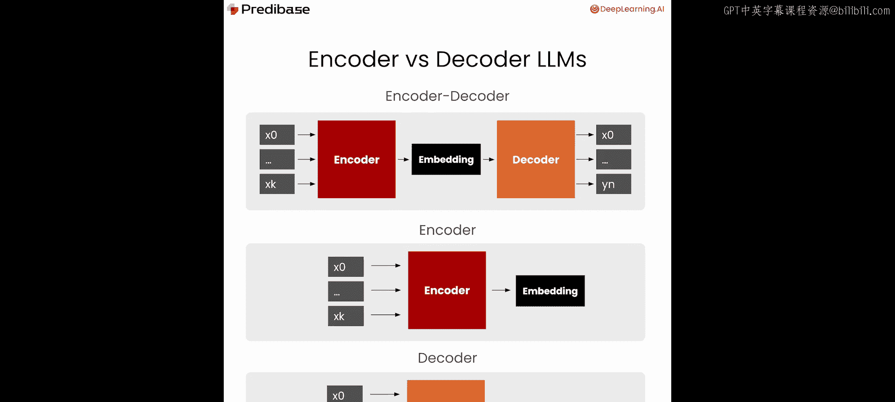
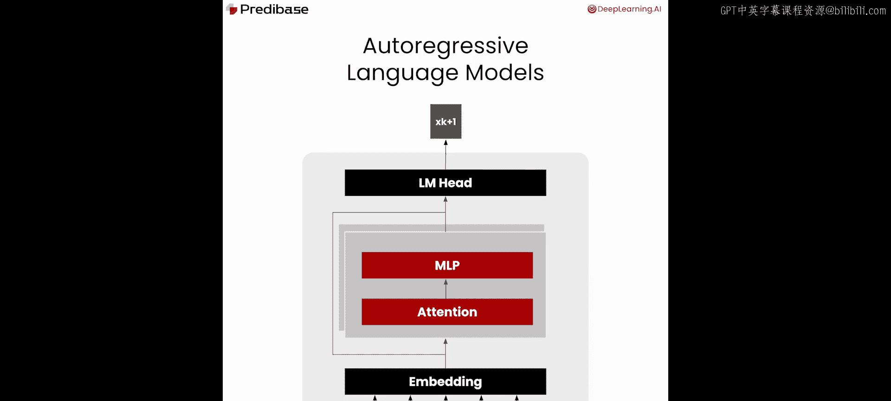
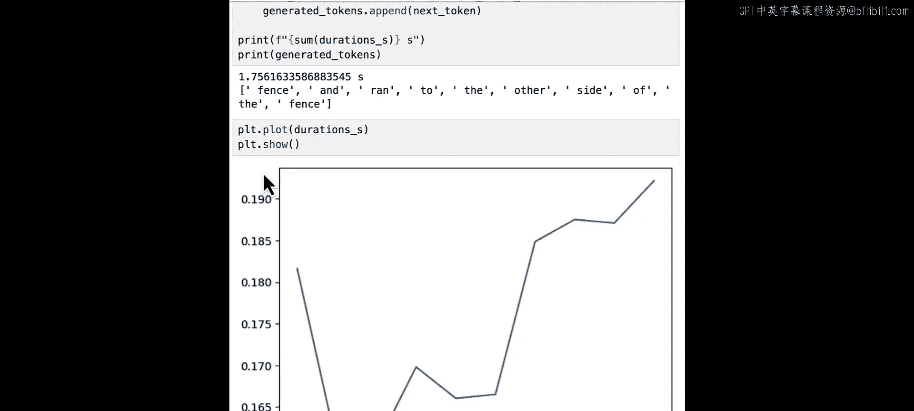
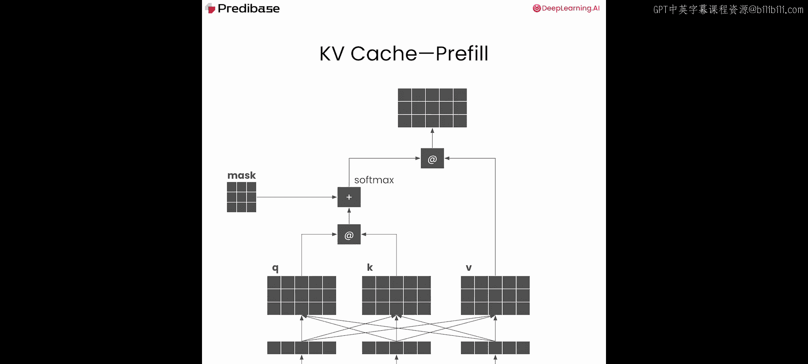
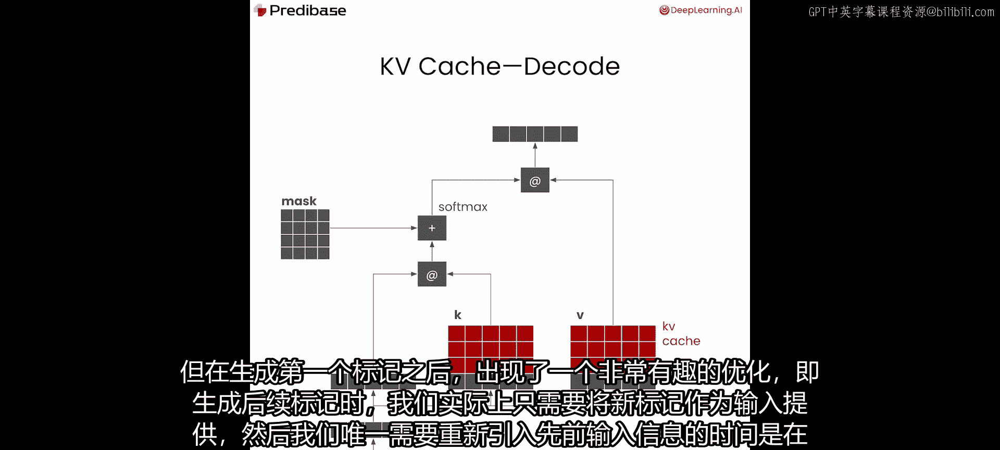
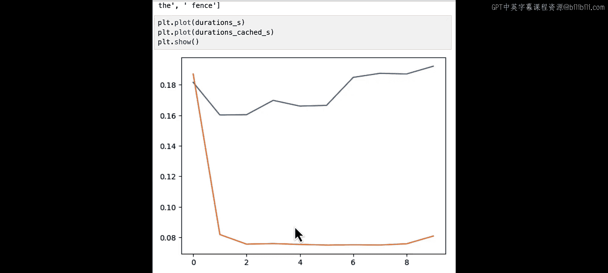

# 002：文本生成 🧠


在本节课中，我们将介绍使用自回归语言模型进行文本生成的过程。你将学习如何从模型输出中逐个迭代地生成词元，并了解这个过程如何被划分为**预填充**和**解码**两个阶段，以及如何使用 **KV 缓存** 来优化注意力计算以加速生成。让我们开始吧。

## 加载模型与理解架构

首先，我们需要加载一个语言模型作为示例。我们选择使用 Hugging Face 上的 GPT-2 模型及其分词器。尽管如今有更多更新的模型，但 GPT-2 因其模型小、推理速度快，在需要低延迟（如自动补全）的生产任务中仍然非常实用。

以下是加载模型和分词器的代码：

```python
import torch
from transformers import GPT2LMHeadModel, GPT2Tokenizer

model_name = "gpt2"
tokenizer = GPT2Tokenizer.from_pretrained(model_name)
model = GPT2LMHeadModel.from_pretrained(model_name)
```





对于 GPT-2 这类我们统称为大语言模型的 Transformer 模型，存在不同的架构类型。早期的编码器-解码器模型是首批出现的架构之一。编码器模型（如 BERT）将词元映射到嵌入空间，适用于分类和相似性搜索等任务。而 GPT-2 是一种**仅解码器**模型，它没有编码器。其工作原理是：将输入通过嵌入层，然后经过一系列由注意力机制和多层感知机组成的块进行处理，最终生成输出。这种仅解码器的结构在实践中会逐个生成词元，构成了我们所说的**自回归语言模型**，这也是现代大多数大语言模型的基础架构。

## 基础文本生成流程



现在我们已经实例化了模型，接下来探索如何让它生成文本。

我们从基础提示词开始：“the quick brown fox jumped over the”。首先，通过分词器处理这个输入，并以 PyTorch 格式返回结果。

```python
prompt = "the quick brown fox jumped over the"
inputs = tokenizer(prompt, return_tensors="pt")
print(inputs)
```

输出包含两个张量：
1.  `input_ids`：文本映射到词元 ID 的结果。
2.  `attention_mask`：一个全为 1 的张量，表示所有词元都应被关注。在后续讨论批处理时，我们会回到注意力掩码的概念。

现在，我们将输入传递给模型并查看输出。在推理时，我们使用 `torch.no_grad()` 来避免计算梯度，以节省内存。

```python
with torch.no_grad():
    outputs = model(**inputs)
logits = outputs.logits
print(logits.shape)  # 输出形状：(batch_size, sequence_length, vocab_size)
```

`logits` 是一个三维张量，形状为 `(1, 7, 50257)`，分别代表批大小、输入序列长度和词汇表大小。

为了确定模型预测的下一个词元，我们取 `logits` 中对应序列最后一个位置（即下一个词元位置）的值，并找出其中概率最高的词元 ID。

```python
# 获取下一个词元的 logits（取批次中第一个样本的最后一个词元位置）
next_token_logits = logits[0, -1, :]
# 选择概率最高的词元 ID（贪心解码）
next_token_id = torch.argmax(next_token_logits, dim=-1).item()
print(f"下一个词元 ID: {next_token_id}")
# 解码回文本
next_token = tokenizer.decode(next_token_id)
print(f"下一个词元: {next_token}")
```

运行后，模型预测的下一个词元是 “fence”。因此，完整的句子可能是 “the quick brown fox jumped over the fence”，这在语法和逻辑上都是合理的。

除了选择概率最高的词元（贪心解码），我们还可以查看概率最高的前 K 个候选词元。

```python
# 获取概率最高的前10个词元
top_k = 10
top_k_values, top_k_indices = torch.topk(next_token_logits, k=top_k)
for i in range(top_k):
    token_id = top_k_indices[i].item()
    token = tokenizer.decode(token_id)
    print(f"{i+1}: {token} (ID: {token_id})")
```

其他可能的词元包括 “edge”、“railing”、“wall” 等。在实际应用中，可以通过调整温度参数等解码策略来增加输出的多样性，而不是总是选择最可能的词元。

## 迭代生成与朴素方法的性能问题

对于自回归大语言模型，生成后续词元最直接的方法是：将前一步生成的词元 ID 拼接到原始输入中，形成新的输入，然后重复这个过程。

以下是生成下一个词元并更新输入的代码：

```python
# 将新生成的词元 ID 拼接到 input_ids 后
new_input_ids = torch.cat([inputs[‘input_ids‘], torch.tensor([[next_token_id]])], dim=-1)
# 同样更新 attention_mask，为新词元添加一个 1
new_attention_mask = torch.cat([inputs[‘attention_mask‘], torch.tensor([[1]])], dim=-1)
print(f"新的 input_ids 形状: {new_input_ids.shape}")
```

现在，让我们定义一个函数来封装单次词元生成的过程，并测量生成多个词元所需的时间。

```python
import time

def generate_token(input_dict):
    """接收包含‘input_ids‘和‘attention_mask‘的字典，生成下一个词元 ID。"""
    with torch.no_grad():
        outputs = model(**input_dict)
    logits = outputs.logits
    next_token_id = torch.argmax(logits[0, -1, :]).item()
    return next_token_id

# 生成10个词元并计时
generated_tokens = []
durations = []
current_inputs = inputs.copy()

for step in range(10):
    start_time = time.time()
    next_id = generate_token(current_inputs)
    durations.append(time.time() - start_time)

    # 解码并记录词元
    generated_tokens.append(tokenizer.decode(next_id))

    # 为下一次迭代准备输入：拼接新词元
    current_inputs[‘input_ids‘] = torch.cat([current_inputs[‘input_ids‘], torch.tensor([[next_id]])], dim=-1)
    current_inputs[‘attention_mask‘] = torch.cat([current_inputs[‘attention_mask‘], torch.tensor([[1]])], dim=-1)

total_time = sum(durations)
print(f"生成10个词元总耗时: {total_time:.2f} 秒")
print(f"生成的文本: {prompt} {‘ ‘.join(generated_tokens)}")
```



生成的结果可能是：“the quick brown fox jumped over the fence and ran to the other side of the fence”。这再次证明了生成文本的连贯性。

然而，我们需要关注这种朴素方法的性能。由于每一步都将整个增长中的序列重新输入模型，计算量会随着序列变长而增加。让我们绘制每一步的耗时图来观察趋势。

```python
import matplotlib.pyplot as plt



steps = list(range(1, len(durations)+1))
plt.plot(steps, [d*1000 for d in durations], marker=‘o‘) # 转换为毫秒
plt.xlabel(‘生成的词元序号‘)
plt.ylabel(‘单次生成耗时 (毫秒)‘)
plt.title(‘朴素方法下生成每个词元的耗时‘)
plt.grid(True)
plt.show()
```

图表显示，除了第一个词元可能因缓存未预热而稍慢外，后续每个词元的生成耗时随着输入序列变长而逐渐增加。这是因为 Transformer 模型中最大的计算瓶颈——**注意力计算**——的复杂度与输入序列长度成正比。

## KV 缓存优化：预填充与解码阶段



注意力计算涉及为输入序列中的每个词元生成查询（Q）、键（K）、值（V）矩阵。在生成第一个词元后，一个关键的优化点出现了：在生成后续词元时，我们实际上只需要为新词元计算 Q、K、V。而对于所有先前词元的 K 和 V 值，它们可以被缓存起来重复使用，而无需重新计算。

这引出了 **KV 缓存** 的概念，它是 LLM 推理中最基础的优化之一，并将词元生成过程分离为两个阶段：
1.  **预填充阶段**：处理整个初始提示词，生成第一个词元，并计算并缓存所有输入词元的 K 和 V 值。
2.  **解码阶段**：基于缓存和最新生成的词元，逐个生成后续词元。每次只需为新词元计算 K 和 V，并与缓存拼接后进行注意力计算。

现在，我们修改生成函数以利用 `past_key_values`。

```python
def generate_token_with_past(input_ids, attention_mask, past_key_values=None):
    """使用 KV 缓存生成下一个词元。"""
    with torch.no_grad():
        outputs = model(input_ids=input_ids,
                        attention_mask=attention_mask,
                        past_key_values=past_key_values,
                        use_cache=True) # 启用缓存
    logits = outputs.logits
    next_token_id = torch.argmax(logits[0, -1, :]).item()
    # 返回新的词元 ID 和更新后的 past_key_values
    return next_token_id, outputs.past_key_values

# 使用 KV 缓存重新生成10个词元并计时
generated_tokens_cached = []
durations_cached = []
current_input_ids = inputs[‘input_ids‘] # 初始提示词
current_attention_mask = inputs[‘attention_mask‘]
past_kv = None

for step in range(10):
    start_time = time.time()
    next_id, past_kv = generate_token_with_past(current_input_ids, current_attention_mask, past_kv)
    durations_cached.append(time.time() - start_time)

    generated_tokens_cached.append(tokenizer.decode(next_id))

    # 关键变化：下一次输入仅是新生成的词元，而不是整个历史序列
    current_input_ids = torch.tensor([[next_id]])
    # 注意力掩码需要增长，以告知模型新词元的位置
    current_attention_mask = torch.cat([current_attention_mask, torch.tensor([[1]])], dim=-1)

total_time_cached = sum(durations_cached)
print(f"使用 KV 缓存生成10个词元总耗时: {total_time_cached:.2f} 秒")
```

使用 KV 缓存后，总时间显著下降。让我们对比两种方法的单步耗时：

```python
plt.plot(steps, [d*1000 for d in durations], marker=‘o‘, label=‘无缓存‘)
plt.plot(steps, [d*1000 for d in durations_cached], marker=‘s‘, label=‘有 KV 缓存‘)
plt.xlabel(‘生成的词元序号‘)
plt.ylabel(‘单次生成耗时 (毫秒)‘)
plt.title(‘KV 缓存优化效果对比‘)
plt.legend()
plt.grid(True)
plt.show()
```

图表清晰地展示了优化效果：在预填充阶段（生成第一个词元），两者耗时相近。但在解码阶段，使用 KV 缓存的方法耗时大幅降低并保持稳定，因为每次只处理一个新词元，避免了重复计算历史序列的注意力。这正是 LLM 推理系统核心的优化手段。

## 总结与展望

本节课中，我们一起学习了使用自回归语言模型进行文本生成的基础流程：
1.  我们了解了如何加载模型、处理输入并获取下一个词元的预测。
2.  我们分析了朴素迭代生成方法存在的性能问题，即随着序列变长，计算开销线性增长。
3.  我们深入探讨了 **KV 缓存** 这一核心优化技术。它通过将生成过程分为**预填充**和**解码**两个阶段，缓存注意力机制中的键（K）和值（V），避免了大量冗余计算，从而极大地提升了生成效率。

KV 缓存是优化 LLM 文本生成的第一个重要里程碑。在此基础上，还有更多高级优化技术（如分页注意力）可以进一步优化内存和计算效率。不过，仅 KV 缓存就能带来绝大部分的收益。



在下一节课中，我们将把讨论提升一个层次，开始探讨**批处理**技术。批处理对于构建能够同时处理多个并发请求的服务系统至关重要，它将帮助我们提高系统的吞吐量。