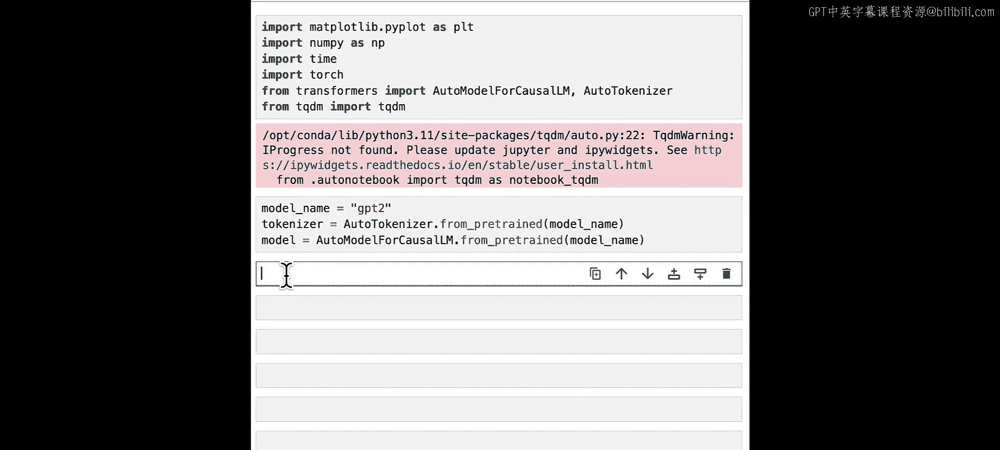
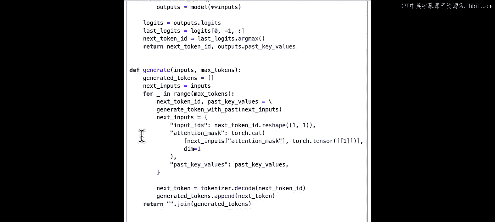
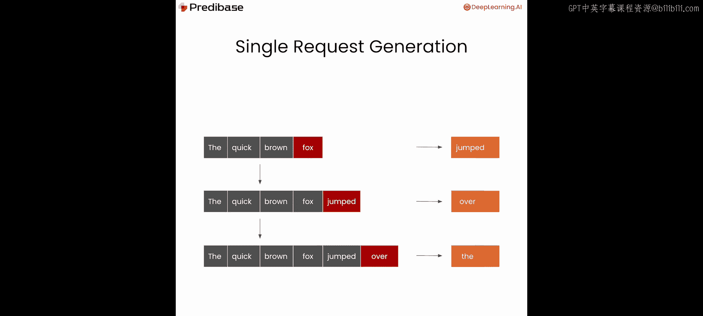
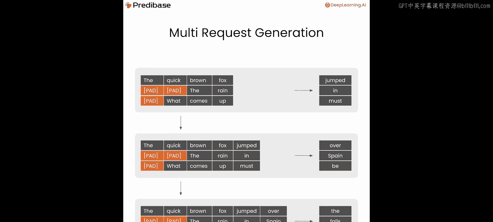
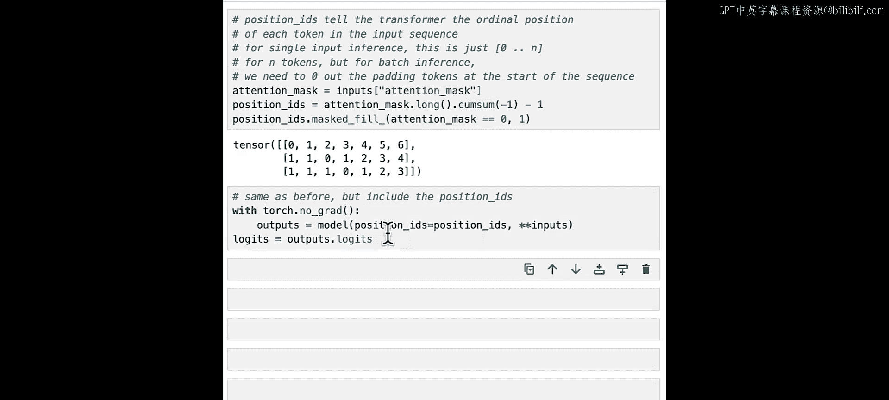
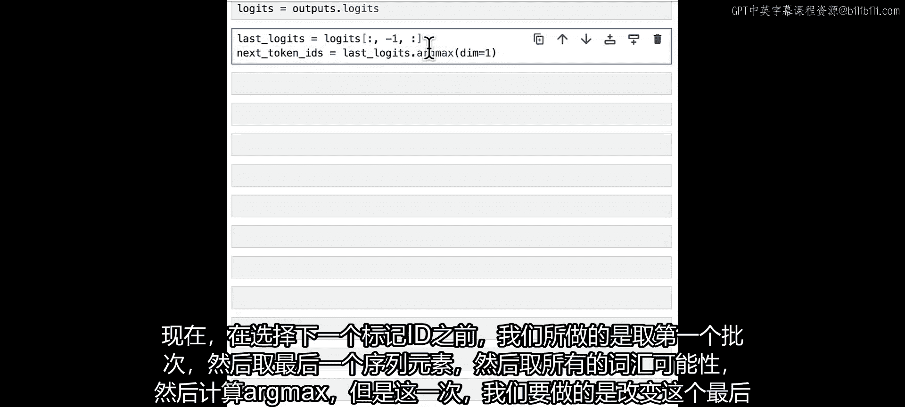
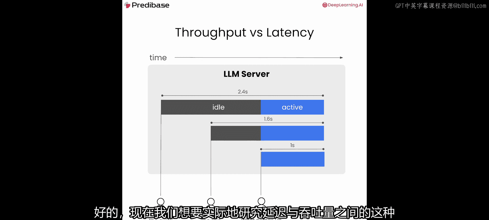
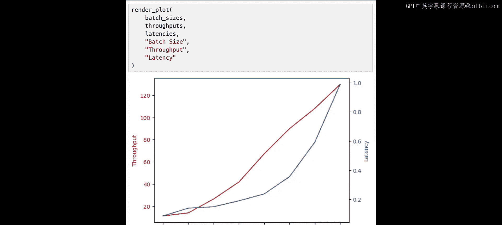

# 003：L2-批处理 🚀

在本节课中，我们将学习如何将多个请求批量处理，以提升服务效率。我们将探讨吞吐量与延迟之间的权衡关系，并通过代码实践来理解批处理的具体实现。

---

在上一节课中，我们学习了如何高效地为单个请求生成文本。

本节中，我们将扩展这一概念，将多个请求批量处理，并观察这如何在处理更多请求（称为**吞吐量**）与快速响应任一请求（称为**延迟**）之间形成权衡。

让我们深入代码。首先，我们将使用与之前相同的依赖项：我们熟悉的GPT-2模型，以及在第一课中创建的相同生成工具函数。但这次，我们将扩展此函数，使其不仅支持单个输入，还能支持多个输入，并观察如何优化其性能。

在上一课中，我们讨论了如何为单个输入逐个生成下一个令牌。例如，对于输入“the quick brown f”，我们生成“jumped”，然后它成为下一步的输入。

现在输入变为“the quick brown Fo jumped over”，我们重复此过程直到决定停止。但在多请求或批处理上下文中，我们需要引入**填充令牌**，目的是使每个输入的维度保持一致，从而得到一个形状规则的张量（在本例中看起来像一个普通的二维矩阵）。因此，对于引入的这些新序列，例如“the rain”和“what comes up”，我们在左侧有这些填充令牌，其目的是确保矩阵的整体形状一致。

让我们从第一课的内容开始，快速检查是否能生成预期的输出。我们的输入仍然是“the quick brown Fo jumped over the”，输出是“fence and ran to the other side of the fence”。

很好，我们得到了预期的结果。现在，让我们看看如何将其扩展到多个输入。

我们需要做的第一件事是对模型和分词器进行一些小修改，以引入一个填充令牌。此外，我们需要定义填充的位置：是在输入序列的左侧（这样我们将有前导填充令牌）还是在右侧（这意味着我们将有尾随填充令牌）。这在一定程度上取决于模型，也取决于你是在进行训练还是推理。对于推理，通常希望进行左填充，因为我们将在输入的右侧追加令牌。自然地，我们希望填充左侧，以避免出现像“the quick brown fox pad pad pad jumped over the lazy dog”这样的序列。

现在，我们将不再将提示定义为一个字符串，而是创建一个包含三个提示的列表。和之前一样，我们的目标是为这三个序列中的每一个生成后续的自然令牌。

和之前一样，我们将把这些输入传递给分词器。幸运的是，Hugging Face的分词器类知道如何处理提示列表以及单个提示。我们将像以前一样返回PyTorch格式，但还会添加一个新参数`padding=True`，这将使用我们之前添加到分词器中的填充令牌来填充提示，使它们位于一个具有规则形状的单个张量中。

现在，让我们看看这次分词器输出了什么。

可以看到，现在我们有一个形状为`(3, 7)`的输入ID张量，其中3是批次大小，7是我们提供的所有输入中的最大序列长度。你会注意到，对于较短的序列（即后两个序列），它们以令牌`50256`开始，这是我们之前引入的填充令牌。因此，它们都被填充到长度为7，并在开头有前导填充。

在上一课中，我们简单提到了注意力掩码，但没有深入细节。但这次，注意力掩码不仅仅是全为1的向量。你会注意到，注意力掩码也包含零，具体来说，零对应于我们引入的填充令牌。这实际上是在告诉模型，它不应该关注填充令牌，换句话说，在思考这个令牌如何与其他令牌关联时，它不应该真正考虑填充令牌，而应该基本上忽略它们，以免影响我们想要生成的总体输出。

现在，让我们回到生成下一个令牌的问题，给定这三个已批处理到单个输入ID张量中的输入序列。在处理批处理输入时，我们想引入的一个新概念是**位置ID**。这些位置ID在这种情况下特定于Hugging Face Transformer的实现，但本质上只是告诉模型输入序列中每个令牌的顺序位置。因此，这只是一个从0到n的列表（n个令牌），但对于批量推理，我们需要将其填充，将序列开头的填充令牌设为零，这样它们就不会对递增序列产生影响。我们将首先这样做。

你可以看到，这里填充令牌有一些额外的1，但在我们经过填充令牌后，序列才真正开始。接下来，我们将使用与之前相同的`with torch.no_grad()`将其传递给模型，但现在我们还将包含这些位置ID，然后输出将再次是逻辑值。

之前，为了选择下一个令牌ID，我们取了第一个批次，取了最后一个序列元素，然后取了所有词汇可能性，然后计算了argmax。但这次，我们将改变这个最后的逻辑值计算，改为在所有批次上进行选择。然后，我们不取全局argmax，而是希望返回一个下一个令牌ID的向量，每个批次一个。为此，我们将在这个维度上取argmax。因此，我们基本上将保留批次维度。如果我们尝试将`dim`更改为不同的值而不是1，我们实际上是在说序列维度的下一个令牌或类似的东西，这不是我们想要的。所以这确保了我们不会交叉处理，意外地跨不同批次计算argmax。因此，每个批次元素都有一个对应的下一个令牌ID。让我们运行它。

如果我们打印出这些下一个令牌ID，可以看到，正如预期的那样，我们有三个：第一个序列对应这个令牌，第二个序列对应那个令牌，第三个输入序列对应第三个令牌。最后，我们可以将这些令牌ID转换为字符串。

我们得到了什么？我们得到了“fence”、“on”和“B”。如果你还记得原始序列是：“the quick brown fo jumped over the fence”、“The rain in Spain falls on.”和“what comes up must.”。所以，虽然这些不完全符合我们预期的陈词滥调，但它们实际上在语法上都是正确的，并且是你期望会自然完成那些原始句子的合理内容。

现在，我们将尝试将所有内容整合在一起，生成不止一个令牌，而是像之前一样在循环中生成n个令牌，使用一个辅助函数`generate_tokens_from_past`，但这次它将是`generate_batch_tokens_with_past`。

这实际上是我们第一课中使用的实现，当时我们只使用批次中的一个元素，并且取全局argmax。所以这次，让我们改变它，以便我们处理批次中的所有元素，而不仅仅是第一个，并且我们将计算下一个令牌ID，而不是单个下一个令牌ID。在维度1上计算，然后像以前一样返回下一个令牌ID以及我们的过去键值。

现在我们已经有了从特定批次生成下一个令牌的函数，让我们继续构建一个函数，该函数将为某个限制（例如`max_tokens=10`）生成所有令牌，即我们想要为批次中的每一行生成的令牌数量。

我们要做的第一件事是定义这个列表`generated_tokens`，它最初只是三个空列表，对应我们的三个提示批次。接下来，我们将使用注意力掩码来生成位置ID，排除对应于填充令牌的注意力掩码中的零元素。然后，我们将扩展我们的批次以包含这些位置ID，以及我们最初想要传递给模型的所有其他关键字参数。

现在，和以前一样，我们将迭代我们想要生成的令牌数量。我们过程中的第一步将只是为当前批次的每个批次元素生成下一组令牌ID。现在，让我们开始有趣的部分：根据之前的输入和我们刚刚生成的新令牌集构建下一个批次的输入。和以前一样，我们将使用上一个批次生成的输入ID作为下一个批次的输入ID。这里我们使用此过程的KV缓存版本，在所谓的预填充步骤中，我们在最开始丢弃原始批次的输入。对于位置ID，我们想做类似的事情，我们取位置ID的最后一个元素并将其加一，然后我们实际上将丢弃序列中的所有先前元素。所以我们将只取最后一个元素，但保留完整的批次维度。因此，最终我们将得到一个形状为`(batch_size, 1)`的张量。这将告诉我们提供的这组下一个令牌的位置ID是什么。`unsqueeze`只是一个PyTorch辅助函数，它将帮助我们获得我们想要的精确形状。对于注意力掩码，我们将做与之前完全相同的事情，我们将取之前的注意力掩码并将其扩展一。但这里有一个稍微不同的附加注意事项：我们实际上需要附加一个形状等于批次维度形状的全1向量，而不仅仅是附加一个1到注意力掩码。最后，我们的过去键值只是我们从上一个令牌生成的过去键值，所以那部分没有变化。

现在，让我们继续将我们在这次特定迭代中生成的下一个令牌ID向量转换为字符串列表，每个批次一个。然后，对于批次中的每个元素，我们将把刚刚生成的新令牌附加到该列表中。最后，我们将把所有令牌连接成一个字符串，而不仅仅是一个列表，并将其作为辅助函数的最终输出返回。

此时，我们有一个名为`generate_batch`的辅助函数，它接受从分词器输出的输入字典和我们想要生成的新令牌的最大数量，因此我们可以像调用任何其他函数一样调用它，看看最后会发生什么。

现在，让我们尝试打印出`generate_batch`函数实际生成的内容。为此，我们将做一些有趣的事情：我们将用红色渲染生成的令牌，以便在视觉上将它们与原始输入区分开来。

你可以看到，对于我们的三个序列中的每一个，我们都生成了看起来非常可理解的内容。在这一点上，我们可以相当有信心地认为模型正在有效地进行批处理。特别是因为我们的第一个序列与我们在单个批次中执行此操作时生成的输出完全相同，我们知道通过引入这种批处理，我们最终仍然得到相同的输出，因此在添加这些额外序列到批次的过程中没有引入交叉污染。

批处理的一个既定目标是提高系统的吞吐量，即在多个请求同时到达的情况下，我们在一定时间内可以生成的令牌数量。在本节课的这一部分，我们将探讨批处理对延迟（生成每个令牌所需的时间）以及整体吞吐量的影响，并观察吞吐量和延迟之间存在根本的权衡关系。

为了说明这一点，让我们从一个仅处理延迟优化系统的示例开始，其中每次收到请求时，我们都将贪婪地处理它，不进行批处理。我们用不同的颜色表示时间线上特定输入从空闲到被处理的时段。因此，“the quick brown f”到达，我们立即处理它。下一个请求到达，它需要在原始输入仍在处理时空闲一段时间，然后同样，它立即被贪婪地拾取，第三个请求也是如此。这旨在优化我们的系统以降低延迟，我们试图最小化任何单个请求的等待时间。在这里，我们看到我们的延迟平均为每个请求1.2秒，但我们的吞吐量总体上仅为每秒1个请求，因为我们没有进行任何批处理，所以每个序列最终都必须等待轮到它。

但在一个批处理的世界里，我们可以思考如何在延迟和吞吐量之间进行权衡，以优先考虑吞吐量而非延迟。我们可以做的一件事是，实际上选择等到一定数量的请求到达或达到某个时间限制后再处理请求。在这种情况下，我们实际上稍微损害了延迟，因为最初发出请求的用户必须等待一段时间。但我们在特定时间间隔内处理的请求总数实际上在增加。在这种情况下，我们现在能够每秒处理1.2个请求，而之前我们只能每秒处理1个请求。这是一个很好的例子，说明优先考虑批处理可以帮助我们获得更好的吞吐量，但会牺牲我们可以交付给用户的延迟。

现在，我们想通过实验研究这种延迟与吞吐量的影响，并试图理解等待不同批次大小对总吞吐量（我们每秒能够生成的令牌数量）和平均延迟（平均生成每个令牌所需的秒数）的影响。

首先，为我们的实验设置定义一些常量。在本例中，我们将为想要生成的令牌数量定义一个常量，即10。然后，我们将定义一些数据结构来测量持续时间（每个样本处理所需的时间）、吞吐量（每个实验样本的吞吐量）和延迟（每个样本的平均延迟）。

现在，让我们继续设置我们想要测试的实验样本，这些将是我们要探索的不同批次大小。在本例中，我们将尝试不同的2的幂，基本上从1到128，看看这对吞吐量和延迟有什么影响。

为了运行我们的实验，我们将首先遍历列表中的每个批次大小，并在进行过程中进行一些简单的调试，我们将在每一步打印出批次大小。接下来，我们将为每个批次生成令牌并记录持续时间。所以这里的第一步是：当前时间是什么？第二步，我们将从一组大小为`batch_size`的提示中形成一个批次。我们将说`for i in range(batch_size)`，我们将从原始的三个提示列表中抓取一个提示，并按顺序取它们。这里的模运算确保我们可以为任何给定的`i`值抓取一个提示。这只是为了确保我们发送到批次的提示有一些多样性，而不是一遍又一遍地说同一个。然后，我们将像之前一样通过分词器发送它们，进行填充并返回PyTorch格式。生成批次，因此我们将最终输出生成为一个字符串，然后最后记录整个过程花费的持续时间（秒）。

接下来，我们将继续记录该特定批次大小的吞吐量和平均延迟的观察结果。首先，我们想计算我们总共生成了多少个令牌，即`batch_size * max_tokens`。然后可以通过取令牌数量除以持续时间（秒）来计算吞吐量。这里的平均延迟可以通过取持续时间（秒）除以`max_tokens`得出。这里唯一的区别是，令牌数量值不参与平均延迟计算。最后，我们将这些值附加到我们的列表中，以便稍后用于可视化。

让我们运行这个，看看我们得到了什么。如果你只是目测，可以看到随着批次大小的增加，延迟开始时很低，然后随着时间的推移开始上升，吞吐量也开始上升。你可能记得我们希望更高的吞吐量（更高的吞吐量是好的），我们希望更低的延迟。因此，我们实际上观察到了我们预期的权衡：获得越来越好的吞吐量开始逐渐降低我们的延迟。

现在，让我们定义一个函数来绘制这种关系。我们将向`render_plot`函数传递一些东西：批次大小（将是X轴）、吞吐量和延迟（将是我们的两个重叠Y轴），然后我们只为这些不同的轴传递一些标签。

让我们运行它。从图中可以看到，红色的吞吐量开始时相当低，然后随着我们继续提供越来越大的批次大小而开始线性增加，延迟也开始上升，尽管相对于吞吐量上升得慢一些，直到我们开始达到一个点，延迟变得如此之高，而吞吐量无法再跟上步伐，以至于你可以合理地认为继续使用更大的批次大小没有任何好处，因为延迟的权衡太严重了。但对于这个范围内的几乎所有内容，你都可以说这里有一个非常合理的权衡，你知道吞吐量在增加，延迟虽然也在增加但仍然很低，这真的取决于你的个人用例和判断，关于什么是你试图优化的正确批次大小。

所以，批处理简而言之就是这样：你希望获得更好的吞吐量，并愿意牺牲一定程度的潜在延迟，以提高系统多个用户或同时进入系统的多个请求的整体服务质量。

在下一课中与我一起学习连续批处理，这是批处理的一种优化，试图解决延迟增加而吞吐量也增加的问题，试图在保持高吞吐量的好处的同时，最小化生成下一个令牌的延迟。

---

在本节课中，我们一起学习了如何将多个请求批量处理以提升服务效率。我们探讨了吞吐量与延迟之间的权衡关系，并通过代码实践实现了批处理生成文本。我们还通过实验观察了不同批次大小对吞吐量和延迟的影响，理解了在实际应用中需要根据具体场景进行权衡选择。