# 004：连续批处理 🔄

## 概述
在本节课中，我们将学习一种名为**连续批处理**的技术。该技术通过利用语言模型逐词生成文本的特性，旨在同时实现**高吞吐量**和**低延迟**的推理效果。


---

## 回顾同步批处理
上一节我们介绍了同步批处理，它通过将多个请求打包成一个批次同时处理来提高吞吐量，但代价是增加了延迟。

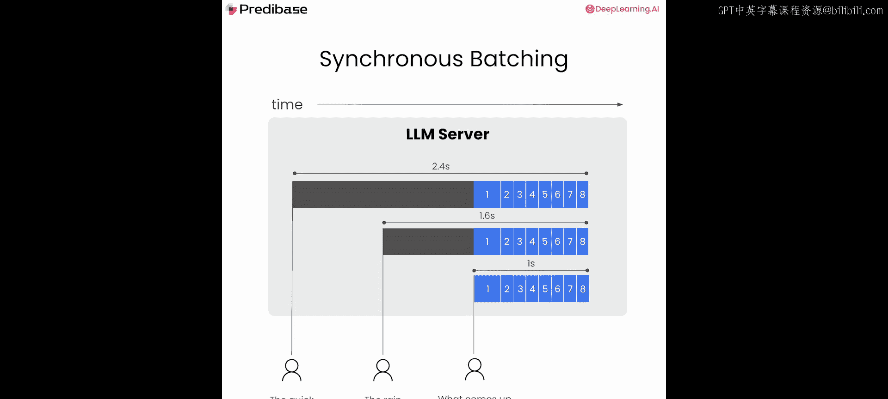

同步批处理的核心流程如下：
1.  收集多个在不同时间到达的请求。
2.  将它们打包成一个批次。
3.  整个批次作为一个整体，从头到尾处理完毕。

然而，这种方法存在一个关键问题：即使批次中某些请求只需要生成少量词元，它们也必须等待耗时最长的请求完成，从而导致延迟增加。

---

## 引入连续批处理
本节中，我们来看看连续批处理如何解决上述问题。其核心思想源于自回归语言模型**逐词生成**的特性。每个词元的生成都可以被视为一个独立的操作。

连续批处理的工作方式如下：
*   **动态入队**：当新请求到达时，系统会判断是否将其加入当前正在处理的批次。
*   **动态出队**：当批次中的某个请求完成（例如达到生成长度上限或遇到停止词）时，可以立即将其移出批次，并换入一个等待中的新请求。

这种让元素在批次中**动态进出**的机制，就是连续批处理的核心。此外，我们还需要区分**预填充**和**解码**阶段：
*   **预填充**：处理用户输入的提示词，生成第一个词元。此阶段计算量较大。
*   **解码**：基于已生成的词元，连续生成后续词元。

在连续批处理系统中，通常会尝试将多个解码请求保持在一个批次中，以减少填充开销，从而优化系统的吞吐量和延迟。

通过这种方式，我们能够获得接近两全其美的效果：延迟非常低（甚至低于逐个处理请求的情况），而吞吐量则与同步批处理相当。如果请求生成的词元数量差异很大，连续批处理甚至能带来更高的吞吐量。

---

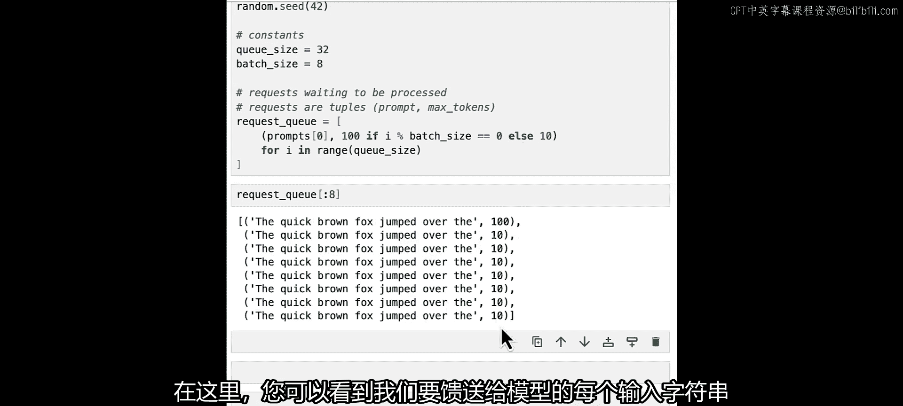

## 动手实现连续批处理
现在，让我们从零开始实现连续批处理过程。

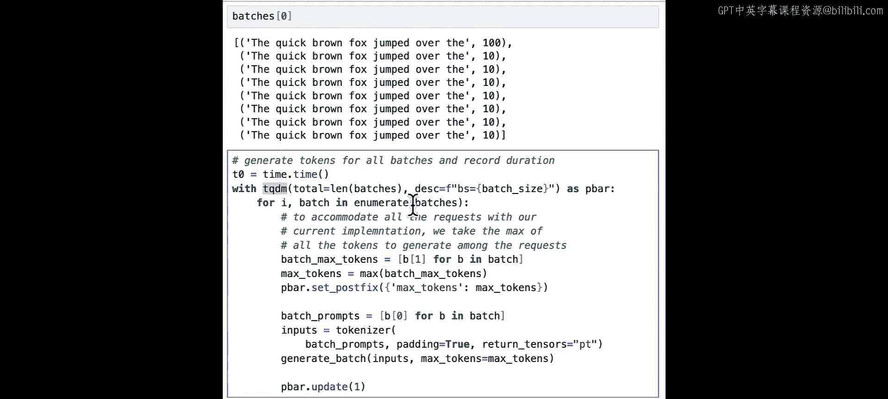

首先，导入必要的库并加载模型，与之前一样，我们使用Hugging Face的GPT-2模型。

```python
import torch
from transformers import AutoTokenizer, AutoModelForCausalLM
```

我们定义一些常量和请求队列。队列中的每个请求是一个元组，包含提示字符串和需要生成的词元数量。

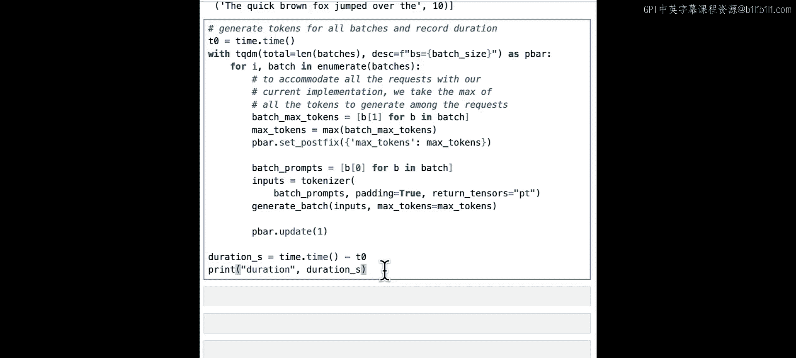

```python
QUEUE_SIZE = 32
BATCH_SIZE = 8

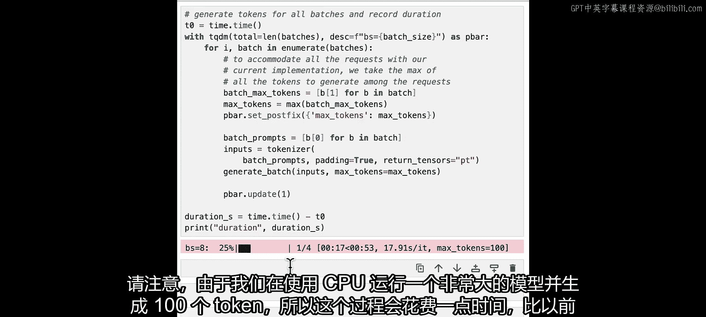

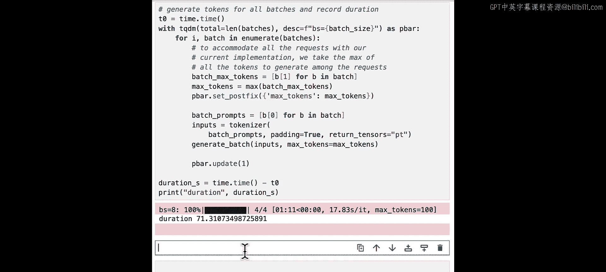

request_queue = []
for i in range(QUEUE_SIZE):
    prompt = "The quick brown fox jumped over the"
    num_tokens = 100 if i % BATCH_SIZE == 0 else 10
    request_queue.append((prompt, num_tokens))
```

以下是请求队列前几个元素的示例：
*   `('The quick brown fox jumped over the', 100)`
*   `('The quick brown fox jumped over the', 10)`
*   `('The quick brown fox jumped over the', 10)`
*   ...

接下来，我们先将请求队列按批次大小切分，以便进行同步批处理作为基准对比。

```python
batches = [request_queue[i:i+BATCH_SIZE] for i in range(0, len(request_queue), BATCH_SIZE)]
```

然后，我们运行同步批处理并记录总耗时。这个过程会比较慢，因为批次中即使只有一个请求需要生成100个词元，其他所有请求也必须等待它完成。

```python
import time
from tqdm import tqdm

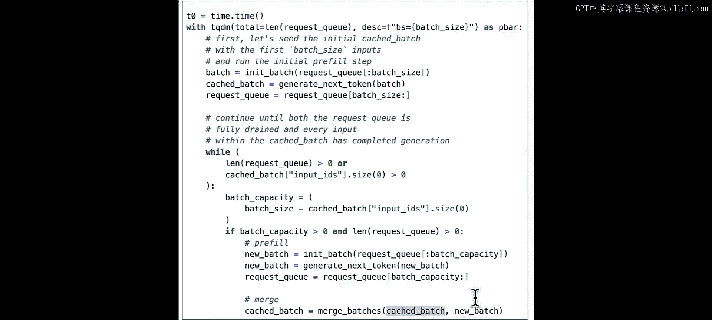

start_time = time.time()
for batch in tqdm(batches):
    prompts = [item[0] for item in batch]
    max_tokens = max([item[1] for item in batch])
    # 调用同步批处理生成函数（假设已定义）
    generate_batch(prompts, max_new_tokens=max_tokens)
total_duration_sync = time.time() - start_time
print(f"同步批处理总耗时：{total_duration_sync:.2f}秒")
```

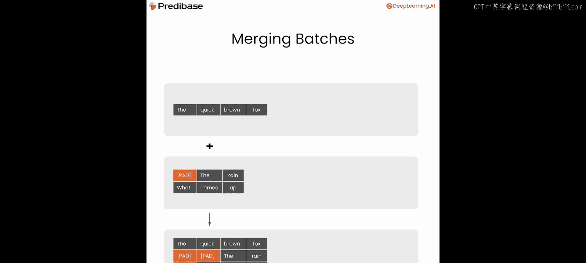

现在，开始实现连续批处理算法。核心逻辑是一个循环，只要请求队列不为空或当前缓存批次中还有请求未完成，就持续运行。

```python
def continuous_batching_loop(request_queue, batch_size):
    cached_batch = None  # 当前正在处理的批次缓存
    processed_count = 0

    while request_queue or (cached_batch and len(cached_batch) > 0):
        # 1. 计算批次剩余容量
        batch_capacity = batch_size - (len(cached_batch) if cached_batch else 0)

        # 2. 如果还有容量且队列有请求，则添加新请求（进行预填充）
        if batch_capacity > 0 and request_queue:
            new_requests = request_queue[:batch_capacity]
            # 对新请求进行预填充，生成初始缓存
            new_batch = init_batch(new_requests)
            request_queue = request_queue[batch_capacity:]

            # 3. 合并新批次与原有缓存批次
            if cached_batch is None:
                cached_batch = new_batch
            else:
                cached_batch = merge_batches(cached_batch, new_batch)

        # 4. 对当前缓存批次执行一步解码（生成下一个词元）
        if cached_batch:
            cached_batch = generate_next_token(cached_batch)

            # 5. 过滤已完成请求
            cached_batch, completed_indices = filter_batch(cached_batch)
            processed_count += len(completed_indices)

    return processed_count
```

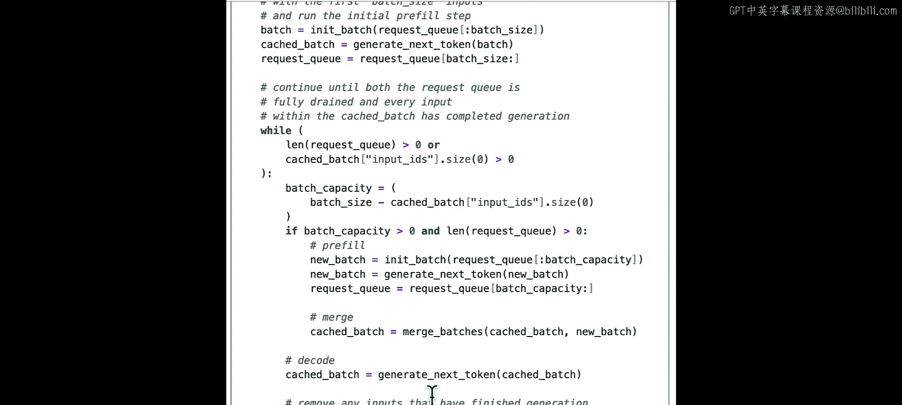

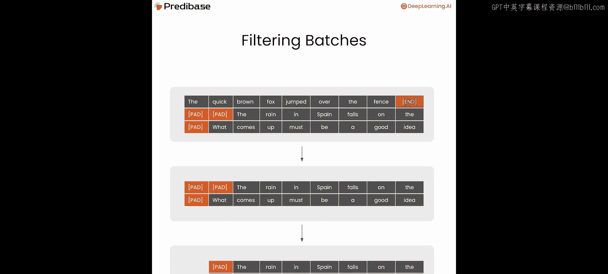

在上述循环中，我们使用了几个关键辅助函数：
*   `init_batch`: 对新请求进行预填充，初始化其键值缓存。
*   `merge_batches`: 将新批次合并到现有缓存批次中，可能需要填充以对齐序列长度。
*   `generate_next_token`: 对当前批次执行一次前向传播，生成下一个词元。
*   `filter_batch`: 检查并移除批次中已完成的请求，并清理不必要的填充。

最后，我们使用相同的请求队列运行连续批处理，并比较耗时。

```python
start_time = time.time()
processed = continuous_batching_loop(request_queue.copy(), BATCH_SIZE)
total_duration_continuous = time.time() - start_time
print(f"连续批处理总耗时：{total_duration_continuous:.2f}秒")
print(f"性能提升：{total_duration_sync / total_duration_continuous:.2f}x")
```

---

## 总结
本节课中，我们一起学习了**连续批处理**技术。
*   我们首先回顾了**同步批处理**在提升吞吐量时带来的高延迟问题。
*   接着，我们探讨了连续批处理的核心思想：利用LLM逐词生成的特性，**动态管理批次**，让请求可以随时加入或离开处理批次。
*   然后，我们动手实现了一个简单的连续批处理循环，包括**预填充、合并、解码和过滤**等关键步骤。
*   实验表明，在处理生成长度差异大的请求时，连续批处理能显著降低端到端延迟，同时保持高吞吐量。

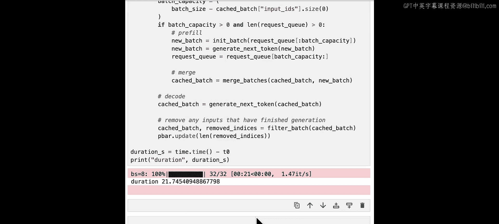

连续批处理是实现**低延迟流式输出**的关键技术之一。在后续课程中，我们将超越批处理，探讨量化、低秩适配等其他提升大模型服务效率的方法。