# 005：量化技术 🧮


在本节课中，我们将学习量化技术的工作原理。量化是一种压缩大型模型的方法，使其能够在消费级硬件上运行。我们将了解如何将模型参数压缩到每个参数8位，并在推理时即时反量化。

## 概述

大型语言模型的权重需要大量内存。通过量化，我们可以将非常大的模型压缩，使其能够在普通硬件上运行。本节将介绍量化的基本概念，并实现一个算法，将模型参数量化为8位，在推理时进行反量化。

## 浮点数表示与内存开销

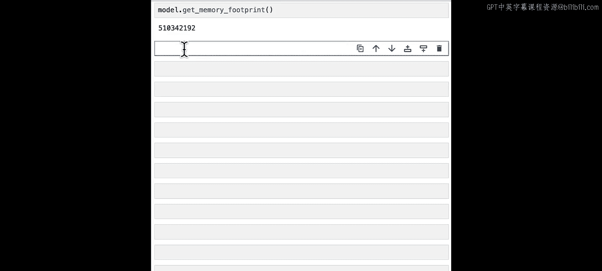

上一节我们介绍了模型的内存占用问题。本节中，我们来看看这些内存开销从何而来。首先，我们需要了解浮点数的标准表示格式。

标准用于表示实数的格式是FP32，即每个数字32位。这种格式在计算应用中非常普遍，但对于像大型语言模型这样拥有数亿甚至数十亿个浮点值的深度学习模型来说，其占用空间相对较大。

在FP32格式中，一个浮点值由三个组成部分构成：
1.  **符号位**：1位，表示正负。
2.  **指数**：8位，对应数值的范围或量级。
3.  **尾数（或有效数字）**：23位，可以看作是数值的小数部分或分数部分，代表了该格式能表示的数值精度。

深度学习应用的一个有趣之处在于，根据具体任务（如训练或推理），模型可能并不需要那么高的精度。通常，我们只需要知道数值的大致量级。因此，我们可以思考如何用更少的比特来表示大致相同的信息。

从FP32向下的第一步是考虑用一半的比特数（16位）能捕获多少信息。这引出了业界流行的两种数据类型：
*   **FP16**：标准的16位浮点表示，指数5位，尾数10位。
*   **Bfloat16 (BF16)**：一种较新的格式，指数8位（与FP32动态范围相同），尾数仅7位。这意味着我们精确捕获数值小数部分的能力大大降低，但由于其能表示更大的数值范围，因此在许多深度学习训练和推理场景中非常实用。

如果硬件支持，我们还可以探索更小的格式，如**FP8**（指数5位，尾数2位），以节省内存开销。

## 量化：压缩与重构

与使用越来越小的浮点表示法不同，量化的核心思想是**压缩**。我们更感兴趣的是如何将数据压缩成一种紧凑形式，并附带一些元数据，以便在前向传播过程中即时重构。这样我们可以在内存开销上获得巨大收益，只需付出少量的计算成本。

以下是量化技术的一种：零点量化。

假设我们有一个包含五个浮点数的张量。我们首先计算该张量的一些元数据（如最小值和最大值），然后将其压缩到0到255的范围内（仅使用无符号整数值），并存储起来供后续使用。

让我们编写一个函数来实现这个量化步骤。

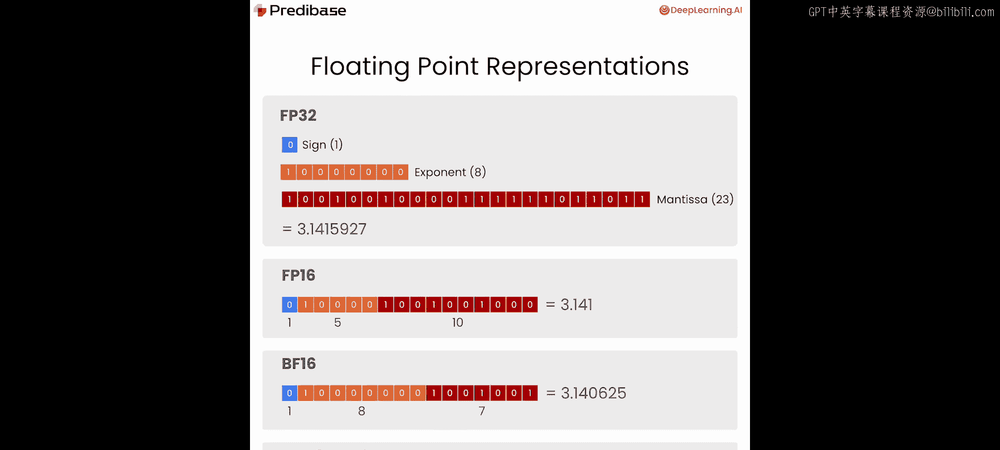

首先，计算张量的最小值和最大值。然后，我们需要计算两组元数据值：**缩放因子（scale）** 和**零点（zero_point）**。
*   **缩放因子**用于将数值量化到0-255的范围内。
*   **零点**是在量化时从原始值中减去的值，在反量化时再加回来。

计算公式如下：
`scale = (max_val - min_val) / (2^n_bits - 1)`，对于8位量化，`n_bits=8`，所以分母是255。
`zero_point = min_val`

接下来，我们将这个缩放函数应用到输入张量上：
1.  对张量中的每个值，减去零点（即最小值）。
2.  然后除以缩放因子。
这将确保`t_quant`中的每个值都在0到255的范围内。

最后，我们执行一个简单的钳位操作来处理任何舍入误差，确保只处理此范围内的值。同时，我们需要保存这些状态值，以便在后续的反量化步骤中用于还原。

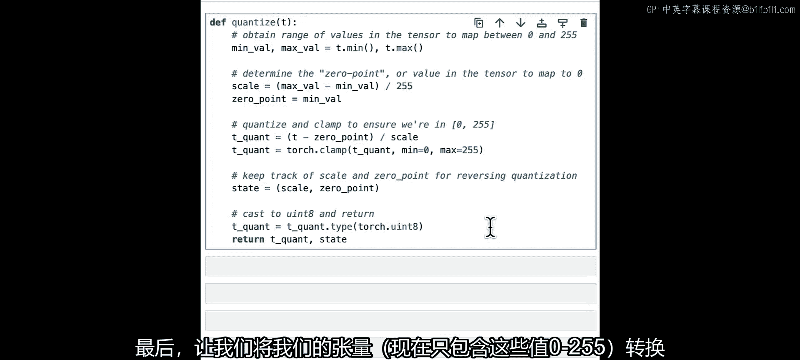

一个重要提示是：与使用越来越小的浮点表示法不同，我们不能直接在计算中使用量化后的张量。因为仅这些整数值不足以表示信息，我们还需要元数据来重构它们，以获得我们试图表示的真正数值。

最后，我们将张量转换为无符号整数8位格式（`torch.uint8`），从而将张量的内存占用减少到原来的1/4。然后返回量化后的张量和其状态。

```python
def quantize(t: torch.Tensor):
    # 计算最小值和最大值
    min_val, max_val = t.min(), t.max()
    # 计算缩放因子和零点
    scale = (max_val - min_val) / (2**8 - 1)  # 8位量化
    zero_point = min_val
    # 应用量化变换
    t_quant = torch.clamp(torch.round((t - zero_point) / scale), 0, 255)
    # 转换为uint8类型以节省内存
    t_quant = t_quant.to(torch.uint8)
    # 返回量化后的张量和状态（缩放因子，零点）
    return t_quant, (scale, zero_point)
```

让我们运行一个快速测试，看看量化函数对模型中随机张量的影响。我们打印其形状和一小部分值，可以看到这些值大多是介于-1和1之间的浮点数。调用量化函数后，打印量化状态中的值样本，以及`t_quant`的最小值和最大值（如果一切正常，应分别为0和255）。结果符合预期，所有值都是0-255范围内的无符号整数。

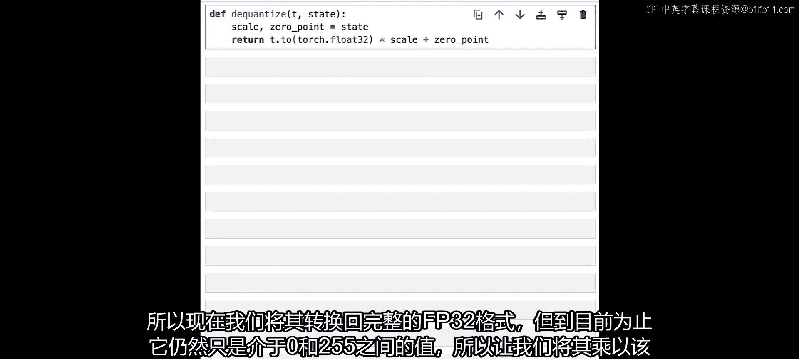

## 反量化：恢复原始数据

接下来，我们编写一个函数来逆转量化步骤，这应该简单得多。

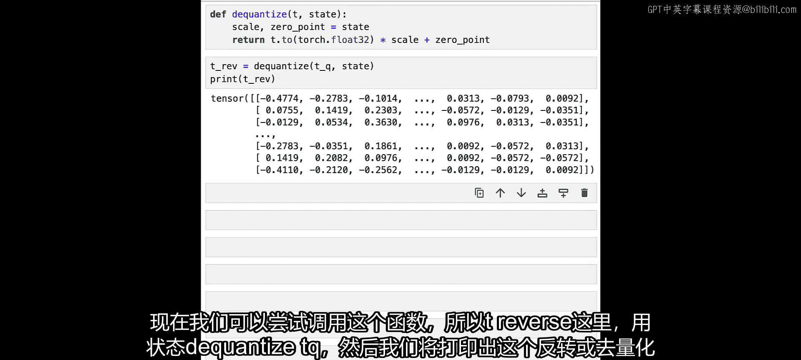

函数`dequantize`接受两个参数：量化张量`t_quant`和存储的状态（包含缩放因子和零点）。我们从中提取这两个值，然后进行一个简单的计算：首先将张量转换回浮点格式，然后乘以缩放因子以恢复到原始范围，最后加上零点偏移，使得最小值变回原始张量的最小值。

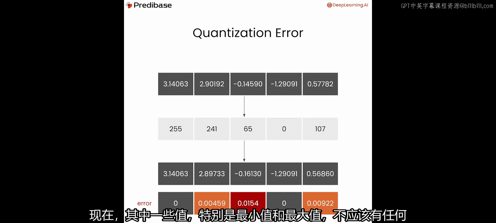

```python
def dequantize(t_quant: torch.Tensor, state):
    scale, zero_point = state
    # 反量化：先扩展范围，再加回零点
    t_dequant = t_quant.float() * scale + zero_point
    return t_dequant
```

现在，我们可以调用这个函数，打印反量化后的张量值，看到它回到了-1到1的预期范围内。但让我们仔细看看这些值与原始值有多接近。

在反量化过程中，我们将浮点张量转换为0-255的整数张量，然后又转换回原始范围的张量。由于这是一种有损压缩，我们预计会在原始张量和反量化张量之间看到一些误差。最小值和最大值应该没有差异，但其他值会有所不同，误差大小通常取决于该数字能否合理地映射到0-255的无符号整数空间。

现在，我们来测量这些张量之间的绝对误差，感受一下对于这个特定张量，我们的反量化与基线相差多远。可以看到，误差在绝对值上通常很低，在某些情况下大约有两位小数的误差。虽然不严重，但肯定会对模型性能产生影响。

## 量化整个模型并评估效果

现在，让我们尝试将这种量化技术应用到整个模型上。在此之前，我们首先查看模型对特定请求的输出，以便与量化后得到的响应进行比较。

我们使用之前课程中的辅助函数，传入未量化的模型和分词器，对输入“the quick brown fox jumped over the”生成10个令牌。我们得到了一个合理的输出：“the quick brown fox jumped over the fence and ran to the other side of the fence”。我们记下这个结果，看看量化过程会对模型输出产生什么影响。

首先，我们编写一个函数来量化整个模型，而不仅仅是单个参数。
1.  创建一个状态字典，用于存储缩放和零点元数据，以便在反量化步骤中重建全精度模型参数。
2.  遍历模型中的每个命名参数，以便使用该名称作为状态字典中的键。
3.  确保每个参数的`requires_grad`设置为`False`，因为`uint8`量化的数据类型不可微分。
4.  量化数据，然后将该数据存储在参数中，同时在状态字典中记录该参数名称对应的状态。
5.  返回量化后的模型和状态字典。

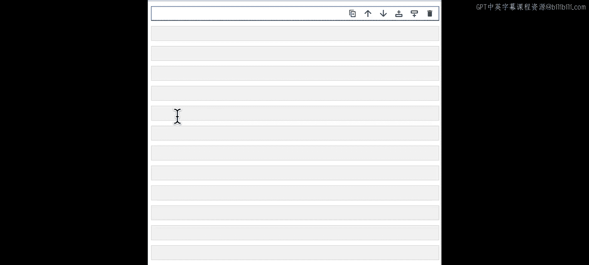

运行量化后，我们可以查看该模型的内存占用。很好，现在变成了137 MB，而不是之前的500多MB。我们确实获得了大约4倍的总占用减少。

你可能会注意到，我们也以状态字典的形式产生了一些新的开销。那么，这个状态字典贡献了多少开销呢？我们计算一下，对于这个拥有超过1亿个参数的模型，状态字典只增加了大约1KB的开销，这在生产环境中是可以接受的。

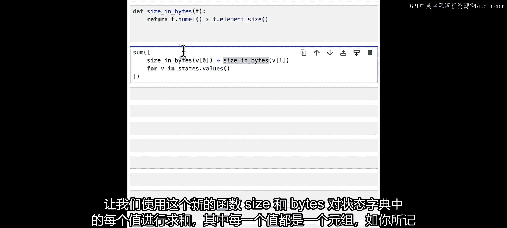

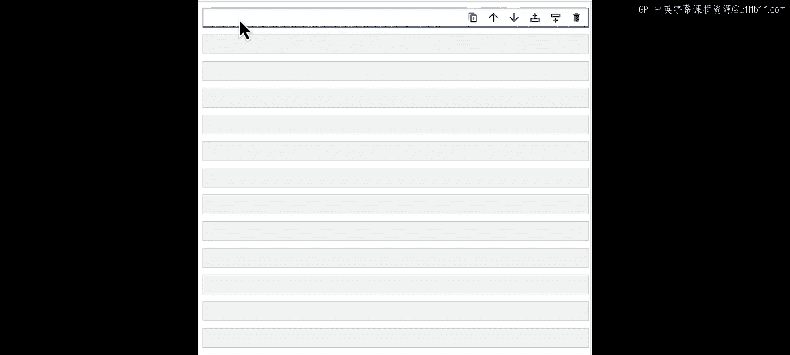

在生产环境中，你可能希望只在计算需要时即时反量化每一层，以避免一次性反量化整个模型，从而抵消量化在减少内存开销方面的所有效果。但这需要更多的工作。因此，我们在这里编写一个额外的辅助函数`dequantize_model`，它接收量化模型和状态字典，然后通过再次遍历命名参数、从状态字典中提取状态、使用量化数据及其状态运行反量化步骤，然后用新的反量化状态重新填充参数数据，从而基本上逆转量化过程。

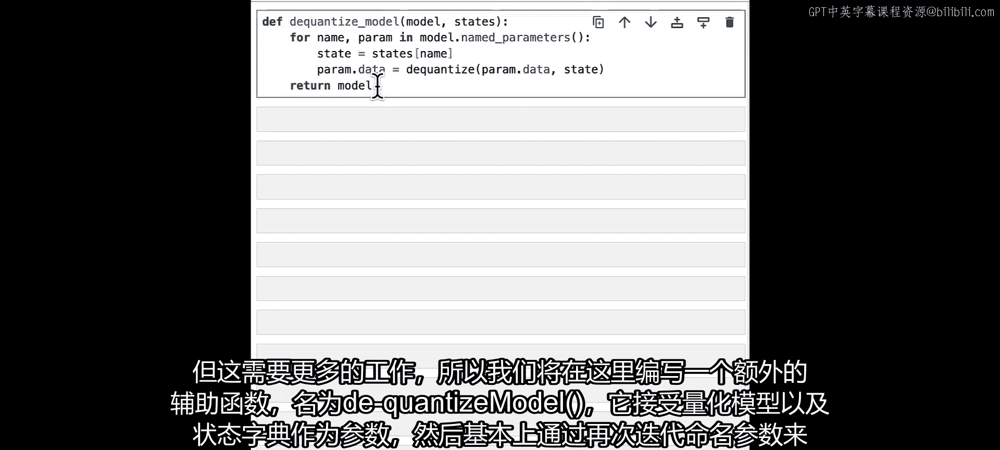

运行反量化函数后，我们计算这个新反量化模型的内存占用，看到它回到了大约510 MB，所以我们的反量化符合预期，模型再次处于FP32格式。

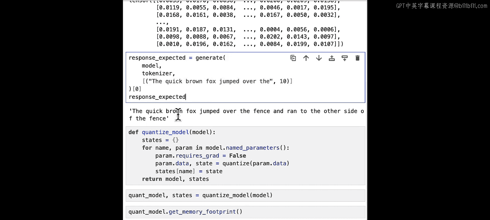

现在，我们再次调用之前用于生成响应的函数，但这次使用反量化后的模型，看看输出是什么。输出是：“the quick brown fox jumped over the fence. the fox jumped over the fence.” 前几个字符相同，但之后开始出现分歧。输出仍然是合理的，即使有点重复，但语法正确，模型并没有退化到无法理解的程度。当然，如果反量化损失足够大，这种情况是可能发生的。

总的来说，你可以看到量化和反量化确实对整体模型输出和质量有影响。因此，存在不同的量化技术，旨在尽可能获得最大的量化效益，同时使模型性能的下降最不明显。

## 总结

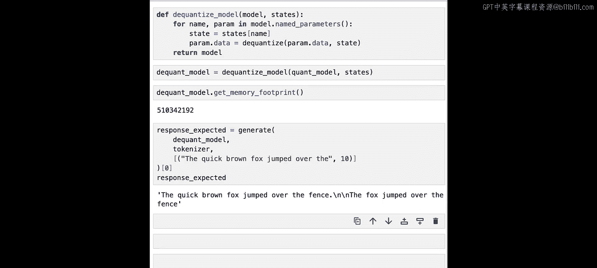

本节课中，我们一起学习了量化技术。我们了解了浮点数表示的内存开销，并深入探讨了量化作为一种压缩方法的核心思想。我们实现了零点量化算法，将模型参数压缩到8位，并成功进行了反量化。通过实践，我们看到量化能显著减少模型内存占用（约4倍），同时会对模型输出质量产生一定影响，但通过精细的量化策略可以控制这种影响。量化是高效服务大型语言模型的关键技术之一。