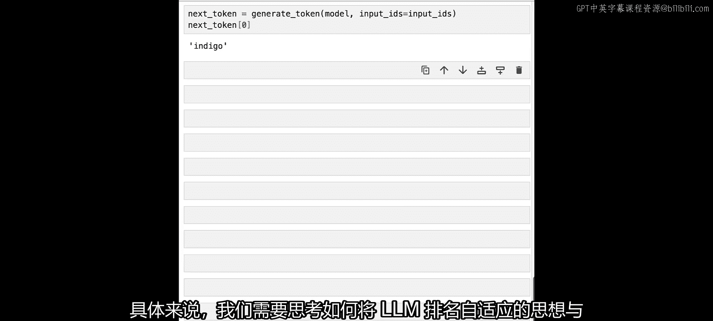

# 006：低秩适应（LoRA） 🧩


在本节课中，我们将学习如何通过低秩适应（LoRA）技术，高效地定制大型语言模型，使其适应特定任务和数据，而无需修改原始模型的大部分参数。

## 概述

为了充分发挥大型语言模型的潜力，我们需要根据特定数据和任务对其进行定制。低秩适应是一种参数高效的微调技术，它允许我们仅通过添加和更新一小部分新参数来定制模型，而无需改变原有的模型权重。这大大降低了微调模型的存储和部署成本。接下来，我们将从零开始实现LoRA，并展示仅添加少量参数如何显著影响模型的输出。

## 微调的基本概念

上一节我们提到了模型定制，本节我们来深入探讨微调。在微调中，我们的目标是调整模型的权重，使其更好地适应特定任务或数据集。

在传统的全参数微调中，模型中的每一个参数（即权重）都会在反向传播过程中被更新。这意味着，当我们保存微调后的模型时，实际上保存了所有模型参数的完整副本。因此，在部署这些微调模型时，每个模型都需要一个全新的独立部署实例。

然而，还有另一种方法可以针对特定任务定制模型。

## 低秩适应（LoRA）原理

低秩适应（LoRA）在模型的某些层（通常是注意力计算相关的层，有时甚至是所有层）中引入一组新的参数。当输入通过该层时，除了经过原始权重 `W` 的处理，还会经过这组新参数的处理。

这组新参数由两个我们称为 `A` 和 `B` 的张量组成，它们具有所谓的“低秩”形状。具体来说：
*   矩阵 `A` 的输入维度与原始权重 `W` 的输入维度相同。
*   矩阵 `B` 的输出维度与原始权重 `W` 的输出维度相同。
*   但 `A` 和 `B` 的内部维度（即秩 `r`）要小得多。

当 `A` 和 `B` 相乘时，其结果的输入输出形状与 `W` 相同，但有效参数量只是 `W` 的一小部分（通常约为1%）。这意味着，如果我们只更新这些新引入的低秩矩阵，就相当于找到了一种方法，仅修改约1%的参数即可微调模型以适应特定任务。

从服务部署的角度看，这非常有利。因为将微调模型加载到内存中的成本很低，我们甚至可以在运行时动态地、按需地在内存中加载或卸载这些LoRA适配器。这就是我们本节课及后续课程将要探索的核心思想。

## 动手实现LoRA

为了深入理解LoRA的工作原理，我们将不使用现成的Hugging Face Transformers库，而是从一个简单的玩具模型开始，逐层剖析。

首先，导入必要的依赖并设置随机种子以确保结果可复现。

```python
import torch
import torch.nn as nn

torch.manual_seed(42)  # 设置随机种子
```

接下来，创建一个用于探索LoRA的测试模型。这是一个非常简单的语言模型，仅包含三层：
1.  嵌入层：将输入词元ID映射到隐藏空间。
2.  线性层：将嵌入向量投影到另一个嵌入空间。
3.  语言模型头层：生成最终的逻辑值，用于预测下一个词元。

```python
class ToyModel(nn.Module):
    def __init__(self, hidden_size):
        super().__init__()
        self.embed = nn.Embedding(10, hidden_size)  # 词汇表大小为10
        self.linear = nn.Linear(hidden_size, hidden_size)
        self.lm_head = nn.Linear(hidden_size, 10)   # 输出维度为词汇表大小

    def forward(self, x):
        x = self.embed(x)
        x = self.linear(x)
        x = self.lm_head(x)
        return x

# 初始化模型，隐藏层维度设为1024
model = ToyModel(hidden_size=1024)
```

现在，为模型创建一些虚拟输入。我们将使用一个简单的词汇表，将词元ID映射为颜色名称。

```python
# 创建输入：一个批次，序列长度为8，词元ID从0到7
input_ids = torch.tensor([[0, 1, 2, 3, 4, 5, 6, 7]])

# 简单的词汇表（词元ID到颜色的映射）
vocab = ["red", "orange", "yellow", "green", "blue", "indigo", "violet", "pink", "brown", "magenta"]
```

定义一个生成函数，用于获取模型的下一个预测词元。

```python
def generate(model, input_ids):
    with torch.no_grad():
        logits = model(input_ids)
        next_token_id = logits[:, -1, :].argmax(dim=-1).item()
        return vocab[next_token_id]

# 生成一个词元
print(f"原始模型预测的下一个词元: {generate(model, input_ids)}")
```

运行后，模型可能会输出类似“magenta”的结果。由于权重是随机初始化的，这个输出本身没有特定含义，但它是确定性的。

## 为线性层引入LoRA参数

我们的目标是在玩具模型的线性层中引入低秩参数，观察其是否能改变模型的输出。

首先，生成一个模拟输入到线性层的张量。

```python
# 模拟线性层的输入：批次大小=1，序列长度=8，隐藏层维度=1024
x = torch.randn(1, 8, 1024)
```

现在，定义LoRA计算中所需的两个低秩矩阵 `A` 和 `B`。这里，我们设置秩 `r = 2`。

```python
hidden_size = 1024
rank = 2

# 初始化LoRA矩阵A和B
lora_A = torch.randn(hidden_size, rank)  # 形状: (1024, 2)
lora_B = torch.randn(rank, hidden_size)  # 形状: (2, 1024)
```

获取原始线性层的权重 `W`，并验证LoRA矩阵相乘后的形状与 `W` 一致。

```python
W = model.linear.weight  # 形状: (1024, 1024)
W_approx = lora_A @ lora_B  # 形状: (1024, 1024)
print(f"原始权重W的形状: {W.shape}")
print(f"LoRA近似W_approx的形状: {W_approx.shape}")
```

比较原始参数和LoRA参数的参数量。

```python
num_params_W = W.numel()
num_params_lora = lora_A.numel() + lora_B.numel()
print(f"原始权重W的参数数量: {num_params_W}")
print(f"LoRA参数(A+B)的数量: {num_params_lora}")
print(f"LoRA参数占比: {num_params_lora / num_params_W * 100:.2f}%")
```

可以看到，LoRA参数的数量远小于原始权重，占比非常小。

接下来，完整运行一次LoRA计算。

```python
# 计算原始线性层的输出
base_output = x @ W.T  # 或者使用 model.linear(x)，这里为演示矩阵运算

# 计算LoRA路径的输出
lora_output = (x @ lora_A) @ lora_B

# 合并输出
combined_output = base_output + lora_output
print(f"合并输出的形状: {combined_output.shape}")
```

## 创建LoRA层抽象

为了更方便地修改模型，我们将上述过程封装成一个 `LoRALayer` 类。

```python
class LoRALayer(nn.Module):
    def __init__(self, base_layer, rank):
        super().__init__()
        self.base_layer = base_layer
        self.rank = rank
        hidden_size = base_layer.in_features

        # 初始化LoRA参数A和B
        self.lora_A = nn.Parameter(torch.randn(hidden_size, rank))
        self.lora_B = nn.Parameter(torch.randn(rank, hidden_size))

    def forward(self, x):
        # 原始层输出
        base_out = self.base_layer(x)
        # LoRA路径输出
        lora_out = (x @ self.lora_A) @ self.lora_B
        # 合并
        return base_out + lora_out
```

使用这个类来替换模型中的原始线性层。

```python
# 用LoRALayer替换原始线性层
model.linear = LoRALayer(model.linear, rank=2)

# 再次生成词元，观察输出是否改变
print(f"引入LoRA后模型预测的下一个词元: {generate(model, input_ids)}")
```

运行后，模型预测的词元很可能从“magenta”变成了另一个颜色（如“indigo”）。这表明引入的低秩参数确实影响了模型的整体输出。

## 总结与展望

本节课我们一起学习了低秩适应（LoRA）的核心原理与实现。我们了解到，LoRA通过向模型层中注入可训练的低秩矩阵 `A` 和 `B`，使得仅需更新极少量的参数（通常<1%）就能有效定制模型。我们从零开始实现了LoRA层，并验证了它能成功改变模型的输出行为。

在实际应用中，我们可以进一步微调这些LoRA参数，以更精确地引导模型生成期望的输出。此外，我们还可以将此技术扩展到模型的更多层中。



在下一节也是最后一节课中，我们将探讨**多LoRA推理**的概念。在生产环境中，用户通常会训练许多不同的LoRA模型并需要同时服务它们。我们将研究如何将LoRA与之前学过的连续批处理技术相结合，构建一个能够同时高效服务多个微调模型的灵活系统，同时保持高吞吐量和低延迟的优势。