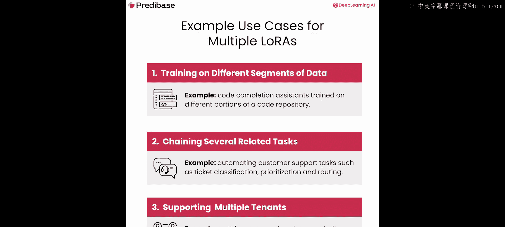
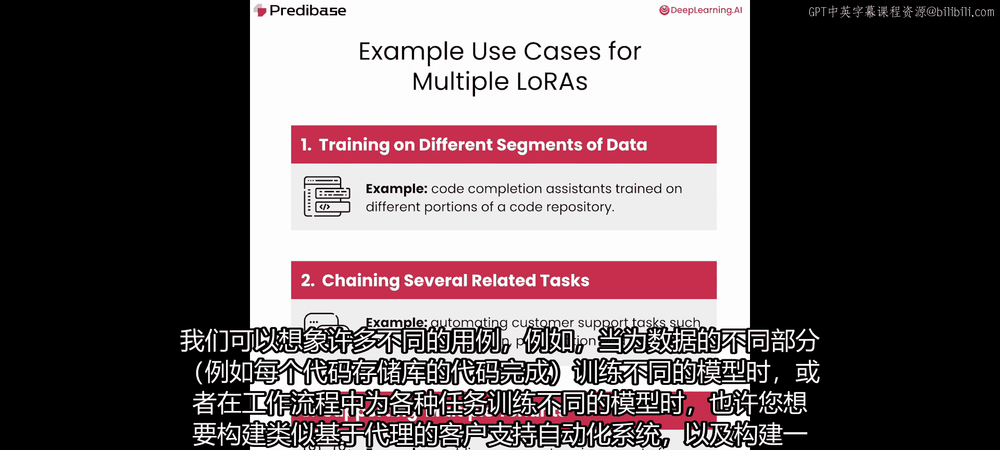
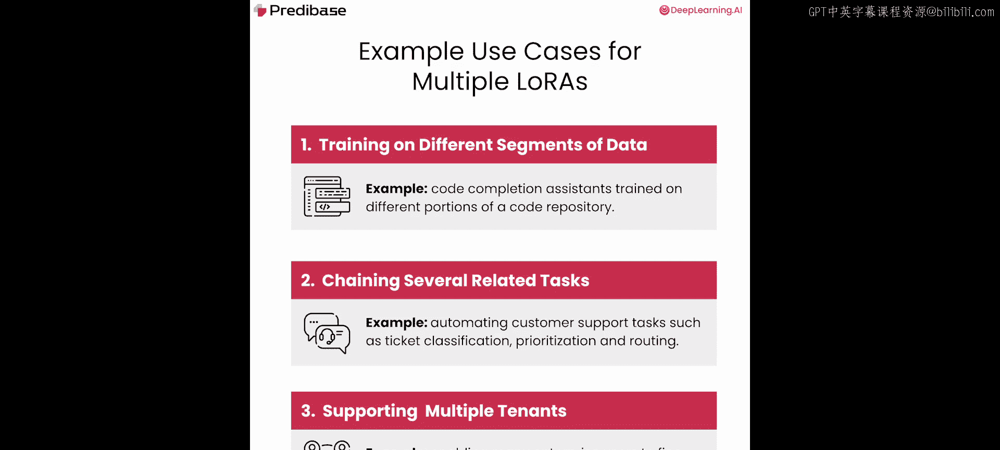
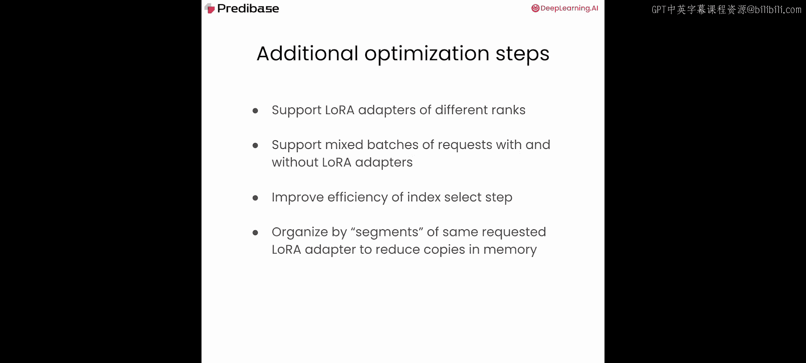
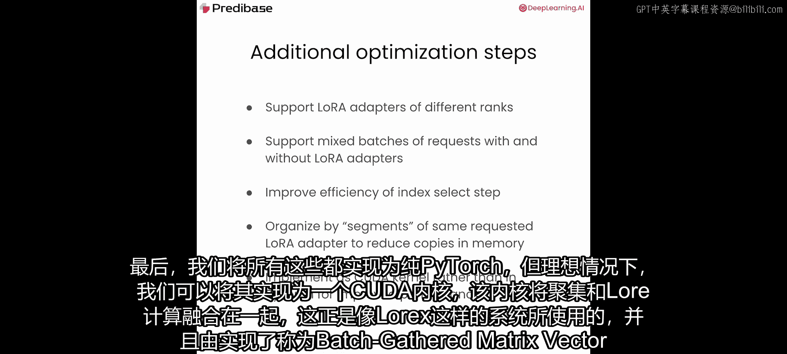
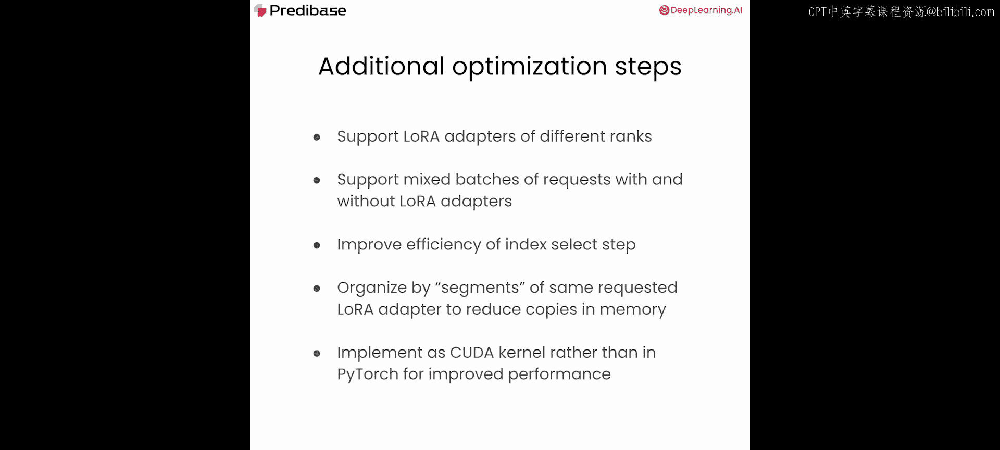

# 007：多LoRA服务 🚀

在本节课中，我们将结合LoRA与连续批处理技术，创建一个端到端的服务系统，该系统能够同时服务多个微调模型，并一次性处理多个请求。

## 概述

上一节我们介绍了LoRA，它的一大优势是内存占用非常小。这带来了一个令人兴奋的可能性：我们能否在同一个基础模型骨干上，同时加载许多这样的小型微调LoRA适配器？我们可以设想许多有用的应用场景，例如：
*   为数据的不同部分（如每个代码仓库的代码补全）训练不同的模型。
*   为工作流中的各种任务训练不同的模型，例如构建基于代理的客户支持自动化系统。
*   构建一个无服务器平台，支持许多拥有自己微调模型的租户。

在这些场景中，最终结果都是拥有许多共享同一个预训练基础模型骨干、且需要并发服务的微调模型。如果采用简单粗暴的方式，我们可能会为每个微调模型部署一个独立的服务，这将非常昂贵；或者构建一个每次只能处理单个适配器、并需要不断在内存中换入换出的系统，这将非常缓慢。

但在本节课的这一部分，我们将探讨如何在不牺牲延迟或吞吐量的情况下，在单个部署中高效地同时服务数十个这样的微调模型。

## 实验设置：构建多LoRA模型接口

为了说明这一点，让我们建立一个非常简单的实验，尝试同时服务多个微调LoRA。我们将使用几种不同的技术来并行处理这些多个LoRA。

首先，像之前一样导入依赖。我们仍然使用一个简单的PyTorch模型，暂时不使用像Hugging Face Transformers这样的库。

接下来，开始定义用于测试的接口。我们将定义一个名为`AbstractMultiLoRAModel`的抽象基类。

这个类需要一个初始化器。我们将定义模型的层。您可能会注意到，这与上一节课玩具模型中的层非常相似：有一个嵌入层、一个线性层和一个最后的LM头。这里我们使用10作为隐藏层大小，而不是1024。这是因为在CPU上工作，如果使用更大的隐藏层大小，计算基础线性层的前向传播会成为瓶颈，而不是多LoRA推理部分。通过使用非常小的线性层，我们可以真正聚焦于多LoRA推理的优势。

接下来，定义一个辅助函数来实现多LoRA的API约定。这里的约定是：对于批次中的特定元素`i`，其输出应等于该批次元素的输入乘以我们想为该批次元素使用的特定LoRA权重`A`和`B`。您可以想象用户发送请求时说“我想使用这个特定的微调模型”或“我将使用那个特定的微调模型”。因此，对于每一个对应于此处的`i`的请求，我们可能希望使用不同的LoRA。这就是最简单的目标。

这里需要注意这些不同张量的形状预期：
*   输入`X`的形状为`(batch_size, sequence_length, in_features)`。
*   LoRA张量`A`和`B`的形状为`(num_loras, in_features, rank)`和`(num_loras, rank, out_features)`。这里多了一个维度，即我们存储在内存中的LoRA总数。
*   我们还有一个名为`lora_indices`的查找张量，它本质上是一个形状为`(batch_size,)`的向量，它将特定的批次元素映射到我们想要使用的LoRA索引。

最后，实现前向传播函数。它将与上一节课玩具模型中的前向传播函数非常相似，但我们将调用`self.linear_lora_helper`函数，而不是`self.linear`。我们的前向函数不仅接收输入`X`，还将接收我们正在使用的LoRA集合以及我们想为此批次使用的LoRA索引。

## 方法一：循环实现

我们的第一次尝试将使用一个非常简单的循环。现在定义一个名为`LoopedMultiLoRAModel`的子类，它继承自我们的抽象多LoRA模型。我们将重用相同的构造函数/初始化器和相同的前向函数，但之前定义为未实现的`linear_lora`函数现在将被实现。

具体来说，我们将首先计算基础线性层的输出，这是LoRA计算的标准部分。然后，我们将遍历这些LoRA索引，拉出对应批次大小维度的批次索引。这可以看作是一个扁平化的字典。接着，我们将从LoRA查找表中拉出该特定LoRA索引处的LoRA权重`A`和`B`。最后，应用我们上面寻找的计算：该特定批次元素的输出等于该批次元素的输入乘以该批次元素的LoRA A，再乘以LoRA B。为批次的每个元素执行此操作后，返回最终输出`Y`。

为了实际使用这个模型，我们只需要对原始的生成过程进行一些小的修改。首先，使用与上一节课相同的玩具分词器，以及相同的输入集。设置一个随机种子以确保过程每次运行都是确定性的。现在，使用与之前相同的生成函数。这里需要注意的重要一点是，我们不必对上一节课使用的生成函数进行任何更改，因为我们传入的是一组不透明的关键字参数，所以我们将透明地将其传递给模型。因此，即使这次我们将向模型传递新的参数，我们也不必更改此函数。

初始化我们的模型实现。现在，实现多LoRA推理过程的外层循环。首先定义几个常量：批次大小（初始设为1）、我们将存储在内存中的LoRA数量（64）、隐藏维度（10）和LoRA秩（2）。接着，随机初始化一些LoRA权重。然后生成10个步骤的输出。我们想定义一个映射张量，将当前批次元素映射到特定的LoRA。接下来，调用我们的生成令牌函数。因为此函数接受任意关键字参数，我们可以按需传递它们。我们的目标是查看每次使用随机的LoRA索引集是否真的会影响输出。换句话说，在不同迭代之间更改LoRA是否会改变输出？如果是，那么我们可以相当确信我们正在使用不同的LoRA，过程基本有效。如果每次迭代输出都相同（因为我们没有改变输入），那么我们可能做错了什么。

运行后，我们看到每次迭代都输出了不同的令牌，这表明我们确实在每次迭代中有效地交换了LoRA。

## 基准测试与性能分析

现在，是时候对我们的多LoRA系统进行基准测试了。我们的目标是测量当批次大小增加时，生成单个令牌的平均延迟，其中批次内的每个元素可能随机选择不同的LoRA适配器。

我们从第2课和第3课观察到，将多个请求批处理在一起是提高LLM推理系统吞吐量的关键技术之一。因此，我们这个多LoRA推理系统的目标将是，即使在单个批次中同时面对数十个LoRA时，也能保持我们从连续批处理中看到的强大批处理效果。

让我们从为基准测试定义更多常量开始：固定序列长度为8，固定词汇表大小为10，运行500个样本以确保获得稳健的基准，最大批次大小为64。

现在定义我们的基准测试函数。该函数的目的是在所有样本上运行完整的基准测试套件，并返回一组观察结果，用于测量和可视化，以确定事情是否按预期工作。

我们将记录平均延迟列表。接下来，从1迭代到最大批次大小加1。在每个批次大小内，我们将观察一组不同的延迟，目标是在最后对它们进行平均。重复以下过程500次：生成一组随机的输入ID和一组随机的LoRA索引，生成单个令牌并测量该过程的端到端延迟，记录持续时间。最后，计算所有样本的平均延迟，将其附加到最终观察结果中。为了调试，我们将在每个批次大小结束时打印出该批次大小的平均延迟，然后简单地返回最终的平均延迟列表。

启动基准测试过程。我们可以看到，随着批次大小的增加，这个平均延迟值也在增加。这告诉我们这里的扩展效果并不理想，理论上，即使我们使用了连续批处理等所有最佳技术，随着批次大小的增加，我们最终也会受到这个过程的瓶颈。这是我们需要留意的第一个危险信号。

让我们实际看看这个趋势。不幸的是，我们观察到延迟随着批次大小（以及批次中LoRA的数量）线性增加。这意味着尝试同时托管多个LoRA基本上消除了批处理的优势，我们还不如一次处理一个输入。

## 方法二：向量化实现

我们能做得更好吗？回想一下，在我们的实现中，我们遍历批次的每个元素，一次应用一个LoRA。这自然破坏了批处理吞吐量的主要驱动力之一，即向量化，或者说能够在单个操作中处理多个输入。如果我们将LoRA计算向量化，就可以摆脱需要迭代批次每个元素并逐个应用LoRA的做法。

在下一个实验中，我们将通过做两件事来向量化LoRA计算：
1.  使用PyTorch的`index_select`辅助函数，将所有LoRA权重收集到一个张量中。
2.  对整个输入张量一起应用LoRA计算，而不是一次做一个LoRA。

现在定义一个新的类，它也继承自`AbstractMultiLoRAModel`，称为`GatheredMultiLoRAModel`。与循环模型类似，它从其父类继承了初始化器和前向函数，但它有一个新的`linear_lora`函数实现，有两处不同：它调用`index_select`从LoRA集合中拉出适当的LoRA A和B张量；一旦我们有了适当的LoRA A和B张量，我们就可以进行一个单一的向量化矩阵乘法步骤，计算`X @ A @ B`，然后返回输出`Y`。

现在使用这个新类重新初始化我们的模型，并运行与之前相同的基准测试步骤，但这次使用这个新的模型实现。您应该已经注意到，事情比以前快了很多。虽然我们仍然看到延迟增加，但远没有之前那么严重。但这只是我们肉眼观察输出得出的印象。让我们实际可视化一下以确认。

这次，我们将把循环模型和收集模型的实现一起绘制在同一张图上，以便并排比较。果然，循环实现与收集实现之间的扩展特性存在显著差异。虽然循环实现导致延迟严格线性增加，但收集实现虽然也导致延迟随时间增加，但开始看起来更接近次线性，甚至在某些方面像对数增长。

由此我们可以推断，通过使用向量化，即使在像这样的CPU上（而不是GPU实现），我们已经看到了向量化对多LoRA推理的强大好处。

## 总结与未来优化方向

本节课中，我们一起学习了如何构建一个多LoRA服务系统。我们从最简单的循环实现开始，发现其延迟随批次大小线性增长，失去了批处理的优势。接着，我们通过使用`index_select`进行向量化，显著改善了性能，延迟增长变得平缓。

那么，我们还能走得更远吗？并不完全。还有其他方法可以进一步优化：
*   此特定实现仅支持批次中单一秩的LoRA，而实践中用户可能希望一起使用具有不同秩的不同LoRA。
*   我们没有实现任何对不需要LoRA适配器的批次元素的支持，这在实际中也可能很常见。
*   每次LoRA计算前通过`index_select`操作创建新张量并非没有开销。
*   我们在批次元素级别操作，而不是在我们可能称之为“段”的级别操作。在许多情况下，特别是在前缀步骤中，可能有大块的批次元素使用相同的LoRA，理想情况下，我们希望利用这一事实来进一步减少内存拷贝和向量化过程的需求。
*   最后，我们是在纯PyTorch中实现这一切。理想情况下，我们可以将其实现为一个融合了收集和LoRA计算的CUDA内核，这正是像vLLM这样的系统中使用的，并由像Punica这样的框架实现，它们实现了称为批处理收集矩阵向量乘法（BgMV）以及分段收集矩阵向量乘法（SGMV）的内核。这些是超越纯PyTorch所能做到的优化。