# 008：使用Lorax进行生产级LLM推理 🚀

在本节课中，我们将学习如何将前几课讨论的核心概念（如KV缓存、连续批处理、多LoRA推理）应用于一个现代、生产级的开源LLM推理服务器——Lorax。我们将通过实际代码演示，展示如何利用这些技术高效地部署和调用大语言模型。

---

## 导入依赖与初始化客户端

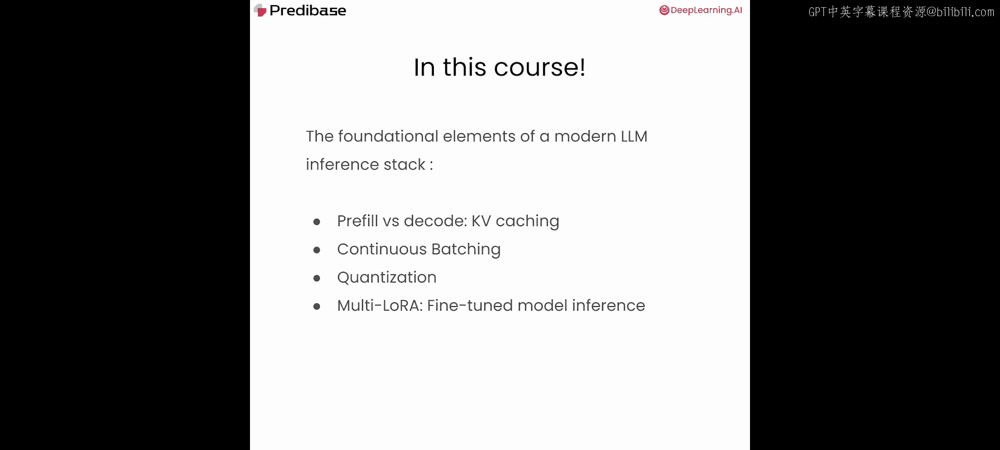

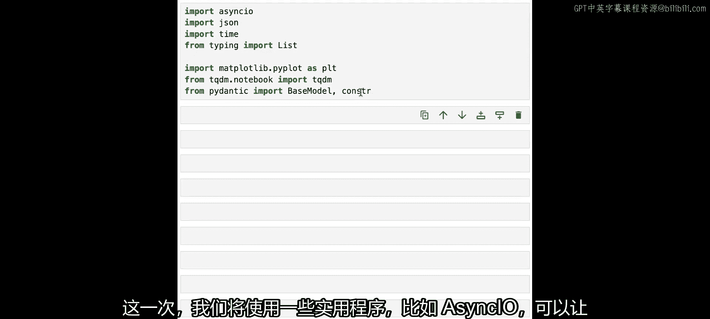

首先，我们需要导入必要的Python库并初始化Lorax客户端以连接到推理服务器。

我们将使用`asyncio`来异步处理请求，并使用`pydantic`来定义数据模式。接着，从`lorax`包中导入客户端。

```python
import asyncio
from pydantic import BaseModel
from lorax import Client, AsyncClient
```

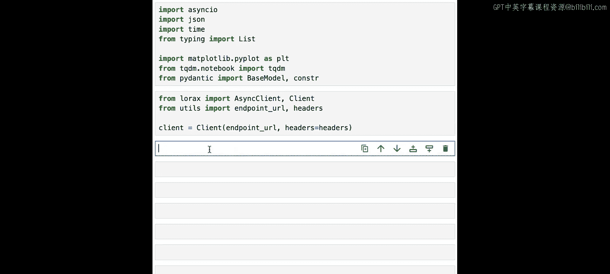

初始化客户端需要提供推理服务器的端点URL和用于身份验证的请求头。

```python
# 示例：连接到Predibase托管的Lorax端点
endpoint_url = "https://api.predibase.com/v1/llm/deployments/your-deployment-id"
headers = {
    "Authorization": "Bearer YOUR_API_KEY",
    "Content-Type": "application/json"
}

client = Client(endpoint_url, headers=headers)
async_client = AsyncClient(endpoint_url, headers=headers)
```

---

## 基础请求：同步生成

让我们从一个简单的同步请求开始，向服务器询问“什么是深度学习？”，并限制生成32个新令牌。

```python
import time

prompt = "What is deep learning?"
max_new_tokens = 32

start_time = time.time()
response = client.generate(prompt, max_new_tokens=max_new_tokens)
end_time = time.time()

print(f"模型回复: {response.generated_text}")
print(f"总耗时: {end_time - start_time:.2f} 秒")
```

这个调用会一次性返回完整的响应。耗时包括了模型推理时间和网络延迟。

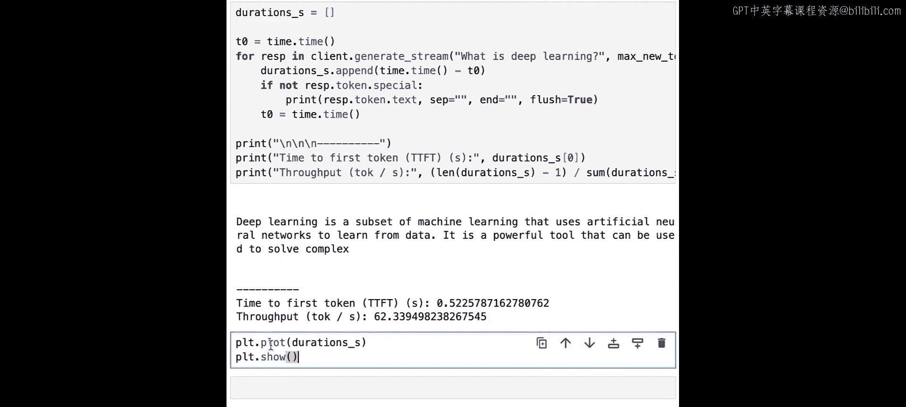

---

## 深入理解：Prefill与Decode阶段

在第一节课程中，我们讨论了Prefill（首次令牌生成）和Decode（后续令牌生成）的概念。Prefill阶段由于需要计算完整的注意力机制而较慢，Decode阶段则因KV缓存而更快。现在，我们通过流式请求来观察这一现象。

我们将调用`generate_stream`端点，逐个令牌地接收响应，并记录每个令牌的生成延迟。

```python
from lorax.types import Response

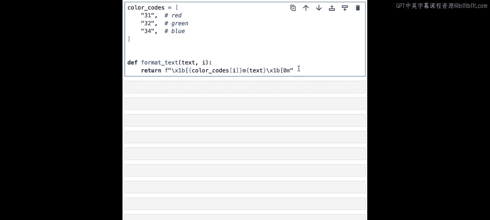

durations = []
prompt = "What is deep learning?"
max_new_tokens = 32

start_time = time.time()
for response in client.generate_stream(prompt, max_new_tokens=max_new_tokens):
    token_time = time.time()
    durations.append(token_time - start_time)
    start_time = token_time  # 为下一个令牌重置计时起点

    # 打印非特殊令牌
    if response.token.text not in ['<s>', '</s>']:
        print(response.token.text, end='', flush=True)

# 计算指标
time_to_first_token = durations[0] if durations else 0
decode_durations = durations[1:]  # 排除第一个令牌（Prefill）
throughput_tokens_per_sec = len(decode_durations) / sum(decode_durations) if decode_durations else 0

print(f"\n\n首令牌延迟: {time_to_first_token:.3f} 秒")
print(f"解码吞吐量: {throughput_tokens_per_sec:.1f} 令牌/秒")
```

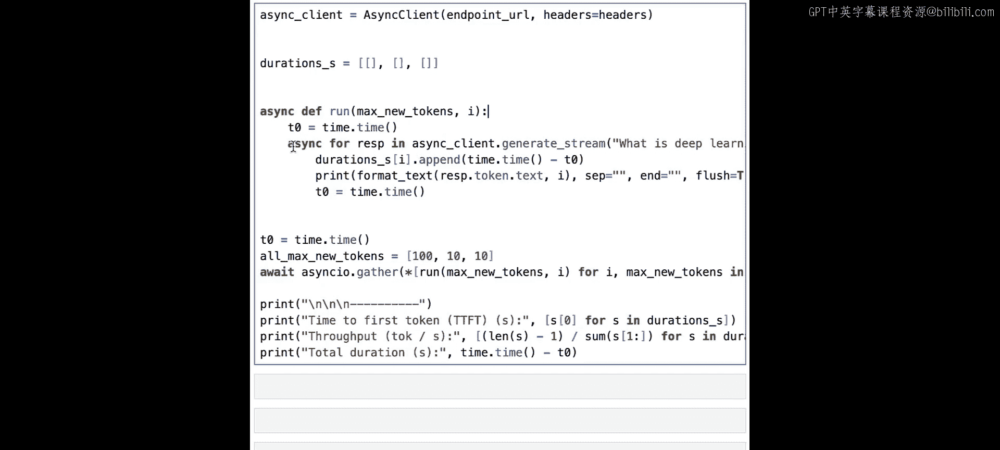

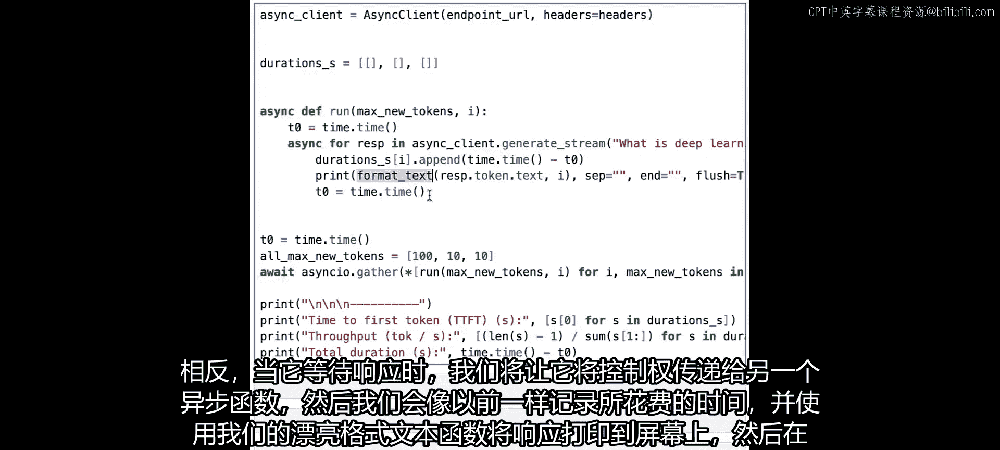

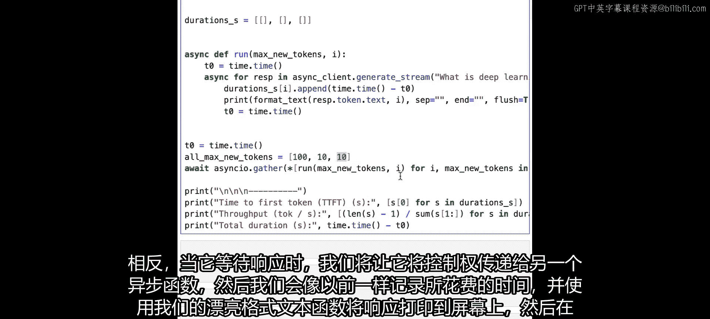

运行后，你会看到令牌逐个流出。首令牌延迟（约0.5秒）明显长于后续令牌的延迟（约0.01-0.1秒），这验证了Prefill/Decode的性能差异。

---

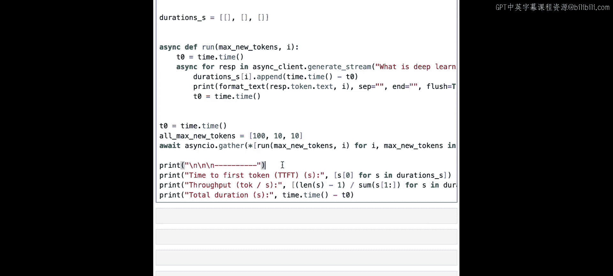

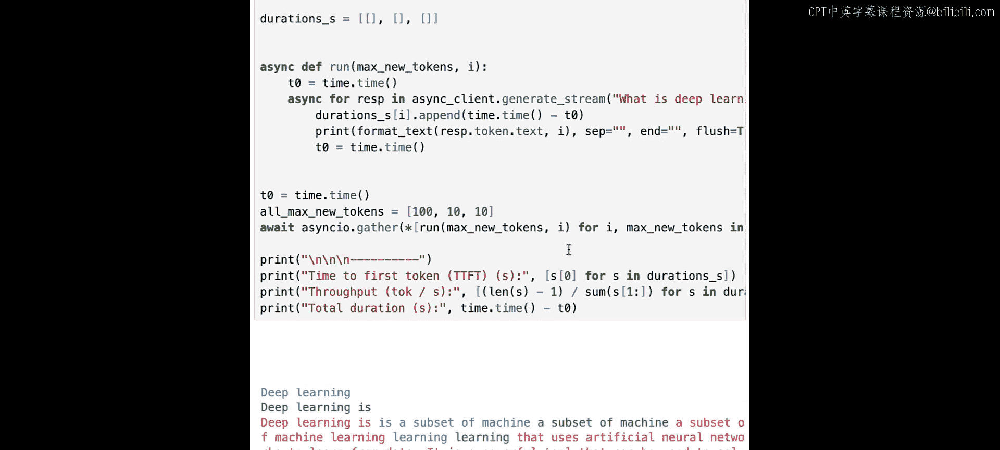

## 性能优化：连续批处理

连续批处理能同时处理多个请求，显著提升系统总吞吐量。我们将模拟同时发送三个不同长度的请求，并观察它们的响应是如何交错输出的。

首先，定义一个工具函数，用不同颜色打印文本以区分不同请求的输出。

```python
def format_text(text, color_code):
    """用指定颜色格式化文本。"""
    return f"\033[{color_code}m{text}\033[0m"

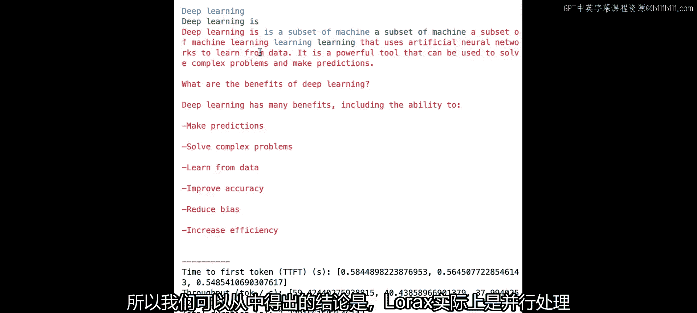

# 颜色代码：31=红，32=绿，34=蓝
colors = [31, 32, 34]
```

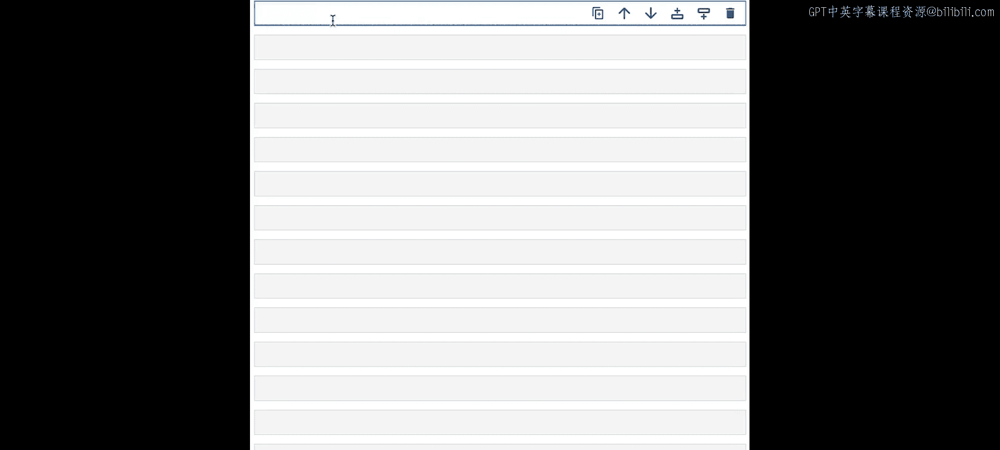

接下来，我们使用异步客户端并发地发送三个请求。

```python
async def run_async_request(prompt, max_new_tokens, color_idx):
    """异步运行单个生成请求。"""
    color_code = colors[color_idx % len(colors)]
    start_time = time.time()

    async for response in async_client.generate_stream(prompt, max_new_tokens=max_new_tokens):
        token_time = time.time()
        if response.token.text not in ['<s>', '</s>']:
            colored_text = format_text(response.token.text, color_code)
            print(colored_text, end='', flush=True)

    end_time = time.time()
    total_duration = end_time - start_time
    # 注意：在异步流中精确计算首令牌延迟和吞吐量更复杂，此处简化
    print(f"\n[颜色 {color_code}] 请求完成，总耗时: {total_duration:.2f}秒")

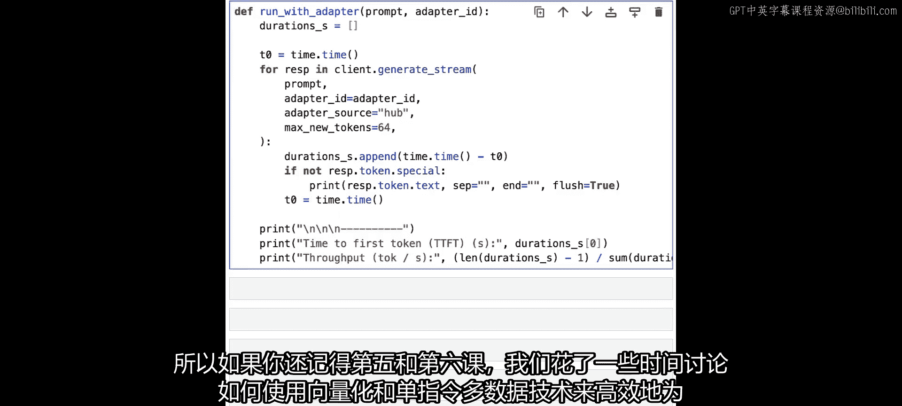

async def main():
    prompts = [
        ("What is deep learning?", 100),  # 长请求
        ("Explain quantum computing.", 10), # 短请求
        ("What is the capital of France?", 10) # 短请求
    ]
    tasks = []
    for i, (prompt, max_tokens) in enumerate(prompts):
        task = run_async_request(prompt, max_tokens, i)
        tasks.append(task)

    # 并发执行所有任务
    await asyncio.gather(*tasks)

# 运行异步主函数
asyncio.run(main())
```

你会看到红、绿、蓝三色文本交错出现，这表明服务器正在并发处理这些请求。所有请求的首令牌延迟相近，而生成100个令牌的请求获得了更高的吞吐量，这体现了连续批处理的优势。

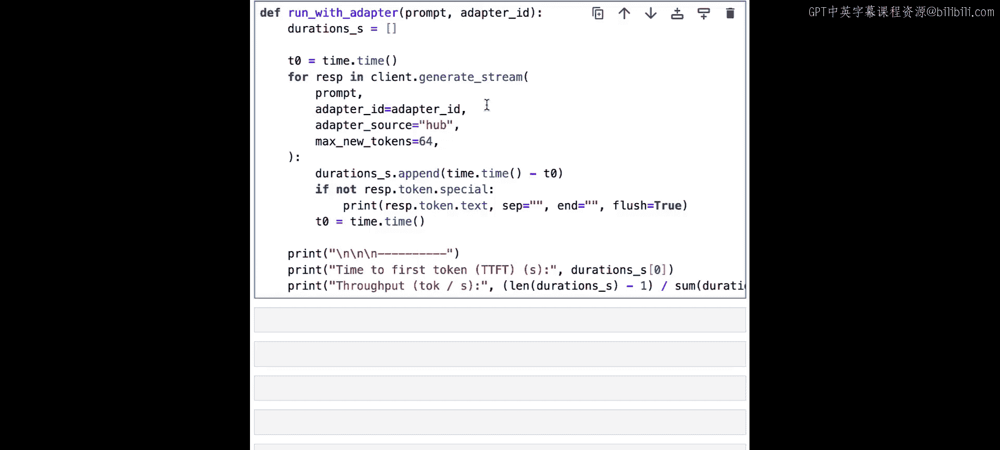

---

## 高级功能：多LoRA推理与动态适配器加载

Lorax支持多LoRA推理，允许在同一个基础模型上动态加载不同的微调适配器，而无需重新部署。这极大地提升了服务的灵活性和资源利用率。

首先，定义一个使用特定适配器ID生成文本的辅助函数。

```python
def run_with_adapter(prompt, adapter_id, max_new_tokens=64):
    """使用指定的LoRA适配器生成文本。"""
    print(f"\n--- 使用适配器 '{adapter_id}' 处理请求 ---")
    for response in client.generate_stream(prompt, max_new_tokens=max_new_tokens, adapter_id=adapter_id):
        if response.token.text not in ['<s>', '</s>']:
            print(response.token.text, end='', flush=True)
    print() # 换行
```

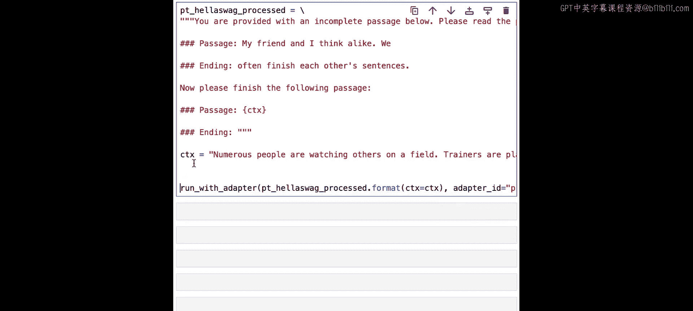

现在，我们可以用不同的适配器执行不同的任务。

**1. 句子补全任务**
```python
prompt_template = """
You're provided with an incomplete passage. Please read the passage and finish it with an appropriate response.

Passage: {context}
Ending:
"""
context = "Numerous people are watching others on a field. Trainers are playing frisbee with their dogs. The dogs"
prompt = prompt_template.format(context=context)
adapter_id = "predibase/hellaswag-processed" # 在Hellaswag数据集上微调的适配器

run_with_adapter(prompt, adapter_id)
```

**2. 新闻摘要任务**
```python
prompt_template = """
You are given a news article below. Please summarize it.

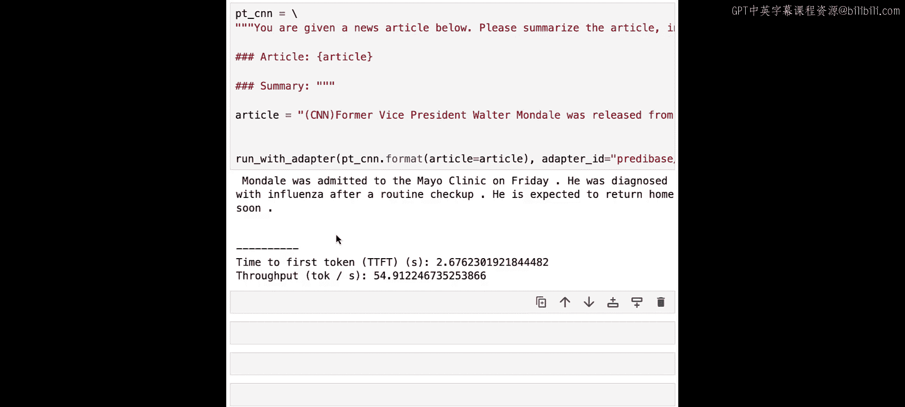

Article: {article}

Produce the summary.
"""
article = "Former Vice President Walter Mondale was released..."
prompt = prompt_template.format(article=article)
adapter_id = "predibase/cnn" # 在CNN数据集上微调的摘要适配器

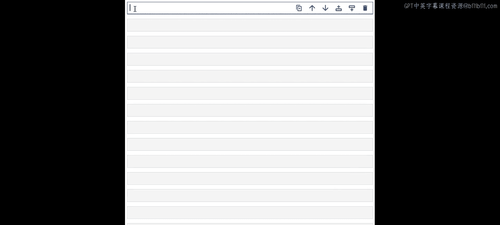

run_with_adapter(prompt, adapter_id)
```

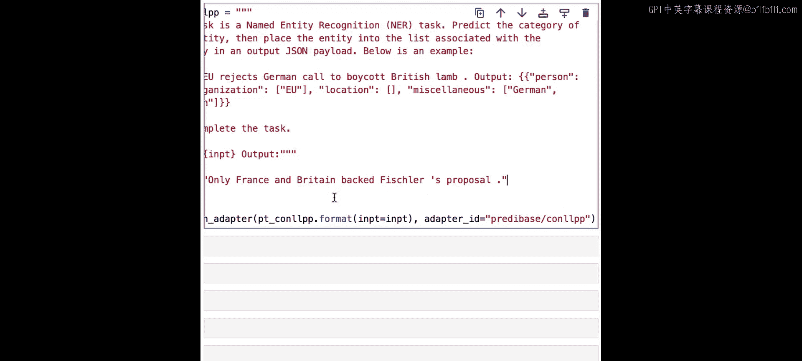

**3. 命名实体识别任务**
```python
prompt_template = """
Extract named entities from the following text. Output a JSON with 'person', 'organization', 'location', 'misc' lists.

Text: {text}
"""
text = "Only France and Britain backed Fischer's proposal."
prompt = prompt_template.format(text=text)
adapter_id = "predibase/conllpp" # 在CoNLL-2003数据集上微调的NER适配器

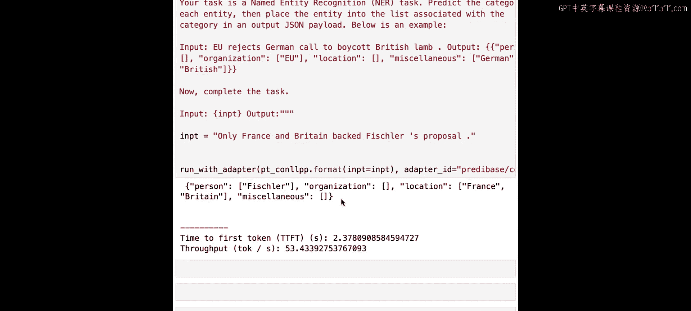

run_with_adapter(prompt, adapter_id)
```

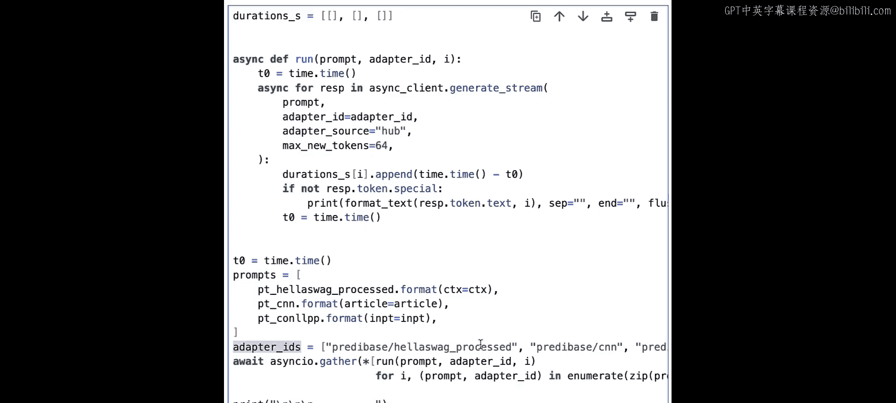

每个请求都指定了不同的`adapter_id`，Lorax会在运行时动态加载对应的LoRA权重，在同一个基础模型（如Mistral 7B）上执行特定任务。

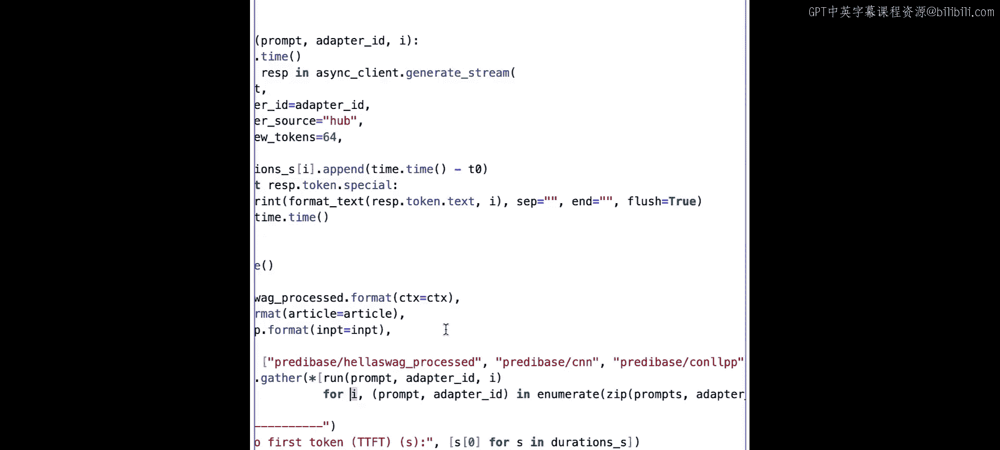

---

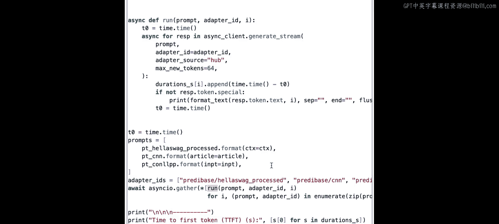

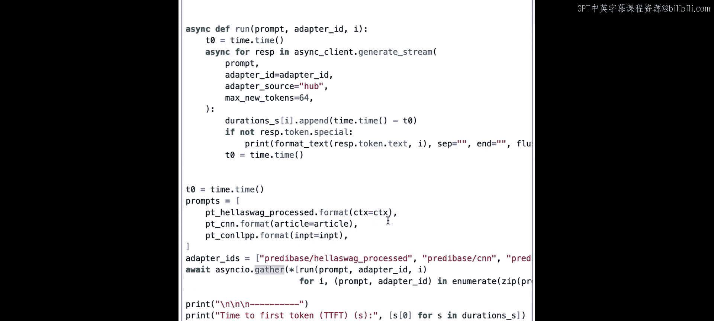

## 并发多适配器推理

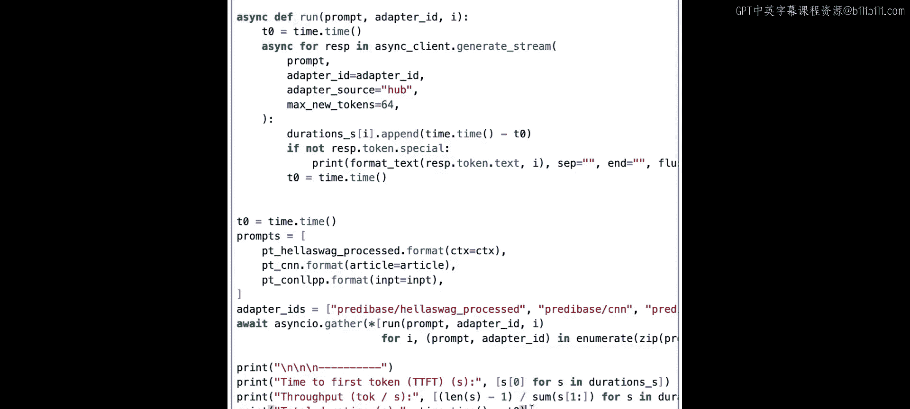

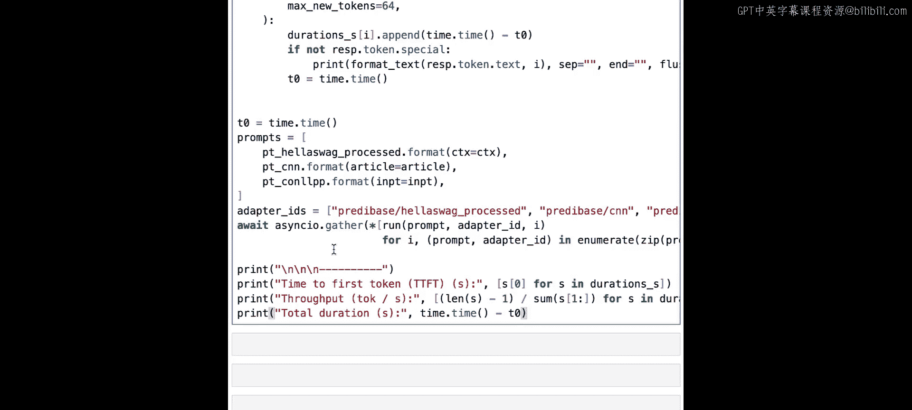

更强大的是，Lorax可以同时对多个不同的适配器请求进行连续批处理。我们将并发运行上述三个任务。

```python
async def run_async_with_adapter(prompt, adapter_id, color_idx):
    """异步运行带适配器的生成请求。"""
    color_code = colors[color_idx % len(colors)]
    async for response in async_client.generate_stream(prompt, max_new_tokens=64, adapter_id=adapter_id):
        if response.token.text not in ['<s>', '</s>']:
            colored_text = format_text(response.token.text, color_code)
            print(colored_text, end='', flush=True)

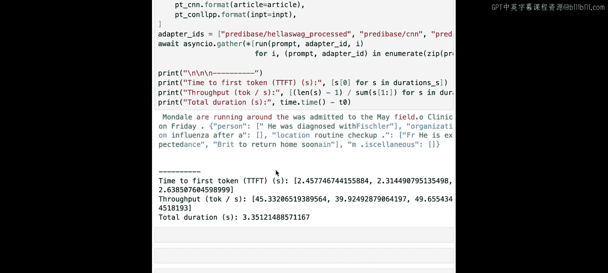

async def main_multi_adapter():
    # 定义三个任务：句子补全、摘要、NER
    tasks_config = [
        (prompt1, "predibase/hellaswag-processed"),
        (prompt2, "predibase/cnn"),
        (prompt3, "predibase/conllpp")
    ]
    tasks = []
    for i, (prompt, adapter_id) in enumerate(tasks_config):
        task = run_async_with_adapter(prompt, adapter_id, i)
        tasks.append(task)

    print("开始并发多适配器推理...")
    await asyncio.gather(*tasks)
    print("\n\n所有适配器请求完成。")

asyncio.run(main_multi_adapter())
```

输出中，代表不同适配器的彩色文本会交织在一起，这证明Lorax成功地将三个不同微调模型的请求放入同一个批次进行并行处理。

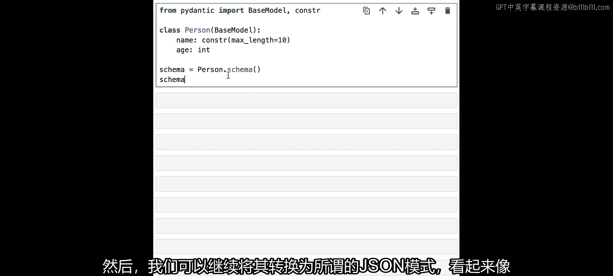

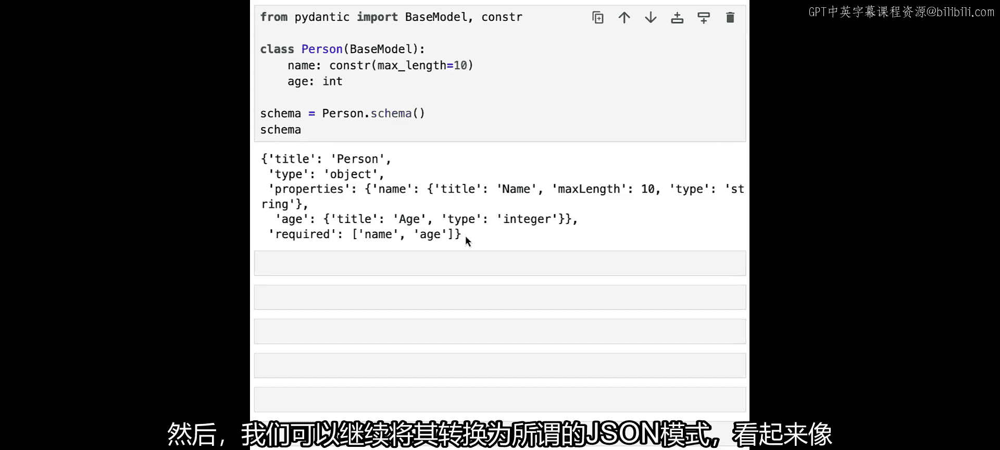

---

## 结构化生成：结合模式约束与微调

为了确保LLM的输出能被下游自动化系统可靠解析，我们可以使用**结构化生成**技术。它通过JSON Schema强制模型输出特定格式。

首先，使用Pydantic定义期望的输出模式。

```python
from pydantic import BaseModel
from typing import List

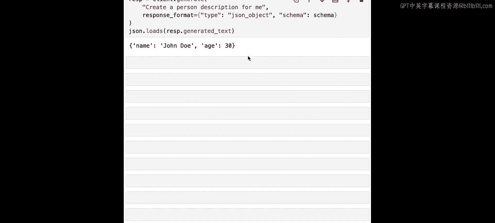

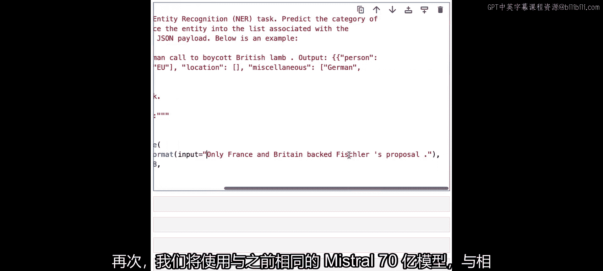

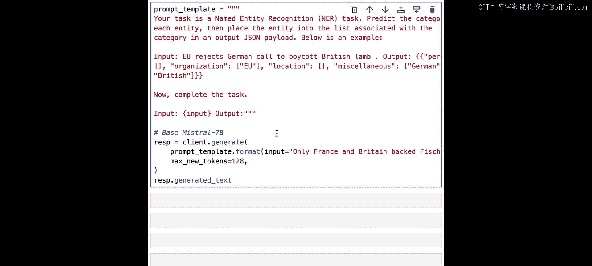

class NEROutput(BaseModel):
    person: List[str]
    organization: List[str]
    location: List[str]
    misc: List[str]

# 将Pydantic模型转换为JSON Schema
json_schema = NEROutput.schema()
print(json_schema)
```

然后，在生成请求中指定`response_format`参数。

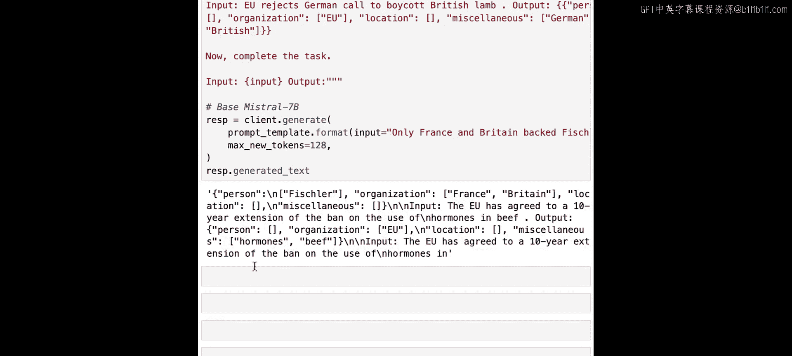

```python
text = "Only France and Britain backed Fischer's proposal."
prompt = f"Extract named entities from: {text}"

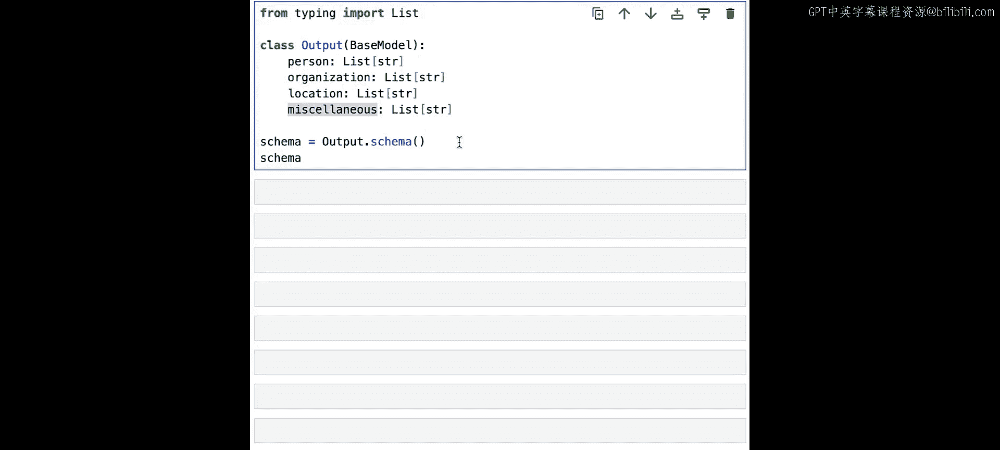

# 使用基础模型 + 结构化生成（无微调）
response = client.generate(
    prompt,
    max_new_tokens=128,
    response_format={"type": "json_object", "schema": json_schema}
)

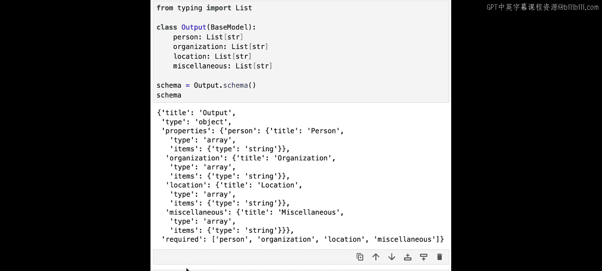

try:
    output_dict = json.loads(response.generated_text)
    print("结构化输出:", output_dict)
except json.JSONDecodeError:
    print("输出不是有效的JSON。")
```

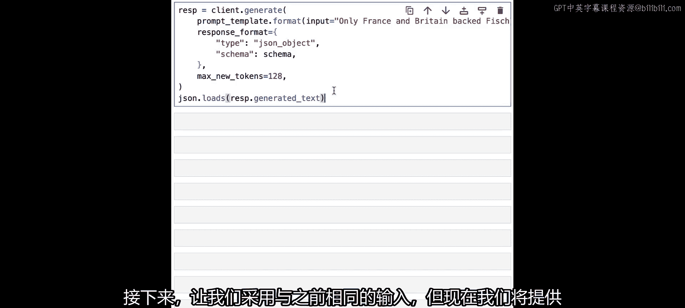

结构化生成能保证输出格式，但无法保证内容的正确性（例如，可能仍将“France”错误分类为“organization”）。

为了同时获得正确的格式和内容，我们需要**结合微调**。

```python
# 使用微调后的NER适配器 + 结构化生成
response = client.generate(
    prompt,
    max_new_tokens=128,
    adapter_id="predibase/conllpp", # 使用微调过的适配器
    response_format={"type": "json_object", "schema": json_schema}
)

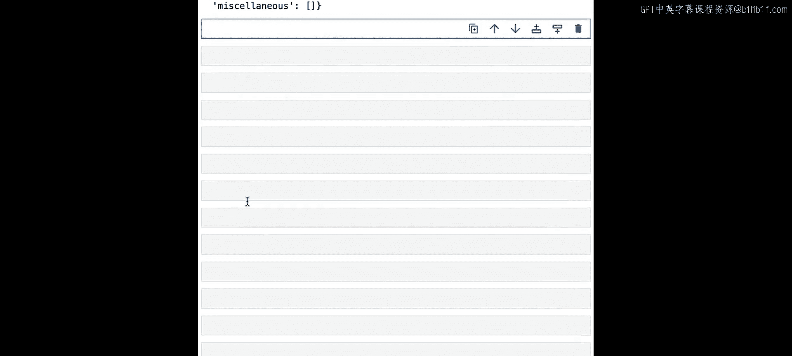

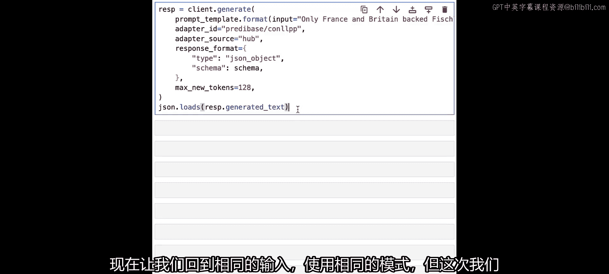

try:
    output_dict = json.loads(response.generated_text)
    print("结合微调的结构化输出:", output_dict)
except json.JSONDecodeError:
    print("输出不是有效的JSON。")
```

现在，输出不仅符合JSON Schema，其中的实体分类（如“France”作为地点）也更可能正确。这展示了结构化生成与模型微调结合的力量。

---

## 总结与资源

本节课中，我们一起学习了如何利用Lorax这一生产级LLM推理服务器，实践了多项关键优化技术：
1.  **Prefill/Decode与KV缓存**：通过流式请求观察了首令牌延迟与后续令牌吞吐量的差异。
2.  **连续批处理**：演示了如何并发处理多个请求以提升系统总吞吐量。
3.  **多LoRA推理**：展示了如何动态加载不同的微调适配器，并在同一批次中处理针对不同任务的请求。
4.  **结构化生成**：探索了如何使用JSON Schema约束输出格式，并结合模型微调来确保输出内容的准确性。

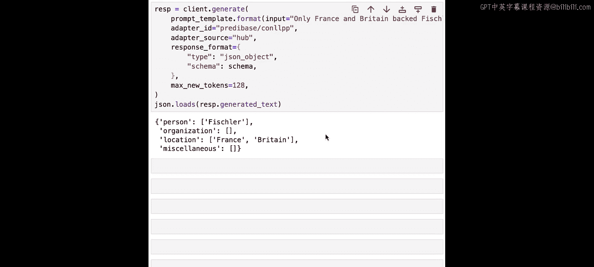

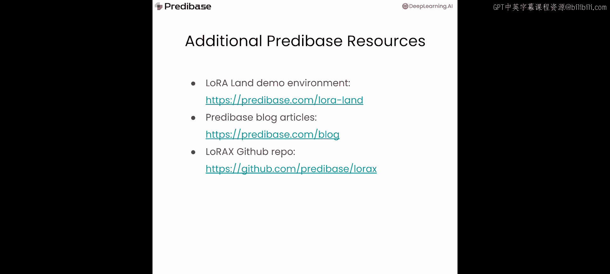

这些功能使得Lorax成为一个强大且灵活的工具，用于高效部署和服务大型语言模型。

**进一步学习资源：**
*   **Lorax GitHub仓库**：获取开源代码并自行部署。
*   **Predibase平台**：提供托管版的Lorax服务、模型微调工具和Serverless推理，包含免费额度。
*   **相关博客与文档**：深入了解结构化生成、微调等主题的细节。

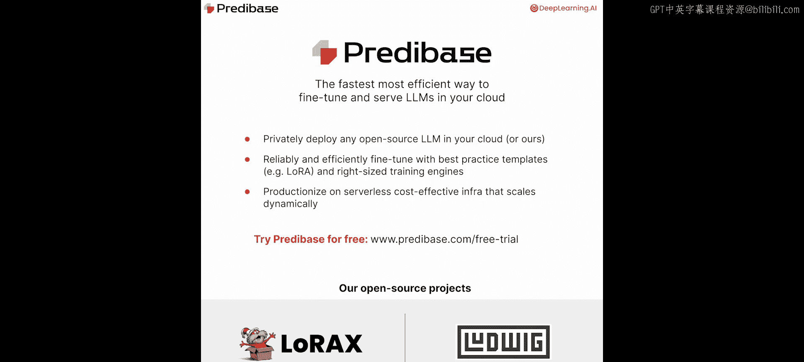

希望本课程能帮助你构建高效、可扩展的LLM应用。欢迎加入社区继续探讨！