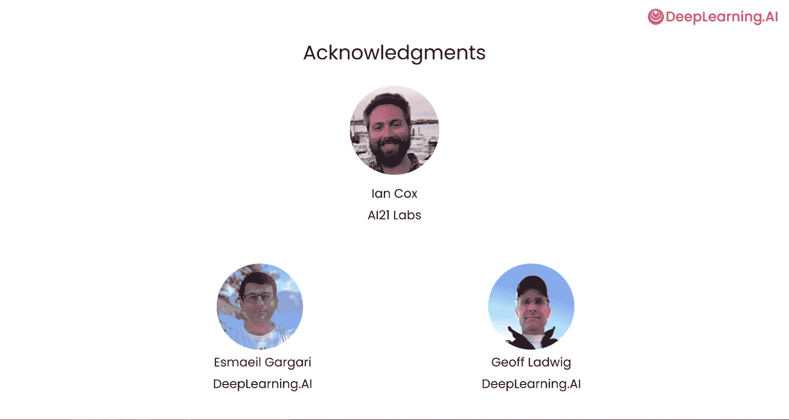

# 001：课程介绍与Jamba模型概述 🚀

在本节课中，我们将学习如何利用Jamba模型构建能够处理长上下文的AI应用。Jamba是一种创新的混合架构模型，它结合了Transformer和Mamba的优势，旨在高效处理超长文本输入。

## 课程概述

欢迎来到“使用Jamba构建长上下文AI应用”课程。本课程是与AI21实验室合作开发的。

Transformer架构是大多数大型语言模型的基础。然而，它在处理长上下文长度时效率不高。

Mamba是Transformer的一种替代方案，它能够通过读取任意长的上下文并将其压缩为固定大小的表示，来处理非常长的输入上下文。许多人一直对Mamba作为Transformer的可能替代品或继任者感到兴奋。

但研究人员发现，当上下文非常长时，纯Mamba架构表现不佳，因为其压缩机制会导致信息丢失。AI21实验室开发了一种新颖的Jamba模型，它结合了传统的Transformer和Mamba，以利用Mamba的效率，同时借助Transformer的注意力机制在正确的时间检索正确的信息。

## 核心架构对比

上一节我们提到了两种核心架构。本节中，我们来看看它们的具体特点。

Transformer的优势之一在于它会比较每一对输入标记，以查看它们彼此之间的关联程度。这就是注意力机制，它决定了在处理一个词时，模型应该关注句子中的哪些其他词。但这种方法在输入长度上具有二次方成本。尽管有多种技术可以降低这种成本，但处理非常长的输入上下文长度对Transformer来说仍然很昂贵。

然后，在论文《Mamba: Linear-Time Sequence Modeling with Selective State Spaces》中，作者描述了一种性能良好且可以在GPU上高效实现的现代状态空间模型。但Mamba在长距离关系和上下文学习方面不如Transformer。

Jamba模型作为一种混合的Transformer-Mamba架构，试图融合两者的优点。

## 课程讲师与内容

我们很高兴本课程的讲师是来自AI21实验室的首席解决方案架构师Chen Wang和AI技术负责人Ken Alphago，他们都是Mamba、Jamba和Transformer领域的专家。

我们很兴奋能在这里教授关于Jamba的课程。在课程中，我们将探索Jamba模型的基础结构，包括Transformer，但重点将放在该模型中鲜为人知的基于Mamba的方面，并理解这种混合架构为何有益。

您还将学习扩展语言模型上下文长度的策略，回顾评估长上下文模型的关键方面，并理解Jamba在这些场景中的优势。您将通过实践实验室获得使用Jamba的动手经验，包括提示工程、文档处理、工具调用和RAG应用，始终专注于利用Jamba模型的长上下文窗口优势来提升性能。

许多人参与了本课程的开发。我们要感谢来自AI21实验室的Ian Cox，以及来自DeepLearning.AI的Ashshmo Gagari和Jeff Ludwig。第一课将是Jamba模型的概述。

这听起来很棒。让我们继续观看下一个视频，学习关于Jamba的更多知识。

## 总结

本节课中，我们一起学习了Jamba模型的背景和核心概念。我们了解到，为了克服纯Transformer在处理长文本时的效率瓶颈和纯Mamba可能的信息丢失问题，Jamba创造性地将两者结合。在接下来的课程中，我们将深入其技术细节并动手实践。