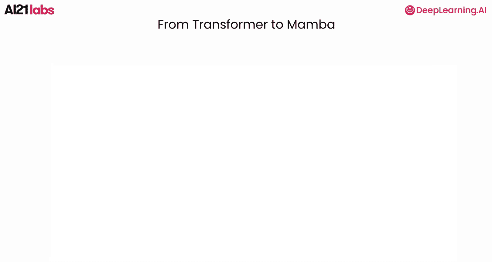
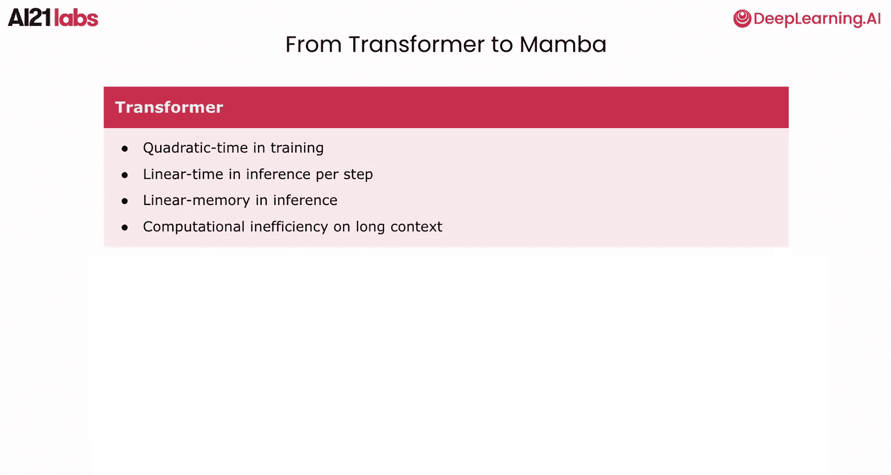
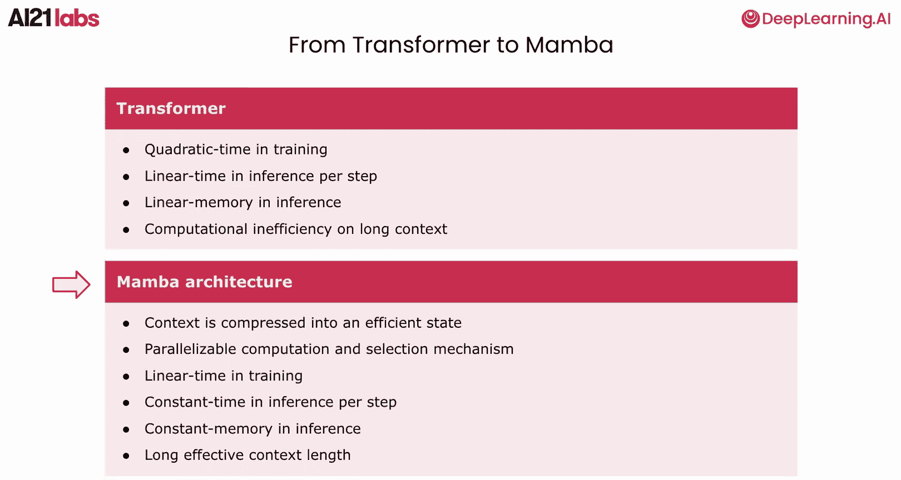
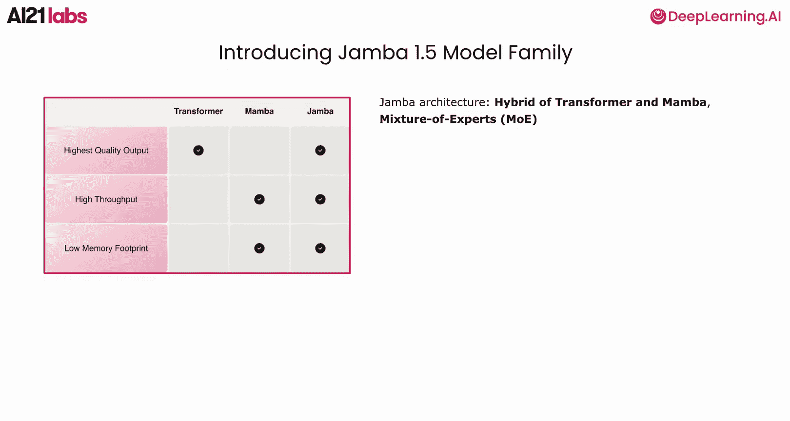
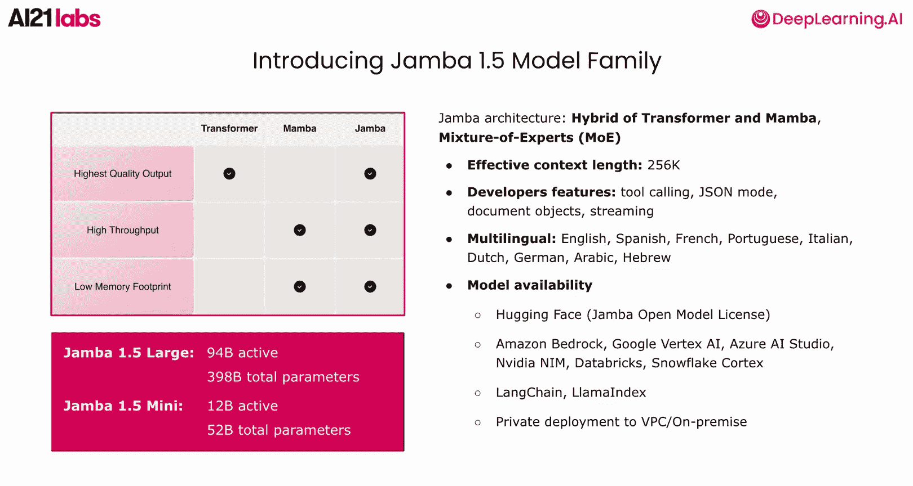
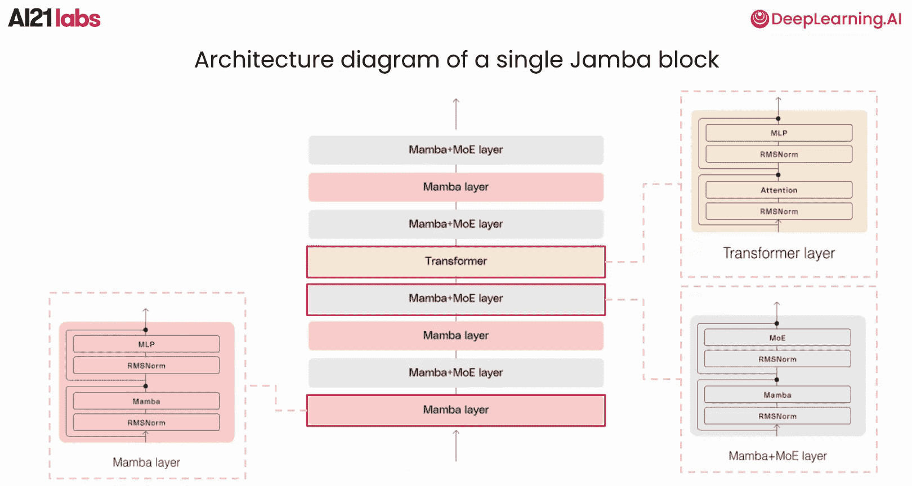
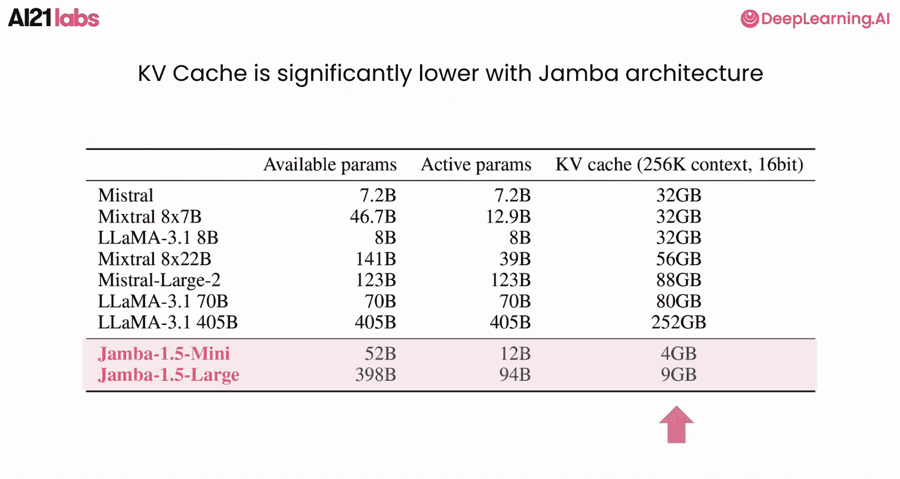
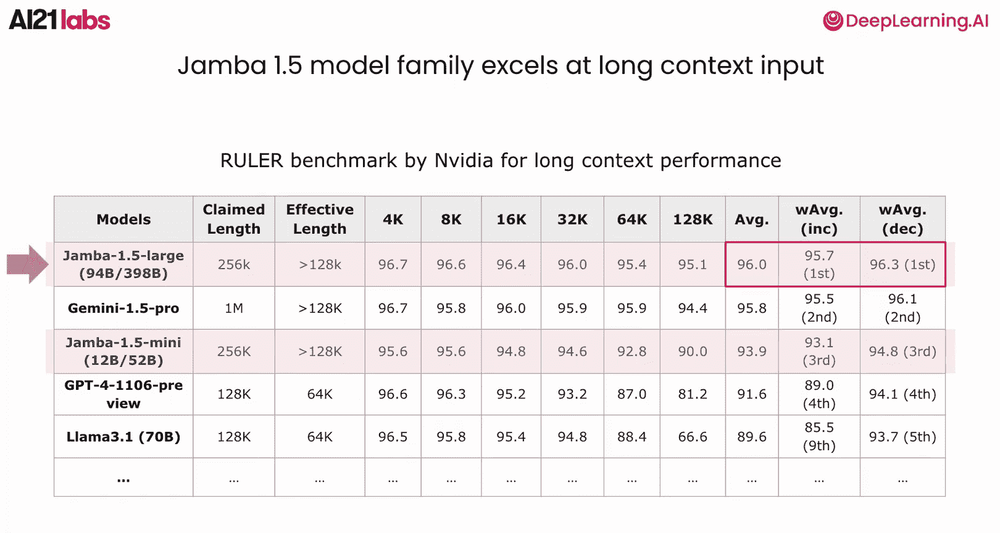

# 002：Jamba模型概述 🚀

在本节课中，我们将学习Jamba模型的关键信息，包括其独特的架构和随之而来的优势。

## 开发动机

开发Jamba模型的主要动机是在不损害输出质量的前提下，提升大型语言模型的效率。目前几乎所有主流的LLM都采用Transformer架构。

它通过注意力机制保留所有上下文信息。其训练时间随上下文长度呈**二次方增长**。在推理时，每一步的时间随上下文长度**线性增长**（使用KV缓存），推理内存也呈**线性增长**。这种计算低效性在长上下文场景下代价高昂，并对上下文长度构成了限制。

## Mamba架构简介

Mamba架构于2023年12月发布，旨在解决Transformer的计算效率问题。

它通过将上下文压缩成一个高效的状态（类似于循环神经网络），同时结合选择机制进行并行计算。更详细的讨论将在下一课进行。

与Transformer相比，Mamba架构带来了显著的效率提升：
*   **训练时间**：随上下文长度**线性增长**（Transformer为二次方增长）。
*   **推理时间**：每一步为**常数时间**（Transformer为线性增长）。
*   **推理内存**：保持**恒定**（Transformer为线性增长）。

这种大幅提升的计算效率使Mamba架构能够原生地更好地处理长上下文。

## Jamba：混合架构的诞生

然而，纯Mamba架构模型的缺点是模型的鲁棒性和输出质量会在大规模应用时受损。

为了兼收两者之长，我们优化了Transformer和Mamba的混合架构，创造了Jamba模型，旨在实现**高输出质量**以及**高计算效率**（高吞吐量和低内存占用）。

Jamba模型还采用了**混合专家**（Mixture of Experts, MoE）技术，以进一步提升模型的吞吐量、效率和质量。

## Jamba 1.5 模型家族

Jamba模型的最新版本是Jamba 1.5模型家族，包含两个模型：
*   **Jamba 1.5 Large**：拥有**940亿**活跃参数和**3980亿**总参数。
*   **Jamba 1.5 Mini**：拥有**120亿**活跃参数和**520亿**总参数。

两个模型都具有**256K tokens**的极长有效上下文长度。

## 开发者功能与可用性

Jamba模型为开发者构建企业级生成式AI应用配备了关键功能，例如：
*   **工具调用**（Tool Calling）
*   **结构化JSON输出**
*   **文档作为输入对象**
*   **流式输出**

Jamba模型也是**多语言**的，支持九种不同语言，包括英语、西班牙语、法语、葡萄牙语、意大利语、荷兰语、德语、阿拉伯语和希伯来语。

Jamba模型以**开放权重**形式在Hugging Face上发布，并广泛支持各种平台和框架，包括AWS、GCP、Azure、NVIDIA NIM、Databricks、Snowflake、LangChain、LlamaIndex等。您也可以将Jamba模型部署到您的私有云或本地环境中。

## 架构剖析与性能

深入内部结构，一个Jamba块由8层组成，包括：
*   1个Transformer层
*   3个Mamba层
*   4个Mamba + MoE层

这种组合优化了模型的输出质量和效率。

由于Mamba层的上下文压缩特性，Jamba模型在长上下文下的KV缓存内存占用优势非常明显。

在模型参数量相似甚至更小的情况下，Jamba模型的KV缓存仅为其他基于Transformer的LLM的一小部分。

## 长上下文评估基准

在保持高效率的同时，Jamba模型在长上下文评估基准测试中也表现出色。

RULER是NVIDIA最近开发的一个专门用于评估大语言模型长上下文性能的基准。它评估LLM在不同上下文长度下执行多种任务的能力，包括：
*   多针检索
*   多跳推理
*   关键词提取
*   问答

两个Jamba模型在不同上下文长度下都表现优异，其中Jamba 1.5在排行榜上名列前茅。

## 总结

本节课中，我们一起学习了关于Jamba模型的所有关键信息。现在你已经了解了Jamba模型的开发动机、其独特的混合架构（Transformer + Mamba + MoE）、模型规格、开发者功能及其在效率和长上下文性能上的优势。

接下来，你将学习导致Jamba模型开发的演进历程，以及其效率提升背后的科学原理。

下节课见！

