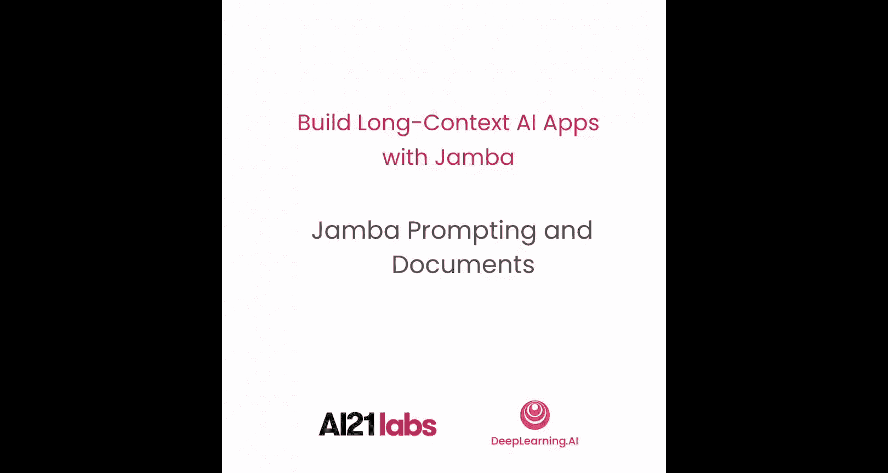
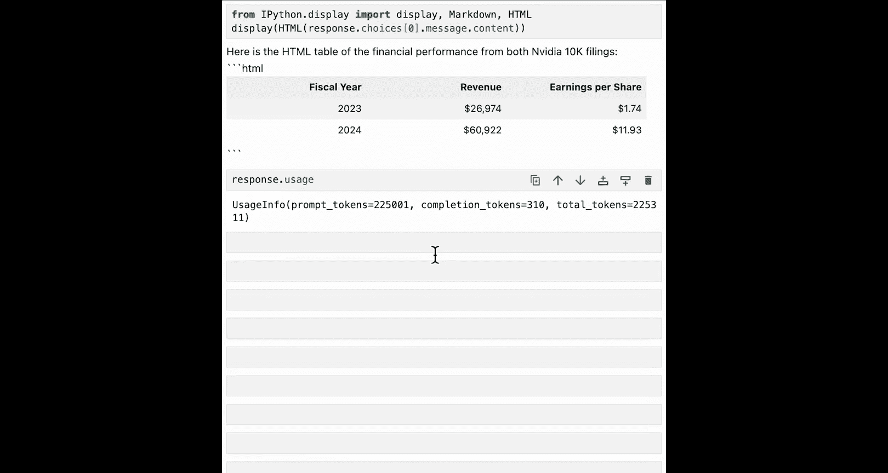

# 003：3. Transformer-Mamba混合LLM架构




在本节课中，我们将学习如何使用AI21 SDK，特别是利用 `documents` 参数来处理长文档。


## 概述

在本节课中，我们将学习如何调用Jamba模型API，探索其核心参数，并重点掌握如何通过`documents`参数直接上传长文档进行处理。我们将使用英伟达近两年的10-K年报作为示例数据集，体验Jamba模型处理长上下文的能力。

## Jamba模型API基础

与其他大语言模型API类似，Jamba模型API需要两个输入参数。

第一个参数是聊天消息列表。这包括系统消息、用户消息和助手消息，用于构成聊天历史。

第二个参数是模型名称。您可以选择使用 `jamba-1.5-large` 或 `jamba-1.5-mini`。您可以根据用例需求在质量、延迟和成本之间进行权衡。

此外，还有一组可选参数，可帮助您构建和定制复杂的生成式应用。

`documents` 是一个独特的参数，允许您在API调用中直接附加长文档作为输入对象。

您还可以强制模型以JSON格式响应，使用 `tools` 参数进行外部函数和工具调用。最大输出令牌数、温度（temperature）和Top-p等参数也可供您调整。

`stop_sequence` 在少样本或多样本上下文学习中非常有用。您还可以选择在一次API调用中生成多个响应，并流式传输响应（一次一个令牌），而不是等待整个响应完成。

## 准备环境与数据

在本课程中，我们将使用英伟达过去两年的10-K年报作为示例数据集。每份报告大约有10万个令牌，或大约200页。您可以充分利用Jamba模型的长上下文窗口来处理这些SEC申报文件。

如果您不熟悉SEC申报文件，不用担心，您很快就会自己找到答案。

现在，让我们进入笔记本，开始使用Jamba进行构建。

首先，添加这两行代码以忽略不必要的警告。

```python
import warnings
warnings.filterwarnings('ignore')
```

现在，导入所需的库。您将加载AI21 Python客户端。同时，从Python客户端导入聊天消息和文档模式。

```python
from ai21 import AI21Client
from ai21.models import ChatMessage, Document
```

您在本课中还需要API密钥，但请放心，API密钥已为您加载。在这里，您可以创建一个AI21客户端。

```python
client = AI21Client(api_key='your_api_key_here')
```

现在，您已准备好使用Jamba模型。

## 发起基础请求

以下是一个聊天消息列表的示例，作为Jamba模型的输入。您可以在系统消息中为Jamba模型提供指导。您可以在用户消息中解释希望Jamba模型执行的任务。您可以在助手消息中附加Jamba模型之前的任何响应。

在这里，由于我们刚开始与Jamba模型交互，可以移除助手消息。

```python
messages = [
    ChatMessage(role="system", content="You are a helpful assistant."),
    ChatMessage(role="user", content="Explain what SEC filings are in one short sentence.")
]
```

现在，在这个对Jamba模型的首次请求中，我们要求Jamba模型用一句话向我们解释SEC申报文件。

现在，让我们将消息发送给Jamba模型。您还可以自定义不同的可选参数。

```python
response = client.chat.completions.create(
    messages=messages,
    model="jamba-1.5-large",  # 您也可以选择使用更小更快的 `jamba-1.5-mini`
    max_tokens=100,
    temperature=0.4,
    top_p=0.9,
    stop=["\n\n"],  # 停止序列可以是字符串列表
    n=1  # 指定单次调用中生成的响应数量
)
```

我们选择使用Jamba-1.5-large模型，但您也可以选择使用更小更快的Jamba-1.5-mini。您可以自定义最大输出令牌数、温度（默认为0.4）和Top-p。还可以自定义停止序列。停止序列可以是一个字符串列表。当生成任何停止序列字符串时，响应将结束，并且停止序列不会包含在生成的响应中。例如，在停止序列中包含您多样本提示中的分隔符字符串，可以帮助模型在适当的位置停止。您还可以指定单次调用Jamba模型生成的响应数量。

现在，您可以运行此单元格以查看Jamba模型的响应。

```python
print(response.choices[0].message.content)
```

## 解析响应

在响应中需要注意几个重要事项。首先，主要响应在助手消息内容部分。

因此，让我们看一下Jamba模型的响应。我们现在可以了解关于SEC申报文件的信息：SEC申报文件是美国上市公司必须向证券交易委员会提交的正式文件，提供详细的财务和运营信息，以确保透明度并保护投资者。

现在您知道了SEC申报文件的准确定义。

另一个需要注意的重要事项是使用信息部分中的令牌数量。

这里我们在提示中使用了26个令牌，在补全中使用了36个令牌，总共62个令牌。您可以通过每次调用Jamba模型来跟踪您的令牌消耗。

要显示响应消息的内容，您可以使用 `response.choices[0].message.content` 来仅获取响应字符串。

## 生成JSON格式响应

Jamba模型还可以生成指定JSON格式的响应。

现在，我们要求Jamba模型以JSON格式为我们提供前五种最常见SEC申报类型的信息，包括表格名称和描述。

```python
messages_json = [
    ChatMessage(role="system", content="You are a helpful assistant that outputs in JSON format."),
    ChatMessage(role="user", content="List the top 5 most common types of SEC filings. For each, include the 'form_name' and a brief 'description'.")
]

response_json = client.chat.completions.create(
    messages=messages_json,
    model="jamba-1.5-large",
    response_format={"type": "json_object"},  # 指定输出应为JSON对象
    temperature=0  # 为确保输出一致性，可将温度指定为0
)

import json
print(json.dumps(json.loads(response_json.choices[0].message.content), indent=2))
```

现在，您可以在一个漂亮的JSON布局中打印模型输出。10-K表格（即年度报告）将在本课程中使用。其他流行的SEC申报类型还包括10-Q季度报告、8-K、S-1等。

让Jamba模型提供一致的JSON格式对于您的生成式应用的健壮性至关重要。

## 处理长文档

正如我们之前讨论的，Jamba模型的一个关键优势是其处理长上下文的能力。AI21 SDK还提供了一种便捷的方式，在API调用中将长文档附加到Jamba模型。

Jamba模型将根据提供的文档遵循您的要求或回答您的问题。为此，您可以首先加载两个英伟达10-K文件。

您也可以从纳斯达克网站下载英伟达10-K文件。原始文本文件可以使用AI21 SDK中的文档模式构建成文档对象列表。

```python
# 假设已从文件加载文本内容到变量 nvidia_10k_2023_text 和 nvidia_10k_2022_text
documents = [
    Document(
        content=nvidia_10k_2023_text,
        metadata={"company_name": "NVIDIA", "document_type": "10-K", "year": 2023}
    ),
    Document(
        content=nvidia_10k_2022_text,
        metadata={"company_name": "NVIDIA", "document_type": "10-K", "year": 2022}
    )
]
```

`content` 是您文件的文本。您还可以添加元数据，以进一步帮助Jamba模型智能地使用文档。例如，您可以添加公司名称、文档类型以及10-K申报年份到元数据中。

## 基于文档的查询

有了整整两年的10-K文档，您可以要求Jamba模型根据这两年的10-K申报文件生成一个包含信息的HTML表格。

请记住，现在包含了整整两年的10-K文档。Jamba模型正在处理大约20万个令牌。因此，此步骤可能需要一些时间。

```python
messages_with_docs = [
    ChatMessage(role="system", content="You are a helpful financial analyst."),
    ChatMessage(role="user", content="Based on the provided 10-K documents, create an HTML table summarizing key financial metrics (e.g., total revenue, net income) for both years. Include the year in the table.")
]

response_with_docs = client.chat.completions.create(
    messages=messages_with_docs,
    model="jamba-1.5-large",
    documents=documents,
    max_tokens=500
)

print(response_with_docs.choices[0].message.content)
```

现在，我们可以使用IPython显示模块将其可视化。

```python
from IPython.display import display, HTML
display(HTML(response_with_docs.choices[0].message.content))
```

现在我们有了这个漂亮的表格，让您可以轻松查看两年10-K申报的财务结果。

最后，在响应使用情况中，您实际上可以看到Jamba模型刚刚帮助您处理了超过20万个令牌，来自两年的10-K文件。

## 总结

在本节课中，我们一起学习了Jamba模型API的基本调用方法，包括必需参数和可选参数。我们重点实践了如何利用独特的`documents`参数直接上传并处理长文档（如英伟达的10-K年报）。我们还探索了如何让模型输出JSON格式以确保应用健壮性，并了解了如何解析响应和使用信息。

在下一节课中，您将学习关于Jamba模型的工具调用功能。我们下节课见。



